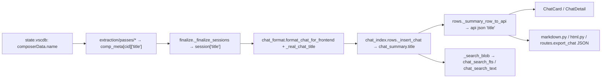

## Background

Cursor stores the human-readable chat title as the JSON field **`name`** on `composerData` (global `cursorDiskKV` rows `composerData:<cid>`) and on each `allComposers[]` entry in the workspace `ItemTable`. The extraction pipeline already normalizes this into `comp_meta[cid]["title"]` (producer: [`cursor_view/extraction/passes/finalize.py`](cursor_view/extraction/passes/finalize.py) line 59 emits `"session": {"composerId": cid, **meta}` where `meta["title"]` is either the real `name` or a synthetic fallback like `"(untitled)"`, `"Chat <8hex>"`, or `"Global Chat <8hex>"`). The title is **dropped at the `format_chat_for_frontend` boundary** ([`cursor_view/chat_format.py`](cursor_view/chat_format.py) lines 165–172) and never appears in the cache, API, frontend, or exports.

## Design decisions

1. **Synthetic vs. real titles.** Extraction invents placeholders like `"(untitled)"`, `"Chat ab12cd34"`, and `"Global Chat ab12cd34"` so downstream passes always have a title string. Those are noise to the user. A single classifier (`_real_chat_title(title)` in `cursor_view/chat_format.py`) returns the trimmed title when it is a genuine Cursor `name` and `""` otherwise, detecting the three synthetic shapes:
   - equal to `""` or `"(untitled)"`
   - matches regex `^Chat [0-9a-f]{8}$`
   - matches regex `^Global Chat [0-9a-f]{8}$`
   The cache stores `""` for synthetic titles so UI / export / search code can treat title as a simple `if title:` gate without re-running the classifier.

2. **Cache schema.** Add a `title TEXT NOT NULL DEFAULT ''` column to `chat_summary` in [`cursor_view/chat_index/schema.py`](cursor_view/chat_index/schema.py) and bump `INDEX_SCHEMA_VERSION` from `2` to `3`. A shipped release has gone out since this plan was first drafted, so the v2 "no shipped caches to invalidate" carve-out (used for the `chat_image` landing) no longer applies — any column add to `chat_summary` is a row-shape change and must route through `ChatIndex.ensure_current`'s synchronous-rebuild branch, per [`chat-index-refresh.mdc`](.cursor/rules/chat-index-refresh.mdc). Add a new `3 -> added title column to chat_summary (...)` paragraph to the existing history block in `schema.py` and move the "Current version" marker from v2 down to v3; do not extend the v2 paragraph.

3. **Composer hash.** Include `title` in the `_composer_hash` payload in [`cursor_view/cache/delta/composer_rows.py`](cursor_view/cache/delta/composer_rows.py) so the watermark reflects the shape served by the API. (Correctness is already covered because a `name` edit flips `source_row.row_hash` for `composerData:<cid>`; this is for completeness with the served payload, mirroring why `project_name` is already in the hash.)

4. **Search.** Add the cached title to `_search_blob` so users can search for their chat titles in the home-page search bar (it's a primary reason Cursor names chats in the first place).

5. **UI — home-page `ChatCard`.** Render a bold title `Typography variant="subtitle2"` at the top of `CardContent`, above the date row, ellipsized to one line with `noWrap`. When the API title is empty, render nothing there and keep the current layout exactly as it is — i.e., the card's visual "primary" field remains the preview box for untitled chats, same as today.

6. **UI — chat detail.** Add the title as a `Typography variant="h4"` **above** the existing `ChatMetaPanel` in [`frontend/src/components/chat-detail/ChatDetail.js`](frontend/src/components/chat-detail/ChatDetail.js), between the back-button row and the meta panel. When title is empty, skip the heading entirely (today's layout). The existing `<h6>` project-name row inside `ChatMetaPanel` stays put — project context is still useful even when a title is shown.

7. **Exports.**
   - **Markdown** ([`cursor_view/export/markdown.py`](cursor_view/export/markdown.py)): when `title` is present, the top-line heading becomes `# {title}` and a `- **Project:**` bullet follows the project info as before; when absent, keep today's `# Cursor Chat: {project_name}` heading byte-for-byte so existing test golden files stay valid except for the new title path.
   - **HTML** ([`cursor_view/export/html.py`](cursor_view/export/html.py)): `<title>` becomes `Cursor Chat - {title}` (or `... - {project_name}` when absent); `<h1>` becomes the chat title (or today's `Cursor Chat: {project_name}`); add a new `
` `"Title:"` row to the meta strip only when title is present (to avoid an "empty Title:" label on untitled chats).
   - **JSON** (inline in [`cursor_view/routes.py`](cursor_view/routes.py::export_chat) JSON branch): automatically picks up the new `title` field once `get_chat(...)` returns it; no code change.

## Data flow after the change

## Key file changes

- [`cursor_view/chat_format.py`](cursor_view/chat_format.py): add `_SYNTHETIC_TITLE_RE` (module-level compiled regex, per [`python-standards.mdc`](.cursor/rules/python-standards.mdc)) and `_real_chat_title(title)`; in `format_chat_for_frontend` add `"title": _real_chat_title((chat.get("session") or {}).get("title"))` to the returned dict (and to the exception-path stub for parity).
- [`cursor_view/chat_index/schema.py`](cursor_view/chat_index/schema.py): extend `chat_summary` DDL with `title TEXT NOT NULL DEFAULT ''`. Bump `INDEX_SCHEMA_VERSION` from `2` to `3`, append a new `3 -> added title column to chat_summary` history entry below the existing v2 paragraph, and move the "Current version" marker from v2 down to v3. The bump folds into the SHA-256 computed by [`cursor_view/chat_index/fingerprint.py`](cursor_view/chat_index/fingerprint.py) and is also written to the `meta.schema_version` row by `_rebuild`, so `ChatIndex.ensure_current` routes upgraders through the synchronous full-rebuild branch on first launch — no `no such column: title` window for users on a shipped cache.
- [`cursor_view/chat_index/rows.py`](cursor_view/chat_index/rows.py): 
  - `_insert_chat`: add `title` to the INSERT column list and VALUES tuple, sourcing it from `formatted.get("title") or ""`.
  - `_search_blob`: prepend `title` to the field list so FTS matches hit titles.
  - `_summary_row_to_api`: include `"title": row["title"]` in the returned dict.
- [`cursor_view/cache/delta/composer_rows.py`](cursor_view/cache/delta/composer_rows.py): add `"title": chat_formatted.get("title", "")` to `_composer_hash`'s payload dict.
- [`cursor_view/export/markdown.py`](cursor_view/export/markdown.py): in `_markdown_header_lines`, branch on `chat.get("title")`: when present, use `# {title}` for the H1 and add `- **Title:** {title}` / `- **Project:** {project_name}`; when absent, keep today's exact output.
- [`cursor_view/export/html.py`](cursor_view/export/html.py): in `generate_standalone_html`, branch on `chat.get("title")` for the `<title>`, `<h1>`, and whether to emit a new `
Title:
` row. HTML-escape the title via `html.escape(..., quote=True)` before interpolation.
- [`frontend/src/components/chat-list/ChatCard.js`](frontend/src/components/chat-list/ChatCard.js): render `{chat.title && <Typography variant="subtitle2" fontWeight={700} noWrap>{chat.title}</Typography>}` as the first child inside `<CardContent>`, with a small bottom margin.
- [`frontend/src/components/chat-detail/ChatDetail.js`](frontend/src/components/chat-detail/ChatDetail.js): between the back-button `<Box>` and `<ChatMetaPanel>`, render `{chat.title && <Typography variant="h4" fontWeight={700} sx={{ mb: 2 }}>{chat.title}</Typography>}`.

## Tests

Add the following in `tests/` (keeping the `tests/test_chat_index_images_*` naming convention style — one file per concern, per [`project-layout.mdc`](.cursor/rules/project-layout.mdc)):

- A new `tests/test_chat_index_titles.py` covering:
  1. Real `name` round-trips end-to-end: seed a synthetic `cursorDiskKV` composer with `name="My great plan"`, force a rebuild, assert `ChatIndex.list_summaries()` and `get_chat()` both return `title="My great plan"` and that `_search_blob` contains the title (FTS search for `"great plan"` finds the session).
  2. Synthetic titles are stripped: seed a composer without a `name`; assert the cached title is `""`.
  3. Incremental refresh picks up a title rename: modify `composerData.name` in place, trigger the incremental path, assert the new title surfaces (this also exercises the `_composer_hash` change).
- Extend `tests/test_chat_index_images_exports.py` (sibling pattern, not a new file) with two small cases:
  - Markdown: asserts `# {title}` appears when title is present and `# Cursor Chat: {project_name}` when absent.
  - HTML: asserts `<title>` and `<h1>` switch shape on title presence and that the `
Title:
` row only appears when title is present.
- Update existing synthetic-fixture helpers in `tests/_image_test_helpers.py` only if the new tests need a public `_composer_with_name(name)` convenience; `_composer("Test Name", ...)` already accepts a `name` arg.

Running `python -m unittest discover -s tests` must stay green, per [`project-layout.mdc`](.cursor/rules/project-layout.mdc).

## Rule review & updates

All implementation steps must respect the existing `.cursor/rules/`. After implementation, audit each rule and update in the same PR where the rule drifts from reality (per [`comments-style.mdc`](.cursor/rules/comments-style.mdc) "Rule drift" section):

- [`sqlite-cursor-db.mdc`](.cursor/rules/sqlite-cursor-db.mdc) — the "Cache tables" section's prose about `INDEX_SCHEMA_VERSION` bumps and the synchronous-rebuild routing already covers a clean version bump, so no rule edit is needed for the v3 bump itself. The rule's mention of `chat_image` landing under v2 without a bump remains accurate as a historical note. Re-read the section during the audit to confirm wording still tracks reality.
- [`project-layout.mdc`](.cursor/rules/project-layout.mdc) — mentions `tests/test_chat_index_incremental.py` as the home for new incremental-refresh regression tests. The new `tests/test_chat_index_titles.py` covers a `chat_summary` column + cache flow end-to-end (not specifically the incremental-refresh path), so no rule change needed, but the added file must be referenced in `.github/CONTRIBUTING.md`.
- [`python-standards.mdc`](.cursor/rules/python-standards.mdc) — soft 400-line / 100-line limits. `chat_index/rows.py` is already documented as intentionally slightly over the 400-line limit; the added `title` handling is ~5 lines. Fine.
- [`react-components.mdc`](.cursor/rules/react-components.mdc) — `ChatCard.js` and `ChatDetail.js` both remain well under 250 lines after the title addition. Fine.
- [`comments-style.mdc`](.cursor/rules/comments-style.mdc) — every new comment must explain *why*, not narrate. The title-classifier helper gets a docstring explaining why synthetic fallbacks are filtered (i.e., extraction always invents a title string for downstream passes; the cache stores empty when synthetic so render-time gating is a simple falsy check).
- [`chat-index-refresh.mdc`](.cursor/rules/chat-index-refresh.mdc) — adding the `title` column is a row-shape change, which the rule's "Invariant: never serve rows under a different schema version" section already requires to route through the synchronous rebuild branch. Bumping `INDEX_SCHEMA_VERSION` to 3 is what triggers that route via `_cached_schema_version` in `ChatIndex.ensure_current`, so the rule's invariants are honored unchanged. No rule edit required.
- If a new convention emerges from this change that is not already captured in an existing rule (e.g., "title display conventions for API consumers"), spin up a new rule file under `.cursor/rules/` — but only if the convention is genuinely cross-cutting; a one-off UI detail is not rule-worthy.

## Documentation

- [`README.md`](README.md): extend the Features list with "View Cursor-generated chat titles inline in the card grid, the chat-detail header, and all three export formats."
- [`.github/CONTRIBUTING.md`](.github/CONTRIBUTING.md):
  - In the "Cache SQLite layout" section, add `title` to the `chat_summary` column list.
  - In the test-files section, add a bullet for the new `tests/test_chat_index_titles.py`.
  - If the exports bullet list in the export subpackage description needs a title-aware touch-up, update it.