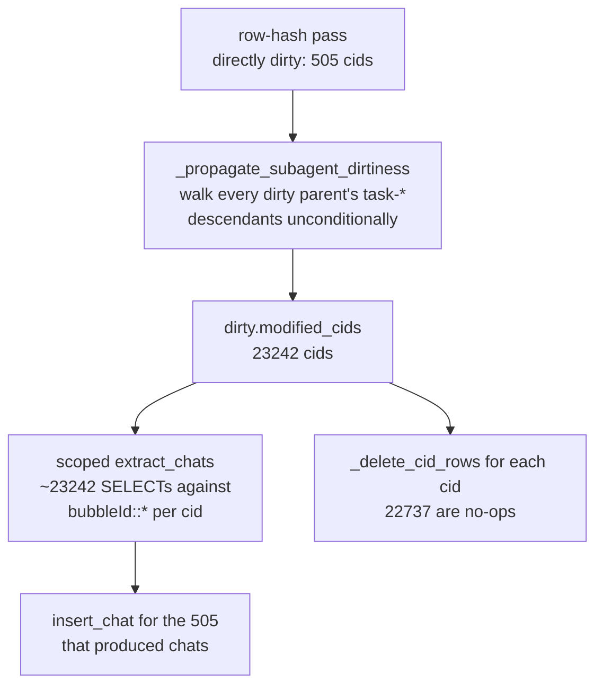
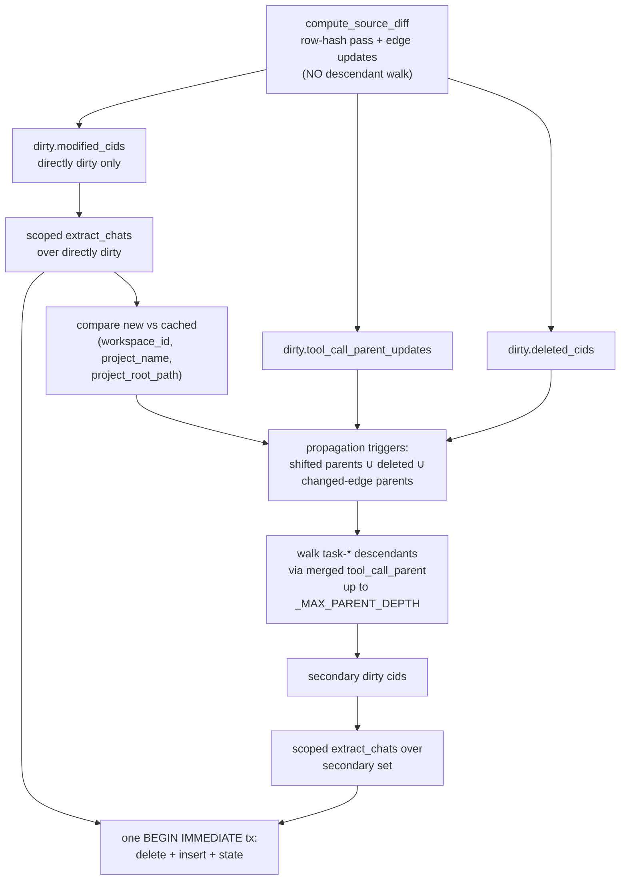
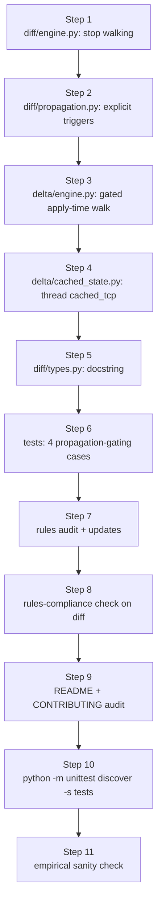

# Cut wasteful subagent propagation in the chat-index incremental refresh

## 1. How the cache works today (deep dive)

### 1.1 Two-stage invalidation

The cache lives at `cursor_view_cache_dir() / "chat-index.sqlite3"` and is owned by `ChatIndex` in [`cursor_view/chat_index/index.py`](cursor_view/chat_index/index.py). On every read (`list_summaries`, `get_chat`, `get_image`) the orchestrator calls `ensure_current`, which routes among four behaviors per [`.cursor/rules/chat-index-refresh.mdc`](.cursor/rules/chat-index-refresh.mdc):

- **Synchronous full rebuild** for `force=True`, missing cache, `sqlite3.DatabaseError`, or schema-version drift (`INDEX_SCHEMA_VERSION` mismatch). Builds to a tmp file then atomically swaps.
- **Stale-while-revalidate** for a pure source-fingerprint miss. Daemon thread runs `_compute_source_diff` then `_apply_delta` under `_rebuild_build_lock`, falling back to a full rebuild on any DML failure.

The coarse gate is `_current_source_fingerprint` ([`cursor_view/chat_index/fingerprint.py`](cursor_view/chat_index/fingerprint.py)) — a SHA-256 over `(path, mtime_ns, size, wal_mtime_ns, wal_size)` for every Cursor `state.vscdb` plus the per-workspace `workspace.json`, with `INDEX_SCHEMA_VERSION` folded in. Match → return immediately. Miss → drop into the row-hash diff. Per [`.cursor/rules/sqlite-cursor-db.mdc`](.cursor/rules/sqlite-cursor-db.mdc) "Invalidation: hash rows, don't stat files", we never use mtime alone for invalidation: Cursor bumps `lastUpdatedAt` (and the file mtime) on navigation-only writes that leave the chat unchanged.

### 1.2 The fine diff (`compute_source_diff`)

[`cursor_view/cache/diff/engine.py::compute_source_diff`](cursor_view/cache/diff/engine.py) opens each source DB read-only and rebuilds a full `source_row_snapshot: dict[SourceKey, SourceRowRecord]` keyed by `(db_path, table_name, key)`. Per source DB:

- **Global `state.vscdb`** ([`cursor_view/cache/diff/global_db.py`](cursor_view/cache/diff/global_db.py)):
  - `cursorDiskKV` rows where `key LIKE 'bubbleId:%' OR key LIKE 'composerData:%'`. Hash via `_hash_value` (SHA-256, 128-bit truncation).
  - For each composer, decode `composerData.fullConversationHeadersOnly` and treat any `bubbleId:<cid>:<bid>` whose `<bid>` is absent from that allowlist as a pruned orphan (no `tool_call_parent` upsert), per the canonical-bubble-order invariant in [`.cursor/rules/sqlite-cursor-db.mdc`](.cursor/rules/sqlite-cursor-db.mdc).
  - Legacy `workbench.panel.aichat.view.aichat.chatdata` row (single `ItemTable` blob); `tabId`s become dirty cids.
  - For changed bubble rows whose JSON has `toolFormerData.toolCallId`, stage a `tool_call_parent_updates[tcid] = cid` upsert.
- **Per-workspace `state.vscdb`** ([`cursor_view/cache/diff/workspace_db.py`](cursor_view/cache/diff/workspace_db.py)) for the project / pane keys (`workbench.explorer.treeViewState`, `history.entries`, `debug.selectedroot`, `composer.composerData`, the `aichat.view.<cid>` pane keys, the pane-container blobs, `aiService.prompts*`, `aiService.generations*`, plus the legacy chatdata key).
- **`workspace.json` sidecar** — a single hash of the file bytes. Change → `workspace_project_dirty.add(ws_id)`.

A composer flips into `dirty.modified_cids` iff one of its rows' hashes actually changed. Cached rows missing from the new snapshot are split into `modified_cids` (some new rows still exist for that cid) vs `deleted_cids` (none) by `_process_deletions`.

### 1.3 Subagent dirtiness propagation — the source of the bloat

After the row-hash pass, [`cursor_view/cache/diff/propagation.py::_propagate_subagent_dirtiness`](cursor_view/cache/diff/propagation.py) builds a reverse index from the persisted `tool_call_parent` map (merged with the diff's staged updates) and walks every dirty parent up to `_MAX_PARENT_DEPTH = 8` hops, folding each `task-<toolCallId>` descendant into `dirty.modified_cids` (and `dirty.subagent_propagated_cids` for observability). The walk is unconditional: any source-row change on a parent — a single appended bubble, a streaming-status update, even a re-formatted JSON value Cursor rewrites — drags every descendant in.

The motivating invariant lives in [`cursor_view/extraction/passes/subagent_inheritance.py::_apply_subagent_inheritance`](cursor_view/extraction/passes/subagent_inheritance.py): subagent composers (`task_v2`-spawned) ship with `subagentInfo: null` and no `workspaceIdentifier`, so they inherit a resolved ancestor's `comp2ws` workspace or `_inferred_project` via the `subagent_parent` chain. The cache propagates dirtiness so that if a parent's project moves, the descendant's inherited project follows. But Pass 6 only reads the parent's **resolved project**, not its bubble content — so propagating on every parent bubble change is far broader than the invariant requires.

### 1.4 Apply (`apply_delta`)

[`cursor_view/cache/delta/engine.py::apply_delta`](cursor_view/cache/delta/engine.py) frames everything in one `BEGIN IMMEDIATE` transaction:

1. `_compose_cached_state` reads `composer_state` + ancestor `chat_summary` rows for non-dirty composers so scoped extraction's Pass 6 can resolve out-of-set ancestors.
2. `_extract_modified_chats` calls `extract_chats(cids=set(dirty.modified_cids), cached_state=...)` once. Each pass that consumes per-cid data uses range-scanning helpers — `iter_bubbles_for_cids` ([`cursor_view/sources/bubbles.py`](cursor_view/sources/bubbles.py)) issues **one SELECT per cid** against the `bubbleId:<cid>:` PK prefix. With 23k cids, that's 23k SELECTs.
3. For each `cid in dirty.modified_cids`, `_delete_cid_rows` (drops `chat_summary` / `chat_message` / `chat_image` / `chat_search_text` / `chat_search_fts` / `composer_state` rows) then `insert_chat` if extraction produced one, then `_upsert_composer_state`.
4. Workspace-only project refresh, `_apply_tool_call_parent_updates`, `_sync_source_row`, `_update_meta`, `COMMIT`.

Concretely: in the user's log line `23242 modified (inserted 505, 22737 subagent-propagated)`, the math is `23242 − 22737 = 505` directly dirty, and exactly 505 inserted means scoped extraction over the 22737 propagated subagents produced no chats (those subagents are mostly content-empty `task-<toolCallId>` shells whose `chat_summary` row is unchanged anyway, so we paid for 22737 useless range-scans + 22737 no-op `_delete_cid_rows`).

### 1.5 Diagnosis

The propagation walk's unconditional shape is the bottleneck. Pass 6's invariant is "subagent inherits a parent's resolved project"; the propagation should fire only when that resolved project actually moves (or when the parent vanishes / the `tool_call_parent` edge changes).

## 2. Alternatives considered

| Option | Verdict |
| --- | --- |
| Drop propagation entirely | Rejected. Breaks `tests/test_chat_index_incremental.py::test_tool_call_bubble_reresolves_task_subagent`: a newly-fired tool-call bubble must re-extract the `task-<tcid>` child so it inherits the parent's workspace. |
| Lazy resolution at read time | Rejected. Subagent project lives in `chat_summary.project_name` / `project_root_path` columns that the FTS / LIKE search blob and the home-page card grid query directly; computing them at read time would require a recursive CTE per query and break the [`.cursor/rules/sqlite-cursor-db.mdc`](.cursor/rules/sqlite-cursor-db.mdc) "Cache tables" content/delta split. |
| Batch scoped extraction into one SQL query (eliminate per-cid SELECT) | Rejected as primary fix. Even if amortized, 22737 cids of unchanged data still serialize, hash, and overwrite `composer_state` / `chat_summary` rows; the win comes from not propagating in the first place. Worth keeping as a follow-up if profiling shows the per-cid SELECT remains a hotspot after the propagation fix. |
| Track a per-composer "project_input_hash" and detect project-relevant changes during the diff | Rejected. Project resolution depends on workspace `treeViewState` / `history.entries`, `composerData.workspaceIdentifier`, attached files / folders / URIs, plus the inheritance walk; reproducing it at hash time duplicates extraction. |
| **Conditional propagation: defer the descendant walk until apply, gate on real project-resolution shift** | **Selected.** Preserves Pass 6's invariant exactly, costs one extra `SELECT workspace_id, project_name, project_root_path FROM chat_summary WHERE session_id IN (...)` keyed by the small directly-dirty set, and falls out cleanly because `_compose_cached_state` already runs before extraction. |

## 3. The fix

Move the descendant walk from `compute_source_diff` into `apply_delta` and run it from a small, evidence-driven trigger set:

- **Deleted parents** (`dirty.deleted_cids`) — descendants lose their inheritance anchor, must re-extract.
- **Edge churn** (`dirty.tool_call_parent_updates`) — if `tcid` is new or its `parent_composer_id` changed vs the cached map, fold `task-<tcid>` into the trigger set so its inheritance chain re-resolves.
- **Project-shift parents** — directly modified parents whose post-extraction `(workspace_id, project_name, project_root_path)` tuple differs from the cached `chat_summary` tuple. This is the only case the current code over-fires on.

Everything else (parent bubble append, parent text edit, parent timestamp churn) leaves the descendant project untouched and no longer triggers propagation.

### 3.1 Data-flow shape

### 3.2 Where the code changes land

- [`cursor_view/cache/diff/engine.py`](cursor_view/cache/diff/engine.py) — drop the `_propagate_subagent_dirtiness(dirty, merged_tcp)` call. Keep `_process_deletions` and `_trim_comp2ws_observability`. Stop populating `dirty.subagent_propagated_cids` here; the apply step owns it now.
- [`cursor_view/cache/diff/propagation.py`](cursor_view/cache/diff/propagation.py) — keep `_MAX_PARENT_DEPTH` and `_propagate_subagent_dirtiness` as a reusable helper but rename / re-document so it accepts an explicit `triggers: set[str]` frontier instead of pulling from `dirty.modified_cids | dirty.deleted_cids` itself. The cycle-bounded walk and `subagent_propagated_cids` book-keeping stay.
- [`cursor_view/cache/delta/engine.py`](cursor_view/cache/delta/engine.py) — add a new helper that:
  1. Snapshots `(workspace_id, project_name, project_root_path)` for every `cid in dirty.modified_cids` from `chat_summary` **before** `_delete_cid_rows` fires (single `SELECT ... WHERE session_id IN (...)`).
  2. After the first scoped-extract loop produces `formatted` per cid, computes the new tuple from `formatted["workspace_id"]`, `formatted["project"]["name"]`, `formatted["project"]["rootPath"]` and adds the cid to `project_shifted` when the tuple differs.
  3. Builds `triggers = project_shifted | dirty.deleted_cids | {parent for tcid, parent in dirty.tool_call_parent_updates.items() if parent is not None and cached_tcp.get(tcid) != parent}` plus `{f"task-{tcid}" for tcid, parent in dirty.tool_call_parent_updates.items() if cached_tcp.get(tcid) != parent}` so removed and rewired edges both re-extract their immediate child.
  4. Calls the renamed propagation walk against `triggers` to populate a `secondary_cids` set, runs a second `extract_chats(cids=secondary_cids, cached_state=cached_state)`, and feeds those chats through the existing `_delete_cid_rows` / `insert_chat` / `_upsert_composer_state` loop **inside the same transaction**.
  5. Updates the existing `logger.info("Incremental chat-index refresh: ...")` so the `subagent-propagated` count reflects the post-conditional set; add a sibling counter for `project-shifted parents` so the log row stays diagnosable.
- [`cursor_view/cache/diff/types.py`](cursor_view/cache/diff/types.py) — keep `subagent_propagated_cids` on `DirtySet`, but its semantics shift from "added by walk during diff" to "added by walk during apply". Update its docstring to match.
- [`cursor_view/cache/delta/cached_state.py`](cursor_view/cache/delta/cached_state.py) — `_compose_cached_state` already reads ancestor state. Extend it to also return the `cached_tcp` map so the apply helper can compare edges without a second `SELECT`. (Or pass it through from `compute_source_diff` via a new `DirtySet` field; prefer the cached-state route to keep `DirtySet` shape unchanged.)

### 3.3 Why this is safe

- **Pass 6 invariant preserved.** The only state the inheritance walk reads is `comp2ws` and `_inferred_project` of ancestors. Both are pure functions of the ancestor's `(workspace_id, project_name, project_root_path)`. If those don't change, the walk produces the same answer for every descendant, which means re-extracting the descendant produces the same `chat_summary` row — i.e., the work was wasted.
- **Edge churn covered explicitly.** A new tool-call bubble appears → row-hash pass flips the parent into `modified_cids` AND stages a `tool_call_parent_updates[tcid] = parent` upsert. We compare to `cached_tcp` and add `task-<tcid>` to triggers. This is exactly what `test_tool_call_bubble_reresolves_task_subagent` pins.
- **Deletion covered explicitly.** A parent disappears from sources → `_process_deletions` lands it in `deleted_cids`. Triggers include `deleted_cids`. The descendant walk runs, the descendants re-extract, Pass 6 walks up the chain through `cached_state.ancestor_comp2ws` (the deleted parent is no longer there, so the walk continues to the grandparent — same as today's full rebuild).
- **Two extractions inside one transaction.** Both writes share `BEGIN IMMEDIATE`; if the second extraction or its inserts blow up, the existing `cur.execute("ROLLBACK")` arm restores the prior cache state. The connection lifecycle and `_rebuild_build_lock` are untouched.
- **Source-row snapshot still authoritative.** Apply still calls `_sync_source_row(cur, dirty.source_row_snapshot)` once at the end, so the next refresh's diff sees a consistent watermark for both phases.
- **Schema-version routing unchanged.** No schema bump needed; this is a pure algorithmic change to the apply path. `INDEX_SCHEMA_VERSION` stays at 3 and the routing rules in [`.cursor/rules/chat-index-refresh.mdc`](.cursor/rules/chat-index-refresh.mdc) continue to hold.
- **Per-cache safety net.** If something goes wrong on a developer's machine, the existing escape hatches still work: the UI Refresh button (`force=True` synchronous full rebuild) and deleting `chat-index.sqlite3` both regenerate from scratch, both already documented in `schema.py`'s `History:` block.

## 4. Implementation steps

### Step 1 — Stop walking descendants in `compute_source_diff`

Edit [`cursor_view/cache/diff/engine.py`](cursor_view/cache/diff/engine.py): remove the `_propagate_subagent_dirtiness(dirty, merged_tcp)` call and the comment block above it. Keep `_process_deletions` and `_trim_comp2ws_observability`. The `merged_tcp` build is now dead in this file; delete it. Also stop touching `dirty.subagent_propagated_cids` here — the apply path will populate it.

Add a one-line note above the deletion call explaining that subagent propagation is now driven from the apply step against post-extraction project state, with a backref to `cursor_view/cache/delta/engine.py`. Per [`.cursor/rules/comments-style.mdc`](.cursor/rules/comments-style.mdc) the comment must explain the intent (why the diff stops here and where the rest happens), not the mechanics.

### Step 2 — Re-shape the propagation helper

Edit [`cursor_view/cache/diff/propagation.py`](cursor_view/cache/diff/propagation.py): change `_propagate_subagent_dirtiness(dirty, cached_tcp)` to accept an explicit `triggers: set[str]` argument and to mutate two outputs (`secondary_cids: set[str]`, plus the existing `dirty.subagent_propagated_cids` for observability). The cycle guard, `_MAX_PARENT_DEPTH`, and the reverse-index build all stay. Update the docstring to say propagation is now apply-time and the trigger set is whichever of `(deleted, project-shifted, edge-churn)` the caller assembled. Per [`.cursor/rules/python-standards.mdc`](python-standards.mdc) keep the typed signature and module/function size under the soft limits.

### Step 3 — Implement conditional propagation in `apply_delta`

Edit [`cursor_view/cache/delta/engine.py`](cursor_view/cache/delta/engine.py):

- Before the deleted/modified loop, add `_snapshot_cached_project(cur, dirty.modified_cids) -> dict[str, tuple[str, str, str]]`. It runs a single `SELECT session_id, workspace_id, project_name, project_root_path FROM chat_summary WHERE session_id IN (...)` and returns a map. Skip the call when `modified_cids` is empty. Soft-limit the IN-list size by chunking 999 ids per query (SQLite default `SQLITE_MAX_VARIABLE_NUMBER`).
- During the existing `for cid in dirty.modified_cids` loop, after `_upsert_composer_state(...)`, derive `new_proj = (formatted.get("workspace_id") or "(global)", formatted["project"]["name"], formatted["project"]["rootPath"])` and compare against `cached_proj.get(cid)`; if different (or cid was absent from the cache, i.e., first appearance), add to a local `project_shifted: set[str]`.
- Read `cached_tcp` once via `_compose_cached_state` (already loaded; thread it back from the helper or expose `cached_state.tool_call_parent` to the apply path).
- Build `triggers = project_shifted | dirty.deleted_cids` plus, for each `(tcid, parent)` in `dirty.tool_call_parent_updates`, fold `parent` (when not `None`) and `f"task-{tcid}"` if `cached_tcp.get(tcid) != parent`.
- Call the renamed propagation helper with `triggers` and the merged `tool_call_parent` view. The helper returns `secondary_cids` and updates `dirty.subagent_propagated_cids`.
- If `secondary_cids` is non-empty, call a new `_extract_secondary_chats(secondary_cids, cached_state) -> dict[str, dict[str, Any]]` (sibling to `_extract_modified_chats`) inside the same `BEGIN IMMEDIATE` block, then loop over `secondary_cids` running `_delete_cid_rows` + `insert_chat` + `_upsert_composer_state` exactly like the primary loop. Track a `secondary_inserted` counter.
- Update the `logger.info("Incremental chat-index refresh: ...")` call. Per [`python-standards.mdc`](python-standards.mdc) "Logging" use lazy `%`-style: extend the format string with `"%s project-shifted parents, %s secondary inserts"` and keep every interpolation as positional `%s`. The `subagent-propagated` count now reflects the smaller, post-conditional set.

If the apply step's top-level function grows past ~100 lines (the [`python-standards.mdc`](python-standards.mdc) soft limit), split the new logic into private helpers (`_compute_propagation_triggers`, `_apply_secondary_pass`) named after the pass they perform, keeping the top-level `apply_delta` body as a recipe.

### Step 4 — Thread `cached_tcp` through to the apply path

Edit [`cursor_view/cache/delta/cached_state.py`](cursor_view/cache/delta/cached_state.py): make `_compose_cached_state` return both the existing `CachedExtractionState` and the raw `cached_tcp` map (or expose the map as a new attribute on `CachedExtractionState`; prefer the latter so call signatures stay short). Update the import surface in [`cursor_view/cache/delta/engine.py`](cursor_view/cache/delta/engine.py) accordingly.

### Step 5 — Adjust types / observability

Edit [`cursor_view/cache/diff/types.py`](cursor_view/cache/diff/types.py): rewrite the `subagent_propagated_cids` field docstring to say "populated by the apply-time propagation walk gated on real project-resolution shifts; empty after `compute_source_diff` returns" (instead of the current "added during diff" wording). No DDL change.

### Step 6 — Tests

Add a new test module `tests/test_chat_index_propagation_gating.py` (sibling of `test_chat_index_incremental.py`, same synthetic-Cursor-DB harness — drives `ChatIndex` via the public `list_summaries` / `_compute_source_diff` / `_apply_delta` surface). Cases:

1. **Bubble append on parent without project shift does NOT propagate.** Build a parent + a `task-<tcid>` child, both fully resolved into the same workspace. Append a non-tool-call user bubble to the parent. Assert: `dirty.modified_cids == {parent_cid}` after diff; after apply, `dirty.subagent_propagated_cids == set()` and `child_cid` is not re-extracted (the child's `chat_summary` row's `rowid` is unchanged — use the same `_messages_with_rowid` shape as `test_treeview_state_only_changes_workspace_project_dirty` to assert untouched rows).
2. **Parent project shift DOES propagate.** Create a parent that's `(global)`, a `task-<tcid>` child inheriting from it. Promote the parent into a workspace via a `workbench.panel.aichat.view.<parent_cid>` pane-view key. Assert: the parent is in `modified_cids`, the child is in `subagent_propagated_cids` after apply, and the child's `chat_summary.workspace_id` flips to the parent's workspace.
3. **Parent deletion still propagates.** Pre-existing parent + child. Drop the parent's `composerData:` and `bubbleId:*` rows from the global DB. Assert: `dirty.deleted_cids == {parent_cid}`; child is in `subagent_propagated_cids`; child's `chat_summary.workspace_id` flips back to `(global)` and inherits via `cached_state.ancestor_comp2ws`.
4. **New tool-call edge propagates exactly the targeted child.** Mirror `test_tool_call_bubble_reresolves_task_subagent` but with a sibling untouched `task-<other_tcid>` whose parent is the same parent. Assert: only `task-<tcid>` is in `subagent_propagated_cids`, the sibling is not. This is the regression that proves edge-churn propagation is surgical.

Update [`tests/test_chat_index_incremental.py::test_tool_call_bubble_reresolves_task_subagent`](tests/test_chat_index_incremental.py) only if its current assertion (`child_cid in dirty.subagent_propagated_cids`) needs reframing for the new "post-apply" semantics — most likely the assertion timing moves from "after `_compute_source_diff`" to "after `_apply_delta`", which is a one-line change to where in the test we read the dirty set. Keep the test passing without weakening any of its other assertions.

`python -m unittest discover -s tests` must stay green per [`.cursor/rules/project-layout.mdc`](.cursor/rules/project-layout.mdc) "Tests".

### Step 7 — Rules audit + updates

Re-read every file under [`.cursor/rules/`](.cursor/rules/) per [`comments-style.mdc`](.cursor/rules/comments-style.mdc) "Rule drift". Expected updates:

- [`.cursor/rules/sqlite-cursor-db.mdc`](.cursor/rules/sqlite-cursor-db.mdc) "Cache tables" — the `tool_call_parent` paragraph currently says "drives the dirtiness-propagation walk that flags subagent descendants of a modified parent". Rewrite to say the walk is now gated on real project-resolution shifts (or parent deletion / edge churn) and runs at apply-time, citing `cursor_view/cache/delta/engine.py` instead of `cursor_view/cache/diff/propagation.py`. Add a brief rationale: "Cursor bumps `lastUpdatedAt` and rewrites bubble JSON for navigation-only events, so 'parent has any dirty row' is far broader than 'parent's resolved project moved'."
- [`.cursor/rules/chat-index-refresh.mdc`](.cursor/rules/chat-index-refresh.mdc) — the routing description doesn't mention propagation, so no edits needed unless the audit surfaces stale wording.
- [`.cursor/rules/comments-style.mdc`](.cursor/rules/comments-style.mdc) — the "Rule drift" clause itself is the meta-rule we're satisfying; no edit unless we change its wording.
- [`.cursor/rules/known-bugs.mdc`](.cursor/rules/known-bugs.mdc) — the change is a measured improvement, not a deferred bug, so no `# TODO(bug):` marker is required by either the new code or the rule.
- [`.cursor/rules/python-standards.mdc`](.cursor/rules/python-standards.mdc), [`.cursor/rules/project-layout.mdc`](.cursor/rules/project-layout.mdc), and the unrelated frontend / image / mermaid rules — no edits expected; verify during the audit.

If any rule turns out to assert "every dirty parent's task-* descendants get folded in" as a canonical invariant (none seen during the pre-read but the audit must confirm), rewrite it in the same change.

### Step 8 — Rules-compliance check on the diff

Sanity-check the diff against each applicable rule:

- [`comments-style.mdc`](.cursor/rules/comments-style.mdc) — added comments must explain intent (why apply-time, why gated on project shift), not mechanics; no `# TODO(bug):` markers introduced.
- [`python-standards.mdc`](.cursor/rules/python-standards.mdc) — `apply_delta` and any new helpers stay under the ~100-line / ~400-line soft limits; logging uses `%`-style; type signatures are explicit (`set[str]`, `dict[str, tuple[str, str, str]]`); no module-load side effects added.
- [`sqlite-cursor-db.mdc`](.cursor/rules/sqlite-cursor-db.mdc) — `_snapshot_cached_project` opens through the existing writable `con` cursor inside the apply transaction (no new connection lifecycle); the new chunked `IN`-list query stays within the same `try/finally`-guarded path.
- [`chat-index-refresh.mdc`](.cursor/rules/chat-index-refresh.mdc) — no schema bump (`INDEX_SCHEMA_VERSION` stays at 3); routing decisions unchanged; this is purely an apply-path optimization.
- [`project-layout.mdc`](.cursor/rules/project-layout.mdc) — every edit lands inside `cursor_view/cache/` and `cursor_view/cache/delta/`; the new test sits under `tests/`; no top-level Python files added.

### Step 9 — Documentation audit

Re-read [`README.md`](README.md) and [`.github/CONTRIBUTING.md`](.github/CONTRIBUTING.md):

- [`README.md`](README.md) — describes user-facing features, not internal cache mechanics. No update expected.
- [`.github/CONTRIBUTING.md`](.github/CONTRIBUTING.md) — the `cache/diff/propagation.py` line-item ("`propagation.py` runs the post-hash classification (deletions, subagent-parent-chain propagation, observability trimming)") becomes inaccurate once propagation moves out of the diff. Rewrite to: "`propagation.py` runs the post-hash deletion classification, the observability trim, and the apply-time gated subagent walk shared with `cache/delta/engine.py`." Also update the `tool_call_parent` paragraph (lines ~177–179) to mention that the dirtiness-propagation walk is gated on parent deletion / edge churn / project-resolution shift.

### Step 10 — Run the test suite

`python -m unittest discover -s tests` per [`.cursor/rules/project-layout.mdc`](.cursor/rules/project-layout.mdc). All four new propagation-gating cases plus every existing chat-index test (incremental, titles, sort-order, images, exports, known-bug-fixes) must pass.

### Step 11 — Empirical sanity check (optional but recommended)

Run `python3 terminal.py` against the developer's own Cursor installation and trigger a refresh that previously surfaced the lopsided `Incremental chat-index refresh: 23242 modified (...)` line. The new log line should show `modified` close to `directly dirty` plus a small `subagent-propagated` count corresponding to the actual project shifts. Capture before/after counts in the PR description so the win is auditable.

## 5. Step graph

