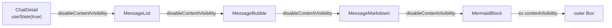

# Disable content-visibility: auto during initial scroll restore

## Why the prior fix did not work

The anchor-based save/restore in `[frontend/src/components/chat-detail/ChatDetail.js](frontend/src/components/chat-detail/ChatDetail.js)`'s `useLayoutEffect` already produces an internally consistent `{ msgIdx, offset }` save (the anchor and `scrollY` are captured at the same moment, so the offset is exact). The bug remains because the **restore** side measures against a stale layout:

```mermaid
sequenceDiagram
  participant LE as useLayoutEffect
  participant DOM as Browser layout
  participant CV as content-visibility:auto
  LE->>DOM: read anchor.offsetTop @ scrollY=0
  DOM-->>LE: offsetTop_pre (all blocks above anchor SKIPPED at 400px)
  LE->>DOM: scrollTo(0, offsetTop_pre + offset)
  DOM->>CV: re-evaluate which blocks are near new viewport
  CV->>DOM: materialize blocks now in buffer (replace 400px placeholder with actual SVG height)
  DOM-->>LE: layout shifts; anchor.offsetTop_post != offsetTop_pre
  Note over LE,DOM: scrollY still at offsetTop_pre + offset → user sees drift = (offsetTop_post - offsetTop_pre)
```

Off-screen `MermaidBlock`s above the saved scroll position are at the 400px placeholder when we compute `targetY` (we are at `scrollY = 0`, far from any of them, all skipped). Immediately after `scrollTo`, the browser re-evaluates `content-visibility: auto` for blocks now in or near the new viewport buffer; those blocks materialize and replace 400px with actual SVG heights (often 600-1000px). `anchor.offsetTop` shifts by the cumulative delta but `scrollY` stays where we put it, so the user lands `delta` px off.

`MermaidBlock` is the only `content-visibility: auto` site in the codebase, which is exactly why diagram-free chats restore precisely (confirmed by grep across `frontend/`).

## Fix: thread a `disableContentVisibility` boolean through to `MermaidBlock`

Make `[frontend/src/components/MermaidBlock.js](frontend/src/components/MermaidBlock.js)` swap `contentVisibility: 'auto'` for `contentVisibility: 'visible'` while a flag from the page-level effect is `true`, and flip the flag from `true` to `false` one `requestAnimationFrame` AFTER the initial restore `scrollTo`. The first paint runs with every block fully materialized at its actual SVG height, so `anchor.offsetTop` is final when we measure it. The rule's load-bearing `content-visibility: auto` + `containIntrinsicSize: '0 400px'` pair re-engages on the very next frame, so theme-toggle performance on long mermaid-heavy chats is untouched (the toggle window is 200ms; the restore-disable window is one frame ≈ 16ms, decoupled in time).

Threading shape (per `frontend-hooks.mdc` and the user's preference for explicit prop drilling over a context):



## File changes

1. **`[frontend/src/components/chat-detail/ChatDetail.js](frontend/src/components/chat-detail/ChatDetail.js)`**
   - Add `const [disableContentVisibility, setDisableContentVisibility] = useState(true)` so the very first commit of the message tree (which happens between `setLoading(false)` in the fetch effect's `startTransition` and the `useLayoutEffect` body) renders with `content-visibility: auto` already gated off.
   - In the existing `useLayoutEffect([loading, sessionId])`, after `window.scrollTo(0, targetY)` and before registering the scroll listener, schedule `const cvRafId = requestAnimationFrame(() => setDisableContentVisibility(false))`. The cleanup adds `cancelAnimationFrame(cvRafId)`.
   - On `loading` changing from `false` back to `true` (e.g. user navigates to a different `sessionId`), reset the flag back to `true` so the next chat's restore enjoys the same fully-materialized window. Easiest shape: a second `useEffect([loading])` that resets to `true` whenever loading flips back on, keeping the restore-pass effect's body focused.
   - Pass `disableContentVisibility` to `<MessageList>`.
   - The prior plan's anchor-based save/restore body and the legacy plain-number fallback stay exactly as they are; this change is additive (new state + new rAF + prop pass).

2. **`[frontend/src/components/chat-detail/MessageList.js](frontend/src/components/chat-detail/MessageList.js)`**
   - Accept `disableContentVisibility` and pass it to each `<MessageBubble>`. Pure pass-through, no logic.

3. **`[frontend/src/components/chat-detail/MessageBubble.js](frontend/src/components/chat-detail/MessageBubble.js)`**
   - Accept `disableContentVisibility` alongside `index` (added in todo 4). Pass to `<MessageMarkdown>` only on the string-content branch (the non-string branch never reaches `MermaidBlock`).

4. **`[frontend/src/components/MessageMarkdown.js](frontend/src/components/MessageMarkdown.js)`**
   - Accept `disableContentVisibility` and pass it to `<MermaidBlock>` inside the existing `replaceNode` interceptor (line 71-77). All four current `<MermaidBlock>` props (`source`, `initialSvg`, `initialError`, `initialDarkMode`) stay; this is a fifth prop.

5. **`[frontend/src/components/MermaidBlock.js](frontend/src/components/MermaidBlock.js)`**
   - Accept `disableContentVisibility` in the props destructure on line 22.
   - In the outer `<Box sx={{ ... }}>` (lines 80-106), change:

```js
contentVisibility: 'auto',
containIntrinsicSize: '0 400px',
```

   to:

```js
contentVisibility: disableContentVisibility ? 'visible' : 'auto',
containIntrinsicSize: '0 400px',
```

   `containIntrinsicSize` stays unconditional because it is a no-op when `content-visibility` is `'visible'`; keeping it static avoids a stylesheet churn when the gate flips.
   - Update the existing inline comment (lines 89-103) to explain the new gate's role: the static `'auto'` would re-skip blocks above the anchor at restore time and shift `offsetTop` after `scrollTo`, so the page-level effect drives `'visible'` for one frame to keep the layout consistent across save and restore. Cross-reference `[.cursor/rules/theme-transitions.mdc](.cursor/rules/theme-transitions.mdc)` "Two CSS containment hints".

## Rule and documentation updates

These belong with the existing plan's `update-rules` todo, but the ones that were already specified for Bug 4 must be edited to reflect this corrected fix:

- **`[.cursor/rules/theme-transitions.mdc](.cursor/rules/theme-transitions.mdc)`**, "Two CSS containment hints" subsection: append a paragraph documenting the `disableContentVisibility` gate as a load-bearing companion to the `contentVisibility: 'auto'` + `containIntrinsicSize: '0 400px'` pair for chats with mermaid diagrams. State the invariant: a page-level effect that wants its first-paint layout to be fully materialized must drive `'visible'` for the first paint and flip to `'auto'` on the next frame. Cross-reference `ChatDetail.js`'s `useLayoutEffect`. Also note: removing this gate re-opens the scroll-drift-on-mermaid-chats bug.
- **`[.cursor/rules/known-bugs.mdc](.cursor/rules/known-bugs.mdc)`**: the Bug 4 "retired examples" entry that the original plan's `update-rules` todo would write must describe the corrected fix as the `disableContentVisibility`-during-restore gate (threaded through `ChatDetail` → `MessageList` → `MessageBubble` → `MessageMarkdown` → `MermaidBlock`), not the anchor-based restore alone. The anchor-based restore is still part of the fix, but it is the SAVE-side correctness guarantee; the gate is the RESTORE-side correctness guarantee.

`comments-style.mdc` compliance: the new prop's documentation comment in `MermaidBlock` and the new state's comment in `ChatDetail` explain INTENT (why a one-frame `'visible'` gate is correct and why the rule's static `'auto'` was insufficient on its own), not what the code literally does.

`react-components.mdc` cap: the user has chosen to defer cap-compliance decomposition to the existing plan's `review-rules` todo. `ChatDetail.js` was 313 lines after todo 4 and gains roughly 10 more lines for the new state, the rAF, the cleanup, the second `useEffect` for the loading-resets-the-flag case, and the prop pass. The `review-rules` todo should escalate the decomposition (most natural extraction: a `useChatScrollAnchor(sessionId, ready)` hook under `frontend/src/hooks/` per `frontend-hooks.mdc`'s "DOM selection save/restore" canonical concern) once the bug fix is verified.

`mermaid-rendering.mdc` is unaffected: the new prop does not touch `mermaid.parse`, `mermaid.render`, or `mermaid.initialize`. The bomb-graphic invariant and the singleton ownership invariant from todo 2 stay closed.

`frontend-hooks.mdc` is unaffected by the minimal-scope fix; it becomes relevant only if the `review-rules` todo extracts the new hook.

## Verification

Per the original plan's `run-tests` todo for Bug 4, manual verification on a diagram-heavy chat with non-trivial scroll:

1. Open `/chat/ec60d4dd-9bac-45af-84e7-bc7e35022378`. Scroll to a position with mermaid blocks both above and below the viewport. Refresh. Expected: the topmost in-viewport message bubble is the same on both sides of the refresh, with the same vertical offset within it (no drift).
2. Repeat on `/chat/7be71d40-07cb-46de-8203-266e17c97ae7`.
3. Repeat on a diagram-free chat to confirm the legacy plain-number fallback path still restores precisely (regression check).
4. Toggle dark/light on a long mermaid-heavy chat AFTER the page has loaded. Expected: theme-toggle performance is unchanged (no off-screen mermaid SVG re-paint), confirming `content-visibility: auto` re-engaged after the restore window.

Python `unittest` suite stays green as a safety check (frontend has no JS test harness per `known-bugs.mdc`).
