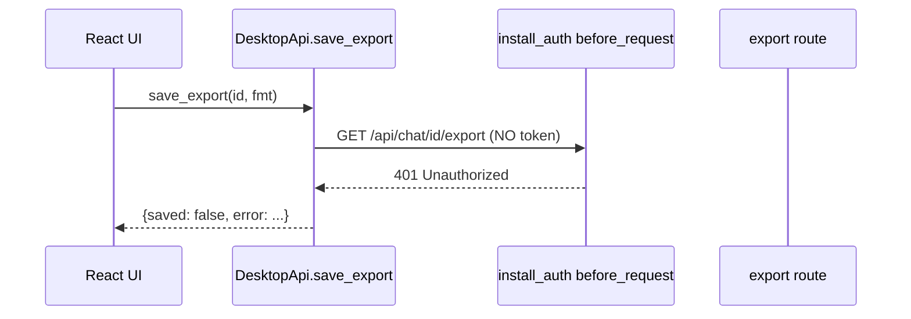

# Fix desktop save_export auth-token omission

## Background

In desktop mode `/api/*` is gated by `install_auth` (per-launch token), but [`cursor_view/desktop/api.py`](cursor_view/desktop/api.py)'s `save_export` fetches `GET /api/chat/<id>/export` with a bare `urllib.request.urlopen(url)` that carries neither the `X-Cursor-View-Token` header nor the `cursor-view-token` cookie. The gate 401s it, `urlopen` raises, and the desktop "Save as..." flow reports an error with no file written. This is the same defect fixed on the sibling branch in commit `035ab389`; that commit is not in this branch's history, so it must be re-applied here.



## Step 1 - Add the auth import

In [`cursor_view/desktop/api.py`](cursor_view/desktop/api.py), add the import between the two existing `cursor_view` imports (line 16-17) so it stays alphabetized:

```python
from cursor_view import __version__
from cursor_view.desktop.auth import TOKEN_HEADER
from cursor_view.desktop.reveal import open_path, reveal_in_file_manager
```

## Step 2 - Attach the token in save_export

In `save_export`, replace the tokenless fetch (current lines 342-343) so the request is built explicitly and the header is attached from `self._token`. Change:

```python
        try:
            with urllib.request.urlopen(url, timeout=30) as resp:
                data = resp.read()
```

to:

```python
        # The /api/* loopback endpoints are gated by install_auth in desktop
        # mode (cursor_view/desktop/auth.py), so this in-process request must
        # present the same per-launch token the frontend sends -- a bare
        # urllib call carries no cookie jar, so the header is the only path.
        request = urllib.request.Request(url)
        if self._token:
            request.add_header(TOKEN_HEADER, self._token)
        try:
            with urllib.request.urlopen(request, timeout=30) as resp:
                data = resp.read()
```

Leave the surrounding `url` construction (lines 335-340), the `pathlib.Path(path).write_bytes(data)`, and the `except` block unchanged. The `if self._token:` guard keeps the call working in any future tokenless construction path.

## Step 3 - Add the regression test

Create [`tests/test_desktop_export_auth.py`](tests/test_desktop_export_auth.py) mirroring the fix commit. It must:

- Guard with `raise unittest.SkipTest(...)` if `import webview` fails, matching the other desktop tests' import-safety posture.
- Construct `DesktopApi(port=54321, token="test-token-abc123")`.
- Patch `cursor_view.desktop.api.webview.active_window` to return a fake window whose `create_file_dialog` returns a temp save path, and patch `cursor_view.desktop.api.urllib.request.urlopen` with a side effect that captures the passed object and returns a fake context-manager response.
- Call `save_export(session_id, "json")` and assert: result is `{"saved": True, "path": <save_path>}`; exactly one request captured; the captured object is a `urllib.request.Request` (not a bare URL string); `request.get_header(TOKEN_HEADER.capitalize()) == "test-token-abc123"` (urllib title-cases header keys); and the picked path's bytes equal the fetched export bytes.

The exact, proven implementation is the 120-line body added by commit `035ab389` in `tests/test_desktop_export_auth.py` (class `SaveExportAttachesTokenTest`); reproduce it verbatim.

## Step 4 - Sync the rules

- [`.cursor/rules/desktop-mode.mdc`](.cursor/rules/desktop-mode.mdc): under "Loopback-token auth in desktop mode", after the `get_token()` paragraph, add the note that the bridge's own in-process `/api/*` loopback calls are subject to the same gate and must attach the `X-Cursor-View-Token` header from `self._token` (a bare `urllib.request.urlopen` carries no cookie jar), that `save_export` is the only such caller today, that any new bridge method fetching `/api/*` must do the same, and that it is regression-pinned by `tests/test_desktop_export_auth.py`. Use the wording added by commit `035ab389`.
- [`.cursor/rules/known-bugs.mdc`](.cursor/rules/known-bugs.mdc): this branch currently lists eleven retired markers and zero live (and does not mention this bug). Add a new retired bullet for the desktop-export auth-token omission in `cursor_view/desktop/api.py::DesktopApi.save_export`, describing the symptom (Save-as completes, no file written, HTTP 401) and the fix (build a `urllib.request.Request` and attach `X-Cursor-View-Token` from `self._token`, regression-pinned by `tests/test_desktop_export_auth.py::SaveExportAttachesTokenTest`), and bump the count line from "eleven retired" to "twelve retired". Keep the "No live `# TODO(bug):` markers" line as-is (this branch has no marker to remove).

Note: per the comments-style "Rule drift" guidance, do not introduce a `TODO(bug):` marker - we are fixing the bug, not deferring it.

## Step 5 - Verify

Run the new test and the existing desktop auth test:

```
python -m unittest tests.test_desktop_export_auth tests.test_desktop_auth -v
```

Then run the full suite to confirm nothing regressed:

```
python -m unittest discover -s tests
```

If `webview` (pywebview) is not installed in the environment, the new test will report as skipped rather than failed - that is expected and matches the other desktop tests.