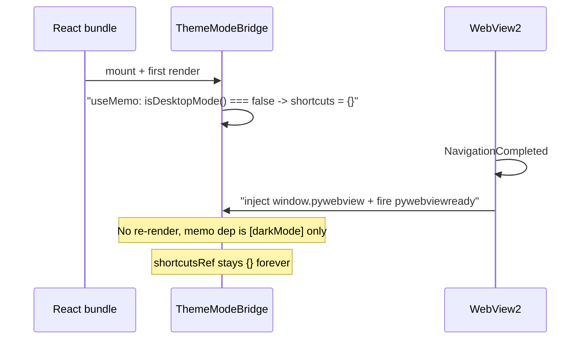

# Fix desktop keyboard shortcuts (Ctrl/Cmd not firing)

## Root cause (confirmed)

`isDesktopMode()` checks `!!window.pywebview`:

```13:15:frontend/src/utils/mode.js
export function isDesktopMode() {
  return typeof window !== 'undefined' && !!window.pywebview;
}
```

On Windows (WebView2/EdgeChromium), pywebview injects `window.pywebview` from `on_navigation_completed`, which runs **after** the React bundle executes and `App` mounts (verified in the installed `webview/platforms/edgechromium.py` and `webview/util.py::inject_pywebview`, which fires `pywebviewready` only after injection).

In [frontend/src/App.js](frontend/src/App.js), the shortcut map is built once at mount and gated on `isDesktopMode()`:

```113:130:frontend/src/App.js
  const shortcuts = useMemo(() => {
    if (!isDesktopMode()) {
      return {};
    }
    const callBridge = (method) => {
      const api = typeof window !== 'undefined' && window.pywebview && window.pywebview.api;
      if (api && typeof api[method] === 'function') {
        api[method]();
      }
    };
    return {
      'mod+t': () => toggleDarkMode(),
      'mod+r': () => callBridge('reload_window'),
      'mod+q': () => callBridge('quit_app'),
    };
    // eslint-disable-next-line react-hooks/exhaustive-deps
  }, [darkMode]);
  useGlobalKeyboardShortcuts(shortcuts);
```

At first render `window.pywebview` does not exist yet, so the map is `{}`. pywebview's later injection triggers no React re-render, and the memo's only dep is `darkMode`, so it never recomputes; `useGlobalKeyboardShortcuts`'s `shortcutsRef.current` stays `{}` and nothing ever matches.

The native menu's Toggle Theme works because [useDesktopMenuEvents](frontend/src/hooks/useDesktopMenuEvents.js) installs its listener unconditionally (no mount-time gate). [Header.js](frontend/src/components/Header.js) line 19 has the same race for the tooltip hint (cosmetic: hint missing until a re-render).

Diagnostic fingerprint: after one manual theme toggle via the Header button, `darkMode` flips, the memo recomputes while `window.pywebview` is now present, and the shortcuts start working - which is the tell-tale sign of this readiness race.



## Fix strategy

Introduce a reactive "desktop ready" boolean that starts from the synchronous `isDesktopMode()` check and flips to `true` on the `pywebviewready` event, then drive the shortcut map (and the Header hint) off it so they recompute once pywebview is live. Keep `isDesktopMode()` as the call-time primitive; only render/mount-time gates switch to the new signal.

## Changes

- New hook `frontend/src/hooks/useDesktopReady.js`:
  - `useState(() => isDesktopMode())` for the already-injected-before-mount case.
  - `useEffect([])`: if `isDesktopMode()` is already true, `setReady(true)` and return; otherwise add a `window.addEventListener('pywebviewready', () => setReady(true))` listener with matching cleanup. The synchronous check inside the effect also covers the "injected between render and effect" ordering, and if the event already fired `window.pywebview` exists so the check catches it - no gap.
  - Returns the boolean. One concern only (per [frontend-hooks.mdc](.cursor/rules/frontend-hooks.mdc)): desktop-runtime readiness detection.

- [frontend/src/App.js](frontend/src/App.js): call `const desktopReady = useDesktopReady();`, gate the shortcuts memo on `desktopReady` instead of `isDesktopMode()`, and add `desktopReady` to its dependency array (`[darkMode, desktopReady]`). Keep the per-method `typeof api[method] === 'function'` guard in `callBridge`. Update the comment to explain the readiness gating and why the mount-time `isDesktopMode()` was insufficient.

- [frontend/src/components/Header.js](frontend/src/components/Header.js): replace the render-time `isDesktopMode()` with `useDesktopReady()` for `themeShortcutHint` so the hint appears as soon as pywebview is ready (no manual toggle required). Drop the now-unused `isDesktopMode` import.

## Rules and docs sync

- [.cursor/rules/desktop-mode.mdc](.cursor/rules/desktop-mode.mdc): add an invariant (under the "Native menu bar" accelerators area or a short new "Detecting desktop mode in React" subsection) stating that `isDesktopMode()` is safe at call time (event handlers) but NOT at React render/mount time, because pywebview injects `window.pywebview` from `on_navigation_completed` after the bundle runs; render-time gates must use `useDesktopReady()` (listens for `pywebviewready`). Cite the App.js shortcut map and the Header hint.
- [.cursor/rules/frontend-hooks.mdc](.cursor/rules/frontend-hooks.mdc): add `useDesktopReady` to the canonical hooks list.
- [.github/CONTRIBUTING.md](.github/CONTRIBUTING.md): add `useDesktopReady` to the frontend `hooks/` bullet.

## Verification

- `cd frontend && npm run build`, then `python desktop.py`: on a cold launch (no prior theme toggle) confirm Ctrl/Cmd+T toggles theme, Ctrl/Cmd+R reloads, Ctrl/Cmd+Q quits, and the theme tooltip shows the `(Ctrl+T)` / `(⌘T)` hint on first hover.
- Browser/terminal mode (`python terminal.py`): confirm Ctrl/Cmd+T still opens a new browser tab (shortcuts intentionally not bound) - no regression.
- `python -m unittest discover -s tests` stays green (Python untouched, but run per project-layout policy).
