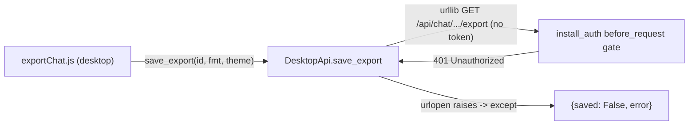

# Fix the documented `save_export` auth-token bug

## Scope

`known-bugs.mdc` documents **eleven** bugs: ten "retired examples" already fixed in git history, and **one live `# TODO(bug):` marker** that is still open. Only the live one needs fixing:

- `DesktopApi.save_export` in [cursor_view/desktop/api.py](cursor_view/desktop/api.py) issues an in-process loopback `GET /api/chat/<id>/export` via `urllib.request.urlopen` with **no** `X-Cursor-View-Token` header and **no** `cursor-view-token` cookie. The `install_auth` `before_request` gate (added in Improvement 10, [cursor_view/desktop/auth.py](cursor_view/desktop/auth.py)) 401s it, `urlopen` raises, and the desktop "Save as..." flow reports an error with no file written.

The ten retired examples require no action (already fixed and regression-pinned where a JS/py test harness exists).

## Root cause



The frontend's `useDesktopAuth` sets the token only on the browser's axios instance; the bridge's own Python `urllib` call shares neither that header nor any cookie jar. `save_export` predates the auth gate and was never updated.

## Fix

### Step 1 - Attach the token header in `save_export`

In [cursor_view/desktop/api.py](cursor_view/desktop/api.py):

1. Add the header-name import to the existing import block (no cycle: `auth.py` imports only Flask/stdlib):

```python
from cursor_view.desktop.auth import TOKEN_HEADER
```

2. Replace the tokenless `urlopen(url, ...)` call (and delete the `# TODO(bug):` block at lines 342-349) with a `Request` that carries the token when present:

```python
        # The /api/* loopback endpoints are gated by install_auth in desktop
        # mode (cursor_view/desktop/auth.py), so this in-process request must
        # present the same per-launch token the frontend sends -- a bare
        # urllib call carries no cookie jar, so the header is the only path.
        request = urllib.request.Request(url)
        if self._token:
            request.add_header(TOKEN_HEADER, self._token)
        try:
            with urllib.request.urlopen(request, timeout=30) as resp:
                data = resp.read()
            pathlib.Path(path).write_bytes(data)
        except Exception as e:
            logger.exception("Failed to save export to %s", path)
            return {"saved": False, "error": str(e)}
```

Behavior on the happy path is otherwise unchanged; the `{"saved": True, "path": path}` return shape is preserved.

### Step 2 - Add a regression test

Add `tests/test_desktop_export_auth.py` (new file; the existing `tests/test_desktop_auth.py` deliberately avoids importing `webview`, so keep the webview-dependent test separate). Pattern mirrors the `tracking_connect` capture style in [tests/test_known_bug_fixes.py](tests/test_known_bug_fixes.py):

- Module-level guard: `try: import webview` / `except ImportError: raise unittest.SkipTest(...)` so the suite stays green in any env without pywebview.
- Construct `DesktopApi(port=..., token="test-token")`.
- Patch `cursor_view.desktop.api.webview.active_window` to return a fake window whose `create_file_dialog(...)` returns a temp file path string.
- Patch `cursor_view.desktop.api.urllib.request.urlopen` with a capturing fake that records the first positional arg (the `Request`) and returns a context-manager object whose `.read()` yields `b"exported-bytes"`.
- Call `api.save_export("11111111-1111-1111-1111-111111111111", "json")`.
- Assert: result is `{"saved": True, "path": <temp path>}`; the captured arg is a `urllib.request.Request` (not a `str`); `req.get_header("X-cursor-view-token") == "test-token"` (note: `urllib` capitalizes header keys, so `X-Cursor-View-Token` is stored as `X-cursor-view-token`); and the temp file now contains `b"exported-bytes"`.

### Step 3 - Sync the rule docs

In [.cursor/rules/known-bugs.mdc](.cursor/rules/known-bugs.mdc):

- Replace the "One live `# TODO(bug):` marker is in the tree at present:" sentence and its `save_export` bullet with `No live \`# TODO(bug):\` markers are in the tree at present.` (the phrasing the file carried before Improvement 18).
- Bump `Ten retired examples now live in git history:` to `Eleven retired examples now live in git history:`.
- Add a new retired-example bullet for the `save_export` fix: symptom (desktop export fails with HTTP 401), cause (tokenless loopback request vs the Improvement 10 gate), fix (attach `TOKEN_HEADER` from `self._token` to the `urllib.request.Request`), and the regression-test citation `tests/test_desktop_export_auth.py`.

In [.cursor/rules/desktop-mode.mdc](.cursor/rules/desktop-mode.mdc), under "Loopback-token auth in desktop mode", add a bullet noting the new load-bearing invariant: the bridge's own in-process loopback calls to `/api/*` (currently `DesktopApi.save_export`'s export fetch) must attach the `X-Cursor-View-Token` header from `self._token`, because they are subject to the same gate as any other client and a bare `urllib` request carries no cookie. This satisfies the `comments-style.mdc` "Rule drift" requirement (sync the rule in the same change that adds the invariant).

### Step 4 - Verify

- Run `python -m unittest discover -s tests` and confirm it stays green (currently 86 tests; expect 87 with the new test, or 86 + skip if pywebview is ever absent).
- Run the new test in isolation: `python -m unittest tests.test_desktop_export_auth -v`.
- `ReadLints` on the two edited Python files.

## Out of scope / notes

- No other tokenless `/api/*` loopback caller exists (`notify_existing` POSTs to the ungated `/__desktop_focus__`; `wait_for_server` GETs `/`), so this single fix fully closes the documented bug.
- The browser/terminal export path (axios blob download in [frontend/src/utils/exportChat.js](frontend/src/utils/exportChat.js)) is unaffected: terminal mode never calls `install_auth`, and the desktop bridge is the only caller of `save_export`.