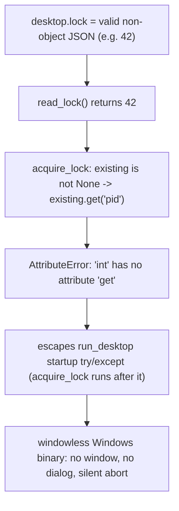

# Fix the documented `read_lock` non-object lockfile crash

## What the rule documents

[.cursor/rules/known-bugs.mdc](.cursor/rules/known-bugs.mdc) documents **one live bug** plus a list of retired examples (already fixed, living in git history). Only the live one needs a fix:

- **Live**: the non-object lockfile crash in [cursor_view/desktop/single_instance.py](cursor_view/desktop/single_instance.py)`::read_lock`.
- **Retired (no action)**: `chat_format.py` swallow-and-stub, `item_table.py` connection leak, `git.py` connection leak, `propagation.py` soft-deletion gap, and six frontend mermaid/theme/scroll fixes. These are all already fixed.

## The bug

`read_lock()` is annotated `-> dict | None` but returns whatever `json.loads` yields. A `desktop.lock` containing valid JSON that is not an object (a bare number/string/array/`null` from tampering or a torn write) flows to callers that do `existing is not None` then `.get(...)`, raising `AttributeError`. Because `acquire_lock` runs *after* `run_desktop`'s startup `try/except`, the error escapes the Improvement-03 error-window routing entirely.



Affected call sites (all transitively fixed by guarding `read_lock`): `acquire_lock` (`existing.get("pid")`), `release_lock` (`lock.get("pid")`), and `run_desktop`'s notify branch in [cursor_view/desktop/__init__.py](cursor_view/desktop/__init__.py) (`notify_existing(existing.get("port"))`).

## Step 1 - Fix `read_lock` and remove the marker

In [cursor_view/desktop/single_instance.py](cursor_view/desktop/single_instance.py), replace the `# TODO(bug):` block and the bare return with the rule's prescribed single-point fix (an `isinstance` guard), and document the intent in the docstring:

```python
def read_lock() -> dict | None:
    """Return the parsed lockfile contents, or None if missing / malformed.

    A lockfile that parses as valid JSON but is not an object (a bare
    scalar / array, from external tampering or a torn write) is treated as
    malformed and yields None, so callers that guard on `is not None` and
    then call `.get()` never see a non-dict.
    """
    path = _lock_path()
    try:
        data = json.loads(path.read_text(encoding="utf-8"))
    except (OSError, ValueError):
        return None
    return data if isinstance(data, dict) else None
```

This closes every call site at once (the rule notes this), so no edits are needed in `acquire_lock`, `release_lock`, or `run_desktop`.

## Step 2 - Add a regression test

In [tests/test_desktop_single_instance.py](tests/test_desktop_single_instance.py), add a test to `DesktopSingleInstanceTest` that writes each non-object payload (`"42"`, `'"a string"'`, `"[1, 2, 3]"`, `"null"`) to the lockfile and asserts: `read_lock()` returns `None`, and `acquire_lock(...)` returns `True` (takes over) rather than raising `AttributeError`. Reset with `release_lock()` between payloads. The existing `setUp` already patches `cursor_view_cache_dir` to a temp dir, so the test plugs in directly.

## Step 3 - Retire the entry in known-bugs.mdc

In [.cursor/rules/known-bugs.mdc](.cursor/rules/known-bugs.mdc):
- Change "One live `# TODO(bug):` marker is in the tree at present:" (and its `read_lock` bullet) to "No live `# TODO(bug):` markers are in the tree at present."
- Add a `read_lock` bullet to the retired-examples list: symptom, the `isinstance` fix, and regression-pinned by the new test in `tests/test_desktop_single_instance.py`.
- Fix the retired count header. It currently reads "Nine retired examples" but already lists **ten** bullets (a drift introduced when the `git.py` entry was added in Improvement 20). After adding `read_lock` it becomes **eleven**, so update the header to "Eleven retired examples".

## Step 4 - Verify

Run `python -m unittest discover -s tests` and confirm it stays green (expect 87 tests: current 86 + 1 new), and `grep -rn "TODO(bug):"` shows no live marker in `single_instance.py` (only the negation references in `loading.py` / `propagation.py` and the doc references in the `.mdc` files remain).

## Notes / decisions

- Minimal, rule-prescribed fix: guard only `read_lock` rather than adding `isinstance` checks at each call site, since the single guard is sufficient and the rule explicitly endorses it.
- No README/CONTRIBUTING changes: this is an internal robustness fix with no user-facing behavior change (a corrupt lockfile is now reclaimed silently instead of crashing).