# Fix search input lag on large chat lists

## Why typing lags today

Each keystroke walks this path in [`frontend/src/components/chat-list/ChatList.js`](frontend/src/components/chat-list/ChatList.js) and [`frontend/src/hooks/useChatSummaries.js`](frontend/src/hooks/useChatSummaries.js):

```mermaid
flowchart LR
  keystroke[Keystroke] --> setSearch[setSearchQuery]
  setSearch --> defer["useDeferredValue commits"]
  defer --> effect["useEffect([query]) re-runs"]
  effect --> fetch["GET /api/chats?q=..."]
  fetch --> setData["setChatData (new array ref)"]
  setData --> memo["groupedProjects useMemo recomputes"]
  memo --> map["ProjectGroup.map renders"]
  map --> cards["~600 ChatCard reconcile"]
```



Three compounding problems:

- `useDeferredValue` only re-prioritizes the *render*, not the dependency. The `useEffect([query])` in `useChatSummaries` still fires per character, so typing `search` issues 6 backend hits, each running `ensure_current()` plus an FTS5 / `LIKE` join in [`cursor_view/chat_index/rows.py`](cursor_view/chat_index/rows.py).
- The hook's `cancelled` flag suppresses *state writes* but does not abort the network request, so the server processes every prefix the user types. [`.cursor/rules/frontend-hooks.mdc`](.cursor/rules/frontend-hooks.mdc) already calls `useChatSummaries` out as the canonical hook that needs the `latestRef`-style cancellation pattern.
- When each response lands, `chatData.items` becomes a new array, `groupedProjects` re-runs, and every `ProjectGroup` / `ChatCard` reconciles. Nothing is `React.memo`-wrapped, `<Collapse>` keeps collapsed children mounted by default, and inline closures (`() => toggleProjectExpand(project.key)`, `handleCardExport`) recreate on each render so any future memo would still bust.

## Frontend changes

1. **New hook `useDebouncedValue`** at [`frontend/src/hooks/useDebouncedValue.js`](frontend/src/hooks/useDebouncedValue.js). One concern, narrow return shape, per [`frontend-hooks.mdc`](.cursor/rules/frontend-hooks.mdc):

```js
import { useEffect, useState } from 'react';

// Defers `value` updates by `delayMs` so a burst of keystrokes
// coalesces into a single downstream change.
export function useDebouncedValue(value, delayMs = 200) {
  const [debounced, setDebounced] = useState(value);
  useEffect(() => {
    const handle = setTimeout(() => setDebounced(value), delayMs);
    return () => clearTimeout(handle);
  }, [value, delayMs]);
  return debounced;
}
```

2. **Wire the debounced query into the page** in [`ChatList.js`](frontend/src/components/chat-list/ChatList.js). Drop `useDeferredValue` (debouncing replaces it for this page) and feed the debounced trimmed value into `useChatSummaries`, the "matching chats" subtitle, and `EmptyState`. Stabilize `handleCardExport` and a new `handleProjectToggle(projectKey)` with `useCallback` so memo on the children holds.

3. **Refit `useChatSummaries` to the cancellation pattern the rule already mandates.** Replace the local `cancelled` flag with a shared `latestRef` and an `AbortController` per request. Both the effect and `refresh()` bump the ref and pass `signal` into `axios.get` so stale responses don't paint and stale requests don't sit on the server. Keep the existing `startTransition`/`{items,total}` return shape unchanged so callers don't move.

4. **Memoize the list-row components and shrink the collapsed DOM:**
   - Wrap [`ProjectGroup.js`](frontend/src/components/chat-list/ProjectGroup.js)'s default export in `React.memo` and refactor its prop contract so `onToggle` is a stable `(projectKey) => void` from the parent (the inner click handler closes over the local `project.key`).
   - Wrap [`ChatCard.js`](frontend/src/components/chat-list/ChatCard.js)'s default export in `React.memo`. Its props (`chat`, `dontShowExportWarning`, `onExport`) are already stable when the parent uses `useCallback` for `onExport` and the chat object is row-identity-stable across fetches.
   - Add `mountOnEnter unmountOnExit` to the `<Collapse>` in `ProjectGroup` so collapsed projects don't keep ~600 cards in the DOM.

## Backend

No changes. The FTS / `LIKE` paths in [`cursor_view/chat_index/rows.py`](cursor_view/chat_index/rows.py) and the refresh routing in [`cursor_view/chat_index/index.py`](cursor_view/chat_index/index.py) are already efficient; the lag is the *frequency* of calls, not the per-call cost.

## Server pagination / list virtualization

Out of scope. If chat counts climb into the thousands the next lever is `LIMIT/OFFSET` on `/api/chats` plus a `react-window`-style virtualized grid; both have API-shape implications and deserve their own plan.

## Rule and doc sync ([`comments-style.mdc`](.cursor/rules/comments-style.mdc) "rule drift")

- [`.cursor/rules/frontend-hooks.mdc`](.cursor/rules/frontend-hooks.mdc) already names `useChatSummaries` as the hook that should adopt the `latestRef` pattern; once the hook lands in that shape, update the rule to reference the *implemented* version (not the bug-fix-plan one) and add a short subsection on debounce-driving-fetch + `AbortController` with `useDebouncedValue` as the canonical example.
- [`.cursor/rules/react-components.mdc`](.cursor/rules/react-components.mdc) currently has no guidance for memoizing list-row components; add a short subsection requiring `React.memo` plus `useCallback`-stabilized callbacks for any list rendered with hundreds of items, citing `ProjectGroup` / `ChatCard` as the canonical example.
- [`.github/CONTRIBUTING.md`](.github/CONTRIBUTING.md) "Frontend (`frontend/src/`)" lists every hook in `src/hooks/`; append `useDebouncedValue` with a one-line description.
- [`README.md`](README.md): no change. The fix is invisible to end users (no new feature, no setup change), so per [`project-layout.mdc`](.cursor/rules/project-layout.mdc) "Documentation sync" the README does not need to move.
- [`known-bugs.mdc`](.cursor/rules/known-bugs.mdc): nothing to flag — we're fixing a real defect, not silently deleting suspicious code, and not hardcoding a user-specific value.

## Verification

- Manual: with a corpus of ~600 chats, type a 6-character query rapidly. Expect exactly one `GET /api/chats?q=…` after the user pauses for ≥200 ms (visible in the Flask access log at INFO level), no piled-up requests, and the input field staying responsive throughout. Toggle one project group expanded so `<Collapse>` actually mounts the ChatCards under the new `mountOnEnter` setting and confirm cards render normally.
- Existing tests: `python -m unittest discover -s tests` must stay green. There are no tests against the chat-index search path that this plan touches; the existing FTS coverage in [`tests/test_chat_index_titles.py`](tests/test_chat_index_titles.py) and `tests/test_chat_index_images_regressions.py` continues to exercise the unchanged backend.
- Frontend tests: the repo has no React test harness; we lean on the manual verification above. (Not adding one here — out of scope and would be a separate plan.)
