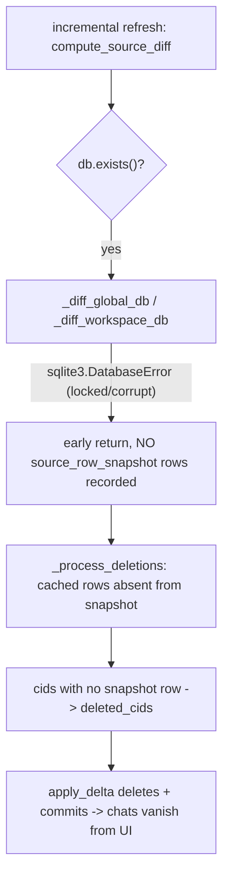

# Fix the three live documented bugs

`known-bugs.mdc` currently lists **three live markers** (the eleven retired examples are already fixed). This plan fixes all three, each with a regression test, and retires the markers. The three fixes are independent and can land in any order; Bug 1 is the highest impact (silent cache data-loss).

---

## Bug 1 - Source-read failure deletes that DB's chats

### Root cause



The file passed `db.exists()` (engine.py:71), so this is the "exists but unreadable" case, common because Cursor is an active writer. Fix: record which source DBs failed to read this pass and **exclude their cached rows from deletion classification**, so their chats are preserved (neither modified nor deleted) until a successful read.

### Steps

1. In [cursor_view/cache/diff/types.py](cursor_view/cache/diff/types.py), add a field to `DirtySet`:

```python
    # Source DB paths whose read FAILED this pass (exists-but-unreadable:
    # a transient lock or corruption), as opposed to genuinely empty. The
    # deletion pass skips cached rows under these paths so a failed read
    # never deletes a still-present source's chats.
    unreadable_db_paths: set[str] = field(default_factory=set)
```

2. In [cursor_view/cache/diff/global_db.py](cursor_view/cache/diff/global_db.py), record the failure in each `except sqlite3.DatabaseError` before returning:
   - `_diff_global_db` open failure (the `except` around `sqlite3.connect`): `dirty.unreadable_db_paths.add(db_path_str)`.
   - `_diff_global_cursor_disk_kv` scan failure (`except` at the `rows = cur.fetchall()` block): `dirty.unreadable_db_paths.add(db_path_str)`. Leave the `if not cur.fetchone(): return` path (table genuinely absent) untouched - that is not a failure.
   - `_diff_global_legacy_chatdata` scan failure: also add (harmless/conservative; its rows carry empty composer_id so cannot drive deletion, but keeps the signal consistent).

3. In [cursor_view/cache/diff/workspace_db.py](cursor_view/cache/diff/workspace_db.py), make read-failure distinguishable from genuinely-empty:
   - Change `_fetch_workspace_item_rows` to return `None` on `sqlite3.DatabaseError` (instead of `[]`), keeping `list(...)` (possibly empty) on success.
   - In `_diff_workspace_db`, after `rows = _fetch_workspace_item_rows(db)`: `if rows is None: dirty.unreadable_db_paths.add(db_path_str); return`.
   - `_diff_workspace_json` needs no change: the sidecar's cached row has empty composer_id, so a failed read cannot route any cid to deletion.

4. In [cursor_view/cache/diff/propagation.py](cursor_view/cache/diff/propagation.py), make `_process_deletions` skip unreadable sources. In the `for sk, (_hash, composer_id) in cached.items()` loop, add as the first check:

```python
        if sk.db_path in dirty.unreadable_db_paths:
            # Source unreadable this pass -> we have no snapshot to compare,
            # so preserve its cached chats rather than treating the empty
            # snapshot as "everything deleted".
            continue
```

   `_process_deletions` already receives `dirty`, so no signature change is needed. A cid whose only rows are under an unreadable path is then left untouched (not in `cids_missing`, not in `deleted_cids`), so it stays in the cache.

5. Regression test in [tests/test_chat_index_incremental.py](tests/test_chat_index_incremental.py) (or a new sibling, per project-layout.mdc): build an index containing a global chat, then run a second refresh while patching `cursor_view.cache.diff.global_db.sqlite3.connect` to raise `sqlite3.DatabaseError` for the global DB path (so the real early-return-on-error path executes). Assert the chat is still present in `list_summaries` / `chat_summary` afterward. Add a companion assertion (or rely on an existing deletion test) that a genuine removal - source readable, composer's rows actually gone - still deletes, so the fix does not disable legitimate deletion.

---

## Bug 2 - Non-dict composerData aborts extraction

### Fix

The sibling `build_bubble_order_map` already guards `if not isinstance(data, dict): continue` ([composer_data.py:175](cursor_view/sources/composer_data.py)); the two iterators that feed Pass 3 do not.

1. In [cursor_view/sources/composer_data.py](cursor_view/sources/composer_data.py), add the dict gate right after the `json.loads` try/except in both iterators (before computing `composer_id`):
   - `iter_composer_data` (after the `composer_data = json.loads(v)` block): `if not isinstance(composer_data, dict): continue`.
   - `iter_composer_data_for_cids` (same spot in its loop): same guard.

   This fixes the crash at its root for every consumer, so the `# TODO(bug):` marker in [global_composers.py](cursor_view/extraction/passes/global_composers.py) is removed and Pass 3's `data.get(...)` calls are safe. (Leave the existing `isinstance(data, dict)` guards in `global_composers.py` in place - harmless and defensive.)

2. Verify and guard the parallel workspace path in [cursor_view/sources/item_table.py](cursor_view/sources/item_table.py) (the `composer.composerData` read around lines 55-60): if it calls `.get(...)` on a value that could be a truthy non-dict, add the same `isinstance(..., dict)` guard.

3. Regression test alongside `test_non_dict_bubble_json_is_skipped` in [tests/test_chat_index_images_regressions.py](tests/test_chat_index_images_regressions.py) (or test_chat_index_incremental.py): seed a `composerData:<cid>` row whose value is a JSON list (non-dict) plus a valid sibling composer, build the index, and assert the build does not raise, the malformed composer is skipped, and the valid one lands.

---

## Bug 3 - Unguarded composerId in workspace_info

### Fix

1. In [cursor_view/projects/inference.py](cursor_view/projects/inference.py)::`workspace_info`, guard both the container and each entry:

```python
        cd = j(cur, "ItemTable", "composer.composerData")
        if isinstance(cd, dict):
            for c in cd.get("allComposers", []):
                if not isinstance(c, dict):
                    continue
                cid = c.get("composerId")
                if not isinstance(cid, str) or not cid:
                    continue
                comp_meta[cid] = {
                    "title": c.get("name", "(untitled)"),
                    "createdAt": c.get("createdAt"),
                    "lastUpdatedAt": c.get("lastUpdatedAt"),
                }
```

   This also hardens against a non-dict `cd` (a `composer.composerData` value that parses to a list), which would otherwise raise on `cd.get(...)`. Remove the `# TODO(bug):` marker.

2. Regression test: drive `workspace_info` against a synthetic workspace `state.vscdb` whose `composer.composerData.allComposers` contains a malformed entry (a non-dict, and a dict missing `composerId`) alongside a valid composer; assert it returns without raising and includes the valid composer's metadata. Use the workspace-DB-building helpers already in the test suite.

---

## Doc sync

1. [.cursor/rules/known-bugs.mdc](.cursor/rules/known-bugs.mdc): remove the three live-marker bullets, flip the header back to `No live \`# TODO(bug):\` markers are in the tree at present.`, bump `Eleven retired examples` to `Fourteen retired examples`, and add the three as retired examples - each with symptom, the fix applied, and its regression-test citation.

2. [.cursor/rules/chat-index-refresh.mdc](.cursor/rules/chat-index-refresh.mdc): add a short invariant for Bug 1 - a source DB that exists but fails to read during the diff is recorded in `DirtySet.unreadable_db_paths`, and `_process_deletions` preserves (does not delete) its cached chats; deletion is reserved for sources that read successfully and no longer contain the composer. This keeps the rule in sync with the new behavior (comments-style.mdc "Rule drift").

---

## Verification

- `python -m unittest discover -s tests` stays green (currently 87 tests; expect ~90 with the three new tests).
- `ReadLints` on every edited Python file.
- Grep `TODO(bug):` to confirm zero live markers remain in code and that known-bugs.mdc matches.

## Out of scope / notes

- Bug 1's fix preserves chats on a failed read but does not force an immediate retry: the stat-based `source_fingerprint` may still advance, so a transiently-locked DB's edits made during the lock window are not re-read until the source changes again. That is a freshness trade-off, not data loss; forcing a re-diff when `unreadable_db_paths` is non-empty (e.g., by not advancing the fingerprint) is a possible follow-up but is intentionally excluded here to keep the fix surgical.
- All three are behavior fixes; per the user request they replace the documented markers rather than leaving them in place.