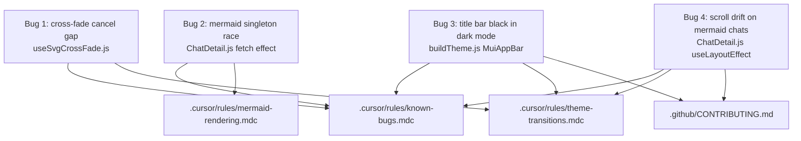

# Four bug fixes

## Bug summary

The four bugs and where they live:



---

## Bug 1: Mermaid SVG cross-fade outgoing layer sticks when reduced motion is enabled mid-fade

### Symptom (existing `# TODO(bug):` in `[frontend/src/hooks/useSvgCrossFade.js](frontend/src/hooks/useSvgCrossFade.js)` around line 156)

A user flips OS-level "reduce motion" during the ~200ms mermaid SVG cross-fade window between dark/light theme toggles. The outgoing SVG layer sticks on top of the incoming SVG until the next svg change for the block (typically the next theme toggle). Two SVGs visually overlap until then.

### Root cause

The hook returns an `onAnimationEnd` callback wired to the outgoing `<Box>`'s `onAnimationEnd` JSX prop in `[frontend/src/components/MermaidDiagramSurface.js](frontend/src/components/MermaidDiagramSurface.js)` (line 138). The callback calls `setOutgoingSvg(null)` to unmount the layer.

The global `@media (prefers-reduced-motion: reduce)` rule in `[frontend/src/index.css](frontend/src/index.css)` (lines 84-92) overrides `animation: none !important;` on every element. When the user flips reduced motion mid-animation, the running keyframe is cancelled — the browser fires `animationcancel`, NOT `animationend`. React's `onAnimationEnd` JSX prop is `onanimationend` only; it does not catch `animationcancel`, so `setOutgoingSvg(null)` is never called.

The hook's `useReducedMotion` JS gate at `useSvgCrossFade.js:130` only suppresses NEW outgoing-layer mounts after the OS preference flip; it does not clean up an in-flight fade whose layer has already mounted.

### Fix plan

1. Modify `[frontend/src/hooks/useSvgCrossFade.js](frontend/src/hooks/useSvgCrossFade.js)`:
   - Add a new `outgoingRef` via `useRef(null)` and include it in the hook's return value.
   - Add a new `useEffect` keyed on `outgoingSvg` that, when `outgoingSvg !== null`, attaches an `animationcancel` listener via `outgoingRef.current.addEventListener('animationcancel', handler)` whose handler is `() => setOutgoingSvg(null)`. The cleanup removes the listener.
   - Place the new effect alongside the existing `useEffect([outgoingSvg])` that maintains `activeCrossFades`.
   - Remove the `# TODO(bug):` block (lines 156-170).
   - Add an intent-only comment explaining why we cannot rely on JSX `onAnimationEnd` alone (the keyframe `animation: none !important` from the global reduced-motion CSS rule fires `animationcancel`, not `animationend`, mid-fade) per `comments-style.mdc`.

2. Modify `[frontend/src/components/MermaidDiagramSurface.js](frontend/src/components/MermaidDiagramSurface.js)`:
   - Destructure `outgoingRef` from `useSvgCrossFade(svg)` (line 45).
   - Attach `ref={outgoingRef}` to the outgoing `<Box>` (around line 135).

3. Update `[.cursor/rules/known-bugs.mdc](.cursor/rules/known-bugs.mdc)`:
   - Move the cross-fade-cancellation entry from the "live" markers section into the "retired examples" section, with a one-line description of the fix (the `animationcancel` listener attached via `useEffect` in the hook).

4. Update `[.cursor/rules/theme-transitions.mdc](.cursor/rules/theme-transitions.mdc)`:
   - In the "SVG content cross-fade (mermaid diagrams)" section's "Four load-bearing pieces" enumeration, add the `animationcancel` listener as a new fifth piece, alongside the existing `useInView` / `useReducedMotion` / concurrent-fade-cap / `willChange` items, marked as a correctness invariant rather than a perf optimization.
   - Cross-reference the change in the "Reduced motion" section.

5. Update `[.cursor/rules/frontend-hooks.mdc](.cursor/rules/frontend-hooks.mdc)`:
   - Update the `useSvgCrossFade` entry in "Canonical hooks to read when writing a new one" to include the new `outgoingRef` return field.

---

## Bug 2: Cross-message mermaid singleton race during dual-theme prerender

### Symptom (existing `# TODO(bug):` in `[frontend/src/components/chat-detail/ChatDetail.js](frontend/src/components/chat-detail/ChatDetail.js)` around line 80)

On a chat with multiple messages and many diagrams, some diagrams render with the WRONG theme on first paint or after the first toggle from cache. The chat URLs the user provided (e.g. `/chat/ec60d4dd-9bac-45af-84e7-bc7e35022378`) will likely be diagram-heavy enough to surface this in dev.

### Root cause

The current fetch effect runs:

```js
const preparedMessages = await Promise.all(
  rawMessages.map(async (message) => {
    const renderedContent = await prepareMarkdownHtml(message.content);
    const mermaidSvgs = await prerenderMermaidDiagrams(renderedContent, darkMode);
    await prerenderMermaidDiagrams(renderedContent, !darkMode);
    return { ...message, renderedContent, mermaidSvgs, images };
  }),
);
```

`prerenderMermaidDiagrams` calls `mermaid.initialize({ theme: ... })` on the global mermaid singleton before its `Promise.all` over diagrams. `Promise.all(rawMessages.map(...))` runs N message-level prerenders concurrently while each message's dual-theme pair fires alternating `theme: dark` / `theme: !dark`. The in-message sequential `await` only serializes the two prerenders for ONE message; across messages, the dual-theme pairs interleave. Once any message's B-pass calls `mermaid.initialize({ theme: !darkMode })`, it overwrites the singleton. Mermaid's internal `processAndSetConfigs` calls `reset()` to that baseline at the start of every `mermaid.render`, so any other message's A-pass render that has not yet captured its config picks up the FLIPPED theme and produces a wrong-themed SVG cached under `(source, darkMode)`.

### Fix plan

1. Restructure the fetch effect in `[frontend/src/components/chat-detail/ChatDetail.js](frontend/src/components/chat-detail/ChatDetail.js)` (lines 40-129) into THREE sequential outer phases:
   - **Phase A** — `Promise.all` over `rawMessages` calling `prepareMarkdownHtml` only. Returns `messagesWithHtml` (with `renderedContent` populated).
   - **Phase B** — `Promise.all` over `messagesWithHtml` calling `prerenderMermaidDiagrams(m.renderedContent, darkMode)`. Returns `mermaidSvgsByMessage` (the user's active theme).
   - **Phase C** — `Promise.all` over `messagesWithHtml` calling `prerenderMermaidDiagrams(m.renderedContent, !darkMode)`. Return value unused (cache-warm only).
   - Build `preparedMessages` from `messagesWithHtml` plus `mermaidSvgsByMessage`.
   - The sequential `await` between Phase B and Phase C ensures that all of Phase B's renders share `theme: darkMode` and all of Phase C's renders share `theme: !darkMode`. Phase B and C themselves can use `Promise.all` internally because every concurrent render within a phase shares the same theme.

2. Remove the `# TODO(bug):` comment (lines 80-102) and replace with an intent-only comment explaining why two sequential outer phases (one per theme) are required: the mermaid singleton's `theme` setting cannot be safely interleaved across concurrent renders, and `prerenderMermaidDiagrams` itself uses `Promise.all` internally, so each call must own the singleton uncontested for its full lifetime. Cite `[.cursor/rules/mermaid-rendering.mdc](.cursor/rules/mermaid-rendering.mdc)` "Render cache and queue" → `prerenderMermaidDiagrams` writer subsection.

3. Update `[.cursor/rules/known-bugs.mdc](.cursor/rules/known-bugs.mdc)`:
   - Move the cross-message singleton race entry from "live" to "retired examples", noting the fix is the three-phase fetch effect with cross-message `Promise.all` inside each per-theme phase, and the manual verification expectation (toggle through both themes on a diagram-heavy multi-message chat such as `/chat/ec60d4dd-9bac-45af-84e7-bc7e35022378` and inspect each diagram's `stroke` / `fill` colors against the expected scheme).

4. Update `[.cursor/rules/mermaid-rendering.mdc](.cursor/rules/mermaid-rendering.mdc)`:
   - In the "Render cache and queue" → "`mermaidRenderCache`" → `prerenderMermaidDiagrams` writer subsection, replace the language about "ChatDetail's fetch effect calls it twice sequentially" with the new three-phase shape (markdown prep, theme A, theme B). Pin the invariant that the dual-theme prerender pair must NOT be nested inside a `Promise.all` over messages.

---

## Bug 3: AppBar (title bar) is black in dark mode after CSS-variables migration

### Symptom

After the recent CSS-variables migration on `1.0.6-dev-ui-refactor`, the `<AppBar>` in `[frontend/src/components/Header.js](frontend/src/components/Header.js)` shows a near-black background in dark mode. On `main`, both light and dark mode used the configured `c.primary.dark` (= `#005e80`, the shared blue from `[frontend/src/theme/colors.js](frontend/src/theme/colors.js)::sharedColors.primary.dark`).

### Root cause

`[frontend/src/theme/buildTheme.js](frontend/src/theme/buildTheme.js)` at line 136 sets:

```js
MuiAppBar: {
  styleOverrides: {
    root: {
      background: 'var(--mui-palette-primary-dark)',
      ...
```

MUI 7's default `MuiAppBar` styling, when `cssVariables` and `colorSchemes` are both configured, includes a higher-specificity scheme-aware override for the dark scheme. The default props gate is:

```js
{
  props: ({ ownerState }) => !ownerState.enableColorOnDark,
  style: ({ theme }) => ({
    ...theme.applyStyles('dark', {
      backgroundColor: theme.vars?.palette.AppBar?.darkBg ?? ...,
    }),
  }),
},
```

`AppBar.darkBg` defaults to `theme.palette.background.default` (= `#121212` from our `darkColors.background.default`), which is what the user sees as "black". Our `styleOverrides.root.background` shorthand gets out-specificity'd by MUI's `applyStyles('dark', { backgroundColor: ... })` when the `enableColorOnDark` prop is the default `false`. This was not an issue on `main` because the pre-migration theme had a single per-mode object built per toggle, with no scheme-conditional default to compete against.

### Fix plan

1. Modify `[frontend/src/theme/buildTheme.js](frontend/src/theme/buildTheme.js)` `MuiAppBar` config (lines 133-141):
   - Add a `defaultProps: { enableColorOnDark: true }` block alongside the existing `styleOverrides`. This disables MUI's dark-mode scheme-conditional default and lets the configured `background: 'var(--mui-palette-primary-dark)'` apply uniformly across both schemes (giving us `#005e80` from the shared `primary.dark` palette token in both modes, matching `main`).
   - Add an intent-only comment per `comments-style.mdc` explaining the `enableColorOnDark` invariant: with `cssVariables` + `colorSchemes`, MUI 7's default AppBar applies a dark-scheme-only `applyStyles('dark', { backgroundColor: AppBar.darkBg })` rule that beats `styleOverrides.root.background` on specificity; setting `enableColorOnDark: true` gates that conditional out so our static override applies in both schemes (matching the pre-migration `main`-branch behavior, where the AppBar was always `#005e80`). Reference `[.cursor/rules/theme-transitions.mdc](.cursor/rules/theme-transitions.mdc)`.

2. Update `[.cursor/rules/theme-transitions.mdc](.cursor/rules/theme-transitions.mdc)`:
   - In the "Centralize via MUI theme `styleOverrides`" section, add a paragraph documenting the `MuiAppBar` `enableColorOnDark: true` requirement and why: with `cssVariables` + `colorSchemes`, MUI 7's default AppBar has scheme-aware overrides for dark mode that beat any static `styleOverrides.root.background` unless `enableColorOnDark` is set. Mark this as a load-bearing wire-up similar to the `colorSchemeSelector: 'data-mui-color-scheme'` invariant in the "CSS variables palette" section.

3. Update `[.cursor/rules/known-bugs.mdc](.cursor/rules/known-bugs.mdc)`:
   - Add the AppBar-black-in-dark-mode bug as a new "retired example" with the fix summary (set `MuiAppBar.defaultProps.enableColorOnDark: true` so the static `styleOverrides.root.background: var(--mui-palette-primary-dark)` applies in both schemes), and the manual verification expectation (open a chat in dark mode, confirm the title bar is `#005e80` blue and not `#121212` black).

4. No README or CONTRIBUTING.md change for this bug — the fix is internal to the theme config and does not change a documented file boundary.

---

## Bug 4: Scroll position drifts on refresh of chats with mermaid diagrams

### Symptom

Refreshing a chat with embedded mermaid diagrams (e.g. `/chat/ec60d4dd-9bac-45af-84e7-bc7e35022378` or `/chat/7be71d40-07cb-46de-8203-266e17c97ae7`) lands the user slightly above or below the saved scroll position. Chats without mermaid diagrams restore precisely.

### Root cause

`[frontend/src/components/MermaidBlock.js](frontend/src/components/MermaidBlock.js)` lines 104-105 set:

```js
contentVisibility: 'auto',
containIntrinsicSize: '0 400px',
```

This skips layout / paint of off-screen mermaid blocks until they scroll into view, using a 400px placeholder height in the meantime. The placeholder is a heuristic: real mermaid blocks vary widely in height (a flowchart with 20 nodes may be 800px+; a sequence diagram with 3 messages may be 200px).

The save/restore in `[frontend/src/components/chat-detail/ChatDetail.js](frontend/src/components/chat-detail/ChatDetail.js)` lines 142-165 stores raw `window.scrollY` to `sessionStorage` and replays it via `window.scrollTo(0, saved)` in `useLayoutEffect`. At save time, the user has scrolled past mermaid blocks above the viewport, so they have been materialized to their actual heights. At restore time, every off-screen mermaid block (above and below) is at the 400px placeholder. Saved scrollY corresponds to a different visual position in the new layout.

Chats without mermaid blocks restore precisely because nothing else uses `content-visibility: auto`.

### Fix plan

The fix uses anchor-based scroll restoration: save the current top-of-viewport message bubble's index and the user's vertical offset within it, and restore by recomputing scrollY from that anchor's actual `offsetTop` in the post-load layout. The result is layout-independent: any size delta in mermaid blocks above the anchor is absorbed by `element.offsetTop` recalculating against the current layout.

1. Modify `[frontend/src/components/chat-detail/MessageBubble.js](frontend/src/components/chat-detail/MessageBubble.js)`:
   - Accept a new `index` prop alongside `sessionId` / `message`.
   - Add `data-msg-idx={index}` to the outermost `<Box sx={{ mb: 3.5 }}>` (line 32) so the anchor element is queryable by index.

2. Modify `[frontend/src/components/chat-detail/MessageList.js](frontend/src/components/chat-detail/MessageList.js)`:
   - Pass `index={index}` to each `<MessageBubble>` (line 24).

3. Modify the scroll save/restore effect in `[frontend/src/components/chat-detail/ChatDetail.js](frontend/src/components/chat-detail/ChatDetail.js)` (lines 142-165):
   - Change the `sessionStorage` value shape from `String(window.scrollY)` to a JSON object `{ msgIdx: number, offset: number }` where `offset = window.scrollY - msgElement.offsetTop`. The anchor is the topmost in-viewport `[data-msg-idx]` element, found via `document.querySelectorAll('[data-msg-idx]')` and `getBoundingClientRect()` at scroll time.
   - On restore, parse the JSON, query the anchor element by `[data-msg-idx="${msgIdx}"]`, compute `targetY = anchorEl.offsetTop + offset`, and `window.scrollTo(0, targetY)`. Fallback to plain scrollY when the saved entry is the legacy plain-number format (so an existing user's `sessionStorage` still works) OR when the anchor element no longer exists (e.g. a chat that has lost messages).
   - Keep the existing `useLayoutEffect` boundary so the restore still fires before the first paint.
   - Add an intent-only comment per `comments-style.mdc` explaining why the anchor-based restoration is robust to layout changes from `content-visibility: auto` placeholder vs actual heights.

4. Update `[.cursor/rules/theme-transitions.mdc](.cursor/rules/theme-transitions.mdc)`:
   - In the "SVG content cross-fade (mermaid diagrams)" section's "Two CSS containment hints" subsection (which documents `contentVisibility: 'auto'` + `containIntrinsicSize: '0 400px'` on `MermaidBlock`), add a paragraph noting that the 400px placeholder heuristic causes scroll-position drift on refresh unless paired with anchor-based scroll restoration; cross-reference `[ChatDetail.js](frontend/src/components/chat-detail/ChatDetail.js)`'s anchor-based `useLayoutEffect`.

5. Update `[.cursor/rules/known-bugs.mdc](.cursor/rules/known-bugs.mdc)`:
   - Add the scroll-drift-on-mermaid-chats bug as a new "retired example" with the fix summary (anchor-based scroll restoration with `data-msg-idx` on `MessageBubble`'s outer `<Box>`) and the manual verification expectation (refresh `/chat/ec60d4dd-9bac-45af-84e7-bc7e35022378` and `/chat/7be71d40-07cb-46de-8203-266e17c97ae7`; user lands precisely where they were).

6. Update `[.github/CONTRIBUTING.md](.github/CONTRIBUTING.md)`:
   - In the `chat-detail/` bullet, mention the anchor-based scroll restoration in `ChatDetail.js`'s `useLayoutEffect` and the `data-msg-idx` contract on `MessageBubble`.

---

## Cross-cutting rule and documentation discipline

After all four fixes land, run a single pass to enforce the always-applied rules from `[.cursor/rules/](.cursor/rules/)`:

- **`comments-style.mdc`** — every new comment explains intent / trade-offs / invariants, not what the code literally says. Rewrite any narration-style comment.
- **`known-bugs.mdc`** — every fixed `# TODO(bug):` is removed and the bug is moved from the "live markers" section to the "retired examples" section in the rule. Any newly-discovered deferred bug gets a fresh `# TODO(bug):` with the symptom + suspected cause format.
- **`react-components.mdc`** — verify no edited file crosses the ~250-line cap. `MermaidDiagramSurface.js` is currently 170 lines plus the new `outgoingRef` plumbing (~5 lines added) — well under. `useSvgCrossFade.js` grows by ~10 lines for the cancel-listener `useEffect` and cleanup, still well under cap. `ChatDetail.js` is currently 269 lines — the three-phase restructure simplifies the inline closure and the anchor-based scroll restore adds maybe 15 lines net; total stays under cap. If any single file grows past the cap during the implementation, decompose into a feature-folder sibling per the rule.
- **`theme-transitions.mdc`** — no new transition literals, no new `transition` shorthand in `sx` outside the documented PALETTE_TRANSITION composition pattern. The AppBar fix changes a `defaultProps`, not a transition. The cross-fade fix changes a hook listener wiring, not the transition itself.
- **`mermaid-rendering.mdc`** — verify the bug-2 restructure does NOT introduce a third call to `mermaid.parse` / `mermaid.render` / `mermaid.initialize`; only the existing `prerenderMermaidDiagrams` calls move between phases. Parse-before-render invariant is preserved by construction (we don't touch `prerenderMermaidDiagrams`'s body).
- **`frontend-hooks.mdc`** — `useSvgCrossFade`'s new `outgoingRef` is a ref-shape return field, consistent with the "expose minimal state" guidance and the existing `surfaceRef` precedent. The cancel-listener cleanup uses `cancelled`-flag-equivalent guarding via the listener's own removal in cleanup.
- **`project-layout.mdc`** — no new top-level files, no file deletions. `[.github/CONTRIBUTING.md](.github/CONTRIBUTING.md)` updated for bug 4's `data-msg-idx` contract.

`[README.md](README.md)` does not need an update: the four bugs are internal correctness fixes that do not change user-facing setup, binary usage, or documented features. The "Smooth dark/light theme fade across the entire UI" feature line in `README.md` already covers the surface area; the fixes restore its promise rather than expand it.

---

## Test and verification

All four fixes are frontend-only. Per `[.cursor/rules/known-bugs.mdc](.cursor/rules/known-bugs.mdc)`, the frontend has no JS test harness, so none of the fixes are regression-pinned by automated tests; the rule explicitly accepts manual verification + cross-referenced rule entries as the invariant-enforcement mechanism for frontend bugs.

Two test layers still run:

1. **Python `unittest` suite** — `[.cursor/rules/project-layout.mdc](.cursor/rules/project-layout.mdc)` requires `python -m unittest discover -s tests` to stay green. None of the four fixes touch the `cursor_view/` Python package, but the run is a safety check that no rule edit (or accidental cross-file change) regresses anything else. Expected outcome: every existing test passes with no new failures or errors.

2. **Manual verification** for each fix, mirroring the verification expectations recorded in the rule entries:
   - **Bug 1** — In a chat with at least one mermaid diagram, toggle dark/light. While the ~200ms cross-fade is in flight, flip the OS-level "reduce motion" preference. Expected: the outgoing SVG layer unmounts cleanly within the same frame the keyframe is cancelled; no stuck overlay remains until the next theme toggle.
   - **Bug 2** — Open a diagram-heavy multi-message chat such as `/chat/ec60d4dd-9bac-45af-84e7-bc7e35022378`. Inspect each diagram's `stroke` / `fill` colors against the expected scheme (light = light theme palette, dark = dark theme palette) on first paint. Toggle dark/light from cache and re-inspect. Expected: every diagram renders in the active theme on first paint and after every toggle, with no off-theme cached SVGs.
   - **Bug 3** — Open any chat in dark mode. Expected: the AppBar / title bar is `#005e80` blue (the shared `primary.dark` palette token), not `#121212` near-black (the dark scheme's `background.default`). Toggle to light mode and confirm the AppBar stays the same blue (matches `main`-branch behavior).
   - **Bug 4** — Open `/chat/ec60d4dd-9bac-45af-84e7-bc7e35022378` and `/chat/7be71d40-07cb-46de-8203-266e17c97ae7`, scroll to a non-trivial position (e.g. mid-chat with mermaid blocks both above and below the viewport), then refresh the page. Expected: the page restores to precisely the same visual position; the topmost in-viewport message is the same on each side of the refresh, with the same vertical offset within it. Repeat with a chat that has no mermaid diagrams to confirm the legacy-format fallback still works for entries written before the upgrade.

If any manual verification fails, treat the failure as a new bug per `[.cursor/rules/known-bugs.mdc](.cursor/rules/known-bugs.mdc)`'s "Do not silently delete suspicious code" section: add a `# TODO(bug):` marker rather than papering over the symptom, and surface it for triage before declaring the plan complete.
