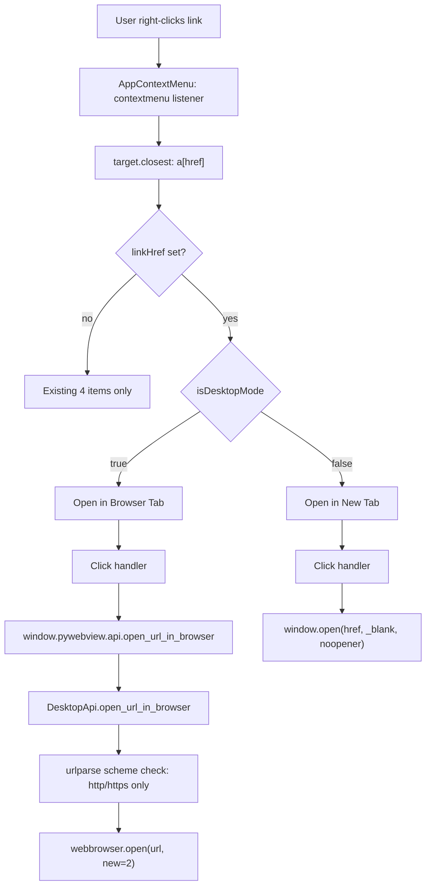

# Image attachment post-implementation follow-up

## Scope

This plan started as a post-implementation audit of the image-attachment-support PR (branch diff vs. `1.0.7-dev`) scoped to bug fixes only. During iteration the scope broadened significantly based on user-reported regressions, user-requested UX enhancements, and rule-audit findings. The resulting eight buckets:

- **Bucket A** - Correctness / UX work introduced by this PR (A1-A10). Includes the original bug-fix items plus user-reported UX regressions (image gallery below bubble instead of inside), export-format bugs (CommonMark thematic-break), and user-requested enhancements (clickable HTML-export images, in-app modal lightbox).
- **Bucket B** - Pre-existing bugs surfaced incidentally during the audit (B1-B3).
- **Bucket C** - Chat-UI right-click "Open link" menu item that routes through the Python bridge in desktop mode and `window.open` in terminal / browser mode, with conditional label text (C1-C3). User-requested after the main image work landed.
- **Bucket D** - Style / plan-target drift items - module / function size splits (D1-D4).
- **Bucket E** - Regression test coverage for every correctness fix (E1).
- **Bucket F** - Documentation reorganization - move contributor-facing sections from `README.md` into the new `.github/CONTRIBUTING.md` (F1).
- **Bucket G** - Final audit phase - rule-violation check, rule-accuracy update, new-rule authorship decision, and a `TODO(bug):`-style bug re-review (G1-G4).
- **Bucket H** - Final docs sync that reconciles `README.md` and `.github/CONTRIBUTING.md` against the post-G-phase tree (H1).

Rollout ordering is in a dedicated section at the bottom of this file.

## Bucket A - Bugs introduced by this PR

### A1 - Preview shows "Content unavailable" for image-only chats

**Where.** [`cursor_view/chat_index/rows.py`](cursor_view/chat_index/rows.py) lines 28-40 (`_preview_from_messages`).

**What.** Plan section 5 changed the coalescer so image-only turns emit `content=""` instead of `"Content unavailable"`. `_preview_from_messages` only considers non-empty string content, so chats whose first turn is image-only fall through to the `"Content unavailable"` fallback in the chat-list preview and search snippet.

**Fix direction.** When `first_user` / `first_any` are both `None`, check whether any message carries a non-empty `images` list; if so return a neutral label (e.g. `"(image attachment)"`) instead of `"Content unavailable"`. Intent-only comment. Function stays well under the 100-line soft limit.

### A2 - Unescaped `uuid` in Markdown export ``

**Where.** [`cursor_view/export/markdown.py`](cursor_view/export/markdown.py) line 22 inside `_render_message_images_markdown`.

**What.** The current interpolation is `f''`. `data_uri` is safe (base64 alphabet + mime prefix), but `uuid` is a string from bubble JSON and is not escaped. A uuid containing `"` or `>` breaks out of the attribute and allows HTML injection when the exported `.md` file is viewed in a renderer that passes HTML through (most of them).

**Fix direction.** Wrap uuid in `html.escape(..., quote=True)`; import `html` at module level. HTML path already uses `html.escape` on its alt text so no fix needed there.

### A3 - Frontend gallery crashes on malformed image entries

**Where.** [`frontend/src/components/chat-detail/MessageImageGallery.js`](frontend/src/components/chat-detail/MessageImageGallery.js) lines 36-40.

**What.** `images.map((img) => ...)` dereferences `img.uuid` with no guard. If the array contains `null` or a non-object, or if `uuid` is absent/non-string, the component throws at render ("Cannot read properties of undefined"). The SQLite `chat_image.uuid TEXT NOT NULL` prevents this in well-formed data, but the frontend is trust-the-server today and a future upstream regression would surface as a React crash that blanks the whole chat page.

**Fix direction.** Filter the `images` prop at component entry to entries satisfying `img && typeof img.uuid === 'string' && img.uuid.length > 0`. Component stays well under the 250-line react-components limit; no hooks introduced.

### A4 - `get_chat` silently drops out-of-range image positions

**Where.** [`cursor_view/chat_index/index.py`](cursor_view/chat_index/index.py) lines 120-124 (line numbers confirmed against the post-schema-drift file; the routing changes from `.cursor/plans/schema-drift-sync-rebuild_aa2ba9e8.plan.md` did not move this block because they landed after `get_chat`).

```120:124:cursor_view/chat_index/index.py
        for image in image_rows:
            position = image.pop("position")
            image.pop("image_index", None)
            if 0 <= position < len(messages):
                messages[position]["images"].append(image)
```

**What.** If `chat_image.position` ever falls outside `[0, len(messages))` (manual DB edit, partial failure during delta apply, future bug) the image is dropped with no log. Silent data loss is harder to notice than a crash.

**Fix direction.** Add a lazy `logger.warning("Dropping out-of-range chat_image row for %s: position=%s", ...)` on the else branch. One line; no module-size impact beyond S2's fix.

### A5 - `_composer_hash` docstring overclaims image-change detection

**Where.** [`cursor_view/cache/delta/composer_rows.py`](cursor_view/cache/delta/composer_rows.py) `_composer_hash` docstring.

**What.** The docstring says "the source-row hash already flips when a bubble's images change". True for the bubble JSON. But if an on-disk PNG file is replaced at the same path with the bubble's `selectedImages[].uuid` and `.path` unchanged, `_hash_value` (which hashes the row's SQLite value, not the referenced file) does not flip and the stale `chat_image` BLOB lingers until something else dirties the composer. Cursor does not typically rewrite image files in place, but the docstring should not overclaim.

**Fix direction.** Soften the paragraph to acknowledge that the row hash flips when the bubble JSON changes (uuid / path / inline bytes) but not when a disk file is replaced under an unchanged reference; note this is acceptable because Cursor assigns a fresh uuid on each upload.

### A6 - Image gallery renders below the chat bubble instead of inside it

**Where.** [`frontend/src/components/chat-detail/MessageBubble.js`](frontend/src/components/chat-detail/MessageBubble.js) (renders `<MessageImageGallery>` as a sibling of `<Paper>`) and [`frontend/src/components/chat-detail/MessageImageGallery.js`](frontend/src/components/chat-detail/MessageImageGallery.js) (role-based asymmetric `ml`/`mr` margins were set up to align with that out-of-Paper positioning).

**What.** User-reported visual regression. The original plan section 9.3 placed `<MessageImageGallery>` *after* `</Paper>`, so attached images visually float beneath the text bubble rather than inside it. The expected layout (per the user's mockup) is for images to sit inside the same Paper that holds the text content, below the markdown block. This issue is **chat-view-only**: both exports already render images inside the message block -- section 8.2's `_render_message_images_html` appends into `rendered_content` before `.message-content` closes, and section 8.1's Markdown export inlines the `` tags within the same `**User**` / `**Cursor**` block.

**Current structure (`MessageBubble.js`):**

```jsx
<Box sx={{ mb: 3.5 }}>
  <Box>{/* avatar + role label */}</Box>
  <Paper>
    <Box sx={{ /* markdown styling */ }}>
      {typeof message.renderedContent === 'string'
        ? <MessageMarkdown html={…} colors={…} role={…} mermaidSvgs={message.mermaidSvgs} />
        : <Typography>Content unavailable</Typography>}
    </Box>
  </Paper>
  {images.length > 0 && (
    <MessageImageGallery sessionId={sessionId} images={images} role={message.role} />
  )}
</Box>
```

The `mermaidSvgs={message.mermaidSvgs}` prop is the hand-off to the mermaid pre-render Map populated by `ChatDetail`'s fetch effect (see `.cursor/plans/mermaid-diagram-rendering_e9f9690c.plan.md` §Change 1); it is orthogonal to A6 and stays on the `<MessageMarkdown>` element as-is after the JSX move below.

**Target structure:**

```jsx
<Box sx={{ mb: 3.5 }}>
  <Box>{/* avatar + role label */}</Box>
  <Paper>
    <Box sx={{ /* markdown styling */ }}>
      {typeof message.renderedContent === 'string'
        ? <MessageMarkdown html={…} colors={…} role={…} mermaidSvgs={message.mermaidSvgs} />
        : <Typography>Content unavailable</Typography>}
    </Box>
    {images.length > 0 && (
      <MessageImageGallery sessionId={sessionId} images={images} role={message.role} />
    )}
  </Paper>
</Box>
```

**Fix direction.**

1. In `MessageBubble.js`, move the `<MessageImageGallery>` render inside the `<Paper>` so it sits as a sibling below the inner markdown-styling `<Box>`. The outer layout `<Box sx={{ mb: 3.5 }}>` and the avatar row stay unchanged.
2. In `MessageImageGallery.js`, drop the role-based asymmetric margins (`ml: role === 'user' ? 0 : 5`, `mr: role === 'user' ? 5 : 0`). Those existed solely to align the gallery with the Paper's own external offset when the gallery sat outside the Paper; inside, the Paper's own padding already scopes the gallery horizontally. Keep `mt` for vertical separation from the text content (plan section 9.4's specified gap of `1.5` still reads well against the markdown block above). `role` stays on the prop signature for alt-text use only.
3. Update the intent comment in `MessageBubble.js` that currently says the gallery "renders beneath the Paper" so the flex layout does not fight the markdown theming. Post-fix, the comment should state that the gallery sits below the inner markdown `<Box>` but inside the same `<Paper>` so the bubble visually contains its attachments (matching the exported Markdown / HTML layout).

**Rule compliance.**

- [`react-components.mdc`](.cursor/rules/react-components.mdc) - `MessageBubble.js` stays at ~103 lines (current count; moving one JSX block from outside to inside a parent element is byte-neutral, well under the 250-line soft limit); `MessageImageGallery.js` drops two lines, still well under 80; theme tokens only (no hard-coded colors); one component per file preserved; "feature-folder sibling" layout preserved. The `mermaid-rendering.mdc` third-party imperative-DOM rule (added by `.cursor/plans/mermaid-diagram-rendering_e9f9690c.plan.md`) applies only to the `MessageMarkdown` → `MermaidBlock` chain inside the Paper and is not affected by the gallery relocation.
- [`frontend-hooks.mdc`](.cursor/rules/frontend-hooks.mdc) - no hook changes; `MessageBubble` keeps its existing `useContext(ColorContext)` and nothing else.
- [`image-attachments.mdc`](.cursor/rules/image-attachments.mdc) - byte flow unchanged (gallery still renders `` against the dedicated route; no base64 inlining, no chat-detail JSON bytes, no new path to the cache).
- [`comments-style.mdc`](.cursor/rules/comments-style.mdc) - the updated intent comment on the gallery placement explains *why* it lives inside the Paper (parity with exported layout, bubble visually contains its attachments) rather than narrating the JSX structure.

**Why no regression test.** This codebase has no frontend test harness -- `tests/` is stdlib-only Python unittest over synthetic Cursor DBs (per `.cursor/rules/project-layout.mdc`), and plan section 10 explicitly forbids adding a new JS dependency. Verification is manual via the chat UI (the user's own screenshot comparison is the gold test).

### A7 - `image-attachments.mdc` rule accuracy

**Where.** [`.cursor/rules/image-attachments.mdc`](.cursor/rules/image-attachments.mdc).

**Rule state check.** Confirmed that `image-attachments.mdc` was **not** touched by any of the three intervening plans (`filter_orphan_bubbles_835756be`, `schema-drift-sync-rebuild_aa2ba9e8`, `mermaid-diagram-rendering_e9f9690c`); both drift items below still apply verbatim.

**What.** Two drift items:
- The "Canonical examples" section near the end of the rule names only `markdown.py::_render_message_images_markdown` and `html.py::_render_message_images_html` as consumers that inline base64 data URIs, but the JSON export path also returns per-message `images` with `data_uri` populated (via `get_chat(..., include_image_bytes=True)` in `routes.py::export_chat`). The "Bytes flow" section higher up does already mention JSON correctly ("Markdown / JSON / HTML renderers") so the fix is a narrow one-bullet addition to the "Canonical examples" list naming the JSON export entry point. Per comments-style.mdc "Rule drift", the two sections must agree.
- The paragraph on `_sniff_mime` says "reads the first 16 bytes" and calls out a deliberate two-part WEBP check. The 16-byte figure is only the size of the unknown-magic debug log slice; the sniffer uses prefix checks of 3-12 bytes depending on format. Minor wording nit worth fixing while the rule is being touched.

**Fix direction.** Edit the two paragraphs. No code change.

### A8 - Markdown export: missing blank line between `` and `---`

**Where.** [`cursor_view/export/markdown.py`](cursor_view/export/markdown.py) `generate_markdown` message loop (lines 70-72 in the current file).

**What.** User-reported. For a text-only message, the current code emits lines `[heading, "", content, "", "---", ""]`, which serializes to:

```
**User**

some text here

---

```

The blank line between `some text here` and `---` is what tells a CommonMark parser to render `---` as a thematic break (horizontal rule). For an image-bearing message the sequence becomes `[heading, "", content, "", "", "", "---", ""]`, which serializes to:

```
**User**

some text here


---

```

There is no blank line between the last `` tag and `---`. Per the [CommonMark spec for thematic breaks](https://spec.commonmark.org/0.31.2/#thematic-breaks), a line consisting of three or more `-` must be preceded by a blank line to be parsed as `<hr />`; otherwise the preceding paragraph consumes it as either a setext-H2 underline or a continuation of the paragraph, depending on the parser. Users reported renderers showing the literal `---` text. Text-only messages don't hit this because `lines.extend([heading, "", content.rstrip(), ""])` already leaves a trailing `""` before `---` is appended.

**Fix direction.** Capture the helper's output once, and when it's non-empty append a trailing `""` so the blank-line separator is restored:

```python
image_lines = _render_message_images_markdown(images)
if image_lines:
    lines.extend(image_lines)
    lines.append("")
lines.extend(["---", ""])
```

The intent comment should explain *why* the blank is needed ("blank line so CommonMark renders the `---` as a thematic break, not a setext heading underline or literal dashes"), not narrate what the code does.

**Interaction with D4.** D4 extracts the per-message block into `_markdown_message_lines`. A8's conditional blank logic moves into that helper when D4 lands. If A8 runs before D4, D4 must preserve the conditional blank in the extracted helper verbatim.

**Rule compliance.**
- [`comments-style.mdc`](.cursor/rules/comments-style.mdc) - intent-only comment on why the blank line is appended (CommonMark thematic-break requirement).
- [`python-standards.mdc`](.cursor/rules/python-standards.mdc) - `generate_markdown` grows ~3 lines; stays well under the 100-line function soft limit and the module stays under 100 lines pre-D4 (and ~95 post-D4 per D4's own estimate).
- [`image-attachments.mdc`](.cursor/rules/image-attachments.mdc) - export renderer semantics unchanged (still uses `img["data_uri"]` base64 URIs); byte-flow untouched.
- [`known-bugs.mdc`](.cursor/rules/known-bugs.mdc) - not a `TODO(bug):` path; this is a concrete bug to fix, not "known-broken behavior we're leaving."

### A9 - HTML export: images should be clickable hyperlinks to a full-size view

**Where.**
- [`cursor_view/export/html.py`](cursor_view/export/html.py) `_render_message_images_html` (lines 328-353 in the current file; the function moved down the module when `.cursor/plans/mermaid-diagram-rendering_e9f9690c.plan.md` added ~60 lines of mermaid CSS to `_HTML_STYLE_TEMPLATE`) - emits each `` tag.
- [`cursor_view/export/html.py`](cursor_view/export/html.py) `_HTML_STYLE_TEMPLATE` `.message-images` CSS block (lines 182-191 in the current file) - needs anchor-specific rules.

**Mermaid-CSS coexistence.** The mermaid rules (lines 266-324 of the current file: `.mermaid`, `.mermaid-toggle`, `.mermaid-source`, `.mermaid-error`, `.mermaid-error-msg`, `.mermaid-error-src`) live farther down the template and do not collide with A9's additions. The selectors are orthogonal (`.message-images a` vs. `.mermaid-*`), and A9's `text-decoration: none` / `line-height: 0` overrides target only descendants of `.message-images`, never descendants of `.mermaid`. No cross-editing of mermaid rules is required when A9 lands.

**What.** User-reported UX request. HTML exports currently emit bare `` tags, so users who want a full-size view of an attached image must right-click and pick *Open Image in New Tab*. The live React gallery (`MessageImageGallery.js`) already ships the better UX: each image is wrapped in `<Box component="a" href={src} target="_blank" rel="noopener">` so one click opens the full-size image in a new tab. The HTML export should be brought to parity.

**Current tag shape (inside `<div class="message-images">`):**

```html

```

**Target tag shape:**

```html
<a href="data:image/png;base64,iVBORw0..." target="_blank" rel="noopener"></a>
```

The `data_uri` appears twice (once in `href`, once in `src`) - both point at the same inlined base64 resource that is already in the document, so there is no extra payload cost and no new path to cache bytes. Browsers render `<a href="data:image/png;..." target="_blank">` by opening the image in a new tab with the data URI as the address; modern browsers (Chrome, Firefox, Safari) explicitly allow top-level navigation to `data:image/*` even though they restrict `data:text/html` for phishing reasons, so the UX is cross-browser.

**Fix direction.**

1. Update `_render_message_images_html` so each entry in the list comprehension builds the wrapped tag:

```python
tags = []
for img in images:
    if not isinstance(img, dict):
        continue
    data_uri = html.escape(img.get("data_uri", ""), quote=True)
    tags.append(
        f'<a href="{data_uri}" target="_blank" rel="noopener">'
        f''
        f'</a>'
    )
```

   The `html.escape(..., quote=True)` on `data_uri` is defensive discipline - base64 output is `[A-Za-z0-9+/=]` and contains no HTML-special characters after the `data:<mime>;base64,` prefix, but the MIME prefix itself comes from `_sniff_mime` (canonical values) and the overall value originates from stored BLOB metadata. Matching the A2 escape-on-interpolation pattern removes a class of bug without reading the threat model. Intent comment should note the UX parity ("one-click full-size view, parity with MessageImageGallery"), not narrate the tag shape.

2. Extend `_HTML_STYLE_TEMPLATE`'s `.message-images` block with anchor-specific rules. The existing `.message-content a { text-decoration: none }` plus `.message-content a:hover { text-decoration: underline }` would produce a hover underline under images wrapped in `<a>`; override both for image-only anchors:

```css
.message-content .message-images a {{
    display: inline-flex;
    text-decoration: none;
    line-height: 0;
}}
.message-content .message-images a:hover {{
    text-decoration: none;
}}
```

   - `display: inline-flex` keeps the anchor box hugging the image instead of stretching to the container edge.
   - `text-decoration: none` on both base and `:hover` neutralizes the global link styling that would otherwise render a line beneath each hovered image.
   - `line-height: 0` removes the descender gap under an inline-block `` inside the anchor. Parallel to `MessageImageGallery.js`'s own `lineHeight: 0` on its anchor.

   The existing `.message-images img { border: 1px solid var(--image-border); border-radius: 6px }` already styles the image; no change needed there.

**Interaction with D3.** D3 moves `_HTML_STYLE_TEMPLATE` into a new sibling `cursor_view/export/html_styles.py`. A9's CSS additions (~6 lines) land in whichever module currently owns the template; the doubled-brace `{{` / `}}` escaping discipline must be preserved. If D3 lands before A9, the additions go in the sibling file; if A9 lands before D3, D3's move carries the new block along without modification.

**Interaction with A2.** A9 independently escapes `data_uri` in the HTML path - the audit flagged both Markdown (A2) and HTML paths as having unescaped `data_uri` in `src`, but A2 as authored only covers Markdown. A9 closes the HTML side of the same discipline while it is already editing the tag construction.

**Markdown parity (out of scope).** The parallel change to the Markdown exporter (`_render_message_images_markdown` wrapping each `` in an anchor) is deliberately not in A9's scope. The user's request named HTML explicitly, and Markdown renderers vary in how they pass through wrapping anchors vs. raw ``. If the same UX is desired for Markdown exports later, a sibling todo would mirror A9's change and test case.

**Rule compliance.**

- [`comments-style.mdc`](.cursor/rules/comments-style.mdc) - intent comment on the anchor wrapping (UX parity with the live gallery, one-click full-size view) rather than narrating the HTML shape.
- [`python-standards.mdc`](.cursor/rules/python-standards.mdc) - the list comprehension becomes an explicit `for`/`append` loop because escaping `data_uri` is simpler to read with a local variable; `_render_message_images_html` grows from 26 to ~30 lines, well under the 100-line function soft limit. Module-size impact: `html.py` gains ~6 lines of CSS in the template pre-D3 (443 -> ~449) and 2-3 lines in the helper body. Post-D3 the module lives at ~225 and easily absorbs this; pre-D3 the module is already over the soft limit and this change makes the case for prioritizing D3 before A9 in the rollout.
- [`image-attachments.mdc`](.cursor/rules/image-attachments.mdc) - byte flow unchanged. The rule's "Bytes flow through dedicated paths" section covers the dedicated `GET /api/chat/<id>/image/<uuid>` route and `include_image_bytes=True` for exports; A9 uses the exact same `data_uri` the existing export path already inlines, just referenced twice per image (once as `href`, once as `src`). No new inline path into chat-detail JSON, no new cache hit.
- [`known-bugs.mdc`](.cursor/rules/known-bugs.mdc) - not a `TODO(bug):` path; this is a user-facing UX enhancement shipped in the same PR as the tests that prove it.
- [`react-components.mdc`](.cursor/rules/react-components.mdc) - frontend unchanged; A9 only brings the HTML exporter to parity with what the frontend already does. No hooks, no theme violations, no component-size changes.
- [`frontend-hooks.mdc`](.cursor/rules/frontend-hooks.mdc) - not touched.
- [`sqlite-cursor-db.mdc`](.cursor/rules/sqlite-cursor-db.mdc) - cache untouched.

**Regression test.** Add one case to E1 (see §E1 below). Test driver feeds `generate_standalone_html` a chat with one image and asserts:
1. The rendered HTML contains the exact substring `'<a href="data:image/png;base64,...[short prefix]" target="_blank" rel="noopener">'` immediately before the `` tag (proving the wrapper), and `</a>` immediately after the `` (proving the close).
2. The `href` and `src` are the *same* `data_uri` (parse both out of the HTML and `assertEqual`).
3. The CSS block `.message-content .message-images a` is present in the `<style>` section with `text-decoration: none` on both base and `:hover` states.
4. Companion assertion that a text-only message's HTML output does not contain any `<div class="message-images">` or anchor wrappers - proves the non-image path stays untouched.

### A10 - Chat view: image click should open a modal lightbox, not a new browser tab

**Where.**
- [`frontend/src/components/chat-detail/MessageImageGallery.js`](frontend/src/components/chat-detail/MessageImageGallery.js) - swap the `<Box component="a" href target="_blank" rel="noopener">` wrapper for a clickable `<Box component="button">` and own the lightbox's open-index state.
- **New file** `frontend/src/components/chat-detail/ImageLightboxModal.js` - one-component-per-file sibling rendering the full-size view over a dimmed backdrop.

**What.** User-reported UX request backed by a Cursor-UI screenshot. The current gallery opens images in a new browser tab (via A9's anchor pattern, inherited from the original §9.4 layout). Cursor's own chat UI uses an in-place modal: clicking a thumbnail overlays a full-size image on a dimmed backdrop, with a counter (`1/2`) top-left, a close button top-right, and a thumbnail strip along the bottom so the user can step through attached images without leaving the chat context. The new-tab pattern jolts the user out of the chat; the modal feels native.

Scope is strictly the **live React UI**. The user's request explicitly calls out that HTML exports must not change: exported `.html` files have no React runtime to mount a modal, and A9's anchor pattern remains the right UX there (users get "Open in new tab" on a click). So after A9 + A10 both land:

- **Live chat view** (React): click opens the in-app modal.
- **HTML export**: click opens the image in a new browser tab.
- **Markdown export**: unchanged from A2 (raw `` tags, viewer-dependent).

**Target UX (per the user's screenshot).**

- Clicking any image thumbnail opens the modal.
- Modal centers the full image over a dimmed backdrop bounded by the viewport (`max-width: 90vw; max-height: 85vh` - the image never overflows).
- If the message has more than one image:
  - A counter ("`1/2`") renders in the top-left.
  - Prev / next chevron buttons render as overlays on the image edges.
  - `ArrowLeft` / `ArrowRight` on the keyboard navigate.
  - A thumbnail strip along the bottom shows all images in the same message; clicking a thumbnail sets the open index.
- A close button (`<IconButton>` with `<CloseIcon>`) sits in the top-right corner.
- Clicking the backdrop closes the modal. Pressing `Escape` closes it (MUI `<Dialog>` supports both natively via `onClose`).

**Component boundary.**

```
MessageImageGallery                     (owns openIndex state)
  +-- <Box component="button">x N       (thumbnails)
  +-- <ImageLightboxModal                (renders only when openIndex !== null)
         sessionId
         images                          (same shape the gallery already normalizes)
         openIndex                       (controlled by parent)
         onClose                         (useCallback: () => setOpenIndex(null))
         onNavigate                      (useCallback: (i) => setOpenIndex(i))
       />
```

Props for `ImageLightboxModal`:

```
{
  sessionId: string,
  images: Array<{ uuid, mime_type?, width?, height? }>,
  openIndex: number | null,
  onClose: () => void,
  onNavigate: (newIndex: number) => void,
}
```

`openIndex === null` => `<Dialog open={false}>` and the modal short-circuits to nothing. The parent gallery re-renders when state flips; the modal's `useEffect` registers / removes its keydown listener accordingly. No portals or refs leaked; the dialog's default focus-trap + Escape behavior is provided by MUI.

**Thumbnail-button migration inside `MessageImageGallery.js`.**

- Remove `const src = ...` inside the map - the thumbnail URL is still the same route, but the anchor wrapper changes from `<a href>` to `<button onClick>`.
- Remove `href`, `target`, `rel` from the wrapper Box.
- Replace with `component="button"`, `type="button"`, `onClick={() => setOpenIndex(i)}`, `aria-label={alt}` so screen-reader users get the same description they currently do from the ``.
- Reset the native button styling on the sx prop: `cursor: 'pointer'`, `padding: 0`, `border: 0` on the button reset, `backgroundColor: 'transparent'`. Keep the existing `border: '1px solid'`, `borderColor: 'divider'`, `borderRadius: 1`, `overflow: 'hidden'`, `maxWidth: 280` styling so the thumbnails look identical to today. Drop `lineHeight: 0` on the button (now a flex container will do the same job via `display: 'inline-flex'`).

**Keyboard handling inside the modal.**

```
useEffect(() => {
  if (openIndex === null) return;
  const handler = (e) => {
    if (e.key === 'Escape') { onClose(); return; }
    if (images.length <= 1) return;
    if (e.key === 'ArrowLeft')  onNavigate(Math.max(0, openIndex - 1));
    if (e.key === 'ArrowRight') onNavigate(Math.min(images.length - 1, openIndex + 1));
  };
  window.addEventListener('keydown', handler);
  return () => window.removeEventListener('keydown', handler);
}, [openIndex, images.length, onClose, onNavigate]);
```

The effect re-registers only when `openIndex` / `images.length` / the callback identities change. Because the parent wraps `onClose` / `onNavigate` in `useCallback` with stable deps, the listener does not churn per render.

Note: MUI `<Dialog>` intercepts Escape on its own via `onClose`, so the explicit Escape branch above is redundant if the dialog is used. I listed it for completeness in case `<Modal>` is chosen over `<Dialog>`. Pick one; if `<Dialog>`, the branch can be removed from the handler.

**Interaction with other fixes.**

- **A3** (defensive image filter) runs at the top of `MessageImageGallery` before the map; the modal never sees malformed entries.
- **A6** (gallery inside `<Paper>`) only changes the JSX placement of the gallery inside `MessageBubble`; A10 doesn't touch that boundary. Either order works.
- **A9** is strictly export-side HTML; A10 is strictly React UI. They are orthogonal.
- **A7** (rule accuracy for `image-attachments.mdc`): the rule's "Canonical examples" section currently lists only `MessageImageGallery.js` as the frontend consumer. A7's edits should also add `frontend/src/components/chat-detail/ImageLightboxModal.js` to that list (it consumes bytes from the same dedicated route). Flagged here so A7 picks it up along with its other rule-accuracy work.

**Rule compliance.**

- [`react-components.mdc`](.cursor/rules/react-components.mdc)
  - One component per file: `ImageLightboxModal` is a new sibling under `chat-detail/`; `MessageImageGallery` stays one component.
  - Size budgets: `ImageLightboxModal.js` targets ~120 lines (well under 250); `MessageImageGallery.js` grows from ~71 to ~95-100 (well under 250).
  - Theme ownership: MUI theme tokens only (`bgcolor: 'background.paper'`, `borderColor: 'divider'`, `color: 'text.secondary'` for the counter, `color: 'text.primary'` on icons); **no hard-coded colors**. The backdrop uses MUI's default shroud.
  - Duplication: only one gallery uses the modal; no hook extraction yet. If a second caller appears later, `useImageLightbox(images)` should be extracted to `frontend/src/hooks/` per the "duplicated logic across pages" rule.

- [`frontend-hooks.mdc`](.cursor/rules/frontend-hooks.mdc)
  - No new custom hook introduced (single consumer).
  - Callbacks passed across the component boundary (`onClose`, `onNavigate`) are wrapped in `useCallback` in `MessageImageGallery` with accurate deps, so the modal's `useEffect` does not re-register the keydown listener on every parent render ("Stable callback references" section of the rule).
  - The keydown `useEffect` cleans up its listener via the effect-return function (standard shape; the rule's `cancelled` flag pattern is specifically for awaited fetches, not DOM event listeners).

- [`image-attachments.mdc`](.cursor/rules/image-attachments.mdc)
  - Byte flow unchanged. The modal's `` still targets `GET /api/chat/<session_id>/image/<image_uuid>` - the same URL the thumbnails already hit, so the browser reuses its cached response. No new route, no new inline base64 in the chat-detail JSON.
  - A7 should add `ImageLightboxModal.js` to the rule's "Canonical examples" list (see Interaction with A7 above).

- [`comments-style.mdc`](.cursor/rules/comments-style.mdc)
  - Intent comment on `MessageImageGallery`'s button wrapper explains the modal-open semantics and why it replaced the anchor (UX parity with Cursor's own chat UI; keeps the user in context). The existing gallery header comment loses its anchor-specific language.
  - `ImageLightboxModal.js` header docstring explains the per-message scope ("one modal per message's attachments; thumbnails restrict to the same message's images") and the UX invariants (Escape closes, arrow keys navigate when > 1 image, close button + backdrop-click mirror Escape).

- [`known-bugs.mdc`](.cursor/rules/known-bugs.mdc) - not a `TODO(bug):` path.

- [`project-layout.mdc`](.cursor/rules/project-layout.mdc) - new file lives under `frontend/src/components/chat-detail/` per the feature-folder structure. **No new dependency** in `frontend/package.json` - MUI `Dialog` / `IconButton` / `Typography` and icons (`CloseIcon`, `ChevronLeftIcon`, `ChevronRightIcon`) are already available via the existing MUI install and used elsewhere in the codebase. Plan section 10 of the original feature plan forbade adding a new JS dependency; A10 respects that.

- [`sqlite-cursor-db.mdc`](.cursor/rules/sqlite-cursor-db.mdc) - not touched.

**Why no regression test.** Same as A3 and A6: the repo has no frontend test harness (`tests/` is stdlib-only Python unittest per `.cursor/rules/project-layout.mdc`), and adding a Jest or Testing Library dependency is out of scope per plan section 10 of the original feature plan. Verification is manual via the Cursor View app against the user's screenshot - click a thumbnail, confirm the modal opens, navigate with arrow keys / thumbnails / chevrons, confirm Escape + backdrop-click + close button all dismiss, confirm `<Paper>` content underneath the modal is unaffected. E1 does not grow for A10.

## Bucket B - Pre-existing bugs surfaced by the audit

### B1 - `_parse_bubble_row` crashes on non-dict JSON

**Where.** [`cursor_view/sources/bubbles.py`](cursor_view/sources/bubbles.py) line 148.

**What.** After `b = json.loads(value)`, the `isinstance(b, dict)` branch populates URI / tool-call / image_refs lists, but the unconditional `txt = (b.get("text") or b.get("richText") or "").strip()` that follows calls `.get` on `b` regardless. If `b` is a list, string, number, or `None`, Pass 2 crashes with `AttributeError` instead of skipping the row. Confirmed pre-existing in `1.0.7-dev` but triggered more often now because image work surfaces more edge cases.

**Fix direction.** Move the `txt` assignment inside the `isinstance(b, dict)` branch and set `txt = ""` in the else, or guard with `txt = b.get(...) if isinstance(b, dict) else ""`. Same isinstance gate the neighboring lines already use.

### B2 - `Content-Length` uses Unicode code points, not UTF-8 bytes

**Where.** [`cursor_view/routes.py`](cursor_view/routes.py) `export_chat` HTML branch (~`Content-Length: str(len(html_content))`).

**What.** `len()` on a `str` counts code points. Any non-ASCII character in the exported HTML (project name, path, chat text) makes the declared `Content-Length` smaller than the UTF-8-encoded body, which can truncate the response in strict clients and proxies. Confirmed pre-existing.

**Fix direction.** Compute `html_bytes = html_content.encode("utf-8")` once, use `len(html_bytes)` for `Content-Length`, and either pass bytes to `Response(...)` or let Flask re-encode. Apply the same pattern to the markdown branch (the Markdown branch already does this correctly with `md_bytes` - verify the HTML branch mirrors it).

### B3 - `Content-Disposition: filename="..."` does not sanitize session_id

**Where.** [`cursor_view/routes.py`](cursor_view/routes.py), three places (`export_chat` JSON/MD/HTML branches).

**What.** `f'attachment; filename="cursor-chat-{session_id[:8]}.html"'`. In practice session_ids are UUIDs, but if one ever contained `"`, `;`, or a newline, the header could be malformed or split. Defense-in-depth fix. Confirmed pre-existing.

**Fix direction.** Use `werkzeug.utils.secure_filename` or a regex `re.sub(r'[^A-Za-z0-9._-]', '', session_id[:8])` before interpolation. Apply to all three branches.

## Bucket C - Chat-UI right-click "Open link" menu item

Three-part feature introduced by a user request after the main image work landed. The app renders links inside chat-message markdown; right-clicking one should offer an "open in a browser tab" action regardless of whether the user is in terminal mode (Flask + system browser) or desktop mode (pywebview embedded webview). In desktop mode the text reads *"Open in Browser Tab"* to signal that the action launches the user's system browser rather than creating another webview window; in terminal mode it reads *"Open in New Tab"* because the app is already a browser tab and the action opens a sibling tab. The feature touches three layers - the Python bridge (C1), a new shared frontend helper (C2), and the context-menu consumer (C3).

**End-to-end flow** (click, branch on mode, land in the right navigation path):



The three horizontal swim-lanes map onto the three sub-todos:

- Left column (`User right-clicks link` -> `target.closest: a[href]` -> `linkHref set?`) is the **C3** link-detection extension to `AppContextMenu.js`.
- Middle column (`Click handler` -> `window.pywebview.api.open_url_in_browser` -> `DesktopApi.open_url_in_browser` -> `urlparse scheme check` -> `webbrowser.open`) is the **C1 + C3** desktop path: frontend click -> pywebview bridge -> Python stdlib browser launch.
- Right column (`Click handler` -> `window.open(href, _blank, noopener)`) is the **C3** terminal / browser-mode path.
- The `isDesktopMode` diamond sits above the two mode columns and represents **C2**'s exported helper; its return value picks both the label text (`Open in Browser Tab` vs. `Open in New Tab`) and the click-handler branch.

### C1 - Backend: add `DesktopApi.open_url_in_browser` bridge method

**Where.** [`cursor_view/desktop/api.py`](cursor_view/desktop/api.py) (currently the `DesktopApi` class only exposes `save_export`).

**What.** Desktop mode wraps the Flask app inside a pywebview window. Inside that window a plain `window.open(href, '_blank')` behaves inconsistently across pywebview backends (Chrome embedded, WebView2, WebKitGTK, QtWebEngine) -- it may be blocked, open a new pywebview window, or navigate the current webview away from the chat. The reliable way to open a URL in the *user's* default browser is to round-trip through the Python bridge and let Python's stdlib `webbrowser.open(url, new=2)` pick the right handler. The existing bridge has one method (`save_export`); C1 adds a second.

**Fix direction.** Add the method to `cursor_view/desktop/api.py`:

```python
from urllib.parse import urlparse
import webbrowser

def open_url_in_browser(self, url: str) -> dict[str, Any]:
    """Open ``url`` in the user's system default browser.

    Called from the chat context menu when a desktop-mode user picks
    "Open in Browser Tab". Restricts to ``http`` / ``https`` schemes
    so a compromised frontend (or a malformed href in stored chat
    content) cannot ask the OS to navigate to ``file:///``,
    ``javascript:``, ``data:``, or other schemes that have
    historically been abused.
    """
    try:
        scheme = urlparse(url).scheme
    except Exception as exc:
        logger.warning("Invalid URL for open_url_in_browser: %s (%s)", url, exc)
        return {"opened": False, "error": "invalid URL"}
    if scheme not in ("http", "https"):
        logger.warning("Refusing to open non-http(s) URL: %s", url)
        return {"opened": False, "error": "unsupported scheme"}
    try:
        opened = webbrowser.open(url, new=2)
    except Exception as exc:
        logger.warning("webbrowser.open failed for %s: %s", url, exc)
        return {"opened": False, "error": str(exc)}
    return {"opened": bool(opened)}
```

Matches the existing `save_export` contract: returns a JSON-serializable dict (pywebview marshals it back to JS), never raises across the bridge, logs failure modes with lazy `%s`-style formatting. `webbrowser` and `urlparse` are stdlib; no new dependency in `requirements.txt`.

**Interaction with other todos.** Standalone. No other backend file needs to change for this bucket; Flask routes are untouched (the bridge call is pywebview-in-process, not an HTTP round-trip). Terminal mode never calls this method (the frontend routes to `window.open` instead), so the method's presence does not affect `run_server` at all.

**Rule compliance.**

- [`python-standards.mdc`](.cursor/rules/python-standards.mdc) - new method is ~20 lines; `cursor_view/desktop/api.py` stays well under the 400-line module limit; lazy `%s` logging throughout; typed return (`dict[str, Any]`); no cross-package underscore imports; `webbrowser` and `urllib.parse` are stdlib, so no import-time side effects change.
- [`known-bugs.mdc`](.cursor/rules/known-bugs.mdc) - scheme allowlist is a defensive check, not a silent delete; no hardcoded user paths; no `TODO(bug):`.
- [`sqlite-cursor-db.mdc`](.cursor/rules/sqlite-cursor-db.mdc) - not touched.
- [`comments-style.mdc`](.cursor/rules/comments-style.mdc) - docstring explains *why* the scheme allowlist exists (attack-surface narrowing) and *why* errors return dicts instead of raising (pywebview-bridge JSON contract), not *what* each line does.

### C2 - Frontend: extract `isDesktopMode` helper to `frontend/src/utils/mode.js`

**Where.** [`frontend/src/utils/mode.js`](frontend/src/utils/mode.js) (new file). [`frontend/src/utils/exportChat.js`](frontend/src/utils/exportChat.js) updates its existing `hasDesktopBridge` to consume the new helper.

**What.** Desktop-mode detection currently lives in [`frontend/src/utils/exportChat.js::hasDesktopBridge`](frontend/src/utils/exportChat.js):

```js
function hasDesktopBridge() {
  return (
    typeof window !== 'undefined' &&
    window.pywebview &&
    window.pywebview.api &&
    typeof window.pywebview.api.save_export === 'function'
  );
}
```

That check intentionally conflates two separate questions: (a) *am I running inside pywebview at all?* and (b) *is the `save_export` method on the bridge ready yet?* C3 needs to ask only (a) to decide the menu label text (the label does not depend on whether `open_url_in_browser` has finished registering). Per [`react-components.mdc`](.cursor/rules/react-components.mdc)'s rule that "a helper may not be copied into two components; promote it on sight", extract (a) to a shared helper rather than duplicating the check at each call site.

**Fix direction.**

1. Create `frontend/src/utils/mode.js`:

```js
// Return true iff the React app is running inside pywebview's desktop
// shell. `window.pywebview` is only injected by pywebview's runtime,
// so its mere existence is the runtime signal. Bridge *readiness*
// (whether a specific Python method is callable yet) is a separate
// per-method check -- keep that check next to each caller so a bridge
// that comes up out-of-order does not silently break one feature
// while another still works.
export function isDesktopMode() {
  return typeof window !== 'undefined' && !!window.pywebview;
}
```

2. Update `frontend/src/utils/exportChat.js::hasDesktopBridge` to layer on top:

```js
import { isDesktopMode } from './mode';

function hasDesktopBridge() {
  return (
    isDesktopMode() &&
    window.pywebview.api &&
    typeof window.pywebview.api.save_export === 'function'
  );
}
```

`hasDesktopBridge` stays internal to `exportChat.js`; only `isDesktopMode` is exported at the utility level because per-method bridge-readiness checks should live next to the method they gate.

**Interaction with other todos.** Prerequisite for C3 (the context menu imports `isDesktopMode`). No other consumer is introduced by this plan.

**Rule compliance.**

- [`react-components.mdc`](.cursor/rules/react-components.mdc) - pure helper in `frontend/src/utils/` per the repo's fixed structure; not duplicated across components; the promote-on-sight rule is the motivation.
- [`frontend-hooks.mdc`](.cursor/rules/frontend-hooks.mdc) - not a hook (no React state, no `useEffect`); no hook discipline applies.
- [`comments-style.mdc`](.cursor/rules/comments-style.mdc) - intent comment distinguishes "desktop runtime present" from "bridge method ready" so a future contributor does not collapse the two checks again.
- [`known-bugs.mdc`](.cursor/rules/known-bugs.mdc) - not touched.

### C3 - Frontend: add conditional "Open in New Tab" / "Open in Browser Tab" menu item

**Where.** [`frontend/src/components/AppContextMenu.js`](frontend/src/components/AppContextMenu.js) (208 lines today; the existing 4-item context menu).

**What.** Extend the existing `contextmenu` handler so right-clicking on an `<a href>` (or inside a descendant of one -- `target.closest('a[href]')`) surfaces an "open link" action at the top of the menu. Label is conditional: `"Open in Browser Tab"` in desktop mode, `"Open in New Tab"` in terminal mode. Click handler routes through the pywebview bridge in desktop mode (C1) or `window.open` in terminal mode.

**Target menu shape when a link is the right-click target** (user-visible order):

```
Open in New Tab       (or "Open in Browser Tab" in desktop mode)
--------
Copy                  (existing, unchanged)
Cut                   (existing, unchanged)
Paste                 (existing, unchanged)
--------              (existing divider)
Select All            (existing, unchanged)
```

When the right-click target is **not** inside an anchor (the common case -- plain message text, the chat list, a header, etc.), the menu shows the existing four items only, with no leading divider.

**Fix direction.**

1. **New imports** at the top of [`AppContextMenu.js`](frontend/src/components/AppContextMenu.js) (lines 1-9 today):

```js
import OpenInNewIcon from '@mui/icons-material/OpenInNew';
import { isDesktopMode } from '../utils/mode';
```

`OpenInNewIcon` is not currently imported anywhere in `frontend/src`; `@mui/icons-material` is already a dependency at `^7.3.9` (see `frontend/package.json`), so no `package.json` edit.

2. **New state** alongside the existing `useState` calls (lines 12-15 today):

```js
const [linkHref, setLinkHref] = useState(null);
```

3. **Extend the `contextmenu` handler** (lines 24-55 today) to resolve the nearest anchor ancestor. Add this after `targetRef.current = target;` (line 29):

```js
// Pull the DOM-resolved absolute href, not the raw attribute value;
// this matches what a left-click would navigate to and spares the
// click handler a base-URL resolution step. Non-anchor targets leave
// linkHref null and the new MenuItem short-circuits below.
const anchor = target.closest('a[href]');
setLinkHref(anchor ? anchor.href : null);
```

Also extend `handleClose` (lines 17-22 today) to reset the new state:

```js
setLinkHref(null);
```

4. **New click handler** `handleOpenLink`, placed next to the existing `handleCopy` / `handleCut` / `handlePaste` / `handleSelectAll`:

```js
const handleOpenLink = () => {
  const href = linkHref;
  handleClose();
  if (!href) return;
  if (isDesktopMode() && window.pywebview?.api?.open_url_in_browser) {
    // Route through the Python bridge so the OS default browser
    // opens the URL instead of pywebview navigating the embedded
    // webview away from the chat. Fire-and-forget: the bridge
    // validates the scheme, logs its own failures, and returns a
    // dict we do not need here.
    window.pywebview.api.open_url_in_browser(href);
    return;
  }
  // Terminal / browser mode -- or desktop mode in the brief window
  // before the bridge finishes registering (rare, but the optional
  // chain above handles it). `noopener` keeps the new tab from
  // reaching back into `window.opener`.
  window.open(href, '_blank', 'noopener');
};
```

5. **New MenuItem** rendered at the top of the `<Menu>` body (lines 185-201 today). Wrap in a fragment that conditionally renders based on `linkHref`:

```jsx
{linkHref && (
  <>
    <MenuItem onClick={handleOpenLink}>
      <ListItemIcon><OpenInNewIcon fontSize="small" /></ListItemIcon>
      <ListItemText>
        {isDesktopMode() ? 'Open in Browser Tab' : 'Open in New Tab'}
      </ListItemText>
    </MenuItem>
    <Divider />
  </>
)}
<MenuItem onClick={handleCopy} disabled={!hasSelection}>
  {/* ...existing Copy/Cut/Paste/Divider/SelectAll unchanged... */}
```

6. **Leave the existing four items untouched.** Their disabled-state logic (`!hasSelection`, `!(editable && hasSelection)`, `!editable`) is unchanged; the new Open-link item sits above them with its own visibility gate.

**Edge cases handled.**

- Right-clicking a non-link element -> `closest('a[href]')` returns `null` -> `linkHref` is null -> the new MenuItem short-circuits -> menu renders with only the existing four items.
- Right-clicking a link that contains text the user had selected -> `selectionText` stays populated so `Copy` remains enabled; the new item appears *above* `Copy`, not instead of it.
- Right-clicking an anchor without an `href` attribute (rare but legal in HTML; think `<a name="...">` fragment markers) -> `closest('a[href]')` ignores it -> menu behaves as if the click were on non-link text.
- Right-clicking a link whose href is `mailto:`, `tel:`, `javascript:`, `file:`, or any non-http(s) scheme in desktop mode -> the Python bridge in C1 refuses the scheme and logs a warning; the menu click is a silent no-op at the UX level (acceptable because these schemes are unusual in chat content and silently failing is safer than opening `javascript:` URLs). In terminal mode `window.open(href, '_blank', 'noopener')` lets the browser apply its own scheme handling (typically "do nothing" for `javascript:`, platform handler for `mailto:` / `tel:`).
- Right-clicking a link while pywebview's bridge is still registering (first ~100ms after page load) -> `window.pywebview?.api?.open_url_in_browser` is falsy -> fallback to `window.open` runs. pywebview may or may not honor the fallback; worst case the user right-clicks again after the bridge is ready.

**File-size math.** Today: 208 lines. Additions: ~2 new imports, 1 state hook, 2 handler-internal lines, 1 ~15-line `handleOpenLink`, 1 ~10-line JSX fragment, 1 reset in `handleClose`. Expected total: ~240 lines. Comfortably under the [`react-components.mdc`](.cursor/rules/react-components.mdc) 250-line soft limit.

**Interaction with other todos.** Depends on C1 (backend bridge method) and C2 (frontend helper). No interaction with Bucket A, B, D, E, F, G, H.

**Rule compliance.**

- [`react-components.mdc`](.cursor/rules/react-components.mdc) - one component per file preserved; file stays under 250 lines; no hard-coded colors (the new MenuItem uses the same MUI theme surface as the existing four); `OpenInNewIcon` is imported from the existing `@mui/icons-material` dependency; the conditional label pulls from `isDesktopMode()` return rather than a hard-coded string table.
- [`frontend-hooks.mdc`](.cursor/rules/frontend-hooks.mdc) - no new custom hook introduced; the existing `useSavedSelection` wiring is untouched; `handleOpenLink` is a plain function (not `useCallback`-wrapped) because it is only referenced from one JSX node inside the same render and does not cross a memoization boundary. The `contextmenu` `useEffect` already follows the rule's cancellation shape (add/remove listener) and grows by two non-async lines that do not affect that shape.
- [`image-attachments.mdc`](.cursor/rules/image-attachments.mdc) - unrelated; not touched. The chat-view image gallery (A10's `ImageLightboxModal`) handles its own click UX; links inside exported markdown message text are a separate concern.
- [`comments-style.mdc`](.cursor/rules/comments-style.mdc) - intent comments on the `closest('a[href]')` resolution (DOM-absolute vs. raw attribute), the bridge-routing decision (why desktop mode cannot use `window.open` directly), and the `noopener` flag (source-window isolation) - all explain *why*, not *what*.
- [`known-bugs.mdc`](.cursor/rules/known-bugs.mdc) - no `TODO(bug):`; the silent failure for `javascript:` / `mailto:` hrefs in desktop mode is intentional defensive behavior (matches C1's scheme allowlist), not known-broken behavior.
- [`project-layout.mdc`](.cursor/rules/project-layout.mdc) - new file (`frontend/src/utils/mode.js`, from C2) lives under the existing `utils/` folder per the fixed frontend structure.
- [`sqlite-cursor-db.mdc`](.cursor/rules/sqlite-cursor-db.mdc) - not touched.

**Why no automated regression test.** Same reason as A3, A6, A10: the codebase has no frontend test harness (`tests/` is stdlib-only Python unittest per `.cursor/rules/project-layout.mdc`), and adding Jest / Testing Library is forbidden by plan section 10 of the original feature plan ("no new Python or JS dependency"). Manual verification is straightforward and covers four distinct paths: (a) terminal mode + link right-click shows "Open in New Tab" and clicking opens the URL in a sibling browser tab with `noopener`; (b) desktop mode + link right-click shows "Open in Browser Tab" and clicking launches the user's system browser while the pywebview window stays on the chat; (c) right-click on plain (non-link) text shows the existing four items only, no leading divider; (d) right-click on a `mailto:` or `javascript:` link in desktop mode logs the scheme rejection in the pywebview console and does not navigate.

## Bucket D - Style / plan-target drift

### D1 - `cursor_view/images/refs.py` over plan section 3.1 target

**Where.** [`cursor_view/images/refs.py`](cursor_view/images/refs.py) is 141 lines vs. plan section 3.1's soft <100-line target. (At plan-write time the module was 142 lines; a one-line whitespace trim landed in an unrelated touch, so the arithmetic below still matches the original split direction.)

**Fix direction.** Follow the plan's own escape hatch: move `image_ref_to_transport_dict` and `image_ref_from_transport_dict` into a new sibling `cursor_view/images/transport.py`. Update `cursor_view/images/__init__.py` to re-export both from the new module. Update `cursor_view/images/refs.py` module docstring to cross-reference. Consumers (`extraction/passes/global_bubbles.py`, `chat_index/rows.py`) already import from the package `__init__.py`, so no call-site changes needed.

### D2 - `cursor_view/chat_index/index.py` 454 lines, 54 over soft limit

**Where.** [`cursor_view/chat_index/index.py`](cursor_view/chat_index/index.py).

**Starting state (post-schema-drift).** At this plan's authoring, `index.py` was 410 lines. After `.cursor/plans/schema-drift-sync-rebuild_aa2ba9e8.plan.md` landed the synchronous-on-schema-drift router, the module is now **454 lines**. The new lines (~50) are the `_cached_schema_version` helper plus the schema-drift branch inside `ensure_current` and its expanded routing docstring; they are correctness-critical and must not be extracted to a helper module away from the `ChatIndex` instance state they read. D2's arithmetic is updated accordingly.

**Fix direction.** Extract the image-attach + strip-internals step from `get_chat` into a private helper `_attach_images_to_messages(con, session_id, messages, include_bytes)` in `rows.py`. Saves ~8 lines in `index.py` (current lines 117-124), landing it at ~446 -- still over 400. Compensate by tightening two groups of docstrings without losing intent:

1. The `ensure_current` + `_background_refresh_worker` routing docstrings (current lines 154-178 and 253-271 respectively) together can shed ~10-15 lines by consolidating the four-case routing bullets into a pointer to [`chat-index-refresh.mdc`](.cursor/rules/chat-index-refresh.mdc), which now codifies the same invariant. Keep the "old-shape rows under a new-shape reader are a correctness bug" intent sentence in-code so the branch comment stays self-explanatory.
2. The `_insert_chat_images` / `_fetch_images_for_session` docstrings in `rows.py` (this is the trim the original todo already calls for, preserving `rows.py` under ~385 after it absorbs the ~8-line extracted helper from `index.py`; current `rows.py` is 390 lines).

**Target.** `index.py` under ~425-430, `rows.py` under ~385. If docstring trimming cannot get `index.py` back under the 400 soft limit without dropping an intent paragraph, accept the overrun and document it with a one-sentence preamble in the module docstring naming schema-drift routing as the mandatory new floor, rather than extracting routing helpers into a separate module (`_cached_schema_version`, `_schedule_background_refresh`, `_background_refresh_worker`, and `_cached_index_up_to_date` all read `self._rebuild_build_lock`, `self.db_path`, `self._bg_*` fields, so a free-function extraction is unnatural). The soft limit is a *soft* limit; the rule's intent is to prevent runaway growth, not to force awkward splits.

A4's `logger.warning` for out-of-range `chat_image.position` lands in the extracted `_attach_images_to_messages` helper, exactly as the original plan states -- that is still the clean home for it.

### D3 - `cursor_view/export/html.py` 514 lines, 114 over soft limit

**Where.** [`cursor_view/export/html.py`](cursor_view/export/html.py).

**Starting state (post-mermaid).** At this plan's authoring, `html.py` was 443 lines (43 over the soft limit). After `.cursor/plans/mermaid-diagram-rendering_e9f9690c.plan.md` landed, the module is now **514 lines**. The ~71 new lines are:

- ~60 lines of mermaid CSS in `_HTML_STYLE_TEMPLATE` (current lines 266-324: the `.mermaid` / `.mermaid-toggle` / `.mermaid-source` / `.mermaid-error` / `.mermaid-error-msg` / `.mermaid-error-src` rules).
- The `transform_mermaid_fences_to_html` call inside `_build_messages_html` (~2 lines).
- The `load_vendored_mermaid_js()` + `build_mermaid_init_script(...)` invocations and the `<script>` / initializer injection before `</body>` inside `generate_standalone_html` (~4 lines).
- New imports block (`from cursor_view.export.mermaid import ...`).

D3 is more motivated than originally stated (114 over the limit vs. 43) and the split moves more bytes than originally projected.

**Fix direction.** Move `_HTML_STYLE_TEMPLATE` (the ~290-line CSS string constant spanning current lines 35-325, including the new mermaid rules) to a new sibling `cursor_view/export/html_styles.py`. `html.py` re-imports it: `from cursor_view.export.html_styles import HTML_STYLE_TEMPLATE`. The template becomes a public name (drop the leading underscore) since it's now cross-module; the import in `html.py` stays the only consumer. Net: `html.py` drops to ~235 lines (not the original ~225 projection -- the mermaid script-injection and helper-call lines stay in `html.py`); new `html_styles.py` lands at ~290 lines (the mermaid CSS rides the move). Both comfortably under 400. No behavioral change.

**Mermaid coexistence.** The mermaid rules all live inside `_HTML_STYLE_TEMPLATE` and travel with the move; no separate copy or cross-reference is needed. After D3 lands, the `html.py` module body is limited to imports, the two rendering helpers (`_render_message_images_html`, `_build_messages_html`), and `generate_standalone_html` -- none of which contain CSS, so a future contributor adding more mermaid rules will naturally land them in `html_styles.py` by inspection.

### D4 - `generate_markdown` 50 lines, over plan section 8.1's <40 target

**Where.** [`cursor_view/export/markdown.py`](cursor_view/export/markdown.py) lines 28-77.

**Starting state.** `markdown.py` is **78 lines total** today; `generate_markdown` spans lines 28-77 (50 lines). The original plan text cited 51 lines for the function and projected a post-refactor module size of ~95; neither arithmetic survives the smaller starting module. The helper-extraction motivation is unchanged because the function still exceeds plan section 8.1's <40-line soft target.

**Fix direction.** Extract the header-block construction (lines 31-52 -- date formatting + project info + info-lines list) into a private helper `_markdown_header_lines(chat) -> list[str]`. Also extract the per-message rendering block (lines 58-72) into `_markdown_message_lines(msg, index) -> list[str]` which internally calls `_render_message_images_markdown` (and carries A8's conditional blank-line separator when A8 lands in the same helper). `generate_markdown` shrinks to ~20 lines (info, header-lines extend, messages branch with the per-message helper call, footer). Module lands near **~75 lines** post-refactor (two helpers add ~15-20 lines, the parent function sheds ~30); well under the <80 plan target.

## Bucket E - Test coverage additions

### E1 - Regression tests for the fixes above

**Where.** [`tests/test_chat_index_images.py`](tests/test_chat_index_images.py).

Add the following cases in a single PR alongside the fixes:

- **Preview for image-only chat.** Seed a bubble with no text and one image; `ChatIndex.list_summaries()` summary `preview` must not equal `"Content unavailable"`. Pairs with A1.
- **Coalescer post-loop placeholder clear.** Feed `[user "" no-images, user "" [img]]`; assert the merged result has `content == ""` (not `"Content unavailable"`) and `images == [img]`. Covers the §5 post-loop that no existing test exercises.
- **`include_image_bytes=True` round-trip via `get_chat`.** Seed one image, call `get_chat(..., include_image_bytes=True)`, base64-decode the returned `data_uri` and assert it equals the original bytes.
- **Missing-disk warning assertion.** Extend `test_missing_disk_image_is_skipped_not_fatal` to wrap the rebuild in `self.assertLogs("cursor_view.images.loading", level="WARNING")` so a regression that silently swallows `OSError` fails the test.
- **Disk + legacy dedup.** Seed one bubble with the same uuid in both `context.selectedImages` (pointing at a real PNG) and top-level `images` (inline bytes); assert only one `chat_image` row lands and its bytes match the on-disk file (disk-preferred dedup per plan §3.1).
- **Non-dict bubble JSON.** Pairs with B1. Seed a `bubbleId:<cid>:<bid>` row whose value is `'[]'` or `'null'` and assert `ensure_current(force=True)` does not crash and the composer's `chat_message` table is empty.
- **Out-of-range image position.** Pairs with A4. Build one composer, manually INSERT a `chat_image` row with `position=999`, call `get_chat`, assert no crash, no wrong attachment to a valid message, and the warning is emitted.
- **Markdown export: blank line before `---` after images.** Pairs with A8. Call `generate_markdown` on a chat whose first message has one image; split the output by `"\n"` and locate the last `\n---` substring is **absent** from the serialized output (the direct-concat shape that breaks CommonMark). Keep a companion assertion on a text-only message to prove the non-image case stays byte-identical (`"\n\n---\n"` around the separator).
- **HTML export: images wrap in clickable anchor.** Pairs with A9. Call `generate_standalone_html` on a chat with one image; use a small regex (or parse-by-split) to locate the `` tag inside `.message-images` and assert:
  1. It is immediately preceded by `<a href="data:image/png;base64,..." target="_blank" rel="noopener">` (substring match is sufficient -- no DOM parser dependency).
  2. It is immediately followed by `</a>`.
  3. The anchor's `href` attribute value equals the ``'s `src` attribute value (pull both out of the same line and `assertEqual`).
  4. The rendered `<style>` block contains `.message-content .message-images a` with `text-decoration: none` *and* a matching `:hover` override with `text-decoration: none` (so the global `.message-content a:hover` underline does not manifest under hovered images).
  5. Companion assertion that a text-only message's HTML output contains no `<div class="message-images">` and no `<a href="data:` anchor (proves the non-image path is untouched).

Keep the test module stdlib-only (matches `test_chat_index_incremental.py` style). Per `.cursor/rules/project-layout.mdc`, `python -m unittest discover -s tests` must stay green. The Markdown-export (A8) and HTML-export (A9) cases may need to import `generate_markdown` / `generate_standalone_html` at test scope and live in `tests/test_chat_index_images.py` next to the coalescer unit cases already there -- keep it stdlib-only.

## Bucket F - Documentation reorganization

### F1 - Move developer-facing content from `README.md` to `.github/CONTRIBUTING.md`

**Where.**
- **New file**: `.github/CONTRIBUTING.md` - GitHub's standard location for contributor docs; auto-linked from the Issues and Pull Requests tabs and surfaced on the repo's Community tab.
- **Modified**: [`README.md`](README.md) - drops the contributor-facing sections, keeps the user-facing ones, adds a single pointer line.
- **Modified**: [`.cursor/rules/project-layout.mdc`](.cursor/rules/project-layout.mdc) - the "Documentation sync" clause is updated to point at the new file (required by `comments-style.mdc`'s Rule drift clause).

**What.** The README currently mixes two audiences. The `## Project layout` section (lines 33-255 in the current file) opens with the sentence *"A contributor's map of where things live"* - it is literally self-labeled as contributor documentation and runs ~220 lines deep into backend subpackages, the cache SQLite layout, test modules, frontend feature folders, and assets. The `### Build a standalone binary` subsection is similarly contributor-only (PyInstaller invocation, icon regeneration, dist/ tree, Gatekeeper quarantine note). An end user who just wants to install and use the tool has to scroll past ~250 lines of developer detail to find `## Features`. Moving that content to GitHub's standard `.github/CONTRIBUTING.md` location fixes the signal-to-noise ratio for users without losing any information for contributors.

**Sections that move to `.github/CONTRIBUTING.md`.**

- `## Project layout` in full, preserving all existing subsections verbatim. Section headers may become `## ...` (top-level in the new file) instead of `### ...` so CONTRIBUTING.md reads cleanly as its own document:
  - `### Entry points`
  - `### Backend (cursor_view/)` (top-level modules + subpackages + the content-tables / delta-tables cache layout block; includes the `cursor_view/export/vendor/` sub-subpackage entry that `.cursor/plans/mermaid-diagram-rendering_e9f9690c.plan.md` added to the canonical subpackages list and the vendored `mermaid.min.js` + `VERSION.txt` file-inventory bullet)
  - `### Tests (tests/)` - renamed to `## Running the tests` as a top-level section, preserving the `python -m unittest discover -s tests` invocation and the test-module summaries (the list has grown since this plan was written to include `tests/test_chat_index_incremental.py`'s orphan-bubble and schema-drift regression tests and the new `tests/test_export_html_mermaid.py`; the move carries whatever the list looks like at the moment F1 executes)
  - `### Frontend (frontend/src/)` (carries the `components/MermaidBlock.js`, `hooks/useMermaid.js`, and `utils/prerenderMermaidDiagrams.js` entries the mermaid plan appended)
  - `### Assets and configuration`
- `### Build a standalone binary` from `## Standalone binary`, including the PyInstaller invocation, icon-regeneration script (`python3 assets/icons/_generate_icons.py`), `dist/` tree, and the macOS `xattr -dr com.apple.quarantine` note.
- `## Updating vendored mermaid` (added to `README.md` by `.cursor/plans/mermaid-diagram-rendering_e9f9690c.plan.md`) -- contributor-only docs (`npm install` → copy → `VERSION.txt` bump flow plus the frontend / export major-version alignment caveat). Belongs in CONTRIBUTING for the same signal-to-noise reason as the Project-layout sections. After the move, `README.md` pointer to CONTRIBUTING should be sufficient; end users installing the tool do not need to know how to rebuild `mermaid.min.js`.
- A short new `## Project conventions` section at the end pointing contributors at `.cursor/rules/` as the persistent convention store (comment style, Python / React component standards, image-attachment handling, mermaid rendering, refresh-path routing, etc.). One paragraph, no verbose restatement of each rule.

**Sections that stay in `README.md`.**

- Title, tagline, privacy note, screenshots (unchanged).
- `## Setup & Running` - quickstart for end users who want to clone and run Python rather than download a binary.
- `## Standalone binary` intro paragraph + `### Run from source (desktop mode)` + `### Running the binary` + `### User preferences / webview profile` - all user-facing binary usage.
- `## Features`.
- Credit line to the original author.
- **New single pointer line** near the top (immediately after the privacy note or as the first section header) of the shape:
  > Contributing to Cursor View? See [`.github/CONTRIBUTING.md`](.github/CONTRIBUTING.md) for the project layout map, the build-from-source PyInstaller instructions, and how to run the test suite.

**Rule update (required in the same PR).** The `comments-style.mdc` Rule drift clause says: *"When a refactor materially changes a convention captured in any rule under `.cursor/rules/`, update that rule in the same PR. Rules must not drift from reality; a stale rule is worse than no rule."* `project-layout.mdc` was touched by `.cursor/plans/mermaid-diagram-rendering_e9f9690c.plan.md` to add the `cursor_view/export/vendor/` sub-subpackage and a new "Vendored third-party browser assets" clause in the Dead-code section, but its Documentation sync clause was **not** touched and still reads exactly as the original plan quoted it:

```
# Documentation sync
- Any change that alters the repository layout must update the
  "Project layout" section of `README.md` in the same change.
```

F1 changes the file that hosts the "Project layout" section, so the rule must be updated in lock-step. The new text is unchanged from the original plan:

```
# Documentation sync
- Any change that alters the repository layout must update the
  "Project layout" section of `.github/CONTRIBUTING.md` in the same
  change. If the change also affects user-facing setup, binary
  usage, or features, update the relevant section of `README.md`
  too.
```

This keeps the rule's prescription concrete (contributors will know exactly which file to sync) while acknowledging that a minority of layout changes (e.g., adding a new binary entry point) do also warrant a README touch.

**Audit of other rules for drift.** `comments-style.mdc`, `known-bugs.mdc`, `python-standards.mdc`, `react-components.mdc`, `frontend-hooks.mdc`, `sqlite-cursor-db.mdc`, and `image-attachments.mdc` do not reference README.md by path or name - they cite code files, `.cursor/rules/` siblings, or themselves. **No additional rule edits needed** beyond the one `project-layout.mdc` update above.

**Interaction with earlier todos.**

- **A6** and **A10** both update the frontend feature-folder list in the README (the `chat-detail/` subpackage bullet gains `MessageImageGallery`, then `ImageLightboxModal`). After F1, that list lives in `CONTRIBUTING.md`. If F1 lands **after** A6 / A10, their README edits are carried by the move verbatim; if F1 lands **before** A6 / A10, those todos edit `CONTRIBUTING.md` directly. Per the rollout ordering below, F1 lands after A6 / A10, so it carries whatever the final documented tree looks like.
- **A7** (rule accuracy edits in `image-attachments.mdc`) is independent of F1 - they touch different rule files.
- **E1** (tests) references `tests/test_chat_index_images.py` and `tests/test_chat_index_incremental.py`. After F1 those references live in `CONTRIBUTING.md`. The test file itself is untouched by F1.
- **No interaction** with any other code-level todo (A1-A5, A8-A9, B1-B3, C1-C3, D1-D4) - none of them touch `README.md` or `.github/CONTRIBUTING.md`. C1-C3 add a backend bridge method and frontend UI components, none of which land in the docs layer.

**Rule compliance.**

- [`project-layout.mdc`](.cursor/rules/project-layout.mdc) - the "Documentation sync" clause is explicitly rewritten in this todo to match the new file layout; future contributors updating the tree will know exactly which file to edit.
- [`comments-style.mdc`](.cursor/rules/comments-style.mdc) - Rule drift clause honored (rule edit ships in the same PR as the content move that motivated it).
- [`known-bugs.mdc`](.cursor/rules/known-bugs.mdc) - no `TODO(bug):` introduced; no hard-coded user paths (all paths in the moved content are already project-relative).
- [`python-standards.mdc`](.cursor/rules/python-standards.mdc) - not touched (no Python changes in F1).
- [`react-components.mdc`](.cursor/rules/react-components.mdc) - not touched (no JSX changes in F1).
- [`frontend-hooks.mdc`](.cursor/rules/frontend-hooks.mdc) - not touched.
- [`sqlite-cursor-db.mdc`](.cursor/rules/sqlite-cursor-db.mdc) - not touched.
- [`image-attachments.mdc`](.cursor/rules/image-attachments.mdc) - not touched (the rule already lives under `.cursor/rules/`; its own cross-references are to code paths and sibling rules, not to README sections).

**Why no regression test.** Documentation-only change. Verification is manual:
1. Render the new `.github/CONTRIBUTING.md` on GitHub (or locally via any markdown preview) and confirm all subsections read cleanly - no broken internal anchor references from the move, no orphaned heading levels.
2. Confirm `README.md` renders without the moved sections and with the new pointer line visible above the fold.
3. Confirm the pointer link resolves (`.github/CONTRIBUTING.md` is the target).
4. Confirm `git grep -n "README.md" .cursor/rules/` shows no rule still pointing at the old location for Project-layout sync.

E1 does not grow for F1.

## Bucket G - Final audit

### G1 - Final Cursor rule violation audit

**What.** After every A-F todo lands, walk each rule file under `.cursor/rules/` and verify the post-execution tree does not violate the rule text. This is the violation-detection counterpart to G2 (accuracy drift) and to A7 / F1 (targeted drift fixes). Scope covers every file this plan modified or created.

**Per-rule checklist:**

- [`comments-style.mdc`](.cursor/rules/comments-style.mdc) - grep every new / modified file for narrating comments ("Set loading to true", "Increment the counter"). Confirm every new comment explains intent, not mechanics. Confirm every rule edit ships in the same PR as the code change that motivated it.
- [`frontend-hooks.mdc`](.cursor/rules/frontend-hooks.mdc) - confirm the `useEffect` in `ImageLightboxModal.js` (A10) handles its keydown listener cleanup correctly and re-registers on open-index change; confirm `useCallback` wraps every callback passed across the gallery-modal boundary with accurate deps; no new custom hook escapes into `frontend/src/hooks/` without `useCallback` discipline.
- [`image-attachments.mdc`](.cursor/rules/image-attachments.mdc) - confirm all six bullets still hold after execution:
  1. `parse_bubble_images` still walks both shapes and dedups.
  2. `_sniff_mime` is still magic-byte-based, stdlib-only.
  3. `chat_image` is still the only home for image BLOBs; nothing escaped to `chat_search_*` or `_composer_hash`.
  4. Image bytes still flow only through `GET /api/chat/<id>/image/<uuid>` or `get_chat(..., include_image_bytes=True)` for exports; nothing new lands in the chat-detail JSON.
  5. Graceful skip with lazy `%s` logging still covers missing-disk and malformed-inline paths.
  6. No `TODO(bug):` on any of those graceful-skip paths.
- [`known-bugs.mdc`](.cursor/rules/known-bugs.mdc) - grep every modified file for `TODO(bug):` and `TODO:` markers; confirm each `TODO(bug):` describes symptom + suspected cause; confirm no hardcoded user paths / usernames / project lists landed in any of the new code. The image-attachment graceful-skip path in `cursor_view/images/loading.py` is a docstring reference to `TODO(bug):` conventions, **not** an actual marker - confirm no actual `TODO(bug):` leaked into that file.
- [`project-layout.mdc`](.cursor/rules/project-layout.mdc) - confirm no new top-level Python file landed (all new code lives in subpackages - `cursor_view/images/transport.py` from D1 and the `open_url_in_browser` method added to `cursor_view/desktop/api.py` by C1 are both sibling / method additions inside existing subpackages, not new top-level files; `frontend/src/utils/mode.js` from C2 lives under the established `utils/` folder per the fixed frontend structure). Confirm tests live under `tests/`. Confirm the Documentation sync rule edit from F1 landed.
- [`python-standards.mdc`](.cursor/rules/python-standards.mdc) - measure every module with `python -c "import ast, pathlib; ..."` to confirm each is under ~400 lines (post-D2 / D3 splits this should be true everywhere); measure every new function to confirm under ~100 lines (`_build_messages_html`, `_attach_images_to_messages`, `_render_message_images_html`, `_insert_chat_images`, `_fetch_images_for_session`, `DesktopApi.open_url_in_browser` etc.); confirm module docstrings are present on every new file; confirm `%s`-style lazy logging in every new `logger.*` call; confirm no cross-package underscore imports.
- [`react-components.mdc`](.cursor/rules/react-components.mdc) - confirm one component per file (`MessageImageGallery.js`, `ImageLightboxModal.js`); measure each component file to confirm under 250 lines; grep for hex colors / RGB strings in new MUI `sx` blocks to confirm theme tokens only.
- [`sqlite-cursor-db.mdc`](.cursor/rules/sqlite-cursor-db.mdc) - confirm every new SQLite connection is inside `with closing(...)` / `try/finally`; confirm no `if "con" in locals()` pattern; confirm every read-only open uses the `file:...?mode=ro` URI form. Confirm the Content tables bullet still lists `chat_image`. The rule was rewritten by `.cursor/plans/schema-drift-sync-rebuild_aa2ba9e8.plan.md` to describe the synchronous-on-schema-drift routing and by `.cursor/plans/filter_orphan_bubbles_835756be.plan.md` to add the "Canonical bubble order" subsection -- confirm neither section drifted in the opposite direction as a side effect of this plan's work (e.g., D2's docstring trim in `index.py` must not delete the "synchronous" framing that the rule now depends on).
- [`chat-index-refresh.mdc`](.cursor/rules/chat-index-refresh.mdc) - new rule added by `.cursor/plans/schema-drift-sync-rebuild_aa2ba9e8.plan.md`. This plan's scope (image attachments, exports, right-click menu) does not add a condition to `_cached_index_up_to_date`, does not touch `ensure_current`'s routing switch, and does not move the `_cached_schema_version` helper. G1's work here is confirming *non-interaction*: the rule's invariant ("never serve rows under a different schema version") is preserved end-to-end. D2's docstring-tightening is the only touch to `index.py` this plan makes, and it must not alter the four-way routing semantics.
- [`mermaid-rendering.mdc`](.cursor/rules/mermaid-rendering.mdc) - new rule added by `.cursor/plans/mermaid-diagram-rendering_e9f9690c.plan.md`. Confirm each bullet still holds after this plan's A-F execution: (1) still only two pipelines (chat view + HTML export) -- A9's anchor wrap on `` does not add a third mermaid path; A10's modal lightbox is strictly for image attachments, not diagrams. (2) Rendered SVGs still never land in `chat_image` / `chat_message` / `chat_search_text`. (3) `MermaidBlock` theme sync still reads `ThemeModeContext`, untouched by A6's gallery relocation. (4) Graceful source fallback on parse error intact. (5) `html.escape` on mermaid body inside `transform_mermaid_fences_to_html` intact. (6) Markdown + JSON exports still leave mermaid fences verbatim. (7) `cursor_view/export/vendor/` is still the only vendored-asset directory (D1 adds `cursor_view/images/transport.py`, not a second `vendor/`; D3 adds `cursor_view/export/html_styles.py` as a peer of `html.py`, not under `vendor/`).

**Output.** If any violation is found:
- **If attributable to a specific A-F todo** and fixable in <20 lines, treat as a hotfix to the owning todo and land in this PR.
- **If pre-existing, out-of-scope, or larger:** write a new follow-up plan file under `.cursor/plans/` (similar in shape to this plan) listing every violation + remediation direction; do NOT expand this plan beyond its scope.

**Rule compliance of G1 itself.** Read-only audit; no rule-surface risk. If G1 spawns a follow-up plan file, that file's own execution follows the same rules this plan does.

### G2 - Cursor rule accuracy update

**What.** G2 is the drift-detection backstop. A7 updates `image-attachments.mdc` for known drift at authoring time; F1 updates `project-layout.mdc` for the Documentation sync clause; G2 catches anything those targeted edits missed.

**Common drift sources after this plan executes:**

- **`python-standards.mdc` motivating examples** - the rule already cites `cursor_view/chat_index.py` / `extraction/core.py` / `cache/source_diff.py` historical splits. If D1 splits `cursor_view/images/refs.py` into `refs.py` + `transport.py` to get under the <100-line target, that is a fresh motivating example worth appending to the "Function size" section ("`cursor_view/images/refs.py` at 142 lines pre-split decomposes into `refs.py` (parser + dataclass) and `transport.py` (dict round-trip helpers)").
- **`image-attachments.mdc` Canonical examples** - A7 already adds `ImageLightboxModal.js`; G2 verifies nothing else slipped. E.g., A9's anchor wrapping pattern in `_render_message_images_html` might warrant mention in the "Bytes flow through dedicated paths" section if G3 decides it merits rule-level capture.
- **`react-components.mdc` contemporary example** - if any component in this plan happens to be a new exemplar of the "decompose past 250 lines" pattern, append it. Likely no - `MessageBubble.js`, `MessageImageGallery.js`, `ImageLightboxModal.js`, and the updated `AppContextMenu.js` (from C3) all stay small. The new `frontend/src/utils/mode.js` (from C2) is the first `src/utils/` helper specifically for runtime-environment detection; if the promote-on-sight rule wants a contemporary example, this is a candidate.
- **Line-count figures** inside any rule that drifted during execution (e.g., if the rule cites a file size that changed).
- **`chat-index-refresh.mdc` and `mermaid-rendering.mdc` non-drift check.** Both rules were introduced after this plan was authored (by `.cursor/plans/schema-drift-sync-rebuild_aa2ba9e8.plan.md` and `.cursor/plans/mermaid-diagram-rendering_e9f9690c.plan.md` respectively). This plan's surface is deliberately orthogonal to both -- image-attachment fixes, export renderers, right-click menu, doc reorganization -- so G2's expected outcome is *no edits needed to either rule*. Call out the expected no-op in the PR description so a reviewer does not mistake non-edits for forgotten edits.

**Output.** Direct edits to the drifted rule text, shipped in this PR. No new rule files here - new rules are G3's concern.

**Rule compliance of G2 itself.** Governed by `comments-style.mdc`'s Rule drift clause: rule edits must ship in the same PR as the code change that motivated them. G2 is the catch-all for drift motivated by A1-F1's aggregate changes.

### G3 - New rule authorship (if warranted)

**What.** Evaluate whether any convention this plan established warrants a new standalone rule or a paragraph extension to an existing rule. Apply the original feature plan's §14.2 default stance:

> *New rules are justified only when there is a convention the implementation established that a future contributor could plausibly violate without one.*

**Candidates to evaluate:**

1. **CommonMark thematic-break spacing around `` (A8).** A contributor adding a new image-bearing markdown export path could easily repeat the A8 bug. Candidate home: a paragraph inside `image-attachments.mdc`'s "Bytes flow through dedicated paths" section, or a new bullet in the rule's summary of export disciplines. Probably warrants rule-level capture - the bug is non-obvious to anyone who has not written the fix.
2. **Defensive `html.escape`-on-interpolation for HTML-bearing data URIs (A2, A9).** Arguably already implied by general web-development knowledge; marginal. If captured, it belongs as a sentence inside `image-attachments.mdc`'s bytes-flow section ("any value interpolated into an HTML attribute must pass through `html.escape(..., quote=True)`, even base64 payloads that appear safe by construction"). Low-priority.
3. **`<a href></a>` anchor-wrap for clickable exported images (A9).** Specific to the HTML export path; marginal value as a standalone rule. Could fold into the same `image-attachments.mdc` paragraph as candidate 2 if that lands. Otherwise skip - the pattern is self-documenting in the `_render_message_images_html` helper.
4. **Modal-lightbox UX pattern for image galleries (A10).** Single consumer right now (`MessageImageGallery` + `ImageLightboxModal`). Per `react-components.mdc`'s "Duplicated UI" reuse rule, do NOT author until a second consumer appears. Skip for now.
5. **Mode-aware Python-bridge routing for `window.open` alternatives (C1-C3).** The discipline that "desktop mode routes `window.open` through the Python bridge, terminal mode uses the browser directly, and the label text adapts to match the user's mental model of where the action lands" is novel to this plan. First implementation; unknown whether a second consumer will appear (e.g., a future "Open downloaded file in system viewer" action would follow the same pattern). Per the same "do NOT author until a second consumer appears" heuristic, defer; note as a candidate for a future rule once the second consumer exists. If there are already signs during execution that the pattern will generalize (for example, G1 / G4 surface a follow-up todo that reuses the bridge), reconsider.

**Output.** For each accepted candidate:
- New rule file → create `.cursor/rules/<name>.mdc` with frontmatter (`description`, `globs`, `alwaysApply`) and body matching the structure of existing rules.
- Paragraph extension → edit the target rule inline.

If no candidate meets the bar, G3 lands as a no-op with a paragraph in the PR description explaining why each was evaluated and rejected.

**Rule compliance of G3 itself.** Any new rule file must:
- Follow the frontmatter convention of existing rules (see `python-standards.mdc`, `image-attachments.mdc` for templates).
- Use `alwaysApply: false` with appropriate `globs:` unless the rule is genuinely universal (the only `alwaysApply: true` rules today are `comments-style.mdc`, `known-bugs.mdc`, `project-layout.mdc` — all cross-cutting disciplines).
- Cite concrete code examples from the post-execution tree as motivating examples.

### G4 - Bug re-review with `TODO(bug):` documentation

**What.** The last audit step. Re-read every file this plan modified or created, looking for bugs that escaped detection during execution. Distinct from G1 (which audits rule conformance): G4 audits behavioral correctness.

**Files in scope** (every file touched by A1-F1):

- `cursor_view/chat_index/rows.py` (A1, A4 helper extracted here per D2)
- `cursor_view/chat_index/index.py` (D2 shrink)
- `cursor_view/cache/delta/composer_rows.py` (A5 docstring)
- `cursor_view/sources/bubbles.py` (B1 guard)
- `cursor_view/routes.py` (B2 byte length, B3 filename sanitize)
- `cursor_view/export/markdown.py` (A2 escape, A8 separator, D4 helper extraction)
- `cursor_view/export/html.py` (A9 anchor wrap)
- `cursor_view/export/html_styles.py` (D3, new file)
- `cursor_view/images/refs.py` (D1 split)
- `cursor_view/images/transport.py` (D1, new file)
- `cursor_view/images/__init__.py` (D1 re-export update)
- `cursor_view/desktop/api.py` (C1 new bridge method `open_url_in_browser`)
- `frontend/src/utils/mode.js` (C2, new file)
- `frontend/src/utils/exportChat.js` (C2 `hasDesktopBridge` update)
- `frontend/src/components/AppContextMenu.js` (C3 link detection + conditional MenuItem)
- `frontend/src/components/chat-detail/MessageBubble.js` (A6 gallery placement)
- `frontend/src/components/chat-detail/MessageImageGallery.js` (A3 guard, A10 button + modal integration)
- `frontend/src/components/chat-detail/ImageLightboxModal.js` (A10, new file)
- `tests/test_chat_index_images.py` (E1)
- `.cursor/rules/image-attachments.mdc` (A7)
- `.cursor/rules/project-layout.mdc` (F1)
- `README.md`, `.github/CONTRIBUTING.md` (F1)

**For each bug found, triage:**

- **(a) Fixable in this plan's scope** (small, < 20 lines, no new test file, clear owner todo). Add a late-stage todo to this plan (with a `G4-*` id prefix so the follow-up ledger is traceable) and execute it.
- **(b) Out of scope or too large.** Add a `# TODO(bug):` comment at the bug site per [`known-bugs.mdc`](.cursor/rules/known-bugs.mdc). The comment must include:
  1. **Symptom** - what goes wrong, observed behavior.
  2. **Suspected cause** - which line / call / data shape is the defect.
  3. **Trigger** - what input / state elicits the bug.
  4. **Observed graceful behavior** (if any) - does a downstream safety net mask the bug today?
  5. **Why not fixing now** - scope, risk, dependency on another fix, follow-up plan pointer.
- **(c) Pre-existing suspicious code** - *never* silently delete. Per `known-bugs.mdc`: "Never silently delete code paths that appear dead or wrong. If a path looks buggy, add a `# TODO(bug):` comment describing the symptom and suspected cause, and leave the behavior unchanged unless explicitly asked to fix the bug." Flag it with `TODO(bug):` and defer to a follow-up plan, matching how B1-B3 were surfaced by the original audit.

**Explicit anti-patterns:**

- Do **not** use `TODO(bug):` for graceful-degradation paths that are documented as intentional. E.g., `cursor_view/images/loading.py::load_image_bytes` returning `None` on `OSError` is a deliberate fallback per `image-attachments.mdc`'s fifth bullet - adding a `TODO(bug):` there would contradict the rule that explicitly forbids it.
- Do **not** use `TODO(bug):` for stylistic items or refactor opportunities. Use plain `TODO:` or no comment per the rule's explicit distinction between `TODO(bug):` ("this is wrong, don't rely on it") and `TODO:` ("this works, but could be nicer").
- Do **not** silently change behavior to "fix" a bug G4 discovers. Fixes follow the (a) late-stage todo path with a dedicated todo entry, or the (b) `TODO(bug):`+ defer path - never a quiet code edit with no ledger entry.

**If any bug found:** document the findings in the PR description as well as the `TODO(bug):` sites, so reviewers can grep for the markers and trace each to a specific G4 finding.

**Rule compliance of G4 itself.** Governed primarily by `known-bugs.mdc`. The prescribed `TODO(bug):` shape is the canonical way to document a found-but-not-fixing bug. G4 also must respect `comments-style.mdc` (every `TODO(bug):` body is intent / context, not narration of mechanics) and `project-layout.mdc` (if a follow-up plan is filed, it lives under `.cursor/plans/` like this one).

## Bucket H - Final documentation sync

### H1 - Reconcile `README.md` and `.github/CONTRIBUTING.md` against the post-G-phase tree

**What.** After G1-G4 land, walk the final state of the repository and make sure `README.md` (user-facing) and `.github/CONTRIBUTING.md` (contributor-facing, populated by F1) still describe it accurately. This is the backstop that closes out the PR's documentation-sync ledger.

**Why this is its own step.** F1 moves the contributor surface into CONTRIBUTING.md, but F1 runs in step 7 (before the G-phase). G1-G4 can change the layout in ways F1 could not anticipate:

- **G1 hotfixes** may split a module that was over its line budget, add a new file, or restructure a subpackage to clear a rule violation.
- **G2 accuracy edits** don't change code, but may surface additions to the subpackage / canonical-examples lists that the CONTRIBUTING copy-snapshot should mirror.
- **G3 new rule authorship** adds `.cursor/rules/*.mdc` files. CONTRIBUTING's "Project conventions" pointer should at minimum name each new rule so contributors can find it, and the rule-discovery path (`.cursor/rules/` directory listing) should still be accurate.
- **G4 late-stage hotfix todos** (the triage path (a) inside G4) can introduce new helper files or test modules that did not exist when F1 ran. Any new file in `cursor_view/` or `tests/` should be reflected in CONTRIBUTING's subpackage / test-module list.

If H1 did not exist, the `project-layout.mdc` Documentation sync clause (rewritten by F1) would hold at the end of step 7 but could silently drift during the G-phase.

**Checklist** (walk in order; skip any item where the G-phase introduced no change):

1. **Subpackage / file map in CONTRIBUTING.md** - `ls cursor_view/` and `ls frontend/src/components/chat-detail/` against the Project-layout section. Every new file from G1 / G4 hotfixes appears with a one-line description; every deleted file is removed; every moved file sits under its new subpackage.
2. **Test-module list in CONTRIBUTING.md** (the "Running the tests" section) - `ls tests/` against the listed modules. Any new `tests/test_*.py` added by a G4 hotfix gets a one-line summary.
3. **Project-conventions pointer in CONTRIBUTING.md** - `ls .cursor/rules/*.mdc` against the pointer text. If G3 authored a new rule, name it in the pointer so contributors grep-hit it from a single read of CONTRIBUTING.
4. **Content-tables list** inside CONTRIBUTING's cache-layout block (the post-F1 home of what was originally README's "Content tables" text) - no changes expected from the G-phase, but confirm nothing drifted.
5. **README.md pointer line** to `.github/CONTRIBUTING.md` (added by F1) - confirm the link still resolves and reads cleanly.
6. **README.md user-facing sections** - `## Setup & Running`, `## Standalone binary` subsections, `## Features`. Only edit if G1 / G4 changed an entry-point name, a CLI flag, a default port, or a user-facing command. If G3 added a new rule relevant to end users (unlikely - new rules are almost always contributor-facing), mention it.

**Interaction with earlier todos.**

- **F1** (docs reorganization) produced the first version of `.github/CONTRIBUTING.md`. H1 edits it in place; no move or restructure.
- **G1-G4** are read-first audits but can spawn hotfix edits. H1 catches those at the docs layer.
- **A1-E1** all run before F1 / G / H, so their doc-surface impact is already baked into CONTRIBUTING by the time H1 runs. Bucket C's backend bridge method (C1) may or may not be mentioned in CONTRIBUTING's backend map depending on how much detail the `cursor_view/desktop/` entry carries; check during H1's walk.

**Rule compliance.**

- [`project-layout.mdc`](.cursor/rules/project-layout.mdc) - H1 is the end-to-end application of the Documentation sync clause that F1 rewrote. The rule reads: *"Any change that alters the repository layout must update the 'Project layout' section of `.github/CONTRIBUTING.md` in the same change. If the change also affects user-facing setup, binary usage, or features, update the relevant section of `README.md` too."* H1 enforces both halves.
- [`comments-style.mdc`](.cursor/rules/comments-style.mdc) - any rule or docs drift introduced during the G-phase is closed out here in the same PR per the Rule drift clause (the clause applies to documentation alongside code).
- [`known-bugs.mdc`](.cursor/rules/known-bugs.mdc) - if G4 produced `TODO(bug):` comments, H1 does **not** surface them in CONTRIBUTING's user / contributor copy. The `TODO(bug):` ledger lives in code comments (grepable) and optionally in a follow-up plan file; CONTRIBUTING is not the right home for a "known issues" list unless the project chooses to add one explicitly (out of scope for this PR).
- Other rules - not touched by H1.

**Output.**

- If no surface-altering change happened during G1-G4: H1 lands as a no-op. Document the no-op outcome in one sentence in the PR description ("G1-G4 produced no layout / entry-point / test / rule-inventory changes; README.md and CONTRIBUTING.md remained in sync with the final tree").
- If changes are required: minimal, targeted edits to the relevant sections. Do not re-reorganize either file; the F1 structure is correct by construction.

**Why no regression test.** Documentation-only, same as F1. Verification is manual:

1. Render the updated `.github/CONTRIBUTING.md` on GitHub or in a local markdown preview - every subpackage, test module, and rule reference resolves against the final tree.
2. Render `README.md` - the pointer to CONTRIBUTING resolves, every user-facing command still maps to a real entry point / flag.
3. `git grep -n "cursor_view/" README.md .github/CONTRIBUTING.md` and spot-check against `ls cursor_view/`.
4. `git grep -n "tests/test_" README.md .github/CONTRIBUTING.md` against `ls tests/`.
5. `git grep -n ".cursor/rules" README.md .github/CONTRIBUTING.md` against `ls .cursor/rules/`.

## Rule compliance summary

All proposed changes respect the rules this PR is already scoped to:

- **python-standards.mdc** - `_insert_chat` stays at 93 lines; all new helpers stay under 100 (including C1's `DesktopApi.open_url_in_browser` at ~20 lines); modules targeted under ~400 after D2/D3 splits; lazy `%s` logging throughout (including C1's scheme-rejection and failure paths); no new underscore-prefixed cross-package imports. G1 verifies end-state conformance; G2 catches any motivating-example drift.
- **image-attachments.mdc** - A7 updates the rule itself to match reality (including adding `ImageLightboxModal.js` to the "Canonical examples" list per A10's hand-off); A5 softens the `_composer_hash` docstring in a way the rule documents; A6, A9, and A10 all keep byte flow unchanged (still `/api/chat/:id/image/:uuid` / `include_image_bytes=True` for exports; no base64 in chat-detail JSON); no BLOB escapes to `chat_search_*` or `_composer_hash`. G3 evaluates whether A8's CommonMark-separator discipline warrants a paragraph extension to this rule. Bucket C does not touch this rule (the right-click menu is independent of image handling).
- **known-bugs.mdc** - No new `TODO(bug):` markers introduced by A1-F1; graceful-skip paths stay framed as intentional degradation (C1's scheme allowlist explicitly rejects non-http(s) URLs with a warning log, matching the existing image-attachments.mdc graceful-skip discipline); pre-existing bug fixes (B1-B3) remove/fix code that was already on the "suspicious but not fixing yet" ledger rather than adding TODOs. G4 is the re-review step that enforces this discipline end-to-end: bugs it finds become either a late-stage fix todo or a fully-documented `TODO(bug):` comment per the rule, never a silent change. The "never silently delete suspicious code" clause is explicitly called out in G4's triage rules.
- **comments-style.mdc** - All new comments are intent-only; the `MessageBubble.js` gallery-placement comment (A6), the CommonMark thematic-break note in `generate_markdown` (A8), the UX-parity note in `_render_message_images_html` (A9), the modal-open semantics note in `MessageImageGallery.js` (A10), the bridge-routing note in `AppContextMenu.js` (C3), the isDesktopMode-vs-bridge-readiness comment in `frontend/src/utils/mode.js` (C2), the scheme-allowlist docstring in `DesktopApi.open_url_in_browser` (C1), the rule drift in `image-attachments.mdc` (A7), the Documentation sync clause update in `project-layout.mdc` (F1), and any drift-catch-up edits from G2 all ship in the same PR as the matching code / docs change. Rule drift clause is strictly honored, with G2 as the backstop.
- **project-layout.mdc** - F1 updates the Documentation sync clause to point at `.github/CONTRIBUTING.md` instead of `README.md`; no other layout-rule drift was introduced across any of the previous todos (Bucket C adds a new file under the existing `frontend/src/utils/` structure and a new method to the existing `DesktopApi` class -- both land inside existing subpackages per the canonical list). G1 verifies post-execution conformance (every new code file lives inside an existing or new subpackage; no new top-level Python modules). H1 is the end-to-end application of the rewritten Documentation sync clause: it re-reconciles README.md + CONTRIBUTING.md against any layout / entry-point / test-module / rule-inventory changes the G-phase introduced.
- **react-components.mdc** - A3 adds a defensive filter, A6 relocates one JSX block and simplifies gallery margins, A9 does not touch the frontend; A10 introduces one new component (`ImageLightboxModal.js`) as a feature-folder sibling under `chat-detail/`; C2 extracts `isDesktopMode` to `frontend/src/utils/mode.js` per the "promote duplicated helpers on sight" rule; C3 grows `AppContextMenu.js` from 208 to ~240 lines (under the 250-line soft limit) without introducing a new component. Theme tokens only throughout, no hard-coded colors, one-component-per-file preserved. G1 measures every component file post-execution; G3 defers the lightbox-pattern and bridge-routing-pattern rules until second consumers appear.
- **frontend-hooks.mdc** - no new custom hooks extracted. A10 uses `useState` + `useCallback` in the gallery and a `useEffect` + event-listener cleanup inside the modal; callbacks crossing the component boundary are wrapped in `useCallback` with accurate deps so the modal's keydown listener does not churn per render. C3 adds a single `useState` to `AppContextMenu.js` and reuses the existing `contextmenu` `useEffect` (extending the handler body, not adding a new effect); no hook discipline changes. G1 verifies the cleanup and `useCallback` discipline.
- **sqlite-cursor-db.mdc** - D2 keeps `_attach_images_to_messages` as an underscore-prefixed helper inside the same package (no cross-package reach); content-tables list still names `chat_image`. Bucket C does not touch the cache or any SQLite code (the new `DesktopApi.open_url_in_browser` method is pure Python stdlib: `urllib.parse` + `webbrowser`). G1 re-walks the connection-cleanup and read-only-URI clauses against every new DB-touching line.

## Rollout ordering

**Starting-state note.** The D2 and D3 line counts shifted after this plan was written. `cursor_view/chat_index/index.py` grew from ~410 to **454 lines** when `.cursor/plans/schema-drift-sync-rebuild_aa2ba9e8.plan.md` added the synchronous-on-schema-drift branch, so D2's extraction + docstring trim is pulling harder than originally projected (see D2's updated arithmetic). `cursor_view/export/html.py` grew from ~443 to **514 lines** when `.cursor/plans/mermaid-diagram-rendering_e9f9690c.plan.md` added mermaid CSS + script injection, so D3 is *more* motivated than originally stated (114 over the 400-line soft limit vs. the original 43) and the style-template move carries ~60 more lines of CSS. The rollout steps themselves are unchanged; only the budget-headroom math each step is making room for shifted.

Recommended sequence to avoid line-budget fights and test churn:

1. D2 (shrink `index.py`) and D3 (split `html.py` styles) - make budget headroom first. A9 touches `_HTML_STYLE_TEMPLATE` and the image-helper in `html.py`, so landing D3 before A9 means the new CSS / HTML additions go into a file that is already comfortably under 400 lines.
2. A4 (add logger.warning in the extracted helper from D2) and D1 (split refs transport) - natural follow-on.
3. A1, A2, A3, A5, A6, A8, A9, A10, B1, B2, B3 - independent surgical fixes. A8 lands before D4 (or is absorbed into D4's `_markdown_message_lines` helper) so the blank-line separator logic is in place when the refactor happens. A9 depends on D3 having landed (see above). A10 is orthogonal to A3, A6, and A9 (frontend-only, independent files) and can land in any order relative to them.
4. **C1 -> C2 -> C3** - chat-UI right-click "Open link" menu feature. Internal order is prescribed: **C1** first (the backend `DesktopApi.open_url_in_browser` method must exist when **C3** calls it through the pywebview bridge); **C2** next (the `frontend/src/utils/mode.js` helper must exist when **C3** imports it); **C3** third (the context-menu consumer that reads from both). All three land in the same PR so the feature is atomic; the internal ordering just prevents confusing intermediate states where a C2-only checkout has a stale `hasDesktopBridge` that still inlines the pywebview check. Bucket C is fully independent of A, B, and D (different files, no shared dependencies), so it can land parallel to step 3 if that sequences more cleanly for review.
5. A7 - rule edits (for known drift), including adding `ImageLightboxModal.js` to `image-attachments.mdc`'s "Canonical examples" list per A10's hand-off note.
6. E1 - tests, landing the regression coverage for every fix above. A6, A10, and C1-C3 have no automated regression tests (no frontend test harness in this repo; plan section 10 of the original feature plan forbids a new JS dependency); every other fix including A8 and A9 has a corresponding unittest case.
7. F1 - docs reorganization. Landing F1 after every content-affecting todo means the move to `.github/CONTRIBUTING.md` carries the final documented tree (including A6's / A10's feature-folder additions, E1's test-module summary, and C1's new `DesktopApi.open_url_in_browser` surface if the CONTRIBUTING map cites `DesktopApi`) verbatim, without a second round-trip. F1 also ships the `project-layout.mdc` Documentation sync clause update.
8. **Final audit phase**, in order:
   - **G1** (rule violation audit) first - a clean read of the now-final tree against every rule. Violations found here may trigger either a hotfix to the owning A-F todo or a new follow-up plan file under `.cursor/plans/`.
   - **G2** (rule accuracy update) second - after G1's violations are triaged, pick up any motivating-example / line-count / canonical-list drift that leaked past A7 and F1's targeted edits. Ship the fixes in this PR per comments-style.mdc's Rule drift clause.
   - **G3** (new rule authorship decision) third - G1 and G2 may have surfaced conventions worth codifying. Evaluate each candidate (A8 CommonMark spacing, A2 / A9 escape-on-interpolation, A9 anchor-wrap, A10 modal pattern, C1-C3 mode-aware Python-bridge routing) against `§14.2`'s "could plausibly be violated without an explicit rule" bar. Most likely outcome: extend `image-attachments.mdc` for image-specific candidates and defer the bridge-routing pattern until a second consumer appears.
   - **G4** (bug re-review with `TODO(bug):` documentation) last - final walk of every file A1-F1 touched. Bugs found either add a late-stage G4-prefixed todo to this plan or land a documented `TODO(bug):` per `known-bugs.mdc`; pre-existing suspicious code is never silently deleted.
9. **H1** - final docs sync. After G1-G4 land, reconcile `README.md` + `.github/CONTRIBUTING.md` against the fully-stabilized tree. Catches any subpackage / entry-point / test-module / new-rule drift that the G-phase introduced. No-op if the G-phase changed nothing surface-visible; otherwise minimal targeted edits. This closes the PR's Documentation sync ledger per the clause F1 rewrote into `project-layout.mdc`.