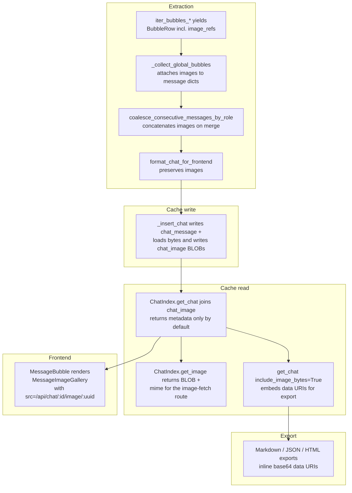

# Image attachment support for Cursor View

## 1. How Cursor stores images (ground truth)

I probed the local `cursorDiskKV` table and confirmed Cursor uses **two** shapes inside a bubble's JSON value (`bubbleId:<cid>:<bid>` rows). Both may appear, either, or neither:

- **Modern (on-disk path) — `bubble.context.selectedImages`**
  Entries: `{uuid, path, dimension: {width, height}, loadedAt, addedWithoutMention}`.
  `path` is an absolute filesystem path like
  `<cursor_root>/User/workspaceStorage/<workspace_id>/images/image-<uuid>.png`.
  This is the format used in the demo chat `bf2f3ce4-...` (`125b0b5e-...` bubble) referenced in the request — the `selectedImages` entry resolves to a real 131 KB PNG on disk.
- **Legacy (inline bytes) — top-level `bubble.images`**
  Entries: `{uuid, dimension: {width, height}, data: {"0": byte, "1": byte, ...}}`.
  `data` is a `Uint8Array` serialized as a string-keyed object; reconstructing the raw image bytes is just `bytes(data[str(i)] for i in range(len(data)))`. On my install this was ~22 bubbles; the byte stream always starts with `89 50 4E 47` (PNG magic).

A bubble's text lives in `b.get("text")` (or `richText` fallback). A bubble's type (`1` = user, else assistant) is already parsed by `_parse_bubble_row` in `cursor_view/sources/bubbles.py`. Image changes always flip the bubble's row hash (images are part of the value we hash in `cursor_view/cache/diff/hashing.py::_hash_value`), so the existing diff path auto-invalidates on image edits — no new diff logic required.

## 2. High-level architecture



## 3. Backend — new subpackage `cursor_view/images/`

Per [`.cursor/rules/project-layout.mdc`](.cursor/rules/project-layout.mdc) ("Organize by concern using subpackages, not by file type"), create a new subpackage rather than a top-level module. Extend the alphabetically-ordered subpackage list with `cursor_view/images/` (between `cursor_view/extraction/` and `cursor_view/projects/`).

```
cursor_view/images/
  __init__.py   # re-exports ImageRef, parse_bubble_images, load_image_bytes
  refs.py       # ImageRef dataclass + parse_bubble_images(bubble: dict) -> list[ImageRef]
  loading.py    # load_image_bytes(ref) -> tuple[bytes, str] | None, mime sniffing
```

### 3.1 `cursor_view/images/refs.py`

- Module docstring: "Parse image attachment references out of Cursor bubble JSON."
- `@dataclass(frozen=True) class ImageRef`:
  - `uuid: str`
  - `width: int | None`
  - `height: int | None`
  - `source_kind: Literal["disk", "inline"]`
  - `disk_path: str | None` — set when `source_kind == "disk"`.
  - `inline_data_dict: dict[str, int] | None` — set when `source_kind == "inline"`. Keep the raw dict here; decode to bytes in `loading.py` so the ref itself is a cheap pointer.
- `parse_bubble_images(bubble: dict) -> list[ImageRef]`:
  - Walk `bubble.get("context", {}).get("selectedImages")` and emit `source_kind="disk"` refs (requires `uuid` + non-empty `path`; `dimension` optional).
  - Walk `bubble.get("images")` and emit `source_kind="inline"` refs when `data` is a dict. Ignore non-dict entries.
  - **Dedup by `uuid`** — a legacy bubble may carry the same image in both shapes; first-seen wins, with modern/`disk` preferred so we ride the live disk file instead of re-parsing the inline dict (cheaper).
  - Docstring explains intent + why dedup prefers disk.
- **Public transport-dict helpers** (both live here so `global_bubbles.py` and `chat_index/rows.py` do not grow their own copies and do not reach into private names across package boundaries per [`.cursor/rules/python-standards.mdc`](.cursor/rules/python-standards.mdc) "Cross-package imports"):
  - `def image_ref_to_transport_dict(ref: ImageRef) -> dict[str, Any]` — emits `{"uuid", "width", "height", "source_kind", "disk_path", "inline_data_dict"}`. Used by Pass 2 to attach images to messages.
  - `def image_ref_from_transport_dict(d: dict[str, Any]) -> ImageRef | None` — inverse; returns `None` when `uuid` or `source_kind` is missing (defensive, since the transport dict may have been round-tripped through the extraction pipeline). Used by `_insert_chat_images` (§6.3).
- Typed everything. No logging here (pure parser). Target: <100 lines; if the two transport-dict helpers push it over, split them into a sibling `cursor_view/images/transport.py` rather than pass the rule's soft limit.

### 3.2 `cursor_view/images/loading.py`

- Module docstring: "Materialize ImageRef bytes + sniff MIME from magic bytes."
- `def _sniff_mime(data: bytes) -> str`:
  - PNG: `data.startswith(b"\x89PNG\r\n\x1a\n")` → `"image/png"`.
  - JPEG: `data.startswith(b"\xFF\xD8\xFF")` → `"image/jpeg"`.
  - GIF: `data.startswith(b"GIF87a")` or `b"GIF89a"` → `"image/gif"`.
  - WEBP: `data[:4] == b"RIFF" and data[8:12] == b"WEBP"` → `"image/webp"`. (WEBP is a two-part match because the file-size field in bytes 4-7 is content-dependent — a naïve prefix check would miss it.)
  - Fallback `"image/png"` with a lazy `logger.debug("Unknown image magic %r for first 16 bytes; defaulting to image/png", data[:16])`. PNG is the empirical default in Cursor's corpus (see §1) so this keeps the browser from refusing to render an otherwise-valid payload.
  - Target: <25 lines. Do NOT pull in `imghdr` / `magic` / Pillow — stdlib-only keeps the PyInstaller bundle small, matches [`.cursor/rules/python-standards.mdc`](.cursor/rules/python-standards.mdc)'s "import-time side effects" discipline (Pillow imports are heavy), and the four MIME types above cover every observed Cursor payload.
- `def load_image_bytes(ref: ImageRef) -> tuple[bytes, str] | None`:
  - `disk`: open via `with open(ref.disk_path, "rb") as f: data = f.read()` (the `sqlite-cursor-db.mdc` try/finally rule is about SQLite connections, but the same "no `if "fh" in locals()`" reasoning applies to file handles). A missing / unreadable file catches `OSError`, returns `None` and logs a **lazy** `logger.warning("Image file missing for %s: %s", ref.uuid, ref.disk_path)`. Do NOT raise.
  - `inline`: `bytes(ref.inline_data_dict[str(i)] for i in range(len(ref.inline_data_dict)))`. On `KeyError` / `TypeError`, log a warning and return `None`.
  - Return `(data, _sniff_mime(data))`.
  - Caller treats `None` as "skip this image, keep the message". Not a `TODO(bug):` because this is a legitimate fallback, not known-broken behavior.

Per [`.cursor/rules/python-standards.mdc`](.cursor/rules/python-standards.mdc): module-load is free of side effects (no disk I/O at import); all logging uses `%s` lazy style.

## 4. Thread images through extraction

### 4.1 `cursor_view/sources/bubbles.py`

The tuple emitted by `iter_bubbles_from_disk_kv` / `iter_bubbles_for_cids` today is:
```57:107:cursor_view/sources/bubbles.py
def _parse_bubble_row(
    key: str,
    value,
    db_path_str: str,
) -> tuple[str, str, str, str, str, list[str], list[str], tuple[str, str] | None] | None:
```

- **Widen** the return tuple by one trailing element: `list[ImageRef]`. Update both iterators' type hints and both docstrings to explain why image refs are part of the row: "so Pass 2 can attach image metadata to the per-bubble message dict in lock-step with text, URIs, and tool calls, without reading the bubble JSON twice."
- In `_parse_bubble_row`:
  - Call `image_refs = parse_bubble_images(b)` after the existing URI / tool-call extraction.
  - Extend the existing no-signal early-return filter:
    ```
    if not txt and not file_uris and not folder_uris and tool_call is None and not image_refs:
        return None
    ```
    Comment (intent, not narration): "Image-only bubbles still carry a message: keep them even when every other signal is empty."
- Unchanged: `_extract_uris_from_bubble`, `_tool_call_from_bubble`, the actual SQL queries.

### 4.2 `cursor_view/extraction/passes/global_bubbles.py`

Update the single caller:

- Unpack the new 9-tuple: `for cid, bubble_id, role, text, db_path, file_uris, folder_uris, tool_call, image_refs in bubble_iter:`. A 9-element unpack is borderline readable but acceptable given there is exactly one call site. Do **not** introduce a `BubbleRow` NamedTuple refactor inside this PR — that would touch `cursor_view/sources/bubbles.py` + the single consumer without feature-level benefit and invites the kind of drive-by refactor [`.cursor/rules/project-layout.mdc`](.cursor/rules/project-layout.mdc) discourages mid-feature.
- The current `if not text: continue` drops bubbles before the ordinal bucket append. **Replace** with `if not text and not image_refs: continue` so image-only bubbles emit a message (content empty string; the gallery in the UI makes the image visible). Intent comment: "Image-only bubbles become empty-text messages so the attached image still renders in the correct turn."
- Import `image_ref_to_transport_dict` from `cursor_view.images` (public re-export, not `cursor_view.images.refs` — crossing into a sub-module by path is one of the patterns the structure-cleanup plan explicitly called out).
- Change the appended dict from `{"role": role, "content": text}` to `{"role": role, "content": text, "images": [image_ref_to_transport_dict(r) for r in image_refs]}`. The `inline_data_dict` the helper emits stays attached only until the cache-write step materializes bytes in `_insert_chat_images` (§6.3); it is NEVER read by any HTTP response path, and both `_fetch_images_for_session` and `get_image` produce their output from the `chat_image` BLOBs, not the transport dict.

Pass 1 (workspace ItemTable) and Pass 7 (legacy chatdata) do **not** carry images today — keep their message shape as `{"role", "content"}` with `images` either absent or `[]`; downstream code defaults missing `images` to `[]`.

## 5. `cursor_view/chat_format.py` — preserve images through coalescing

- `coalesce_consecutive_messages_by_role`:
  - Change the emitted record shape to `{"role", "content", "images"}`. `images` defaults to `[]` (never `None`) so downstream consumers can `for img in msg["images"]` without a guard.
  - When merging same-role segments, concatenate image lists: `out[-1]["images"] = out[-1]["images"] + msg.get("images", [])`.
  - Fix the "Content unavailable" placeholder: `segment_content` currently returns `"Content unavailable"` when `content` is blank. Narrow that to "blank text AND no images"; when there are images but no text, use empty string so the UI does not stamp "Content unavailable" next to an image. Intent comment: "Image-only turns keep empty text; gallery below the text conveys the user signal."
  - Cases 5 and 6 in the §11 test plan cover (a) images from two consecutive same-role segments concatenating in order and (b) an image-only segment immediately after a text-only same-role segment merging cleanly without the "Content unavailable" placeholder.
- `messages_for_json_export`: preserve `images` on every message dict (just include the key when present; no content change). The existing copy-then-rename loop already does `m = dict(msg)`, which carries `images` through by reference — that's fine because the JSON serializer only reads it. No deep copy needed.
- `format_chat_for_frontend`:
  - No functional change in the happy path; the `messages` list is passed through verbatim.
  - The existing `except Exception` handler returns a stub with `"messages": []` and a carried `TODO(bug):` marker. Do **not** remove or extend that TODO per [`.cursor/rules/known-bugs.mdc`](.cursor/rules/known-bugs.mdc) — and confirm the stub's empty `messages` list means `_fetch_images_for_session` will just find no rows keyed by its `session_id`, so the image path degrades the same way the text path does (empty gallery, no crash).

## 6. Cache schema — add `chat_image` content table

### 6.1 `cursor_view/chat_index/schema.py`

- **Do not bump `INDEX_SCHEMA_VERSION`.** It stays at `2`. Cursor View has not shipped a public release since the v2 bump, so only in-repo developers carry v2 caches; forcing a rebuild for every user is unnecessary. Follow the precedent the existing v2 history comment already documents for the bubble-ordering fix:
  > Developers with a stale local cache can delete `chat-index.sqlite3` or hit the UI's Refresh button to regenerate it.
  Extend the v2 history comment in the same style with one additional line: "The later `chat_image` content table also landed under v2 for the same reason — no shipped caches to invalidate."
- Add to `_create_schema`:
  ```sql
  CREATE TABLE chat_image (
      session_id TEXT NOT NULL,
      position INTEGER NOT NULL,
      image_index INTEGER NOT NULL,
      uuid TEXT NOT NULL,
      mime_type TEXT NOT NULL,
      width INTEGER,
      height INTEGER,
      data BLOB NOT NULL,
      PRIMARY KEY (session_id, position, image_index)
  );
  CREATE INDEX idx_chat_image_session ON chat_image(session_id);
  CREATE INDEX idx_chat_image_uuid ON chat_image(session_id, uuid);
  ```
  - The `(session_id, uuid)` index supports the `GET /api/chat/<id>/image/<uuid>` route's lookup without a composite-PK scan.
  - **`uuid` is intentionally NOT unique per session** — the same image can legitimately be attached to multiple turns, which Cursor represents as two bubbles that both reference the same uuid. `get_image` therefore uses `LIMIT 1`; the bytes are identical regardless of which row it picks. Document this invariant in the `_create_schema` DDL comment so nobody adds a `UNIQUE` constraint later and breaks repeat-attachment chats.

### 6.2 `cursor_view/cache/delta/composer_rows.py::_delete_cid_rows`

Add one line — `cur.execute("DELETE FROM chat_image WHERE session_id=?", (cid,))`. Per [`.cursor/rules/sqlite-cursor-db.mdc`](.cursor/rules/sqlite-cursor-db.mdc) this is required to keep the delta path correct: a modified composer's images must be deleted before the re-insert so stale entries don't linger.

### 6.3 `cursor_view/chat_index/rows.py`

Current file: 253 lines. Current `_insert_chat`: ~85 lines and right under the 100-line soft limit from [`.cursor/rules/python-standards.mdc`](.cursor/rules/python-standards.mdc). Adding the image write inline would push it over. Extract private helpers to stay inside both limits; after this change `rows.py` is expected to land ~300 lines (still well under the 400-line module limit).

- `def _insert_chat_images(cur: sqlite3.Cursor, session_id: str, messages: list[dict[str, Any]]) -> None`:
  - Import `image_ref_from_transport_dict` and `load_image_bytes` from `cursor_view.images` (public re-exports; no underscore-private cross-package imports).
  - For `position, msg in enumerate(messages)`:
    - For `image_index, image_dict in enumerate(msg.get("images") or [])`:
      - `ref = image_ref_from_transport_dict(image_dict)` — skip on `None` with a lazy debug log.
      - `loaded = load_image_bytes(ref)` — skip on `None` (the loader already logged).
      - Insert `(session_id, position, image_index, ref.uuid, mime, ref.width, ref.height, data)` into `chat_image`.
  - Target: <30 lines. No return value.
- In `_insert_chat`, after the existing `INSERT INTO chat_message` executemany, call `_insert_chat_images(cur, session_id, messages)`. Docstring already describes the caller contract; extend with one intent line: "Image BLOBs are materialized here so the chat-index is the single cache of record — Cursor's original on-disk files may be deleted without data loss."
- If `_insert_chat` still crosses 100 lines after adding the one call site, split the existing `_preview_from_messages` / `_search_blob` derivations out into a `_derive_chat_write_payload(messages, project)` helper that returns the tuple of `(preview, search_blob)`. Do this prophylactically rather than waiting for a follow-up refactor round.

Also add a read helper:
- `def _fetch_images_for_session(con: sqlite3.Connection, session_id: str, *, include_bytes: bool) -> list[dict[str, Any]]`:
  - Branch the SQL at call time (two literals, not string concatenation): when `include_bytes`, `SELECT position, image_index, uuid, mime_type, width, height, data FROM ...`; else omit `data`.
  - `ORDER BY position ASC, image_index ASC`.
  - When `include_bytes`, build `data_uri = f"data:{mime};base64,{base64.b64encode(data).decode('ascii')}"` and include in output.
  - When not, omit `data` / `data_uri` entirely.
  - Typed; docstring explains why bytes are opt-in (chat-detail JSON stays small; only exports pay the base64 cost).
  - Target: <35 lines.

### 6.4 `cursor_view/chat_index/index.py`

Current file: 330 lines. With the additions below the file is expected to land ~365-375 lines, still well under the 400-line module limit. Budget drift here means the additions must be tight — do not inline image-shape or base64 logic (all of that lives in `rows.py` / `cursor_view.images`).

- `get_chat(session_id: str, force_refresh: bool = False, include_image_bytes: bool = False) -> dict | None`:
  - After the existing `messages = [...]` list-comp, call `_fetch_images_for_session(con, session_id, include_bytes=include_image_bytes)` and group by `position` into a dict `pos -> list[image_dict]`. Then mutate each message: `for pos, msg in enumerate(messages): msg["images"] = grouped.get(pos, [])`.
  - Strip `position` and `image_index` from each image dict before returning — they are storage-layer internals, and the frontend / exports only need `{uuid, mime_type, width, height[, data_uri]}`.
  - Keep read-only connection guard unchanged.
- Add a new method `get_image(self, session_id: str, image_uuid: str) -> tuple[bytes, str] | None`:
  - Calls `self.ensure_current(force=False)` so a stale cache gets refreshed lazily just like `get_chat`, then opens read-only connection through `_connect(read_only=True)` and runs `SELECT mime_type, data FROM chat_image WHERE session_id=? AND uuid=? LIMIT 1`. Returns `(bytes(row["data"]), row["mime_type"])` or `None`.
  - Docstring explains that this bypasses the chat-detail payload to keep `GET /api/chat/<id>` cheap when chats contain megabytes of images.
  - Docstring also notes the intentional `LIMIT 1` — a session can reference the same image uuid from multiple turns (see §6.1); any matching row returns identical bytes.

No change to `_apply_delta`, the singleton wiring, `_rebuild`, `_current_source_fingerprint`, or the stale-while-revalidate worker thread.

### 6.5 `cursor_view/cache/delta/composer_rows.py::_composer_hash`

Explicitly **do not** add image bytes into the composer hash — images are already part of the source row hash that governs dirtiness, and pulling BLOB bytes into `composer_hash` would defeat the purpose of that lightweight column. Add one intent sentence to the `_composer_hash` docstring: "Image BLOBs are intentionally excluded — the source-row hash already flips when a bubble's images change."

### 6.6 Cache-rule sync

Update [`.cursor/rules/sqlite-cursor-db.mdc`](.cursor/rules/sqlite-cursor-db.mdc):

- Add `chat_image` to the **Content tables** bullet list with a one-line description.
- Under **Cache tables** → schema-version history, extend the v2 entry with a second sentence noting that the `chat_image` content table also landed under v2 for the same "no shipped caches to invalidate" reason; developers with stale local caches delete `chat-index.sqlite3` or hit the UI's Refresh button.

The rule mandates updating both the schema file and the rule "in the same change" — do both in the same PR per [`.cursor/rules/comments-style.mdc`](.cursor/rules/comments-style.mdc) "Rule drift" clause.

## 7. HTTP API — new image route, extended export

### 7.1 `cursor_view/routes.py`

- New route:
  ```python
  @bp.route("/api/chat/<session_id>/image/<image_uuid>", methods=["GET"])
  def get_chat_image(session_id, image_uuid):
      ...
  ```
  Calls `get_chat_index().get_image(session_id, image_uuid)`, returns 404 on `None`, otherwise `Response(data, mimetype=mime, headers={"Cache-Control": "private, max-age=31536000, immutable"})`. The image uuid is Cursor-assigned and stable for the lifetime of the bubble, so `immutable` is correct.
- `export_chat`:
  - Replace `get_chat_index().get_chat(session_id, force_refresh=_should_force_refresh())` with `get_chat_index().get_chat(session_id, force_refresh=_should_force_refresh(), include_image_bytes=True)`.
  - No other change — the exports read `chat["messages"][i]["images"]` with `data_uri` already filled.
- `get_chat` (the detail API) stays on the default `include_image_bytes=False`, so the JSON that flows to the browser contains only per-image `{uuid, mime_type, width, height}`.

## 8. Exports — inline base64

### 8.1 `cursor_view/export/markdown.py`

Current file: 45 lines. Extract a module-level helper so `generate_markdown` stays short:

- `def _render_message_images_markdown(images: list[dict[str, Any]]) -> list[str]`:
  - For each image dict, return a list of `` tag lines using the image's `data_uri` field: `f''`.
  - Use raw HTML `` tags (not ``) because markdown data-URI references in `` are not uniformly supported across renderers; every mainstream markdown renderer passes raw HTML through verbatim.
  - Returns an empty list when `images` is empty/missing so the caller can `lines.extend(_render_message_images_markdown(...))` unconditionally.
- In `generate_markdown`, after appending the role heading + content block and before the trailing `"---"` separator, extend `lines` with the helper's output so images sit inside the same "message block" visually.

Target: file stays under 80 lines; `generate_markdown` stays under 40 lines.

### 8.2 `cursor_view/export/html.py`

Current file: 377 lines; `generate_standalone_html` is already ~150 lines (a pre-existing soft-limit violation documented but not fixed by the cleanup plan). Adding image rendering inline would worsen that and push `html.py` past the 400-line module limit. Extract a module-level helper:

- `def _render_message_images_html(images: list[dict[str, Any]], theme: dict[str, Any]) -> str`:
  - Returns either `""` (no images) or `'<div class="message-images">...</div>'` joined with newlines.
  - `alt` text is `f'Image attached by {"user" if role == "user" else "Cursor"}'`. Signature takes `role: str` as a third parameter to pass that through.
  - `theme` is passed so a future fallback (e.g. tinted placeholder) can reach palette tokens without re-importing `EXPORT_HTML_THEMES`. Unused in v1 but documented in the docstring.
- In `generate_standalone_html`, after the existing `rendered_content = markdown.markdown(...)` block and regex fixup, append `_render_message_images_html(msg.get("images") or [], role, theme)` to `rendered_content` with a single `+=`. One line change inside the function.
- Add to `_HTML_STYLE_TEMPLATE` (keeping the double-brace escaping rule the file documents):
  ```css
  .message-content .message-images {{
      display: flex;
      flex-direction: column;
      gap: 8px;
      margin-top: 12px;
  }}
  .message-content .message-images img {{
      border: 1px solid var(--image-border);
      border-radius: 6px;
  }}
  ```
  The existing `.message-content img { max-width: 100% }` already handles sizing — do not re-declare width.

Target: `html.py` lands ~395-398 lines (still under 400). If a pre-existing `generate_standalone_html` refactor has landed by the time this PR opens and the file is smaller, the budget is more comfortable; if adding the CSS block tips the file past 400, extract a second helper (`_build_messages_html(messages, theme)`) from `generate_standalone_html` in the same change rather than deferring the fix.

### 8.3 JSON export (`cursor_view/routes.py::export_chat` `application/json` branch)

`messages_for_json_export` now preserves `images`. Since the route calls `get_chat(..., include_image_bytes=True)`, each image dict already carries `data_uri`. No additional transformation needed; the JSON payload will include each message's `images` array with full data URIs.

JSON file size: a chat with N images inlines all of them; the user's feature request explicitly asks for this behavior ("image should be embedded directly in to the exported file"). Users who want to keep JSON exports small must use the image-less feature baseline, which would be a separate opt-out and is out of scope here.

## 9. Frontend

### 9.1 `frontend/src/components/chat-detail/ChatDetail.js`

- The fetched chat's `messages[i].images` is already a list of `{uuid, mime_type, width, height}`. Preserve it through the `preparedMessages` map:
  ```
  return {
    ...message,
    renderedContent: await prepareMarkdownHtml(message.content),
    images: Array.isArray(message.images) ? message.images : [],
  };
  ```
- Pass `sessionId` into the message list: `<MessageList sessionId={sessionId} messages={messages} />`.

Per [`.cursor/rules/frontend-hooks.mdc`](.cursor/rules/frontend-hooks.mdc): the existing `useEffect` already uses the `cancelled` flag and a cleanup function. We are **not** adding a new hook (images render via plain ``). No new hook work needed; this avoids the hook discipline trap altogether.

### 9.2 `frontend/src/components/chat-detail/MessageList.js`

- Accept `sessionId` prop and forward: `<MessageBubble key={index} sessionId={sessionId} message={message} />`. Keep component tiny.

### 9.3 `frontend/src/components/chat-detail/MessageBubble.js`

- Accept `sessionId` prop.
- After the existing `<Paper>…</Paper>`, if `Array.isArray(message.images) && message.images.length > 0`, render `<MessageImageGallery sessionId={sessionId} images={message.images} role={message.role} />`.
- Keep the file under 250 lines (currently ~94).

### 9.4 New component `frontend/src/components/chat-detail/MessageImageGallery.js`

Per [`.cursor/rules/react-components.mdc`](.cursor/rules/react-components.mdc) ("One React component per file", feature folder siblings) — new sibling under `chat-detail/`:

- Props: `{ sessionId: string, images: Array<{uuid, mime_type, width, height}>, role: 'user' | 'assistant' }`.
- Rendering: an MUI `<Box>` flex container (wrap, `gap: 1`) holding one `<Box component="a" href target="_blank" rel="noopener">` per image wrapping an ``. The `src` is `/api/chat/${encodeURIComponent(sessionId)}/image/${encodeURIComponent(img.uuid)}`. `max-width: 280px; border-radius: 1; border: 1px solid`; borderColor via `colors.secondary.main` or the existing divider token — **no hard-coded colors** per the theme ownership rule.
- Include `alt` text `Image attached by ${role === 'user' ? 'user' : 'Cursor'}`.
- Size target: <80 lines. One concern (rendering a gallery).

### 9.5 No changes to markdown rendering pipeline

`prepareMarkdownHtml.js` processes `message.content` only; images flow as structured data on the message object, not via markdown text. This keeps the code path narrow and avoids parsing base64 into the unified pipeline.

### 9.6 `mime_type` on the frontend payload

The chat-detail JSON response includes `mime_type` per image even though `` ignores it (the browser trusts the response `Content-Type` from the image route instead). The field is kept for two reasons:

- Export consumers (Markdown / JSON / HTML renderers) read it to build the `data:<mime>;base64,...` URI.
- A future "save image as…" UX could use it for the download filename extension without a second round-trip to the image route.

Do not strip it in `_fetch_images_for_session`; do strip `position` and `image_index` per §6.4.

## 10. Files explicitly NOT modified by this feature

Guard against drive-by refactor creep by listing the files this PR must leave untouched. If implementation surfaces a genuine blocker requiring one of these to change, stop and escalate rather than editing silently:

- `cursor_view/cache/diff/**` — image changes already flip bubble row hashes via the existing `_hash_value` in `cursor_view/cache/diff/hashing.py` (§1). No new diff logic.
- `cursor_view/cache/delta/backfill.py` — images flow through `_insert_chat` on the full-rebuild path just like messages; the backfill pass only reconciles delta-only tables (`composer_state`, `source_row`, `tool_call_parent`), none of which carry image state.
- `cursor_view/cache/delta/engine.py`, `project_only.py`, `metadata.py`, `cached_state.py` — delta orchestration is image-agnostic once `_delete_cid_rows` (§6.2) drops `chat_image` rows.
- `cursor_view/chat_index/rebuild.py`, `fingerprint.py` — the full-rebuild path calls `_insert_chat` per chat and that is where images land; rebuild I/O cost grows with image count (each BLOB is read from disk once per rebuild), which is acceptable because full rebuilds are rare (first launch, schema drift, or explicit refresh).
- `cursor_view/extraction/passes/{workspace_messages,global_composers,uri_fallbacks,task_subagents,subagent_inheritance,item_table_chats,finalize}.py` — only Pass 2 (`global_bubbles.py`) consumes the widened bubble tuple; every other pass keeps operating on sessions / comp_meta / comp2ws dicts it already knows about. `_finalize_sessions` does NOT need to filter or transform the `images` list; an empty `messages` list still short-circuits the same way.
- `cursor_view/sources/{composer_data,item_table,sqlite_util}.py` — neither `iter_composer_data*` nor `iter_chat_from_item_table` carries images in Cursor's on-disk format, so their iterators keep their current shape.
- `cursor_view/projects/**` — project inference is URI-driven; images never contribute project signal.
- `cursor_view/desktop/**`, `cursor_view/app_factory.py`, `cursor_view/terminal.py`, `cursor_view/__main__.py`, `cursor_view/cleanup.py`, `cursor_view/paths.py`, `cursor_view/timestamps.py` — no entry-point or lifecycle change.
- `cursor_view/export/themes.py`, `cursor_view/export/markdown_fences.py` — palette tokens and fence normalization are image-independent. `--image-border` already exists in every theme palette.
- `frontend/src/markdown/**`, `frontend/src/hooks/**`, `frontend/src/utils/**`, `frontend/src/theme/**`, `frontend/src/contexts/**` — no hook, utility, theme, or context change (§9).
- `frontend/src/components/chat-list/**`, `frontend/src/components/Header.js`, `frontend/src/components/AppContextMenu.js`, `frontend/src/components/MessageMarkdown.js`, `frontend/src/components/export/**` — only `chat-detail/` renders images; chat-list cards intentionally stay text-only to keep the list scannable.
- `cursor-view.spec`, `requirements.txt`, `frontend/package.json` — no new Python or JS dependency. MIME sniffing uses stdlib only (§3.2).
- Tests other than the new `tests/test_chat_index_images.py` — existing coverage (`tests/test_chat_index_incremental.py`) must stay green without edits, because the transport-dict threading preserves the pre-image message shape when `images` is empty.

## 11. Tests

Per [`.cursor/rules/project-layout.mdc`](.cursor/rules/project-layout.mdc) — "Any new behavior that touches the chat-index refresh path must land with a synthetic-Cursor-DB regression test…".

Add `tests/test_chat_index_images.py` using the same stdlib `unittest` + synthetic-DB harness as `tests/test_chat_index_incremental.py`. Five cache-path test cases:

1. **`test_full_rebuild_materializes_modern_image`** — seed a synthetic global DB with one bubble whose `context.selectedImages[0].path` points at a tmp PNG file we also write. After `ChatIndex.ensure_current()`, assert `chat_image` contains one row with the right uuid, mime, and bytes.
2. **`test_full_rebuild_materializes_legacy_image`** — seed a bubble with top-level `images[0].data = {str(i): b for i,b in enumerate(png_bytes)}`. Assert round-trip bytes equality.
3. **`test_modification_updates_chat_image`** — after rebuild, rewrite the bubble's image to a different PNG, force a background refresh path (direct `compute_source_diff` + `apply_delta`), assert `chat_image` rows for the cid were deleted and replaced.
4. **`test_missing_disk_image_is_skipped_not_fatal`** — bubble's `selectedImages[0].path` points at a nonexistent file; `_insert_chat` logs a warning and produces a message with no `chat_image` row. No exception propagates.
5. **`test_full_rebuild_materializes_multiple_images_per_message`** — seed a single bubble whose `context.selectedImages` has two entries with different uuids pointing at two on-disk PNGs with distinct byte contents. After rebuild assert: (a) two `chat_image` rows exist with `image_index` `0` and `1` and the correct per-index bytes, (b) `_fetch_images_for_session` returns them in `image_index` order, (c) `ChatIndex.get_chat` attaches both image dicts to the single message's `images` list in the same order, and (d) `ChatIndex.get_image` called with each uuid returns that uuid's bytes (not the other's). This locks the multi-image-per-message behavior against any future "optimization" in `_insert_chat_images` / `_fetch_images_for_session` that would collapse per-message images.

Running `python -m unittest discover -s tests` must stay green.

Coalescer image-merge unit cases (from §5): add two fixtures directly against `coalesce_consecutive_messages_by_role` in the same test module rather than a separate file:

6. **`test_coalesce_concatenates_images_on_same_role_merge`** — feed two consecutive user-role messages, the first text-only, the second image-only; assert the merged message has the first's text and the second's image in order.
7. **`test_coalesce_image_only_turn_does_not_get_content_unavailable_placeholder`** — a lone image-only user message must come out with empty content (not "Content unavailable") so the UI does not stamp the placeholder next to the gallery.

No route-level (Flask test client) tests are added — the existing suite does not cover routes, and wiring a test client just for images would be a scope expansion. The image-fetch route is thin enough that its correctness follows from the `ChatIndex.get_image` behavior tested in cases 1 and 5 above.

## 12. Documentation updates

Per [`.cursor/rules/project-layout.mdc`](.cursor/rules/project-layout.mdc) ("Any change that alters the repository layout must update the 'Project layout' section of `README.md` in the same change"):

- **`README.md`** — under "Subpackages" insert the `cursor_view/images/` bullet after `extraction/` (keeps roughly the current alphabetical flow). Under the "content tables" bullet list, add `chat_image` with a one-line description.
- **`.cursor/rules/project-layout.mdc`** — extend the alphabetical subpackage list to include `cursor_view/images/`.
- **`.cursor/rules/sqlite-cursor-db.mdc`** — see §6.6.

## 13. Rule-compliance checklist (enforced by this plan)

Every rule file has a dedicated clause below so the implementation cannot inadvertently violate it:

- **[`comments-style.mdc`](.cursor/rules/comments-style.mdc)** — the only new comments allowed are intent-only (documented explicitly in §3, §4.2, §6.1, §6.3, §6.5, §6.6). No narrating comments such as "insert images" or "set loading to true" will be added.
- **[`frontend-hooks.mdc`](.cursor/rules/frontend-hooks.mdc)** — no new hook is introduced (§9); existing `useEffect` in `ChatDetail.js` already uses a `cancelled` flag and is untouched. If a follow-up feature needs lazy image loading, a new hook would be added under `frontend/src/hooks/` following the `useChatSummaries` cancellation shape — but that is explicitly out of scope here.
- **[`known-bugs.mdc`](.cursor/rules/known-bugs.mdc)** — no hardcoded usernames, paths, or project lists. The missing-disk-image fallback (§3.2) is not a `TODO(bug):` because it is intentional graceful degradation, not known-broken behavior. No existing code paths are silently deleted; the existing `TODO(bug):` inside `format_chat_for_frontend`'s exception handler is left untouched per §5.
- **[`project-layout.mdc`](.cursor/rules/project-layout.mdc)** — all new Python code lives under the new `cursor_view/images/` subpackage (§3); no new top-level Python files; tests land in `tests/` (§11); §10 enumerates every file intentionally kept unchanged; README updated (§12).
- **[`python-standards.mdc`](.cursor/rules/python-standards.mdc)** — each new module stays under 400 lines (targets: `refs.py` <100, `loading.py` <70); `_insert_chat` stays under 100 lines by extracting `_insert_chat_images` (§6.3) and, if still tight, the optional `_derive_chat_write_payload` follow-up helper; `rows.py` budget ~300 lines (from 253); `index.py` budget ~375 lines (from 330); `html.py` budget ~398 lines with the helper extraction in §8.2; typed signatures everywhere; module docstrings on every new file; lazy `%s` logging (§3.2); no import-time side effects; no cross-package underscore imports (the new subpackage only re-exports public names through its own `__init__.py`, and outside callers only use those public names — see §3.1, §4.2, §6.3).
- **[`react-components.mdc`](.cursor/rules/react-components.mdc)** — new `MessageImageGallery.js` is one component per file, sibling under `chat-detail/`, <80 lines; no duplication (there is no existing gallery); theme tokens only, no hard-coded colors; the modified `MessageBubble.js` stays under 250 lines (from ~94, +~15 for the conditional render).
- **[`sqlite-cursor-db.mdc`](.cursor/rules/sqlite-cursor-db.mdc)** — no Cursor DB is opened writable; no mtime-only invalidation logic added (the bubble hash in `cache/diff/hashing.py` already covers image changes); schema touch is paired with a rule update in the same change (§6.6); file-handle cleanup in `loading.py` uses `with open(...)` context manager (§3.2).

## 14. Review existing rules and author new ones if appropriate

This step runs **after** every code change in §§3-11 has landed and **before** the final README + rules sync in §12 / §6.6, so the audit reviews the post-implementation reality rather than the pre-implementation plan. It mirrors the `review_cursor_rules` pass the cleanup plan (`.cursor/plans/cursor-view_structure_cleanup_d9ba8085.plan.md`) ended with and is governed by the "Rule drift" clause of [`comments-style.mdc`](.cursor/rules/comments-style.mdc): "When a refactor materially changes a convention captured in any rule under `.cursor/rules/`, update that rule in the same PR."

### 14.1 Re-read every existing rule against the post-implementation tree

Walk each file under `.cursor/rules/` and confirm its motivating examples, canonical lists, and soft limits still match reality. For any rule whose text is now stale, update it in the same PR:

- **[`comments-style.mdc`](.cursor/rules/comments-style.mdc)** — scan every new comment added in §§3-11 for narration; confirm each comment explains intent (as required in §§3, 4.2, 6.1, 6.3, 6.5, 6.6). No rule edit expected unless a new "image-only turn" motivating example is worth adding under the existing intent-vs-mechanics block.
- **[`frontend-hooks.mdc`](.cursor/rules/frontend-hooks.mdc)** — no new hook was introduced, so no rule edit is expected. If a follow-up pass during implementation decides a `useImageGallery` hook is warranted after all (e.g. for retry / fade-in state), that hook must land with its own section in this rule showing the cancellation + `useCallback` shape.
- **[`known-bugs.mdc`](.cursor/rules/known-bugs.mdc)** — confirm no new `TODO(bug):` markers were added for the graceful-skip paths (missing disk file, malformed inline `data` dict); those are legitimate fallbacks, not known-broken behavior.
- **[`project-layout.mdc`](.cursor/rules/project-layout.mdc)** — extend the alphabetical subpackage list to include `cursor_view/images/` (already called out in §12); confirm the "tests live under `tests/`" bullet still matches after adding `tests/test_chat_index_images.py`.
- **[`python-standards.mdc`](.cursor/rules/python-standards.mdc)** — confirm that (a) `_insert_chat` stayed under the 100-line function limit after the §6.3 split, and (b) neither `cursor_view/images/refs.py` nor `cursor_view/images/loading.py` performs disk I/O at import time. If `_insert_chat` crossed the limit anyway, split further rather than retroactively weakening the rule.
- **[`react-components.mdc`](.cursor/rules/react-components.mdc)** — confirm `MessageBubble.js` stayed under 250 lines after the §9.3 gallery integration and that `MessageImageGallery.js` uses theme tokens only (no hard-coded colors). If the gallery ended up needing a pure helper that could plausibly be reused by a future "export preview" component, move it into `frontend/src/utils/` and cite it here.
- **[`sqlite-cursor-db.mdc`](.cursor/rules/sqlite-cursor-db.mdc)** — the table-list edits in §6.6 already update this rule; in this step just verify the final text matches the final schema DDL and that the BLOB guidance from §14.2 below lands in the same PR.

### 14.2 Decide whether a new rule is warranted

New rules are justified only when there is a convention the implementation established that a future contributor could plausibly violate without one. Evaluate each candidate below; author only the ones still obviously useful after the code is written:

- **`.cursor/rules/image-attachments.mdc` (likely yes)** — captures the non-obvious image-handling discipline this PR establishes:
  1. Cursor stores image attachments in two shapes (`context.selectedImages` disk path + top-level `images` inline-bytes dict); always parse both in `cursor_view/images/refs.py::parse_bubble_images`, never branch-by-format at the call site.
  2. Never trust a file extension for MIME — always sniff magic bytes in `cursor_view/images/loading.py::_sniff_mime`. The PNG extension appears on JPEG payloads in the wild.
  3. Image BLOBs belong in the `chat_image` content table only. Do not duplicate them into `chat_search_text` / `chat_search_fts` (breaks FTS5 tokenization), and do not fold their bytes into `cursor_view/cache/delta/composer_rows.py::_composer_hash` (the bubble's source-row hash already covers image changes, and hashing megabyte BLOBs inflates the watermark column).
  4. The HTTP API returns image **metadata** by default; bytes flow only through `GET /api/chat/<id>/image/<uuid>` or through `get_chat(..., include_image_bytes=True)` for exports. Do not inline base64 into the chat-detail JSON response.
  5. Graceful skip on missing disk file / malformed inline dict — log a lazy `%s` warning and drop the image; never raise, and never add `TODO(bug):` for this path.

  This rule goes under `.cursor/rules/image-attachments.mdc` as a new sibling, cites `cursor_view/images/`, `cursor_view/chat_index/rows.py`, and `cursor_view/routes.py` as motivating examples, and is glob-scoped with an `alwaysApply: false` frontmatter + a description so it surfaces only when image code is touched.

- **Blob-in-content-tables guidance inside `sqlite-cursor-db.mdc` (likely yes, merge don't fork)** — the three BLOB-specific items from the candidate rule above (no BLOBs in `chat_search_*`, no BLOBs in `composer_hash`, no inline base64 in the chat-detail JSON) overlap conceptually with the existing `sqlite-cursor-db.mdc` content-vs-delta-tables split. If authoring `image-attachments.mdc` would duplicate too much, fold the BLOB-handling bullets into `sqlite-cursor-db.mdc` under the content tables block and keep `image-attachments.mdc` strictly about the parser/loader/MIME-sniffing discipline. Decide at implementation time based on which split reads better.

- **Transport-dict shape for images (no new rule)** — the `{uuid, width, height, source_kind, disk_path, inline_data_dict}` transport dict is a private implementation detail between §4.2 and §6.3 and should not be rule-hoisted; if anything its lifecycle (carried through extraction, dropped before the HTTP response) is an intent comment on `_insert_chat_images`, not a durable rule.

- **"Files NOT modified" discipline as a rule amendment to `project-layout.mdc` (no)** — §10 of this plan is PR-specific scaffolding, not a durable project convention. Do not fold it into any rule; it lives only for the lifetime of this feature.

### 14.3 Commit the rule edits in the same change as the feature

Per the "Rule drift" clause this is non-negotiable: whatever rule edits §§14.1-14.2 concluded are needed must be part of the same PR as the image-attachment implementation. A stale rule is worse than no rule. When this section is complete, there must be no rule whose motivating examples contradict the post-implementation tree.

## 15. Implementation order (suggested TODO sequence)

1. New subpackage `cursor_view/images/` (`refs.py`, `loading.py`, `__init__.py`).
2. Widen `cursor_view/sources/bubbles.py` iterator tuples (§4.1).
3. Update `cursor_view/extraction/passes/global_bubbles.py` to thread images (§4.2).
4. Update `cursor_view/chat_format.py` coalescer + JSON export helper (§5).
5. Add `chat_image` DDL (§6.1). `INDEX_SCHEMA_VERSION` stays at `2`.
6. Extend `_insert_chat` with `_insert_chat_images`, add `_fetch_images_for_session` (§6.3).
7. Extend `_delete_cid_rows` (§6.2).
8. Extend `ChatIndex.get_chat` + add `get_image` (§6.4).
9. Add `/api/chat/<id>/image/<uuid>` route + switch export path to `include_image_bytes=True` (§7).
10. Export renderers (Markdown + HTML) with helper extraction (§8).
11. Frontend plumbing (`ChatDetail` → `MessageList` → `MessageBubble` + new `MessageImageGallery`) (§9).
12. Tests including the coalescer image-merge cases (§11).
13. Review existing rules and author new ones if appropriate (§14).
14. README + rules sync (§12, §6.6).
