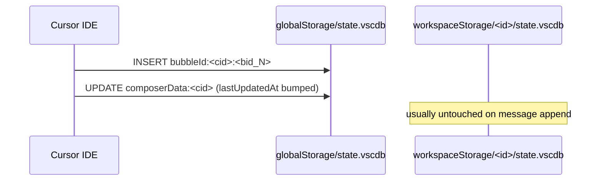
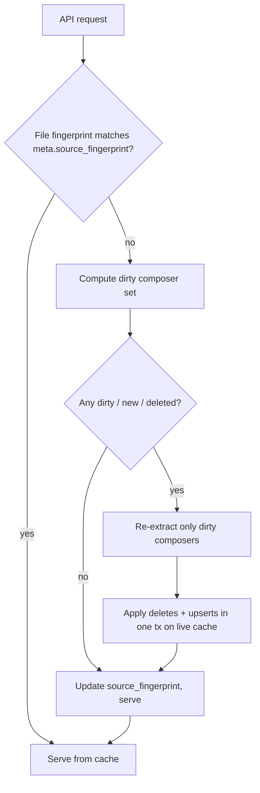

# Incremental refresh for the Cursor View chat cache

## 1. How the caching system works today

The cache lives at `cursor_view_cache_dir() / "chat-index.sqlite3"` and is fully owned by [`cursor_view/chat_index.py`](cursor_view/chat_index.py). Its schema is:

- `meta(key, value)` — `schema_version`, `source_fingerprint`, `source_manifest`, `built_at`, `chat_count`
- `chat_summary(session_id PK, project_name, project_root_path, date, workspace_id, db_path, message_count, preview, sort_key_ms)`
- `chat_message(session_id, position, role, content)` — composite PK `(session_id, position)`
- `chat_search_text(session_id PK, content)` — LIKE fallback
- `chat_search_fts` — FTS5 virtual table of `(session_id UNINDEXED, content)`

**Read path (`list_summaries`, `get_chat`).** Every API call goes through `ensure_current()`. That function computes a `source_fingerprint` over the live Cursor DBs and compares it to `meta.source_fingerprint`:

```288:329:cursor_view/chat_index.py
    def _current_source_fingerprint(self) -> tuple[str, list[dict[str, Any]]]:
        ...
        for ws_id, db in workspaces(root) or []:
            if db.exists():
                sources.append(self._source_entry(ws_id, db))
        ...
    def _source_entry(self, workspace_id: str, path: Path) -> dict[str, Any]:
        stat = path.stat()
        entry: dict[str, Any] = {
            "workspace_id": workspace_id,
            "path": str(path),
            "mtime_ns": stat.st_mtime_ns,
            "size": stat.st_size,
        }
        wal_path = path.with_name(path.name + "-wal")
        if wal_path.exists():
            wst = wal_path.stat()
            entry["wal_mtime_ns"] = wst.st_mtime_ns
            entry["wal_size"] = wst.st_size
        return entry
```

If any one of the per-file `(mtime_ns, size, wal_mtime_ns, wal_size)` tuples changes, the fingerprint changes.

**Write path.** A fingerprint mismatch calls `_rebuild()`:

```331:342:cursor_view/chat_index.py
    def _rebuild(self, source_fingerprint: str, sources: list[dict[str, Any]]) -> None:
        ...
        temp_path = self.db_path.parent / f"{self.db_path.stem}.{uuid.uuid4().hex}.tmp"
        try:
            self._build_index_to_temp(temp_path, source_fingerprint, sources)
            self._swap_temp_into_place(temp_path)
```

`_build_index_to_temp` creates a fresh SQLite file, calls `extract_chats()` (the 7-pass pipeline in [`cursor_view/extraction/core.py`](cursor_view/extraction/core.py)), and inserts every chat via `_insert_chat`. `_swap_temp_into_place` waits for readers to drain (`_active_readers == 0`) and then `Path.replace`s the temp file over the live index.

**Cost of the current strategy.** On any user DB write:

- **Extraction** walks every workspace `state.vscdb` in full (`_collect_workspace_messages`), every `bubbleId:*` row in the global `cursorDiskKV` (`_collect_global_bubbles` — typically the largest pass), every `composerData:*` row (`_collect_global_composers`), every legacy `chatdata` tab, plus URI fallbacks and subagent inheritance.
- **Insertion** deletes the whole cache file and re-inserts every summary, every message, every FTS doc from scratch.
- **Swap** blocks incoming reads until the rebuild completes (the stale-while-revalidate background path partially mitigates this, but the first request after startup still blocks on a full rebuild).

For users with many workspaces and tens of thousands of bubbles, a single message being appended in Cursor forces all of that work.

## 2. How Cursor actually stores chats

Sources (paths from [`cursor_view/paths.py`](cursor_view/paths.py)):

- **Global DB:** `<cursor_root>/User/globalStorage/state.vscdb`
  - `cursorDiskKV` table (the hot write path)
    - Keys `bubbleId:<composerId>:<bubbleId>` — one row per message bubble. Value is a small JSON blob with `type` (1=user, 2=assistant), `text`/`richText`, and optional `relevantFiles`, `workspaceUris`, `attachedFolders*`, `context.fileSelections/folderSelections` (see [`cursor_view/sources/sqlite_data.py`](cursor_view/sources/sqlite_data.py)).
    - Keys `composerData:<composerId>` — per-composer metadata (`name`, `createdAt`, `lastUpdatedAt`, `workspaceIdentifier`, `subagentInfo.parentComposerId`, `originalFileStates`, `allAttachedFileCodeChunksUris`, `context.mentions.*`, and — for older Cursor builds — a full `conversation` array).
  - `ItemTable` — legacy keys like `workbench.panel.aichat.view.aichat.chatdata`, `composer.composerData`, `aiService.prompts`, `aiService.generations`.
- **Per-workspace DBs:** `<cursor_root>/User/workspaceStorage/<ws_id>/state.vscdb`
  - `ItemTable` only: `composer.composerData`, `workbench.panel.aichat.view.aichat.chatdata`, `workbench.explorer.treeViewState`, `history.entries`, `debug.selectedroot`. Used for workspace → project resolution and legacy chat scraping.
  - Sidecar `workspace.json` with `folder` / `workspace` URIs for authoritative roots.

**What changes when the user sends a Cursor message.** In overwhelming practice:



Key observations that make incremental work feasible:

- Message writes are **append-only on bubbles** keyed by `(composerId, bubbleId)`. Edits keep the same key but change the value.
- `composerData:<cid>.lastUpdatedAt` is bumped on every meaningful change to that composer, so it is a good per-composer watermark.
- Workspace DBs change for navigation/history reasons that do not affect chat content. Most of the recency-driven invalidations we see are from these touch-only writes.
- Only a tiny subset of composers is dirty at any given moment; the current cache throws away work for the other 99%.

## 3. Proposed design: per-composer incremental refresh

### 3.1 Two-stage invalidation

Keep the existing file-level fingerprint as a **fast "nothing changed" gate**, but change the mismatch path from "rebuild everything" to "recompute the set of dirty composers and re-extract only those."



The full rebuild path survives for: schema bumps (`INDEX_SCHEMA_VERSION` change), unreadable cache (`sqlite3.DatabaseError`), and missing cache file. Everything else becomes a diff.

### 3.2 New cache tables to support diffs

Add two tables to the cache schema (new `INDEX_SCHEMA_VERSION = 2`, which forces one last full rebuild on upgrade):

- `composer_state(session_id PK, workspace_id, db_path, last_updated_ms, composer_hash, bubble_count)` — per-composer watermark.
- `source_row(db_path, table_name, key, row_hash, composer_id, PRIMARY KEY(db_path, table_name, key))` — per-row content hashes for the rows we care about (`cursorDiskKV` bubble + composerData rows, plus the two `ItemTable` keys we consume). `composer_id` is denormalized so we can join dirty rows back to affected composers in one query.

`source_row` is the safety net against cases where `lastUpdatedAt` doesn't move but content did (and vice versa: lastUpdatedAt bumped by Cursor writes that don't affect the chat we care about).

### 3.3 Computing the dirty set

New helper `_compute_source_diff(sources)` returning `DirtySet { modified_cids, deleted_cids, workspace_project_dirty }`:

1. For each source DB (global + each workspace), open read-only with the existing `?mode=ro` URI pattern.
2. For the **global DB**, iterate `cursorDiskKV` in one pass:
   - `SELECT key, value FROM cursorDiskKV WHERE key LIKE 'bubbleId:%' OR key LIKE 'composerData:%'`
   - Compute `row_hash = sha256(value)` (or `xxhash` if we want to avoid the crypto cost; a non-cryptographic 64-bit hash is fine here).
   - Compare against `source_row` cached hashes; collect changed/new/removed keys → parse out `composer_id` → union into `modified_cids` / `deleted_cids`.
3. For each **workspace DB**, only two `ItemTable` keys matter for chats (`composer.composerData`, `workbench.panel.aichat.view.aichat.chatdata`) plus the project-inference keys (`workspace.json`, `workbench.explorer.treeViewState`, `history.entries`, `debug.selectedroot`). Hash each of those six values; if any changed, mark the composers in that workspace as `project_dirty` (cheap summary-only refresh) and re-scrape that workspace's ItemTable chat rows the same way as today but scoped to that one workspace.
4. Return the union as the dirty set.

This scan is essentially the same amount of SQL work the current rebuild already does in Pass 2 / Pass 3, minus the JSON parsing of every bubble: we only pay the JSON parse cost for rows whose hash changed.

### 3.4 Scoped re-extraction

Factor `extract_chats()` in [`cursor_view/extraction/core.py`](cursor_view/extraction/core.py) so its passes can accept an optional `cids: set[str] | None`:

- `_collect_workspace_messages`: when `cids` is given, skip workspaces whose chats are all unaffected and, inside the ones that remain, filter `iter_chat_from_item_table` results by membership.
- `_collect_global_bubbles`: add a `WHERE key IN (…)` form of `iter_bubbles_from_disk_kv` that streams only bubbles whose `composerId` is in `cids`. For scoped calls, use `SELECT key, value FROM cursorDiskKV WHERE key >= 'bubbleId:<cid>:' AND key < 'bubbleId:<cid>:~'` per cid (range scan on the implicit PK index is effectively O(bubbles_per_cid)).
- `_collect_global_composers`: similarly `SELECT value FROM cursorDiskKV WHERE key = 'composerData:<cid>'` per dirty cid.
- URI fallback / subagent inheritance passes run on the subset but also pull parent-composer state from the cache for ancestors that didn't change (to avoid losing inherited project info).

The existing unchanged-composers path is simply: pull their current summary+messages out of the cache unchanged.

Expose `extract_chats(cids=None)` as the backwards-compatible entry point; a `None` set means "full scan," preserving the current full-rebuild semantics.

### 3.5 Applying the diff to the cache

New method `ChatIndex._apply_delta(dirty, sources, fingerprint)`:

1. Open a single writable connection to the live cache (WAL already enabled in `_configure_connection`).
2. `BEGIN IMMEDIATE` transaction.
3. For each `cid` in `deleted_cids`: `DELETE FROM chat_summary`, `chat_message`, `chat_search_text`, `chat_search_fts`, `composer_state`, `source_row` rows for that cid.
4. For each `cid` in `modified_cids`:
   - Extract the new version by calling the scoped extraction (§3.4).
   - `DELETE` old rows for the cid from the five content tables.
   - `INSERT` new rows using the existing `_insert_chat` logic.
   - Upsert the `composer_state` row.
5. For each workspace in `workspace_project_dirty` (but not also in `modified_cids`): re-run project inference for that workspace and `UPDATE chat_summary SET project_name=?, project_root_path=? WHERE workspace_id=?`. Messages are untouched.
6. Replace `source_row` rows in bulk from the hashes computed in §3.3 (`INSERT OR REPLACE`, plus a `DELETE` for rows no longer seen).
7. Update `meta.source_fingerprint`, `meta.built_at`, `meta.chat_count`.
8. `COMMIT`.

Because this writes in place via SQLite WAL, no temp-file swap is needed, and readers using `?mode=ro` continue to see a consistent snapshot. `_cache_read_guard` / `_swap_pending` remain only for the full-rebuild path.

### 3.6 Concurrency and correctness

- Reuse `_rebuild_build_lock` to serialize delta computations — a single writer at a time.
- `_schedule_background_rebuild` becomes `_schedule_background_refresh` and calls the delta path; stale-while-revalidate semantics for readers are preserved.
- Full rebuild remains available on:
  - `force_refresh=True` from the UI,
  - `meta.schema_version` mismatch (bumped to 2 when this lands),
  - `sqlite3.DatabaseError` on the cache,
  - absence of `composer_state` / `source_row` tables (upgrading from schema 1).

### 3.7 Why each change is faster

- **Per-composer diff vs. per-file fingerprint.** Today every untouched composer is re-extracted and re-inserted because a single file's mtime moved. Hashing only the `cursorDiskKV` rows we actually consume reduces the post-change work from `O(total bubbles across all users' workspaces)` to `O(bubbles in changed composers + rows scanned)`. For an append of one new bubble, that is typically dozens of rows re-parsed instead of tens of thousands.
- **Scoped extraction.** Range-scanning `WHERE key >= 'bubbleId:<cid>:' AND key < 'bubbleId:<cid>:~'` uses the implicit PK index and touches only that composer's bubbles. The 7-pass orchestrator still runs, but each pass operates on the dirty cid set, not the whole user corpus.
- **In-place writes with WAL.** The atomic `Path.replace` of a fresh multi-MB SQLite file is a measurable cost on its own (filesystem rename, cache eviction, Windows handle juggling via `_swap_pending`). WAL-based incremental writes avoid both the temp-file build and the rename, and let readers keep their open connections.
- **Targeted FTS updates.** `DELETE FROM chat_search_fts WHERE session_id=?` followed by `INSERT` is `O(tokens in that session)`. Rebuilding the FTS from scratch (which the current code implicitly does by dropping the table) is `O(tokens across all sessions)` and is a substantial chunk of rebuild time for heavy users.
- **Project-only refresh for workspace-scope changes.** When the only thing that changed is `workbench.explorer.treeViewState`, we now do an `UPDATE chat_summary` on that workspace's rows — no message re-extraction at all. This is the single most common "noise" write today, and it becomes effectively free.
- **Cheap fast-path retention.** The coarse `(mtime, size, wal_mtime, wal_size)` fingerprint still short-circuits 100% of idle reads. We only pay the diff cost when something actually changed.

### 3.8 Risks and edge cases

- **Bubble edits keeping the same key.** Covered by value hashing in `source_row`; a changed value produces a different hash even if `bubbleId` stays the same.
- **Cursor updates `lastUpdatedAt` without changing content.** Watermark-only strategies miss this as a false positive (we'd refresh when we don't need to); content-hash strategy handles it cleanly.
- **Content changes without `lastUpdatedAt` bump.** Very rare but observed historically; the content-hash path catches it.
- **Cursor internal schema drift** (e.g., switch from `composerData.conversation` back to `bubbleId:*`): protected by the `INDEX_SCHEMA_VERSION` bump and by keeping the full-rebuild fallback.
- **Corruption of `composer_state` / `source_row`.** If either table is missing or unreadable, `ensure_current` downgrades to a full rebuild, same as today's `sqlite3.DatabaseError` path.
- **Legacy `ItemTable` chatdata** (global): hashed as a single key; a change invalidates all composers it enumerates. This is acceptable because that path is legacy and small.

## 4. Implementation steps

Organized so each step is independently testable and reviewable.

- **Step A — Schema bump and new tables.** Edit [`cursor_view/chat_index.py`](cursor_view/chat_index.py): bump `INDEX_SCHEMA_VERSION` to `2`, extend `_create_schema` with `composer_state` and `source_row` (+ indexes: `source_row(composer_id)`, `composer_state(workspace_id)`). Add `session_id` to `chat_search_fts` content column only if not already there.
- **Step B — Extract a `SourceDiff` module.** New file `cursor_view/cache/source_diff.py` that owns `_compute_source_diff(sources) -> DirtySet` and the row-hash logic. Keeps `chat_index.py` under the 400-line soft limit in [`.cursor/rules/python-standards.mdc`](.cursor/rules/python-standards.mdc).
- **Step C — Parameterize extraction.** Refactor [`cursor_view/extraction/core.py`](cursor_view/extraction/core.py) so each `_collect_*` helper accepts an optional `cids: set[str] | None`, and add cid-scoped SQL in [`cursor_view/sources/sqlite_data.py`](cursor_view/sources/sqlite_data.py) (new `iter_bubbles_for_cids`, `iter_composer_data_for_cids`). `extract_chats(cids=None)` stays backward-compatible.
- **Step D — Incremental apply.** Add `ChatIndex._apply_delta` and route `ensure_current` through it when a cache exists and the schema matches. Keep `_rebuild` intact; only call it on schema/DB-error paths.
- **Step E — Backfill on upgrade.** On first run after the schema bump, full-rebuild populates `composer_state` + `source_row` using the hashes computed during the rebuild pass. Subsequent runs take the incremental path.
- **Step F — Observability.** Add `logger.info("Incremental refresh: %s modified, %s deleted, %s project-only", ...)` so we can validate empirically that the diff set is small in the common case. Guard existing debug logs behind `logger.debug`.
- **Step G — Tests/verification.** At minimum: a synthetic SQLite fixture that starts empty, runs `ensure_current`, mutates one `bubbleId` row, and asserts only that composer's `chat_message` rows are rewritten (using SQLite `rowid` stability as the witness). Add a second test for a workspace-only `treeViewState` bump that asserts no `chat_message` rows are touched.
- **Step H — Rule/doc updates.** The "rule drift" clause in [`.cursor/rules/comments-style.mdc`](.cursor/rules/comments-style.mdc) applies: update [`.cursor/rules/sqlite-cursor-db.mdc`](.cursor/rules/sqlite-cursor-db.mdc) with the new "hash rows, don't stat files" convention, and note the new tables in the README's "Backend" section.

## 5. Non-goals (to keep this change tractable)

- Not moving off SQLite, not restructuring the frontend, not changing the public API surface.
- Not rewriting the 7-pass extraction logic itself — only adding a cid filter.
- Not doing delta FTS (we just drop/insert per-session FTS rows).
- Not optimizing first-run cold builds; the full-rebuild code path is unchanged for that case.
