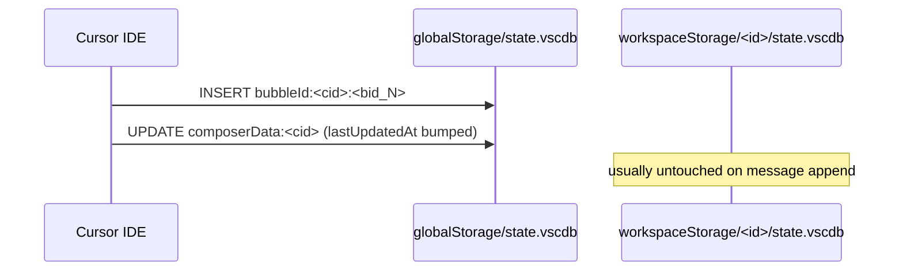
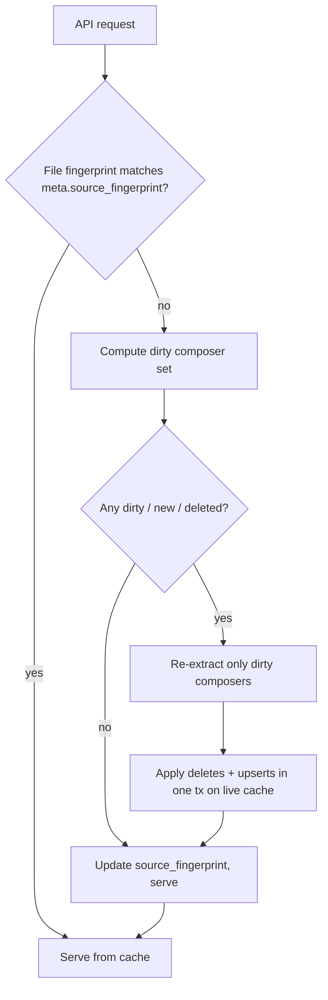

# Incremental refresh for the Cursor View chat cache

## 1. How the caching system works today

The cache lives at `cursor_view_cache_dir() / "chat-index.sqlite3"` and is fully owned by [`cursor_view/chat_index.py`](cursor_view/chat_index.py). Its schema is:

- `meta(key, value)` — `schema_version`, `source_fingerprint`, `source_manifest`, `built_at`, `chat_count`
- `chat_summary(session_id PK, project_name, project_root_path, date, workspace_id, db_path, message_count, preview, sort_key_ms)`
- `chat_message(session_id, position, role, content)` — composite PK `(session_id, position)`
- `chat_search_text(session_id PK, content)` — LIKE fallback
- `chat_search_fts` — FTS5 virtual table of `(session_id UNINDEXED, content)`

**Read path (`list_summaries`, `get_chat`).** Every API call goes through `ensure_current()`. That function computes a `source_fingerprint` over the live Cursor DBs and compares it to `meta.source_fingerprint`:

```288:329:cursor_view/chat_index.py
    def _current_source_fingerprint(self) -> tuple[str, list[dict[str, Any]]]:
        ...
        for ws_id, db in workspaces(root) or []:
            if db.exists():
                sources.append(self._source_entry(ws_id, db))
        ...
    def _source_entry(self, workspace_id: str, path: Path) -> dict[str, Any]:
        stat = path.stat()
        entry: dict[str, Any] = {
            "workspace_id": workspace_id,
            "path": str(path),
            "mtime_ns": stat.st_mtime_ns,
            "size": stat.st_size,
        }
        wal_path = path.with_name(path.name + "-wal")
        if wal_path.exists():
            wst = wal_path.stat()
            entry["wal_mtime_ns"] = wst.st_mtime_ns
            entry["wal_size"] = wst.st_size
        return entry
```

If any one of the per-file `(mtime_ns, size, wal_mtime_ns, wal_size)` tuples changes, the fingerprint changes.

**Write path.** A fingerprint mismatch calls `_rebuild()`:

```331:342:cursor_view/chat_index.py
    def _rebuild(self, source_fingerprint: str, sources: list[dict[str, Any]]) -> None:
        ...
        temp_path = self.db_path.parent / f"{self.db_path.stem}.{uuid.uuid4().hex}.tmp"
        try:
            self._build_index_to_temp(temp_path, source_fingerprint, sources)
            self._swap_temp_into_place(temp_path)
```

`_build_index_to_temp` creates a fresh SQLite file, calls `extract_chats()` (the 8-pass pipeline in [`cursor_view/extraction/core.py`](cursor_view/extraction/core.py)), and inserts every chat via `_insert_chat`. `_swap_temp_into_place` waits for readers to drain (`_active_readers == 0`) and then `Path.replace`s the temp file over the live index.

The 8 passes, in order:

1. `_collect_workspace_messages` — per-workspace project info, `ItemTable` chat rows, and (via `workspace_info`) synthetic `comp_meta` seeded from `workbench.panel.aichat.view.<cid>` pane-view keys.
2. `_collect_global_bubbles` — streams every `bubbleId:*` row from the global `cursorDiskKV`, builds `tool_call_parent[toolCallId] -> parent_cid` as a side-effect.
3. `_collect_global_composers` — walks `composerData:*` rows, fills meta, records authentic `subagentInfo.parentComposerId` links.
4. `_apply_uri_fallbacks` — per-composer project inference from bubble URIs.
5. `_link_task_subagents_to_parents` (recent addition) — for composers whose id is `task-<toolCallId>` and whose `subagentInfo` is `null`, look up `tool_call_parent[toolCallId]` to reconstruct the parent link.
6. `_apply_subagent_inheritance` — walks the parent chain (authentic + reconstructed) so subagent composers inherit an ancestor's workspace/project.
7. `_collect_global_item_table_chats` — legacy `workbench.panel.aichat.view.aichat.chatdata` tabs.
8. `_finalize_sessions` — drops empty sessions, picks final project, sorts by recency.

**Cost of the current strategy.** On any user DB write:

- **Extraction** walks every workspace `state.vscdb` in full (`_collect_workspace_messages`), every `bubbleId:*` row in the global `cursorDiskKV` (`_collect_global_bubbles` — typically the largest pass), every `composerData:*` row (`_collect_global_composers`), every legacy `chatdata` tab, plus URI fallbacks and subagent inheritance.
- **Insertion** deletes the whole cache file and re-inserts every summary, every message, every FTS doc from scratch.
- **Swap** blocks incoming reads until the rebuild completes (the stale-while-revalidate background path partially mitigates this, but the first request after startup still blocks on a full rebuild).

For users with many workspaces and tens of thousands of bubbles, a single message being appended in Cursor forces all of that work.

## 2. How Cursor actually stores chats

Sources (paths from [`cursor_view/paths.py`](cursor_view/paths.py)):

- **Global DB:** `<cursor_root>/User/globalStorage/state.vscdb`
  - `cursorDiskKV` table (the hot write path)
    - Keys `bubbleId:<composerId>:<bubbleId>` — one row per message bubble. Value is a small JSON blob with `type` (1=user, 2=assistant), `text`/`richText`, and optional `relevantFiles`, `workspaceUris`, `attachedFolders*`, `context.fileSelections/folderSelections`, and (for assistant tool-call bubbles) `toolFormerData.toolCallId` + `toolFormerData.name` (see [`cursor_view/sources/sqlite_data.py`](cursor_view/sources/sqlite_data.py)).
    - Keys `composerData:<composerId>` — per-composer metadata (`name`, `createdAt`, `lastUpdatedAt`, `workspaceIdentifier`, `subagentInfo.parentComposerId` — which is `null` for `task_v2`-spawned subagents, `originalFileStates`, `allAttachedFileCodeChunksUris`, `context.mentions.*`, and — for older Cursor builds — a full `conversation` array).
  - `ItemTable` — legacy keys like `workbench.panel.aichat.view.aichat.chatdata`, `composer.composerData`, `aiService.prompts`, `aiService.generations`.
- **Per-workspace DBs:** `<cursor_root>/User/workspaceStorage/<ws_id>/state.vscdb`
  - `ItemTable` keys consumed by extraction: `composer.composerData`, `workbench.panel.aichat.view.aichat.chatdata`, `workbench.explorer.treeViewState`, `history.entries`, `debug.selectedroot`, the per-chat `workbench.panel.aichat.view.<cid>` pane-view keys, and the nested `workbench.panel.composerChatViewPane.<paneId>` keys whose JSON bodies carry sub-keys of the same `aichat.view.<cid>` form. The last two families are what give research-only chats (no file ops) their workspace link.
  - Sidecar `workspace.json` with `folder` / `workspace` URIs for authoritative roots.

**Cross-composer dependencies introduced by the subagent passes.** Two composers in the same extraction run can be coupled:

- A `task-<toolCallId>` subagent composer's workspace is resolved from its *parent's* bubble that fired the tool (`toolFormerData.toolCallId`). So when the parent composer gets a new tool-call bubble, the child subagent's resolved workspace can change even though the child's own rows didn't move.
- Similarly, a workspace pane-view key change in a workspace DB can promote a composer from `(global)` to that workspace for the first time, making that composer dirty even though its global-DB rows are identical to what we cached.

These two couplings mean the dirty set cannot be computed by hashing rows alone; we also need to propagate dirtiness along the subagent parent chain and along the pane-key-to-composer link (see §3.3).

**What changes when the user sends a Cursor message.** In overwhelming practice:



Key observations that make incremental work feasible:

- Message writes are **append-only on bubbles** keyed by `(composerId, bubbleId)`. Edits keep the same key but change the value.
- `composerData:<cid>.lastUpdatedAt` is bumped on every meaningful change to that composer, so it is a good per-composer watermark.
- Workspace DBs change for navigation/history reasons that do not affect chat content. Most of the recency-driven invalidations we see are from these touch-only writes.
- Only a tiny subset of composers is dirty at any given moment; the current cache throws away work for the other 99%.

## 3. Proposed design: per-composer incremental refresh

### 3.1 Two-stage invalidation

Keep the existing file-level fingerprint as a **fast "nothing changed" gate**, but change the mismatch path from "rebuild everything" to "recompute the set of dirty composers and re-extract only those."



The full rebuild path survives for: schema bumps (`INDEX_SCHEMA_VERSION` change), unreadable cache (`sqlite3.DatabaseError`), and missing cache file. Everything else becomes a diff.

### 3.2 New cache tables to support diffs

Add three tables to the cache schema (new `INDEX_SCHEMA_VERSION = 2`, which forces one last full rebuild on upgrade):

- `composer_state(session_id PK, workspace_id, db_path, last_updated_ms, composer_hash, bubble_count)` — per-composer watermark.
- `source_row(db_path, table_name, key, row_hash, composer_id, PRIMARY KEY(db_path, table_name, key))` — per-row content hashes for the rows we care about (`cursorDiskKV` bubble + composerData rows, plus the `ItemTable` keys we consume — including the `workbench.panel.aichat.view.<cid>` pane-view keys and `workbench.panel.composerChatViewPane.%` container keys per workspace DB). `composer_id` is denormalized so we can join dirty rows back to affected composers in one query; for pane-view / pane container rows, `composer_id` is the `<cid>` encoded in the key (or empty for container rows that are decoded lazily).
- `tool_call_parent(tool_call_id PK, parent_composer_id)` — persistent form of the in-memory `tool_call_parent` built by Pass 2. Needed so scoped extraction can run Pass 5 (`_link_task_subagents_to_parents`) without re-scanning every bubble in the global DB. Updated from the row-hash diff in §3.3.

`source_row` is the safety net against cases where `lastUpdatedAt` doesn't move but content did (and vice versa: lastUpdatedAt bumped by Cursor writes that don't affect the chat we care about). `tool_call_parent` is what lets us reconstruct subagent parent links incrementally; without it, any `task-*` composer in the dirty set would force a full global-bubble scan to re-resolve its parent.

### 3.3 Computing the dirty set

New helper `_compute_source_diff(sources)` returning `DirtySet { modified_cids, deleted_cids, workspace_project_dirty, workspace_comp2ws_dirty }`:

1. For each source DB (global + each workspace), open read-only with the existing `?mode=ro` URI pattern.
2. For the **global DB**, iterate `cursorDiskKV` in one pass:
   - `SELECT key, value FROM cursorDiskKV WHERE key LIKE 'bubbleId:%' OR key LIKE 'composerData:%'`
   - Compute `row_hash = sha256(value)` (or `xxhash` if we want to avoid the crypto cost; a non-cryptographic 64-bit hash is fine here).
   - Compare against `source_row` cached hashes; collect changed/new/removed keys → parse out `composer_id` → union into `modified_cids` / `deleted_cids`.
   - For every changed bubble row, JSON-decode it lazily and, if it carries `toolFormerData.toolCallId`, stage an upsert into `tool_call_parent` (first-seen wins, matching Pass 2 semantics). For every deleted bubble row, stage a delete of the matching `tool_call_parent` row if it pointed at that bubble's composer.
3. For each **workspace DB**, hash the values of the keys extraction actually consumes (per [`workspace_info`](cursor_view/projects/inference.py)):
   - **Project-inference keys** — `workspace.json` (file mtime+size outside SQLite), `workbench.explorer.treeViewState`, `history.entries`, `debug.selectedroot`, and the workspace `composer.composerData` ItemTable row. If any of these change, add the workspace id to `workspace_project_dirty` (summary-only refresh of every `chat_summary` row with that `workspace_id`; messages untouched).
   - **Comp2ws-establishing keys** — `workbench.panel.aichat.view.<cid>` and `workbench.panel.composerChatViewPane.%`. These are not project-level; they promote specific composers into (or out of) a workspace. For every added/removed pane-view key, extract the `<cid>` and add it to `workspace_comp2ws_dirty[ws_id] = set(cids)`. A cid appearing in `workspace_comp2ws_dirty` is folded into `modified_cids` because its `workspace_id` / project / title may all change.
   - **Legacy chat data** — `workbench.panel.aichat.view.aichat.chatdata` (scraped by Pass 7). Hash once; if changed, re-scrape just that workspace's tab list and fold any composer ids it enumerates into `modified_cids`.
4. **Propagate dirtiness along the subagent chain.** After the per-DB scan:
   - For every cid in `modified_cids` or `deleted_cids`, walk the cached `tool_call_parent` table in reverse (`SELECT tool_call_id FROM tool_call_parent WHERE parent_composer_id=?`) to find all `task-<toolCallId>` composers whose resolved parent is dirty; add them to `modified_cids` so Passes 5+6 run for them against the new parent state. Bound the walk at the same `_MAX_PARENT_DEPTH = 8` used in [`_apply_subagent_inheritance`](cursor_view/extraction/core.py) to match existing semantics.
   - Also fold any cid whose cached `composer_state.workspace_id` points at a workspace in `workspace_project_dirty` into a secondary "project-only refresh" list (distinct from `workspace_project_dirty` itself, which is addressed by a single `UPDATE ... WHERE workspace_id=?`). The two are equivalent performance-wise; we keep them split so §3.5's logging can distinguish "message-level dirty" from "project-only dirty".
5. Return the union as the dirty set.

This scan is essentially the same amount of SQL work the current rebuild already does in Pass 2 / Pass 3, minus the JSON parsing of every bubble: we only pay the JSON parse cost for rows whose hash changed (plus the small additional `toolFormerData.toolCallId` extraction on those same changed bubbles).

### 3.4 Scoped re-extraction

Factor `extract_chats()` in [`cursor_view/extraction/core.py`](cursor_view/extraction/core.py) so its passes can accept an optional `cids: set[str] | None`:

- **Pass 1 `_collect_workspace_messages`**: when `cids` is given, skip workspaces whose chats are all unaffected and, inside the ones that remain, filter `iter_chat_from_item_table` results by membership. The pane-view-key seeding inside `workspace_info` remains scoped to the per-workspace loop; filter its emitted `comp_meta` entries to the dirty cid set when a `cids` filter is active.
- **Pass 2 `_collect_global_bubbles`**: add a cid-scoped form `iter_bubbles_for_cids(db, cids)` in [`cursor_view/sources/sqlite_data.py`](cursor_view/sources/sqlite_data.py) that streams only bubbles whose `composerId` is in `cids` via `SELECT key, value FROM cursorDiskKV WHERE key >= 'bubbleId:<cid>:' AND key < 'bubbleId:<cid>:~'` per cid (range scan on the implicit PK index is effectively O(bubbles_per_cid)). The scoped iterator still emits the 7-tuple including `tool_call`, so `_collect_global_bubbles` keeps populating an in-memory `tool_call_parent` for the dirty cids — but that map alone is insufficient for Pass 5 (see below).
- **Pass 3 `_collect_global_composers`**: similarly `iter_composer_data_for_cids(db, cids)` → `SELECT value FROM cursorDiskKV WHERE key = 'composerData:<cid>'` per dirty cid.
- **Pass 4 `_apply_uri_fallbacks`**: naturally scoped — it iterates `bubble_*_uris_by_cid`, which only contains dirty cids after scoped Pass 2.
- **Pass 5 `_link_task_subagents_to_parents`**: the in-memory `tool_call_parent` built by scoped Pass 2 only covers bubbles of dirty parent composers. For `task-<toolCallId>` composers whose parent was *not* in the dirty set, the authoritative answer lives in the cache's `tool_call_parent` table from §3.2. Merge the persisted map with the freshly-observed one (in-memory wins on conflict — first-seen-wins is preserved) and run Pass 5 against the union. For every staged upsert/delete in §3.3, apply the matching change to the in-memory map before running this pass.
- **Pass 6 `_apply_subagent_inheritance`**: ancestors that were not re-extracted must be looked up from `composer_state` + `chat_summary` in the cache so the walk's `comp2ws.get(ancestor)` / `sessions[ancestor].get("_inferred_project")` checks see final-from-last-run values. Concretely, seed the scoped run's `comp2ws` and `_inferred_project` from the cache for every non-dirty cid that appears as an ancestor in `subagent_parent`.
- **Pass 7 `_collect_global_item_table_chats`**: scoped by cid the same way as today's full scan; affects only cids present in the legacy tab structure.
- **Pass 8 `_finalize_sessions`**: produces only sessions for cids in the dirty set; the apply step in §3.5 merges them with unchanged rows that stay untouched in the cache.

The existing unchanged-composers path is simply: pull their current summary+messages out of the cache unchanged.

Expose `extract_chats(cids=None, cached_state=None)` as the backwards-compatible entry point; a `None` set means "full scan," preserving the current full-rebuild semantics. `cached_state` bundles the `tool_call_parent` and ancestor `comp2ws` / `_inferred_project` views that Passes 5 and 6 need when `cids` is not `None`.

### 3.5 Applying the diff to the cache

New method `ChatIndex._apply_delta(dirty, sources, fingerprint)`:

1. Open a single writable connection to the live cache (WAL already enabled in `_configure_connection`).
2. `BEGIN IMMEDIATE` transaction.
3. For each `cid` in `deleted_cids`: `DELETE FROM chat_summary`, `chat_message`, `chat_search_text`, `chat_search_fts`, `composer_state`, `source_row` rows for that cid.
4. For each `cid` in `modified_cids`:
   - Extract the new version by calling the scoped extraction (§3.4) with the merged `tool_call_parent` and cached ancestor state.
   - `DELETE` old rows for the cid from the five content tables.
   - `INSERT` new rows using the existing `_insert_chat` logic.
   - Upsert the `composer_state` row.
5. For each workspace in `workspace_project_dirty` (but not also in `modified_cids`): re-run project inference for that workspace and `UPDATE chat_summary SET project_name=?, project_root_path=? WHERE workspace_id=?`. Messages are untouched.
6. Apply the `tool_call_parent` staged upserts/deletes from §3.3 (`INSERT OR REPLACE` / `DELETE`). Must run after Passes 5/6 are applied so the persisted map reflects the new state for the *next* incremental refresh.
7. Replace `source_row` rows in bulk from the hashes computed in §3.3 (`INSERT OR REPLACE`, plus a `DELETE` for rows no longer seen).
8. Update `meta.source_fingerprint`, `meta.built_at`, `meta.chat_count`.
9. `COMMIT`.

Because this writes in place via SQLite WAL, no temp-file swap is needed, and readers using `?mode=ro` continue to see a consistent snapshot. `_cache_read_guard` / `_swap_pending` remain only for the full-rebuild path.

### 3.6 Concurrency and correctness

- Reuse `_rebuild_build_lock` to serialize delta computations — a single writer at a time.
- `_schedule_background_rebuild` becomes `_schedule_background_refresh` and calls the delta path; stale-while-revalidate semantics for readers are preserved.
- Full rebuild remains available on:
  - `force_refresh=True` from the UI,
  - `meta.schema_version` mismatch (bumped to 2 when this lands),
  - `sqlite3.DatabaseError` on the cache,
  - absence of `composer_state` / `source_row` / `tool_call_parent` tables (upgrading from schema 1).

### 3.7 Why each change is faster

- **Per-composer diff vs. per-file fingerprint.** Today every untouched composer is re-extracted and re-inserted because a single file's mtime moved. Hashing only the `cursorDiskKV` rows we actually consume reduces the post-change work from `O(total bubbles across all users' workspaces)` to `O(bubbles in changed composers + rows scanned)`. For an append of one new bubble, that is typically dozens of rows re-parsed instead of tens of thousands.
- **Scoped extraction.** Range-scanning `WHERE key >= 'bubbleId:<cid>:' AND key < 'bubbleId:<cid>:~'` uses the implicit PK index and touches only that composer's bubbles. The 8-pass orchestrator still runs, but each pass operates on the dirty cid set, not the whole user corpus.
- **Persisted `tool_call_parent`.** Without the cached map, every incremental refresh that touches a `task-<toolCallId>` subagent would force a full scan of every `bubbleId:*` row in the global DB (the only way to discover which parent fired which tool). Persisting the map collapses Pass 5's cost from `O(all bubbles)` to `O(|modified_cids|)` lookups, which is what makes the subagent pass cheap in the common case.
- **In-place writes with WAL.** The atomic `Path.replace` of a fresh multi-MB SQLite file is a measurable cost on its own (filesystem rename, cache eviction, Windows handle juggling via `_swap_pending`). WAL-based incremental writes avoid both the temp-file build and the rename, and let readers keep their open connections.
- **Targeted FTS updates.** `DELETE FROM chat_search_fts WHERE session_id=?` followed by `INSERT` is `O(tokens in that session)`. Rebuilding the FTS from scratch (which the current code implicitly does by dropping the table) is `O(tokens across all sessions)` and is a substantial chunk of rebuild time for heavy users.
- **Project-only refresh for workspace-scope changes.** When the only thing that changed is `workbench.explorer.treeViewState` (or `history.entries`, or `debug.selectedroot`), we now do an `UPDATE chat_summary` on that workspace's rows — no message re-extraction at all. This is the single most common "noise" write today, and it becomes effectively free.
- **Targeted handling of pane-view keys.** Writes to `workbench.panel.aichat.view.<cid>` and `workbench.panel.composerChatViewPane.*` are distinguished from project-only refreshes: they only fold the specific `<cid>`s mentioned into the dirty set, not every chat in the workspace. A pane-view key appearing for the first time is the sole workspace signal for research-only chats, so the refresh has to correctly promote them from `(global)` — and that is still `O(|affected cids|)`, not `O(workspace chats)`.
- **Cheap fast-path retention.** The coarse `(mtime, size, wal_mtime, wal_size)` fingerprint still short-circuits 100% of idle reads. We only pay the diff cost when something actually changed.

### 3.8 Risks and edge cases

- **Bubble edits keeping the same key.** Covered by value hashing in `source_row`; a changed value produces a different hash even if `bubbleId` stays the same.
- **Cursor updates `lastUpdatedAt` without changing content.** Watermark-only strategies miss this as a false positive (we'd refresh when we don't need to); content-hash strategy handles it cleanly.
- **Content changes without `lastUpdatedAt` bump.** Very rare but observed historically; the content-hash path catches it.
- **Cursor internal schema drift** (e.g., switch from `composerData.conversation` back to `bubbleId:*`): protected by the `INDEX_SCHEMA_VERSION` bump and by keeping the full-rebuild fallback.
- **Corruption of `composer_state` / `source_row`.** If either table is missing or unreadable, `ensure_current` downgrades to a full rebuild, same as today's `sqlite3.DatabaseError` path.
- **Legacy `ItemTable` chatdata** (global): hashed as a single key; a change invalidates all composers it enumerates. This is acceptable because that path is legacy and small.
- **Subagent parent flipping workspaces.** If a parent composer's `workspaceIdentifier` changes (e.g. Cursor migrates a composer between workspaces), every descendant `task-*` subagent must re-resolve its workspace. Covered by §3.3 step 4: dirty-set propagation walks down the subagent tree from every cid that changes.
- **Stale `tool_call_parent` for deleted parents.** If a parent composer is deleted, any `task-<toolCallId>` child resolved via the cached map is orphaned. §3.5 step 6 deletes the matching `tool_call_parent` rows as part of the same transaction that deletes the parent's `source_row` entries, so the next scoped Pass 5 correctly fails the lookup and falls through to the `(global)` branch.

## 4. Implementation steps

Organized so each step is independently testable and reviewable.

- **Step A — Schema bump and new tables.** Edit [`cursor_view/chat_index.py`](cursor_view/chat_index.py): bump `INDEX_SCHEMA_VERSION` to `2`, extend `_create_schema` with `composer_state`, `source_row`, and `tool_call_parent` (+ indexes: `source_row(composer_id)`, `composer_state(workspace_id)`, `tool_call_parent(parent_composer_id)` so §3.3's "subagents of dirty parent" lookup is indexed).
- **Step B — Extract a `SourceDiff` module.** New file `cursor_view/cache/source_diff.py` that owns `_compute_source_diff(sources) -> DirtySet` and the row-hash logic. Keeps `chat_index.py` under the 400-line soft limit in [`.cursor/rules/python-standards.mdc`](.cursor/rules/python-standards.mdc).
- **Step C — Parameterize extraction.** Refactor [`cursor_view/extraction/core.py`](cursor_view/extraction/core.py) so each `_collect_*` helper accepts an optional `cids: set[str] | None` and the scoped run threads a `cached_state` (persisted `tool_call_parent` + ancestor `comp2ws` / `_inferred_project` views). Add cid-scoped SQL in [`cursor_view/sources/sqlite_data.py`](cursor_view/sources/sqlite_data.py) (new `iter_bubbles_for_cids`, `iter_composer_data_for_cids`) — both must preserve the current 7-tuple shape from `iter_bubbles_from_disk_kv` including `tool_call`. `extract_chats(cids=None, cached_state=None)` stays backward-compatible.
- **Step D — Incremental apply.** Add `ChatIndex._apply_delta` and route `ensure_current` through it when a cache exists and the schema matches. Stage `tool_call_parent` upserts/deletes alongside `source_row` changes so both land atomically (§3.5 steps 6–7). Keep `_rebuild` intact; only call it on schema/DB-error paths.
- **Step E — Backfill on upgrade.** On first run after the schema bump, full-rebuild populates `composer_state`, `source_row`, and `tool_call_parent` using the hashes and the `tool_call_parent` map produced by Pass 2 during the rebuild. Subsequent runs take the incremental path.
- **Step F — Observability.** Add `logger.info("Incremental refresh: %s modified, %s deleted, %s project-only, %s subagent-propagated", ...)` so we can validate empirically that the diff set is small in the common case and that subagent propagation is not over-firing. Guard existing debug logs behind `logger.debug`.
- **Step G — Tests/verification.** At minimum: (1) synthetic SQLite fixture that starts empty, runs `ensure_current`, mutates one `bubbleId` row, and asserts only that composer's `chat_message` rows are rewritten (using SQLite `rowid` stability as the witness); (2) a workspace-only `treeViewState` bump that asserts no `chat_message` rows are touched; (3) a new test that appends a `toolFormerData.toolCallId` bubble to a parent composer and asserts the matching `task-<toolCallId>` child's summary gets re-resolved workspace/project without its `chat_message` rows being rewritten; (4) a test that adds a `workbench.panel.aichat.view.<cid>` key in a workspace DB and asserts the targeted cid is promoted from `(global)` to that workspace without other chats in that workspace being touched.
- **Step H — Rule/doc updates.** The "rule drift" clause in [`.cursor/rules/comments-style.mdc`](.cursor/rules/comments-style.mdc) applies: update [`.cursor/rules/sqlite-cursor-db.mdc`](.cursor/rules/sqlite-cursor-db.mdc) with the new "hash rows, don't stat files" convention, and note the new tables (including `tool_call_parent`) in the README's "Backend" section.

## 5. Non-goals (to keep this change tractable)

- Not moving off SQLite, not restructuring the frontend, not changing the public API surface.
- Not rewriting the 8-pass extraction logic itself — only adding a cid filter and threading a `cached_state` into Passes 5 and 6.
- Not doing delta FTS (we just drop/insert per-session FTS rows).
- Not optimizing first-run cold builds; the full-rebuild code path is unchanged for that case.
