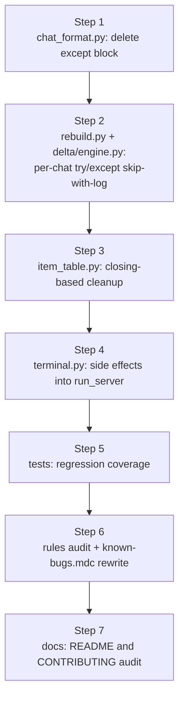

## Summary of bugs found

Two bugs are explicitly flagged with `# TODO(bug):` per [`.cursor/rules/known-bugs.mdc`](.cursor/rules/known-bugs.mdc), and one more is named in [`.cursor/rules/python-standards.mdc`](.cursor/rules/python-standards.mdc) as "bug #12 ... deferred to the follow-up bug-fix plan" but is missing the required marker in code (itself a `known-bugs.mdc` compliance gap).

### Bug 1 — `cursor_view/chat_format.py::format_chat_for_frontend` swallows every exception and returns a stub with `uuid.uuid4()`

Located at [cursor_view/chat_format.py](cursor_view/chat_format.py) lines 204-222. The current handler is:

```204:222:cursor_view/chat_format.py
    except Exception as e:
        # TODO(bug): swallowing every exception and returning a stub with a
        # fresh ``uuid.uuid4()`` session id breaks the cache's session-id
        # invariant ...
        logger.error("Error formatting chat: %s", e)
        return {
            "project": {"name": "Error", "rootPath": "/"},
            ...
            "session_id": str(uuid.uuid4()),
            ...
        }
```

Why it is broken (the symptom the TODO captures, expanded):

- The chat-index cache treats `session_id` as the row identity for `chat_summary`, `chat_message`, `chat_search_text`, `chat_search_fts`, `chat_image`, `composer_state`, etc. (see [`.cursor/rules/sqlite-cursor-db.mdc`](.cursor/rules/sqlite-cursor-db.mdc) "Cache tables").
- Per the schema invariant, `session_id` must equal Cursor's `composerData.composerId` — that is the same key the diff/delta path uses for cleanup. `cursor_view/cache/delta/composer_rows._delete_cid_rows` deletes by the real cid.
- When formatting fails, the stub returns a freshly-minted UUID instead. Three concrete consequences:
  1. The stub row lands in `chat_summary` under a UUID nobody ever sees again. `_delete_cid_rows(real_cid)` cannot find it on the next refresh, so the row lingers as an undeletable ghost forever.
  2. `GET /api/chat/<real_cid>` 404s because the cache only has the random UUID.
  3. The displayed card on the chat-list page reads `Error` / `Unknown database path` and clicks lead nowhere — the user has no way to recover.
- The handler also masks every real defect (a TypeError in the project-name fallback, a missing `composerId`, etc.) behind a single `logger.error("Error formatting chat: %s", e)`, so debugging requires re-running with a breakpoint.

Fix shape (per user direction): re-raise so callers decide whether to skip the chat. To prevent a single bad chat from killing a whole refresh, the per-chat insert loop becomes the new skip-with-log boundary — that gives strictly better correctness than today (no ghost rows) **and** strictly better resilience than a naive re-raise (one bad chat ≠ a dead refresh).

### Bug 2 — `cursor_view/sources/item_table.py::iter_global_legacy_chatdata` leaks the SQLite connection on the error path

Located at [cursor_view/sources/item_table.py](cursor_view/sources/item_table.py) lines 107-134. `con = sqlite3.connect(...)` runs **inside** the `try`, so any exception from `j()` or the bubble-iteration loop jumps to `except Exception` without closing `con`. The sibling `iter_chat_from_item_table` in the same file already does the right thing with `contextlib.closing` (lines 32-37). [`.cursor/rules/sqlite-cursor-db.mdc`](.cursor/rules/sqlite-cursor-db.mdc) "Connection cleanup" mandates this pattern. The leak matters because Cursor's global `state.vscdb` is the single hot DB and a stuck connection can contend with the live IDE.

### Bug 3 — `cursor_view/terminal.py` runs `cleanup_orphan_temp_files()` and `app = create_app()` at import time

Located at [cursor_view/terminal.py](cursor_view/terminal.py) lines 21 and 23. Module load triggers a cache-directory sweep and Flask app construction, so anything that imports `cursor_view.terminal` purely to read `run_server` (CLI dispatch, introspection tools, tests) pays the side-effect cost. [`.cursor/rules/python-standards.mdc`](.cursor/rules/python-standards.mdc) "Import-time side effects" calls this out by name as bug #12. The sibling [`cursor_view/desktop/__init__.py`](cursor_view/desktop/__init__.py) already does the right thing inside `run_desktop()` (lines 39-41). Importers verified safe to refactor:

- `terminal.py` (root shim) — uses `from cursor_view.terminal import main`.
- `cursor_view/__main__.py` — uses `from cursor_view.terminal import run_server`.

Nobody imports the module-level `app`, so the symbol can be removed.

This bug is **also** a `known-bugs.mdc` compliance gap: the file lacks the required `# TODO(bug):` marker for known-broken-but-deferred behavior. The fix removes the bug, which retires the gap by construction.

### Rule drift to reconcile in the same change

[`.cursor/rules/known-bugs.mdc`](.cursor/rules/known-bugs.mdc) line 13-15 currently cites:

> Motivating example: `cursor_view/chat_format.py` hard-codes a developer's username in a project-name fallback; it is annotated with `# TODO(bug):` but not removed.

That example is stale — the current `chat_format.py` uses `os.path.basename(os.path.expanduser("~"))` (dynamic), and the live `# TODO(bug):` in that file is about exception swallowing, not a hardcoded username. [`.cursor/rules/comments-style.mdc`](.cursor/rules/comments-style.mdc) "Rule drift" requires fixing this in the same PR.

After this plan lands, both `# TODO(bug):` markers will be gone, so the rule's motivating example needs a new pointer. The replacement should cite a still-true example from elsewhere in the codebase that follows the convention but isn't targeted by this fix-pass — git history is the appropriate archive for the retired markers.

## Implementation plan

### Step 1 — Fix Bug 1 in [cursor_view/chat_format.py](cursor_view/chat_format.py)

Delete the entire `except Exception as e:` block (lines 204-222) so `format_chat_for_frontend` propagates errors to its caller. Remove the `import uuid` if it becomes unused (the `uuid.uuid4()` on the happy path at line 121 keeps the import alive — verify before removing).

The function's docstring should be updated to note that callers handle bad input by skipping the chat.

### Step 2 — Make the two `_insert_chat` loops skip-on-error so Step 1 is safe

Wrap the per-chat call in [cursor_view/chat_index/rebuild.py](cursor_view/chat_index/rebuild.py) line 80:

```python
for chat in chats:
    try:
        formatted, messages = _insert_chat(cur, chat, fts_enabled)
    except Exception:
        logger.exception(
            "Skipping chat that failed to format; cid=%s",
            (chat.get("session") or {}).get("composerId"),
        )
        continue
    formatted_chats.append((chat, formatted, messages))
```

Apply the same pattern in [cursor_view/cache/delta/engine.py](cursor_view/cache/delta/engine.py) line 86 (skip the `_upsert_composer_state` call and don't increment `inserted`). Use lazy `%s`-style logging per [`.cursor/rules/python-standards.mdc`](.cursor/rules/python-standards.mdc) "Logging".

Net behavior change vs. today: a malformed chat now **disappears** from the cache (correct — no ghost row, no 404 mismatch) instead of leaving a `Error` / random-UUID stub row that can never be cleaned up.

### Step 3 — Fix Bug 2 in [cursor_view/sources/item_table.py](cursor_view/sources/item_table.py)

Mirror the `iter_chat_from_item_table` pattern. Move `sqlite3.connect` outside the main `try`, narrow its `except` to `sqlite3.DatabaseError` (matches the sibling), and wrap the cursor work in `with closing(con):`. Drop the bare `con.close()` and the broad `except Exception` — `with closing(...)` already handles cleanup, and the upstream loop already tolerates a debug-logged error per the docstring contract. The `# TODO(bug):` block disappears.

```python
def iter_global_legacy_chatdata(db: pathlib.Path) -> Iterable[tuple[str, str, str]]:
    try:
        con = sqlite3.connect(f"file:{db}?mode=ro", uri=True)
    except sqlite3.DatabaseError as e:
        logger.debug("Error processing global ItemTable %s: %s", db, e)
        return
    with closing(con):
        try:
            chat_data = j(con.cursor(), "ItemTable", _LEGACY_CHATDATA_KEY)
            ...  # existing iteration body
        except sqlite3.DatabaseError as e:
            logger.debug("Error processing global ItemTable %s: %s", db, e)
            return
```

### Step 4 — Fix Bug 3 in [cursor_view/terminal.py](cursor_view/terminal.py)

Move both side-effecting calls into `run_server`, mirroring `run_desktop`:

```python
def run_server(port: int = 5000, debug: bool = False, no_browser: bool = False) -> None:
    cleanup_orphan_temp_files()
    app = create_app()
    logger.info("Starting server on port %s", port)
    if not no_browser:
        threading.Timer(1.5, webbrowser.open, args=[f"http://127.0.0.1:{port}"]).start()
    app.run(host="127.0.0.1", port=port, debug=debug)
```

Drop the module-level `cleanup_orphan_temp_files()` call and the module-level `app = create_app()` binding. Verified no importer references `cursor_view.terminal.app`.

## Implementation flow



## Rule audit and documentation updates

- [`.cursor/rules/known-bugs.mdc`](.cursor/rules/known-bugs.mdc) — replace the stale "hard-codes a developer's username" motivating example with a still-true reference (or simply describe the marker convention without naming a specific file, since both live `TODO(bug):` markers are retired by this change). Required by [`.cursor/rules/comments-style.mdc`](.cursor/rules/comments-style.mdc).
- [`.cursor/rules/python-standards.mdc`](.cursor/rules/python-standards.mdc) — strike "Filed as bug #12 ... the fix is deferred to the follow-up bug-fix plan, but new code must not repeat the pattern" and replace with a forward-looking "new code must not repeat the pattern" sentence that no longer references a deferred fix. The motivating example block can stay as a historical illustration referencing git history.
- [`.cursor/rules/sqlite-cursor-db.mdc`](.cursor/rules/sqlite-cursor-db.mdc) — verify "Connection cleanup" still reads correctly after the `iter_global_legacy_chatdata` fix lands; update only if its motivating example becomes inaccurate.
- All other rules under `.cursor/rules/` — read once to confirm none reference `format_chat_for_frontend`'s old swallow-stub behavior or the deferred terminal.py fix.

## README / CONTRIBUTING updates

- [README.md](README.md) — no change required. None of these fixes touch user-visible setup, binary usage, or features (the failure mode being fixed is silent corruption of error chats, which has no documented surface).
- [.github/CONTRIBUTING.md](.github/CONTRIBUTING.md) — no layout change, so no required update. Worth a re-read to confirm the descriptions of `cursor_view/chat_format.py` (line 23) and `cursor_view/terminal.py` (line 24) still match post-fix; minor wording adjustment only if a description mentions the deferred-bug behavior.

## Test plan (regression guards)

- Add a `tests/test_chat_format_bad_chat.py` (or extend an existing chat-format test module) with two cases: (a) a chat whose `format_chat_for_frontend` raises is **skipped** by the rebuild loop and produces zero rows in `chat_summary` (no ghost UUID row) — assert `assertLogs` catches the skip warning; (b) the same case via the incremental delta apply path.
- Confirm `python -m unittest discover -s tests` stays green per [`.cursor/rules/project-layout.mdc`](.cursor/rules/project-layout.mdc).