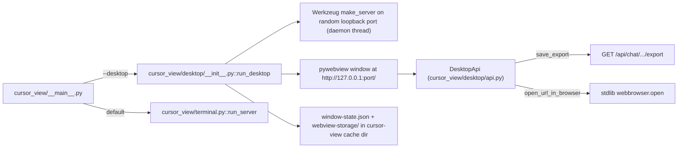

# Maturing the experimental desktop mode

This plan organizes the work into **21 self-contained improvements** plus **2 final bug-sweep todos**. Each improvement carries its own rule-review and doc-sync subtasks per [`comments-style.mdc`](.cursor/rules/comments-style.mdc) "Rule drift" and [`project-layout.mdc`](.cursor/rules/project-layout.mdc) "Documentation sync", so any subset can be implemented independently.

## Current architecture (baseline)

The bridge today exposes only `save_export` and `open_url_in_browser`; everything else (link clicks, GitHub button, theme toggle, etc.) bypasses Python and runs in the embedded webview.

## Cross-cutting rule notes that apply throughout

- **New `.cursor/rules/desktop-mode.mdc`** is created lazily by whichever improvement first needs to pin a new desktop-only invariant; subsequent improvements append to it. This is consistent with how `mermaid-rendering.mdc` and `theme-transitions.mdc` grew.
- **Module size** caps from [`python-standards.mdc`](.cursor/rules/python-standards.mdc): `cursor_view/desktop/__init__.py` is currently 132 lines and adding a menu bar + readiness probe + token middleware will push it past the ~400-line soft limit. Improvements that grow it should split into new sibling modules under `cursor_view/desktop/` (e.g. `menu.py`, `readiness.py`, `auth.py`, `links.py`, `single_instance.py`).
- **Lazy `%s` logging** ([`python-standards.mdc`](.cursor/rules/python-standards.mdc)) and **`try/finally` connection cleanup** patterns ([`sqlite-cursor-db.mdc`](.cursor/rules/sqlite-cursor-db.mdc)) apply to every new Python file.
- **Bridge methods follow the existing return-shape pattern** in [`cursor_view/desktop/api.py`](cursor_view/desktop/api.py)::`open_url_in_browser`: never raise across the JS boundary, return a JSON dict with success/error keys, log every failure path with lazy `%s` formatting.
- **Frontend mode-detection** must continue to use the shared [`frontend/src/utils/mode.js`](frontend/src/utils/mode.js)::`isDesktopMode()` helper plus the per-method `typeof window.pywebview.api.<method> === 'function'` gate at each call site, as already established by [`frontend/src/utils/exportChat.js`](frontend/src/utils/exportChat.js)::`hasDesktopBridge`.
- **No new top-level Python files** ([`project-layout.mdc`](.cursor/rules/project-layout.mdc)). All new Python modules go under `cursor_view/desktop/`.

---

## Improvement 01 - Eliminate the webview-opens-before-Flask-is-ready race

**What it is.** [`cursor_view/desktop/__init__.py::run_desktop`](cursor_view/desktop/__init__.py) starts the Flask server in a daemon thread and immediately calls `webview.create_window(url=f"http://127.0.0.1:{port}/")`. There is no synchronization between Flask's `serve_forever` actually accepting connections and pywebview navigating to the URL. On cold launches the user sometimes sees a "site can't be reached" frame for half a second.

**What it does.** Replaces the eager URL navigation with a two-stage open: create the window with `url=None` (or a tiny inline `data:` splash), then call `window.load_url(...)` only after a readiness probe (an HTTP `GET /` against the chosen port via stdlib `urllib.request`) returns 200, with a bounded retry loop and a fallback timeout.

**How it will be implemented.**
- New module [`cursor_view/desktop/readiness.py`](cursor_view/desktop/readiness.py) exposing `wait_for_server(port: int, timeout: float = 10.0) -> bool` that polls `http://127.0.0.1:{port}/` every 50ms via `urllib.request.urlopen` with a per-request 0.5s timeout. Returns True on first 200, False on timeout. No external deps; lazy `%s` logging on each retry past the first.
- `run_desktop` becomes: spawn server thread, then `wait_for_server(port)`. If False, surface a native error dialog (see Improvement 03) and bail before opening the window.
- Optional inline-`data:` splash payload (single small SVG with the Cursor View wordmark) lives in a sibling `cursor_view/desktop/splash.py` returning the data URI as a constant. Keeps the asset out of `cursor_view/export/vendor/` (that directory is reserved for HTML-export third-party assets per [`project-layout.mdc`](.cursor/rules/project-layout.mdc)).

**Todos**
- `01a-readiness-probe`: Add `cursor_view/desktop/readiness.py` and refactor `run_desktop` to wait before navigating.
- `01b-splash-payload`: Add the optional inline data-URI splash so the window has something to show during the probe.
- `01c-rules-and-docs`: Re-read [`python-standards.mdc`](.cursor/rules/python-standards.mdc) for the new module; if a new desktop-only invariant is worth pinning, create or extend `.cursor/rules/desktop-mode.mdc` with the "wait-before-navigate" rule. Update `.github/CONTRIBUTING.md` `cursor_view/desktop/` bullet to mention the readiness module. README needs no change unless behavior is user-visible.

---

## Improvement 02 - Robust Flask shutdown + lifecycle hardening

**What it is.** The current `try/finally` in [`run_desktop`](cursor_view/desktop/__init__.py) calls `server.shutdown()` and `server_thread.join(timeout=5)`. There is no logging if the join times out, no signal handler for SIGINT/SIGTERM in case `webview.start()` exits abnormally, and `server_thread` is `daemon=True` so an unclean exit can leave a half-served HTTP request mid-flight.

**What it does.** Adds explicit shutdown logging, a `KeyboardInterrupt` branch, and a final `logger.warning` if the join times out so the user can see why a process is hanging. Also installs a `signal.signal(signal.SIGTERM, ...)` handler that calls `webview.windows[0].destroy()` (which unblocks `webview.start()` and runs the existing `finally`).

**How it will be implemented.**
- In [`run_desktop`](cursor_view/desktop/__init__.py), wrap `webview.start(...)` in a `try / except KeyboardInterrupt / finally` triple. The `finally` calls `server.shutdown()`; if `server_thread.join(timeout=5)` returns with `server_thread.is_alive()` still True, log a `logger.warning("Flask server thread did not exit within 5s")` with lazy `%s`.
- Install SIGTERM handler in `run_desktop` (after window creation, before `webview.start`). Skip on Windows where SIGTERM doesn't apply the same way; document that.
- No new module; the change stays in `__init__.py` (under the soft-limit ceiling).

**Todos**
- `02a-shutdown-drain`: Add the explicit shutdown drain + warning log.
- `02b-signal-handler`: Install the SIGTERM handler with the platform-conditional skip.
- `02c-rules-and-docs`: Re-read [`python-standards.mdc`](.cursor/rules/python-standards.mdc) for lazy `%s` adherence. No rule/README update expected unless a new invariant emerges.

---

## Improvement 03 - Startup-error native dialog

**What it is.** Today, if `make_server` raises (port already bound after the `free_port` race window, no privileges, etc.) or `cleanup_orphan_temp_files()` raises, the user sees a Python traceback in the terminal — and after Improvement 07 (Windows console suppression), they see nothing at all.

**What it does.** Wraps the startup sequence in `run_desktop` with an exception boundary that, on failure, shows a native error dialog via `webview.create_window(...)` + a one-shot HTML payload, then exits with a non-zero code.

**How it will be implemented.**
- New helper `cursor_view/desktop/error_window.py::show_startup_error(message: str, traceback: str | None) -> None` that creates a small `data:` HTML window containing the message + collapsible traceback. Window has a single "Close" button and `webview.start()` until dismissed.
- `run_desktop` wraps `cleanup_orphan_temp_files()`, `make_server`, and the `wait_for_server` call in a single `try/except Exception` and routes to `show_startup_error` on failure.
- Lazy `%s` logging on every error path; the dialog text is built from the exception string, never from `traceback.format_exc()` written to a UI without escaping.

**Todos**
- `03a-error-window`: Add the error-window helper and wire it into `run_desktop`'s startup boundary.
- `03b-rules-and-docs`: Re-read [`python-standards.mdc`](.cursor/rules/python-standards.mdc); update `.github/CONTRIBUTING.md` desktop bullet to list the new module.

---

## Improvement 04 - Single-instance enforcement

**What it is.** Each `cursor-view --desktop` launch spawns a fresh Flask + window. Once desktop becomes the default, double-clicking the icon twice (extremely common) opens two windows on two different random ports, neither of which sees the other's window state.

**What it does.** Detects an already-running desktop instance via a lockfile in `cursor_view_cache_dir() / "desktop.lock"` (containing the running PID + the chosen port). If the lockfile is fresh and the process is alive, the new launch sends an "open / focus me" message to the existing instance via a small loopback IPC and exits.

**How it will be implemented.**
- New module [`cursor_view/desktop/single_instance.py`](cursor_view/desktop/single_instance.py) with two top-level functions: `acquire_lock(port: int) -> bool` (writes `{pid, port, started_at_ns}` JSON, returns False if a fresh lock with a live process exists) and `notify_existing(port_from_lock: int) -> bool` (HTTP POST to `http://127.0.0.1:{port_from_lock}/__desktop_focus__`).
- New Flask route `POST /__desktop_focus__` registered only in desktop mode (Improvement 10's auth middleware will allow this route via the loopback token, OR it stays unauthenticated because it does not expose data — TBD as part of 04a). The route calls `webview.windows[0].show()` + `restore()`.
- Stale-lock detection uses `psutil.pid_exists(...)` if available, else a simple `os.kill(pid, 0)` probe. Cross-platform: Windows `os.kill(pid, 0)` raises `OSError` on dead pids — use `signal.SIGTERM` constant carefully or skip the kill probe and rely on the IPC GET timing out.
- Lock release in `finally` of `run_desktop`.

**Todos**
- `04a-lockfile`: Implement `acquire_lock` + `notify_existing` + the focus route registration.
- `04b-stale-detection`: Add the cross-platform stale-PID detection with `os.kill(pid, 0)` + Windows fallback.
- `04c-tests`: Synthetic test under `tests/test_desktop_single_instance.py` exercising the lockfile race (acquire → second-acquire-fails → release → re-acquire). Per [`project-layout.mdc`](.cursor/rules/project-layout.mdc) "Tests live under `tests/`".
- `04d-rules-and-docs`: Create or extend `.cursor/rules/desktop-mode.mdc` with the "single-instance lockfile" invariant. Update `.github/CONTRIBUTING.md` desktop bullet. Update `README.md` "User preferences" section to mention `desktop.lock` lives next to `webview-storage/`.

---

## Improvement 05 - Native menu bar

**What it is.** The desktop window currently has no native menu bar. All UI affordances live inside the React app, which is fine for terminal mode but not for a desktop-first experience where users expect File / Edit / View / Help menus and the system shortcuts that come with them.

**What it does.** Adds a `webview.menu.Menu` tree (pywebview ≥5.0 native menus) with platform-aware naming. Items: **File** → Refresh / Open Cache Folder / Quit; **Edit** → Cut / Copy / Paste / Select All (delegated to webview); **View** → Toggle Theme / Reload / View Logs; **Help** → About / Documentation (opens README via bridge) / GitHub.

**How it will be implemented.**
- New module [`cursor_view/desktop/menu.py`](cursor_view/desktop/menu.py) with `build_menu(api: DesktopApi) -> list[webview.menu.Menu]` returning the menu tree. Each menu item action calls into a `DesktopApi` method (so the bridge is the single source of truth for cross-mode actions like "open URL externally").
- The menu is passed to `webview.start(menu=...)`. Some pywebview backends (notably WebKitGTK) have limited menu support; document the gap and gate menu construction behind a `if hasattr(webview.menu, 'Menu')` check, falling back to no menu silently with a `logger.info`.
- Menu actions that need the React app to react (e.g. "Toggle Theme") emit a JS evaluation via `window.evaluate_js("window.dispatchEvent(new CustomEvent('cursor-view:toggle-theme'))")`. The frontend installs a global listener in `App.js::ThemeModeBridge` for these events. New custom-event names go in a new constant module [`frontend/src/utils/desktopEvents.js`](frontend/src/utils/desktopEvents.js).
- Per [`react-components.mdc`](.cursor/rules/react-components.mdc), the global event listener belongs in a hook: new `frontend/src/hooks/useDesktopMenuEvents.js` returning nothing, called from `App.js::ThemeModeBridge`.

**Todos**
- `05a-menu-tree`: Implement `build_menu` and wire it into `webview.start`.
- `05b-bridge-methods`: Add bridge methods on `DesktopApi` for `quit_app`, `reload_window`, `toggle_devtools` (debug-only).
- `05c-frontend-events`: Implement `useDesktopMenuEvents` hook + add the `desktopEvents.js` constants. Update [`frontend-hooks.mdc`](.cursor/rules/frontend-hooks.mdc) "Canonical hooks to read" with the new hook.
- `05d-fallback`: Document the WebKitGTK menu gap in `.cursor/rules/desktop-mode.mdc` (the rule may need to be created here if Improvements 04/01 haven't created it yet).
- `05e-rules-and-docs`: Re-read [`react-components.mdc`](.cursor/rules/react-components.mdc) and [`frontend-hooks.mdc`](.cursor/rules/frontend-hooks.mdc); update `.github/CONTRIBUTING.md` desktop bullet + frontend hooks bullet; mention native menu in README under "Running the binary".

---

## Improvement 06 - Keyboard shortcuts

**What it is.** No global keyboard shortcuts beyond what the embedded browser provides natively. Users expect Ctrl/Cmd+R reload, Ctrl/Cmd+Q quit, Ctrl/Cmd+T toggle theme, Ctrl/Cmd+, settings, Ctrl/Cmd+F search.

**What it does.** Wires shortcuts to menu items (where the platform's menu system handles the accelerator) and adds a small JS-side `keydown` capture for shortcuts that need to land in React state (search focus, theme toggle even when no menu fires).

**How it will be implemented.**
- Menu items in Improvement 05 carry platform-correct accelerator strings (`"Cmd+R"` on macOS, `"Ctrl+R"` elsewhere). pywebview menu API supports `key` parameter on `MenuAction`.
- New hook [`frontend/src/hooks/useGlobalKeyboardShortcuts.js`](frontend/src/hooks/useGlobalKeyboardShortcuts.js) with a `useEffect` registering a single `keydown` listener that uses `useDebouncedValue`-style stable callback refs to dispatch the same `CustomEvent` payloads Improvement 05 introduced. The hook is gated on a `shortcuts: { [combo]: () => void }` argument so consumers compose their own bindings — keeps "one concern per hook" per [`frontend-hooks.mdc`](.cursor/rules/frontend-hooks.mdc).
- Shortcut detection prefers `event.key` + `event.metaKey/ctrlKey` checks (avoids deprecated `event.keyCode`).

**Todos**
- `06a-menu-accelerators`: Add accelerator strings to all menu items in `cursor_view/desktop/menu.py`.
- `06b-keyboard-hook`: Implement `useGlobalKeyboardShortcuts` and wire it from `App.js`.
- `06c-discoverability`: Surface shortcuts in MUI tooltips on the corresponding header buttons (Tooltip already wraps the theme-toggle IconButton in [`Header.js`](frontend/src/components/Header.js), extend its title with the shortcut hint).
- `06d-rules-and-docs`: Re-read [`frontend-hooks.mdc`](.cursor/rules/frontend-hooks.mdc); update its "Canonical hooks" list + `.github/CONTRIBUTING.md` frontend hooks bullet.

---

## Improvement 07 - Suppress the Windows console window in desktop mode

**What it is.** [`cursor-view.spec`](cursor-view.spec) builds with `console=True`, so on Windows the `cursor-view.exe` always pops a console window even when `--desktop` is passed. This is the single biggest "this feels unprofessional" issue for Windows users.

**What it does.** Splits the spec into two binaries: the existing console-bearing `cursor-view.exe` (terminal mode default) and a new windowless `cursor-view-desktop.exe` (or after Improvement 21's flip, the other way around). On macOS and Linux the `console` setting has no effect, so the .app bundle and Linux binary are unchanged.

**How it will be implemented.**
- Refactor [`cursor-view.spec`](cursor-view.spec) into a multi-binary spec: two `EXE(...)` blocks sharing the same `Analysis(a)` and `PYZ(pyz)`, differing only in `name` and `console`. The macOS `BUNDLE` wraps the windowless binary. Reference: PyInstaller multi-target spec docs.
- Alternative: keep one binary with `console=False` and rely on Improvement 11's log-file for debugability. Cleaner long-term but requires Improvement 11 to land first. Document the dependency.
- Update [`.github/CONTRIBUTING.md`](.github/CONTRIBUTING.md) "Build a standalone binary" section to list both output binaries with their purpose; cross-link from the README "Running the binary" section.

**Todos**
- `07a-spec-split`: Refactor the spec into two-EXE form (or single-EXE-windowless if 11 is done).
- `07b-ci-update`: If the CI workflow from Improvement 14 is in place, ensure both artifacts are uploaded.
- `07c-rules-and-docs`: Re-read [`project-layout.mdc`](.cursor/rules/project-layout.mdc) for the spec-changes-need-rule-sync clause; no rule update expected. Update README + CONTRIBUTING per the references above.

---

## Improvement 08 - macOS .app bundle metadata polish

**What it is.** [`cursor-view.spec`](cursor-view.spec)'s `BUNDLE` block has bare-minimum `info_plist` keys: `CFBundleExecutable`, `CFBundleName`, `CFBundleDisplayName`, `CFBundleShortVersionString`, `LSUIElement`, `NSHighResolutionCapable`. Several common keys are missing: `CFBundleVersion`, `LSApplicationCategoryType`, `NSHumanReadableCopyright`, `NSRequiresAquaSystemAppearance`. The version string is hardcoded `'0.1.0'`, which is stale.

**What it does.** Adds the missing keys, sources the version from a single place (`cursor_view/__init__.py::__version__`), and sets `LSApplicationCategoryType` so Finder shows a proper category.

**How it will be implemented.**
- Add `__version__ = "0.1.0"` to a new (or existing) [`cursor_view/__init__.py`](cursor_view/__init__.py). Spec reads it via `from cursor_view import __version__` at the top.
- `info_plist` gains: `CFBundleVersion: __version__`, `LSApplicationCategoryType: "public.app-category.developer-tools"`, `NSHumanReadableCopyright: "© 2026 …"`, `NSRequiresAquaSystemAppearance: False` (so the app's colors track the system appearance, not just the embedded webview).
- Optional follow-up (separate todo): document UTI registration for `.cursor-chat-export` if/when the export pipeline ever produces a custom format.

**Todos**
- `08a-version-source`: Add `__version__` constant + import from spec.
- `08b-info-plist-keys`: Add the missing `info_plist` keys.
- `08c-rules-and-docs`: Re-read [`python-standards.mdc`](.cursor/rules/python-standards.mdc) "Module and function size" — `__init__.py` should stay tiny. Update README "Standalone binary" subsection if anything is user-visible (likely just the category in Finder).

---

## Improvement 09 - External-link routing through the bridge

**What it is.** Today only the right-click "Open in Browser Tab" menu item in [`AppContextMenu.js`](frontend/src/components/AppContextMenu.js) routes through `pywebview.api.open_url_in_browser`. The Header's GitHub button ([`Header.js`](frontend/src/components/Header.js)) uses `<Button component="a" href="..." target="_blank">`, and any rendered chat content with `<a target="_blank">` likewise navigates inside the webview (or, depending on the backend, opens an unstyled second pywebview window). This is a per-platform UX bug.

**What it does.** Introduces a global click interceptor that catches any anchor click whose `href` is not same-origin and routes it to `open_url_in_browser` when `isDesktopMode()` is true.

**How it will be implemented.**
- New hook [`frontend/src/hooks/useDesktopExternalLinks.js`](frontend/src/hooks/useDesktopExternalLinks.js) installing a single capture-phase `document.addEventListener('click', ...)` listener. On click of an `event.target.closest('a[href]')` whose absolute URL is not the same as `window.location.origin` (loopback), prevent default and call the bridge.
- `App.js::ThemeModeBridge` calls the hook so it runs once for the entire app.
- The Header GitHub button is left untouched in markup — the hook handles it transparently. Same for any future chat content with external links and any image lightbox "open in new tab" affordance.
- Per [`frontend-hooks.mdc`](.cursor/rules/frontend-hooks.mdc), the hook returns nothing (pure side effect), takes no arguments (single global listener), uses cleanup that removes the listener.

**Todos**
- `09a-link-hook`: Implement `useDesktopExternalLinks` and wire it from `App.js`.
- `09b-edge-cases`: Cover edge cases — clicks on `<area>`, middle-click, Cmd/Ctrl-click (in desktop mode all should route externally), `download` attribute (always preserve native behavior).
- `09c-rules-and-docs`: Re-read [`react-components.mdc`](.cursor/rules/react-components.mdc) "Theme ownership" and [`frontend-hooks.mdc`](.cursor/rules/frontend-hooks.mdc); add "External links route through bridge" invariant to `.cursor/rules/desktop-mode.mdc` (creating the rule if not yet created); update CONTRIBUTING frontend-hooks bullet.

---

## Improvement 10 - Loopback-token authentication

**What it is.** While the desktop window is open, any local process (browser, curl, malware) can connect to `127.0.0.1:{port}` and fetch every chat. The random-port mitigation only buys time against drive-by scans, not a determined local attacker.

**What it does.** Generates a 32-byte URL-safe token at desktop launch, requires it on every `/api/*` request, and injects it into the webview as a cookie + as `window.__cursorViewDesktop.token` for non-axios callers.

**How it will be implemented.**
- New module [`cursor_view/desktop/auth.py`](cursor_view/desktop/auth.py) with `generate_token() -> str` (uses `secrets.token_urlsafe(32)`) and `install_auth(app: Flask, token: str) -> None` (registers a `before_request` that 401s any `/api/*` request lacking the matching `X-Cursor-View-Token` header or `cursor-view-token` cookie).
- `run_desktop` calls `install_auth(app, token)` after `create_app()` and before `make_server`. The token is passed to `DesktopApi.__init__` and the bridge gains `get_token() -> str` so the React app can read it once at boot.
- Frontend: new hook `useDesktopAuth` runs once at boot and configures the global `axios` defaults: `axios.defaults.headers.common['X-Cursor-View-Token'] = token`. For `` requests that don't go through axios, the cookie path covers them (the bridge sets the cookie on the same response that initially returns the index.html).
- Same-origin `` and `<a>` requests inherit the cookie automatically; cross-origin is blocked by the auth middleware as a free defense.
- Terminal mode does NOT install auth (preserves existing browser-mode behavior).

**Todos**
- `10a-token-middleware`: Implement `cursor_view/desktop/auth.py` and call it from `run_desktop`.
- `10b-cookie-bootstrap`: Make the initial GET `/` response set the auth cookie. This may require a desktop-only override of the catch-all `serve_react` route in [`cursor_view/routes.py`](cursor_view/routes.py); avoid leaking desktop concerns into `routes.py` by registering a small desktop-only blueprint instead.
- `10c-frontend-axios`: Add `useDesktopAuth` and wire global axios headers + the bridge `get_token` call.
- `10d-tests`: Synthetic test in `tests/test_desktop_auth.py` exercising the 401 path on missing/wrong token and the 200 path on correct token.
- `10e-rules-and-docs`: Add "Loopback-token auth in desktop mode" invariant to `.cursor/rules/desktop-mode.mdc`. Update README "Setup & Running" to clarify the security boundary. Update CONTRIBUTING.md desktop bullet.

---

## Improvement 11 - Log to a file in desktop mode

**What it is.** `logging.basicConfig(level=logging.INFO)` in [`run_desktop`](cursor_view/desktop/__init__.py) writes to stderr. With Improvement 07's console suppression, that disappears entirely on Windows. Users hitting issues have no diagnostic trail to attach to a bug report.

**What it does.** Adds a `RotatingFileHandler` writing to `cursor_view_cache_dir() / "logs" / "desktop.log"` with a 1MB cap and 3 backups, alongside (not instead of) the stderr handler.

**How it will be implemented.**
- Extend [`cursor_view/paths.py`](cursor_view/paths.py) with `cursor_view_log_dir() -> pathlib.Path` that mirrors `cursor_view_cache_dir`'s creation/permission-fallback pattern.
- New helper [`cursor_view/desktop/logging_setup.py`](cursor_view/desktop/logging_setup.py)::`configure_desktop_logging() -> pathlib.Path` returning the chosen log file path. Adds the `RotatingFileHandler` with the same format string already used by `basicConfig`.
- `run_desktop` calls `configure_desktop_logging()` before `cleanup_orphan_temp_files()` and stashes the returned path on the bridge for the future "View Logs" menu item (Improvement 12).
- Captured stdout/stderr from misbehaving libraries: optionally redirect `sys.stdout` / `sys.stderr` to a `logging.Logger` adapter only when running frozen (`sys.frozen`) so dev launches keep their console output.

**Todos**
- `11a-log-file`: Implement `cursor_view_log_dir` + `configure_desktop_logging` + wire from `run_desktop`.
- `11b-stdout-redirect`: Add the frozen-only stdout/stderr capture.
- `11c-rules-and-docs`: Re-read [`python-standards.mdc`](.cursor/rules/python-standards.mdc) "Logging" — confirm lazy `%s` is preserved. Update CONTRIBUTING.md desktop bullet to mention the new module + log location. Update README "User preferences / webview profile" section to add the log path.

---

## Improvement 12 - "View Logs" / "Open Cache Folder" / "Reveal Exported File"

**What it is.** Once Improvements 05 (menu) and 11 (log file) are in, users need a one-click way to reach the log file and the cache folder. Independently, the existing `save_export` flow returns a path but doesn't offer to reveal it in the OS file manager — a common quality-of-life expectation.

**What it does.** Adds three bridge methods + corresponding menu items + a "Reveal in Finder/Explorer" affordance in the post-save toast.

**How it will be implemented.**
- New [`cursor_view/desktop/reveal.py`](cursor_view/desktop/reveal.py) with `reveal_in_file_manager(path: pathlib.Path) -> bool`. Per-platform: macOS uses `subprocess.Popen(["open", "-R", str(path)])`, Windows uses `subprocess.Popen(["explorer", "/select,", str(path)])`, Linux uses `subprocess.Popen(["xdg-open", str(path.parent)])` (xdg-open lacks a select-file flag; document the limitation).
- Three new bridge methods on `DesktopApi`: `open_log_file()`, `open_cache_folder()`, `reveal_export(path: str)`. All return the standard `{ok: bool, error: str | None}` shape.
- Menu items in [`cursor_view/desktop/menu.py`](cursor_view/desktop/menu.py) call the bridge methods.
- Frontend toast change: when `exportChat` returns `{saved: true, path}`, surface a small MUI Snackbar with a "Reveal" action button that calls `pywebview.api.reveal_export(path)`. Component lives in `frontend/src/components/export/` per [`react-components.mdc`](.cursor/rules/react-components.mdc) shared-area rule.

**Todos**
- `12a-reveal-helper`: Implement `reveal_in_file_manager` with per-platform branches and lazy `%s` logging on failure.
- `12b-bridge-methods`: Add the three bridge methods and menu items.
- `12c-frontend-toast`: Add the Snackbar + Reveal action; integrate into `useExportFlow`.
- `12d-rules-and-docs`: Update CONTRIBUTING.md desktop bullet. Add the "subprocess for reveal" invariant to `.cursor/rules/desktop-mode.mdc` so future contributors don't reach for a heavier dependency.

---

## Improvement 13 - About dialog with diagnostics

**What it is.** No "About" surface today. Users reporting issues have to manually figure out their version, which webview backend they have, which Python is bundled, where their cache lives.

**What it does.** Adds an About menu item that opens a small modal in the React app showing version, OS, pywebview version + active backend (WebView2 / WKWebView / WebKitGTK / QtWebEngine), Python version, cache + log directory paths, and a "Copy to Clipboard" button for bug-report-friendly text.

**How it will be implemented.**
- Bridge method `DesktopApi.get_diagnostics() -> dict` returning a JSON dict with the keys above. Source: `cursor_view.__version__`, `platform.system()`, `webview.__version__`, `webview.guilib`, `sys.version`, `cursor_view_cache_dir()`, `cursor_view_log_dir()`.
- New React component `frontend/src/components/AboutDialog.js`. Mounted in `App.js`, opened via the same custom-event pattern Improvement 05 introduced (e.g. `cursor-view:open-about`).
- Per [`react-components.mdc`](.cursor/rules/react-components.mdc) "One React component per file" + size cap; the dialog is small enough to live in one file.

**Todos**
- `13a-bridge-method`: Implement `get_diagnostics`.
- `13b-react-modal`: Implement `AboutDialog.js` + custom-event wiring.
- `13c-menu-wiring`: Add Help → About menu item routing through `cursor-view:open-about`.
- `13d-rules-and-docs`: Re-read [`react-components.mdc`](.cursor/rules/react-components.mdc); update CONTRIBUTING.md frontend components bullet to list `AboutDialog.js`.

---

## Improvement 14 - Restore the `desktop-build.yml` CI workflow

**What it is.** [`.github/CONTRIBUTING.md`](.github/CONTRIBUTING.md) "Assets and configuration" section explicitly references `.github/workflows/desktop-build.yml` as a CI workflow that builds the standalone binary on Windows, macOS, and Linux. **This file does not exist in the repo.** This is documentation drift the [`comments-style.mdc`](.cursor/rules/comments-style.mdc) "Rule drift" clause exists to catch, and per [`known-bugs.mdc`](.cursor/rules/known-bugs.mdc) it is a candidate for a `# TODO(bug):` marker until the workflow is restored.

**What it does.** Restores (or creates) the workflow as a per-OS PyInstaller matrix that builds, smoke-tests, and uploads artifacts on tag push. Resolves the doc-drift.

**How it will be implemented.**
- New [`.github/workflows/desktop-build.yml`](.github/workflows/desktop-build.yml) using a 3-OS `matrix.os: [ubuntu-latest, windows-latest, macos-latest]`.
- Per-OS steps: checkout, setup Python 3.11, setup Node 20, `pip install -r requirements.txt`, `npm ci && npm run build` in `frontend/`, `pyinstaller cursor-view.spec`, smoke-test BOTH `dist/cursor-view/cursor-view --help` AND `dist/cursor-view/cursor-view-desktop --help` (the two-EXE split landed in Improvement 07 — a single `cursor-view --help` would not catch an import-time regression in the desktop-only path; once Improvement 21 lands also run `--terminal --no-browser`), `actions/upload-artifact@v4` for the per-OS dist folder (which contains both binaries from a single `COLLECT()`).
- Trigger on `push` to `main` AND on `push` of tags matching `v*`. Tag pushes additionally upload to a draft release via `softprops/action-gh-release`.
- Decide if Linux build also produces an AppImage now or later (defer to follow-up).

**Todos**
- `14a-workflow-file`: Author the workflow.
- `14b-smoke-test`: Add the `--help` smoke test command per OS.
- `14c-rules-and-docs`: Re-read [`project-layout.mdc`](.cursor/rules/project-layout.mdc) "Files with no caller" — the doc reference no longer dangles. If a temporary `# TODO(bug):` marker was added in Improvement 0 (the bug-sweep), retire it here per [`known-bugs.mdc`](.cursor/rules/known-bugs.mdc) "When the next deferred bug surfaces… cite that file from this section".

---

## Improvement 15 - Linux `.desktop` file + asset install instructions

**What it is.** On Linux, the PyInstaller binary is launchable from a terminal but not from the user's app menu. There is no `.desktop` file shipped.

**What it does.** Ships a `cursor-view.desktop` template under `assets/linux/` plus `README.md` instructions for placing it under `~/.local/share/applications/` and copying the icon to `~/.local/share/icons/`.

**How it will be implemented.**
- New asset directory `assets/linux/` containing `cursor-view.desktop` (template with `Exec=/path/to/cursor-view --desktop`, `Icon=cursor-view`, `Categories=Development;Utility;`). Add a small `install-linux.sh` helper that copies the file + icon and runs `update-desktop-database`.
- [`project-layout.mdc`](.cursor/rules/project-layout.mdc) currently lists `assets/icons/` as the only known `assets/` subdir. The rule must be updated to list `assets/linux/` (per its "extend, don't replace" clause).
- README gets a new "Linux desktop integration" subsection under "Standalone binary".

**Todos**
- `15a-desktop-template`: Add `assets/linux/cursor-view.desktop` template + `install-linux.sh` helper script.
- `15b-rules-and-docs`: Update [`project-layout.mdc`](.cursor/rules/project-layout.mdc) `assets/` enumeration to include `assets/linux/`. Update README and CONTRIBUTING.md "Assets and configuration" section.

---

## Improvement 16 - macOS `.app` file-type associations (optional)

**What it is.** Standalone follow-up to Improvement 08: register `.cursor-chat-export.html` (or a custom UTI) so double-clicking an exported chat opens it in Cursor View. Optional and somewhat speculative; included as a separate improvement so it can be deferred indefinitely.

**What it does.** Adds `CFBundleDocumentTypes` and `UTExportedTypeDeclarations` entries to the spec's `info_plist`, plus a desktop-mode launch-arg handler that detects an opened file path and either renders it in a viewer-only mode or imports it.

**How it will be implemented.**
- Spec change: add the `info_plist` entries.
- `cursor_view/__main__.py` parses positional file arguments (currently it does not).
- New desktop-mode "viewer" route in the React app for displaying a single exported chat without going through the chat-index cache.
- Documented as **optional** because the value-add is modest and the implementation breadth is large; flag it as deferrable.

**Todos**
- `16a-info-plist`: Add document-type declarations to the spec.
- `16b-launch-args`: Parse the file argument in `__main__` and route appropriately.
- `16c-viewer-route`: Add the viewer-only React route.
- `16d-rules-and-docs`: Update [`project-layout.mdc`](.cursor/rules/project-layout.mdc) frontend structure if a new top-level component dir lands. Update README "Standalone binary".

---

## Improvement 17 - Code-signing / notarization documentation

**What it is.** Distributable binaries on macOS need codesign + notarization to avoid Gatekeeper rejection beyond the existing `xattr -dr com.apple.quarantine` workaround documented in README. Windows users hit SmartScreen on unsigned `.exe` files. Linux is mostly fine without signing.

**What it does.** Adds a new top-level documentation file (`docs/SIGNING.md`) — or a new "Code signing" section in CONTRIBUTING.md — covering:
- macOS: `codesign --deep --options runtime --sign <ID>`, `xcrun notarytool submit`, `xcrun stapler staple`, env vars (`APPLE_ID`, `APPLE_TEAM_ID`, `APPLE_APP_PASSWORD`).
- Windows: `signtool sign /fd SHA256 /a /tr <timestamp_url> /td SHA256 cursor-view.exe`, env vars for cert thumbprint.
- Linux: GPG-detached-signature flow for downloads + AppImage `--sign` notes.

The doc explicitly does NOT procure or store certificates; it documents the procedure for someone (the maintainer or a contributor with their own cert) to follow.

**How it will be implemented.**
- Decision needed (in 17a): standalone `docs/SIGNING.md` versus a new section in CONTRIBUTING.md. The `docs/` directory does not currently exist; per [`project-layout.mdc`](.cursor/rules/project-layout.mdc) "Do not create a new top-level Python file unless it is a shim" the rule applies to Python only — top-level non-Python directories are allowed but should still be enumerated in the rule's expectations.
- Optional helper scripts under `scripts/` (also new) gated on env-var presence.

**Todos**
- `17a-decision-and-skeleton`: Decide doc location + author the macOS section.
- `17b-windows-section`: Author the Windows signtool section.
- `17c-linux-section`: Author the GPG / AppImage section.
- `17d-rules-and-docs`: Update [`project-layout.mdc`](.cursor/rules/project-layout.mdc) if a new top-level dir (`docs/` or `scripts/`) is introduced.

---

## Improvement 18 - PyInstaller `--onefile` vs `--onedir` decision recorded in spec

**What it is.** The current spec is `--onedir` shape (multiple files in `dist/cursor-view/`). On Windows distribution this complicates "just download the .exe" UX; a `--onefile` build produces a single self-extracting binary at the cost of a slower cold start.

**What it does.** Documents the decision in a header comment in the spec and (optionally) ships both shapes side-by-side from the CI workflow.

**How it will be implemented.**
- Header comment block at the top of [`cursor-view.spec`](cursor-view.spec) explaining: chosen shape, reason (cold-start vs UX), and a pointer to the Improvement 14 CI workflow if it produces both.
- If shipping both: add a second `EXE` block in the spec with `onefile=True` (PyInstaller 6 syntax) and update CI matrix to upload both.

**Todos**
- `18a-comment-block`: Add the decision-record comment to `cursor-view.spec`.
- `18b-optional-onefile`: Optionally add the second EXE block + CI artifact.
- `18c-rules-and-docs`: No rule update expected. Update README "Standalone binary" to mention onefile vs onedir if both ship.

---

## Improvement 19 - Same-origin navigation lock

**What it is.** Even after Improvement 09 routes anchor clicks externally, raw `window.location = "https://..."` (or a navigation triggered by some library code) still navigates the embedded webview away from the loopback origin. This is both a security concern (the webview becomes a general-purpose browser an attacker can pivot through) and a UX concern (the user has no back button).

**What it does.** Installs a navigation guard in pywebview that intercepts any navigation whose target origin is not `http://127.0.0.1:{port}`, cancels it, and routes the URL to `webbrowser.open`.

**How it will be implemented.**
- pywebview exposes `window.events.before_navigate` on most backends with cancel-by-return-False semantics. Install in `run_desktop`: handler logs lazy `%s`, calls `webbrowser.open(url)`, returns False.
- WebKitGTK and the Qt backend may have varying `before_navigate` support — document in `.cursor/rules/desktop-mode.mdc`. Where the event is unsupported, fall back to relying on Improvement 09 alone and log a `logger.warning` once at startup.
- Per [`python-standards.mdc`](.cursor/rules/python-standards.mdc) "Module and function size", the navigation guard lives in a new sibling [`cursor_view/desktop/navigation.py`](cursor_view/desktop/navigation.py) so `__init__.py` stays small.

**Todos**
- `19a-navigation-guard`: Implement `cursor_view/desktop/navigation.py` and wire from `run_desktop`.
- `19b-backend-coverage`: Document per-backend support in the new desktop-mode rule.
- `19c-rules-and-docs`: Add the "Same-origin navigation lock" invariant to `.cursor/rules/desktop-mode.mdc` alongside the link-routing invariant from Improvement 09.

---

## Improvement 20 - Desktop-mode UI affordances

**What it is.** A few small UI elements in the React app are oddly redundant once a native menu and external-link routing are in place. The Header GitHub button (terminal-mode browser-tab affordance) is a duplicate of the Help → GitHub menu item. Some chat-detail toolbar buttons may also have natural menu equivalents.

**What it does.** Conditionally hides redundant UI when `isDesktopMode()` is true (or always shows them — depending on per-element judgment). Adds a small `(desktop)` test-id-only marker for the future about dialog / diagnostics.

**How it will be implemented.**
- [`Header.js`](frontend/src/components/Header.js) GitHub button wraps in `{!isDesktopMode() && (...)}` (per-call gate, no provider needed; `isDesktopMode()` is cheap).
- Other affordances are inventoried in 20a; the change list emerges from that audit.
- Per [`react-components.mdc`](.cursor/rules/react-components.mdc) "Theme ownership", no styling difference between modes — only show/hide.

**Todos**
- `20a-audit-and-list`: Inventory UI elements that become redundant in desktop mode.
- `20b-conditional-hides`: Add `isDesktopMode()` gates in chosen places (Header GitHub button at minimum).
- `20c-rules-and-docs`: No rule update expected. Document the policy in `.cursor/rules/desktop-mode.mdc` ("Use `isDesktopMode()` gates for redundant-in-desktop UI; never duplicate the menu in chrome").

---

## Improvement 21 - GATED: Default-mode flip

**What it is.** Once Improvements 01-20 (or a chosen subset) have landed, `cursor_view/__main__.py` should default to `--desktop` and require `--terminal` to opt back into the Flask + browser flow. This is the last functional change before the bug sweeps.

**What it does.** Inverts the default in `__main__.py`, renames the existing `--desktop` flag to a no-op alias (kept for one release), introduces `--terminal`, updates the `.app` Info.plist comment, updates the spec console=False default (couples with Improvement 07), and updates README + CONTRIBUTING + project-layout.mdc to reflect the new default.

**How it will be implemented.**
- [`cursor_view/__main__.py`](cursor_view/__main__.py): default branch becomes `run_desktop()`; `--terminal` flag added with the existing `--port`/`--debug`/`--no-browser` as terminal-only sub-flags. Keep `--desktop` accepted (for one release) as a no-op with a `logger.info("--desktop is now the default; flag is deprecated and will be removed.")`.
- README "Setup & Running" + "Standalone binary" + "Running the binary" sections all flip their examples.
- `.github/CONTRIBUTING.md` "Entry points" section updated.
- macOS `.app` Info.plist comment in [`cursor-view.spec`](cursor-view.spec) flipped.

**Todos**
- `21a-cli-default-flip`: Invert `__main__.py` default + add `--terminal` + deprecate `--desktop`.
- `21b-spec-update`: Update the spec's `BUNDLE` comment + Linux/Windows behavior comment.
- `21c-readme-flip`: Flip README examples.
- `21d-contributing-flip`: Flip CONTRIBUTING.md entry-points section.
- `21e-rules-and-docs`: Update [`project-layout.mdc`](.cursor/rules/project-layout.mdc) if any wording about terminal-being-default needs to change. Add a `Default mode` note to `.cursor/rules/desktop-mode.mdc`.

---

## Final - Bug sweeps

**Improvement 22 - Implementation bug sweep**

Re-read every file touched by Improvements 01-21 and look for symptoms that warrant a `# TODO(bug):` marker per [`known-bugs.mdc`](.cursor/rules/known-bugs.mdc). The marker has three required parts: the literal `# TODO(bug):` prefix, a one-line **symptom** description (what the user observes when the bug fires), and a follow-up sentence on the **suspected cause** (which invariant is violated). For any code path that "looks dead or wrong" — never silently delete it; add the marker.

**Improvement 23 - Project-wide bug sweep**

Independently of the desktop work, sweep the entire repo for hardcoded user-specific values, swallow-and-stub exception handlers, connection leaks, scroll/render races, and other patterns matching the retired examples in [`known-bugs.mdc`](.cursor/rules/known-bugs.mdc). The "documentation drift" between [`.github/CONTRIBUTING.md`](.github/CONTRIBUTING.md)'s reference to `.github/workflows/desktop-build.yml` and the file's actual absence in the tree is itself the canonical example of the kind of issue this sweep should catch (and is closed by Improvement 14).

For each finding: either fix in place (preferred), or add the `# TODO(bug):` marker per the rule, then cite the file in the relevant section of `.cursor/rules/known-bugs.mdc`. Both bug-sweep todos must complete before this plan is considered done.