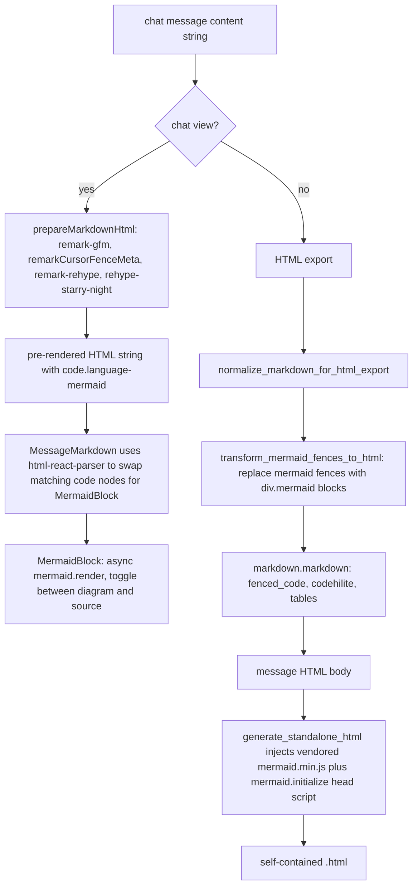

# Mermaid diagram rendering in the chat view and HTML export

## Goal and invariants

- Chat view (React): any fenced code block tagged with language `mermaid` renders as a diagram by default, with a small per-block toggle to flip between rendered diagram and raw source. Theme follows `ThemeModeContext` (dark/light) with zero extra fetches.
- HTML export: every exported `.html` is **self-contained** (matches the project's existing image-base64-inline philosophy — see [`.cursor/rules/image-attachments.mdc`](.cursor/rules/image-attachments.mdc)). We vendor `mermaid.min.js` in the repo and inline its bytes into each export, plus a one-line `mermaid.initialize(...)` tag; no network at view time.
- Markdown and JSON exports: leave `mermaid`-tagged fences untouched (GitHub / GitLab / VS Code already render them; converting would regress portability).
- Chat-index cache (`cursor_view/chat_index/`): **no changes**. We do not materialize rendered SVGs into `chat_message`, `chat_search_text`, or `chat_image`. Per [`image-attachments.mdc`](.cursor/rules/image-attachments.mdc) and [`sqlite-cursor-db.mdc`](.cursor/rules/sqlite-cursor-db.mdc), BLOBs live only in `chat_image` and rendered mermaid diagrams are not image attachments.

## Architecture



## Clarifying decisions already made

- **HTML export mode**: self-contained (inline vendored `mermaid.min.js`).
- **Chat view behavior**: render as diagram by default with a per-block toggle to source.

## Frontend (chat view)

### Dependencies

Add to [`frontend/package.json`](frontend/package.json):

- `mermaid` (latest v11.x) — UMD bundle for the exported HTML's `<script>` tag plus the ESM entry used by React.
- `html-react-parser` (latest v5.x) — so `MessageMarkdown` can convert the pre-rendered HTML string into a React tree and map `code.language-mermaid` nodes to a React component, instead of re-doing imperative DOM + `createRoot` dances inside a `useEffect`. Lightweight (~4 KB gzipped), widely maintained.

Install:

```bash
cd frontend
npm install mermaid html-react-parser
```

### New component: `frontend/src/components/MermaidBlock.js`

Single React component per file (per [`react-components.mdc`](.cursor/rules/react-components.mdc)). ~80–120 lines, well under the 250-line soft limit.

Responsibilities:

- Props: `{ source, colors, role }`.
- State: `mode` (`'diagram' | 'source'`), `svg` (rendered output), `renderError` (truthy if `mermaid.render` throws — we surface the error message and force source view).
- Effect: on mount / when `source` / `darkMode` change, call `mermaid.render(uniqueId, source)` (imported from `mermaid`). Uses the `latestRef` cancellation pattern from [`frontend-hooks.mdc`](.cursor/rules/frontend-hooks.mdc) so stale renders (theme flip mid-render) don't overwrite fresh state.
- UI: MUI `Box` with a small top-right toggle button (`<IconButton>` with `AccountTreeIcon` / `CodeIcon` from `@mui/icons-material`) that flips `mode`. Under the button: either `dangerouslySetInnerHTML={{__html: svg}}` (SVG is produced by mermaid itself from trusted authored content — no user-supplied HTML — and mermaid sanitizes via its own `securityLevel: 'strict'` config) or a `<pre><code>` showing the raw source.
- Error fallback: if `mermaid.render` rejects, render the raw source inside a `<pre>` with a small `<Typography variant="caption" color="error">` above it carrying the parser message, so bad diagrams degrade the same way Cursor does in-chat.
- Accessibility: wrapper `<Box role="img" aria-label="Mermaid diagram">` around the SVG; toggle button carries `aria-pressed`.

### New hook: `frontend/src/hooks/useMermaid.js`

Per [`frontend-hooks.mdc`](.cursor/rules/frontend-hooks.mdc), "one concern per hook": this hook owns mermaid singleton initialization only (not rendering state, not toggle state — those live in `MermaidBlock`).

- Reads `darkMode` from `ThemeModeContext`.
- In a `useEffect`, calls `mermaid.initialize({ startOnLoad: false, securityLevel: 'strict', theme: darkMode ? 'dark' : 'default' })` whenever `darkMode` flips. Returns nothing — it's a side-effect hook.
- Consumed once inside `MessageMarkdown` (or a higher ancestor) so theme changes re-initialize mermaid for all open `MermaidBlock` instances.

### Update: `frontend/src/components/MessageMarkdown.js`

Keep the component at one responsibility (render pre-rendered markdown with chat styling). Replace the single `dangerouslySetInnerHTML` branch with `html-react-parser`'s `parse(html, { replace })`:

```jsx
import parse from 'html-react-parser';
import MermaidBlock from './MermaidBlock';
import useMermaid from '../hooks/useMermaid';

function replace(node) {
  if (
    node.type === 'tag' &&
    node.name === 'code' &&
    node.attribs?.class?.split(/\s+/).includes('language-mermaid')
  ) {
    const source = node.children
      .filter((c) => c.type === 'text')
      .map((c) => c.data)
      .join('');
    return <MermaidBlock source={source} colors={colors} role={role} />;
  }
  return undefined;
}
```

Also strip the surrounding `<pre>` that remark-rehype puts around the code node (either unwrap by matching `pre > code.language-mermaid` in the replace callback, or let `MermaidBlock` return a block-level element and accept the harmless `<pre>` wrapper — prefer the former for clean styling).

This component stays well under the 250-line soft limit (currently ~60 lines; adds ~20).

### Update: `frontend/src/markdown/prepareMarkdownHtml.js`

**No change needed.** `remarkCursorFenceMeta` only rewrites `\d+:\d+:path` Cursor fence metadata; plain `mermaid` fences pass through untouched and land in the rehype tree as `code.language-mermaid`, which is exactly what our `html-react-parser` replacer keys on.

Document this invariant in a top-of-file comment in `remarkCursorFenceMeta.js` so a future refactor doesn't quietly absorb the mermaid lang tag.

### No change needed in `ChatDetail.js`

`ChatDetail.js` already calls `prepareMarkdownHtml(message.content)` and stores the result on `message.renderedContent`. The `html-react-parser` swap happens inside `MessageMarkdown`, so the upstream fetch + cancel flow (which correctly follows [`frontend-hooks.mdc`](.cursor/rules/frontend-hooks.mdc) cancellation discipline) stays intact.

## Backend (HTML export)

### Vendor mermaid

- New directory: `cursor_view/export/vendor/`
- New file: `cursor_view/export/vendor/mermaid.min.js` — the UMD browser build from `frontend/node_modules/mermaid/dist/mermaid.min.js` (after `npm install mermaid`). Commit this file to the repo.
- New file: `cursor_view/export/vendor/VERSION.txt` — records the exact mermaid version for reproducibility and supply-chain auditing.
- New file: `cursor_view/export/vendor/__init__.py` — empty; makes `vendor` importable as a package so the PyInstaller spec treats it uniformly.

Update procedure documented in the new rule and in README: bump `mermaid` in `frontend/package.json`, `npm install`, copy `dist/mermaid.min.js` into the vendor dir, update `VERSION.txt`.

### New module: `cursor_view/export/mermaid.py`

One-line module docstring + typed helpers per [`python-standards.mdc`](.cursor/rules/python-standards.mdc). Target length: ~80 lines, well under the 400-line soft limit. Functions kept under 100 lines per the same rule.

```python
"""Mermaid diagram rendering for the HTML export.

Chat-view rendering is implemented entirely in the React bundle (see
``frontend/src/components/MermaidBlock.js``). This module is only used
by ``cursor_view/export/html.py`` to (a) rewrite ``mermaid`` fenced-code
blocks into inline ``<div class=\"mermaid\">`` elements before
Python-Markdown sees them, and (b) return the vendored
``mermaid.min.js`` contents + an initializer ``<script>`` block for
inclusion in the exported HTML so every file is self-contained.
"""

import functools
import html
import re
from importlib import resources
from typing import Any

# Matches a fenced code block whose info string is exactly ``mermaid``
# (with optional trailing whitespace). Captures the body for escaping.
_MERMAID_FENCE_RE = re.compile(
    r"(?m)^```[ \t]*mermaid[ \t]*\n(.*?)\n```[ \t]*$",
    re.DOTALL,
)


def transform_mermaid_fences_to_html(markdown_content: str) -> str:
    """Replace mermaid fenced-code blocks with ``<div class="mermaid">`` HTML.

    Python-Markdown's ``fenced_code`` has no native mermaid support
    (Pygments falls back to ``TextLexer``), so we pre-empt it and hand
    the block to the browser as a raw HTML element. Markdown treats
    block-level raw HTML surrounded by blank lines as verbatim
    pass-through, so we add the blank lines explicitly.
    """
    def sub(match: re.Match[str]) -> str:
        body = html.escape(match.group(1))
        return f'\n\n<div class="mermaid">{body}</div>\n\n'
    return _MERMAID_FENCE_RE.sub(sub, markdown_content)


@functools.lru_cache(maxsize=1)
def load_vendored_mermaid_js() -> str:
    """Return the vendored ``mermaid.min.js`` contents, cached per process."""
    return (
        resources.files("cursor_view.export.vendor")
        .joinpath("mermaid.min.js")
        .read_text(encoding="utf-8")
    )


def build_mermaid_init_script(theme_mode: str) -> str:
    """Return an inline ``<script>`` that boots mermaid with the export theme."""
    theme = "dark" if theme_mode == "dark" else "default"
    return (
        '<script>mermaid.initialize({'
        'startOnLoad: true, '
        'securityLevel: "strict", '
        f'theme: "{theme}"'
        '});</script>'
    )
```

Notes:

- `html.escape` of the mermaid source protects against `<script>`-in-fence payloads: the browser will see escaped entities, mermaid's parser operates on the decoded text of the div.
- `securityLevel: "strict"` disables mermaid's HTML rendering inside diagrams (the most paranoid built-in setting), matching our "authored-content-but-still-belt-and-braces" posture.
- `functools.lru_cache` avoids re-reading the vendored JS for every message; matches the existing pattern `export/themes.py` uses for the palette dict.
- The module uses lazy `%s` logging nowhere (no logging added) — nothing here is hot enough to warrant logs; if we add any, it'll use `%s` per [`python-standards.mdc`](.cursor/rules/python-standards.mdc).

### Update: `cursor_view/export/html.py`

Two surgical additions; no existing byte-for-byte output changes for non-mermaid chats.

1. In `_build_messages_html`, immediately before the existing `markdown.markdown(...)` call, pipe the already-normalized content through `transform_mermaid_fences_to_html`:

```python
from cursor_view.export.mermaid import transform_mermaid_fences_to_html

normalized_content = normalize_markdown_for_html_export(content)
normalized_content = transform_mermaid_fences_to_html(normalized_content)
rendered_content = markdown.markdown(normalized_content, ...)
```

2. In `generate_standalone_html`, inject two script blocks before `</body>` (keeping CSS inside `<style>` unchanged):

```python
from cursor_view.export.mermaid import build_mermaid_init_script, load_vendored_mermaid_js

mermaid_lib = load_vendored_mermaid_js()
mermaid_init = build_mermaid_init_script(resolved_theme_mode)
# ... inserted right before </body> in the f-string
```

Added to the rendered HTML (simplified):

```html
    <div class="footer">...</div>
    <script>/* vendored mermaid.min.js contents */</script>
    <script>mermaid.initialize({startOnLoad: true, ...});</script>
  </body>
</html>
```

3. Add one CSS rule to `_HTML_STYLE_TEMPLATE` so unrendered / pre-boot mermaid source doesn't leak as a wall of monospace before mermaid runs:

```css
.message-content .mermaid {{
    text-align: center;
    margin: 1em 0;
}}
.message-content .mermaid:not([data-processed="true"]) {{
    visibility: hidden;
}}
```

(Mermaid sets `data-processed="true"` on diagrams it has rendered, so the hide-until-ready rule self-reverses without any extra JS.)

### PyInstaller spec update: [`cursor-view.spec`](cursor-view.spec)

Add the vendor dir to `datas` so the standalone binary can still read `mermaid.min.js` via `importlib.resources`:

```python
datas=[
    ('frontend/build', 'frontend/build'),
    ('cursor_view/export/vendor/mermaid.min.js', 'cursor_view/export/vendor'),
    ('cursor_view/export/vendor/VERSION.txt', 'cursor_view/export/vendor'),
],
```

### Markdown and JSON exports

No changes. [`cursor_view/export/markdown.py`](cursor_view/export/markdown.py) emits message content verbatim; `mermaid`-tagged fences render on any GitHub-flavored markdown viewer already. JSON export is the chat payload; same story.

## Tests

Stdlib `unittest` under [`tests/`](tests/) per [`project-layout.mdc`](.cursor/rules/project-layout.mdc). Running `python -m unittest discover -s tests` must stay green.

New file `tests/test_export_html_mermaid.py` with cases:

- `test_mermaid_fence_rewritten_to_div`: feeds a chat with one message whose content is a `mermaid`-tagged fence wrapping `flowchart TD\n A --> B` into `generate_standalone_html`. Asserts the output contains `<div class="mermaid">flowchart TD\n A --&gt; B</div>` and does **not** contain `<code class="language-mermaid">`.
- `test_mermaid_library_inlined`: asserts the rendered HTML contains a 1-KiB-or-larger `<script>` block (sentinel substring from the real `mermaid.min.js` header, e.g. `"mermaid"` plus a distinctive internal identifier) and an `mermaid.initialize({` call tag.
- `test_mermaid_fence_source_escaped`: feeds a mermaid fence whose body contains `A -->|"<b>foo</b>"| B` and asserts the `<` and `>` are entity-escaped inside the `.mermaid` div so mermaid's parser sees literal text.
- `test_non_mermaid_fences_untouched`: feeds a chat with a Python fenced block and asserts the output still contains `codehilite` / `language-python` classes (regression guard on the existing pipeline).
- `test_theme_selection`: `theme_mode="light"` produces `theme: "default"`; `theme_mode="dark"` produces `theme: "dark"`.

The incremental-refresh tests under `tests/test_chat_index_incremental.py` are unaffected — this change does not touch `cursor_view/chat_index/`, `cursor_view/cache/`, or `cursor_view/extraction/`.

## Rules updates

Rule drift is explicitly called out by [`comments-style.mdc`](.cursor/rules/comments-style.mdc) ("When a refactor materially changes a convention captured in any rule under `.cursor/rules/`, update that rule in the same PR"), so we update rules in the same change.

### New: `.cursor/rules/mermaid-rendering.mdc`

Globs: `cursor_view/export/**/*.py` and `frontend/src/**/*.{js,jsx}`. `alwaysApply: false`.

Content outline:

- **Two rendering pipelines, one source format.** Authors write `mermaid`-tagged fenced code blocks; the chat view renders them client-side via `MermaidBlock`; the HTML export pre-transforms them into `<div class="mermaid">` blocks and ships with a vendored `mermaid.min.js`. Never introduce a third path or a server-side SVG renderer without updating this rule.
- **BLOBs stay out of the cache.** Rendered mermaid SVGs are not attachments and must not land in `chat_image`, `chat_message`, `chat_search_text`, `chat_search_fts`, or any source-row hash input. Cross-references [`image-attachments.mdc`](.cursor/rules/image-attachments.mdc) and [`sqlite-cursor-db.mdc`](.cursor/rules/sqlite-cursor-db.mdc).
- **Theme sync.** `MermaidBlock` consumes `ThemeModeContext`; the export's mermaid initializer reads the same `theme_mode` that drives the CSS palette (`EXPORT_HTML_THEMES`). The mermaid theme must never be hard-coded.
- **Graceful source fallback.** A parse error surfaces as the raw fence, not a blank box. Don't silence errors (not a [`known-bugs.mdc`](.cursor/rules/known-bugs.mdc) `TODO(bug):`; this is deliberate degradation, parallel to image graceful skip).
- **Escape before inlining.** `transform_mermaid_fences_to_html` must `html.escape` the body before wrapping in `<div class="mermaid">`. Mermaid's own `securityLevel: "strict"` is belt-and-braces; the escape is the actual XSS boundary.
- **Markdown + JSON exports leave fences verbatim.** Raising a rendered SVG into those formats regresses portability.
- **Vendor update procedure.** Document the `npm install mermaid` → `cp dist/mermaid.min.js → cursor_view/export/vendor/` → bump `VERSION.txt` workflow. Call out that the frontend and export must track the same major version to avoid diagram-syntax drift between chat view and export.

### Update: [`.cursor/rules/project-layout.mdc`](.cursor/rules/project-layout.mdc)

- Add `cursor_view/export/vendor/` to the canonical subpackages list and explicitly allow it as the *only* place vendored third-party JS/CSS lives. This pre-empts a future contributor sprinkling `vendor/` dirs elsewhere.
- No change to the frontend structure rule (the new component lives under the existing `components/` slot; no new top-level `frontend/src/` folder).

### Update: [`.cursor/rules/react-components.mdc`](.cursor/rules/react-components.mdc)

Add a short "Third-party rendering libraries" clause:

- When integrating a library whose primary output is imperative DOM (mermaid, prism, monaco), isolate it behind a React component that owns the effect + cleanup (cancellation per [`frontend-hooks.mdc`](.cursor/rules/frontend-hooks.mdc)), and never call the library's `.initialize` / singleton setup inside a render function. `MermaidBlock` + `useMermaid` are the canonical example.

### Update: [`README.md`](README.md)

- Under **Project layout → Backend → Subpackages**, mention `export/vendor/` (stores `mermaid.min.js` for the self-contained HTML export).
- Under **Project layout → Frontend**, mention `components/MermaidBlock.js` and `hooks/useMermaid.js`.
- Under **Features**, add "Rendered mermaid diagrams in the chat view and HTML exports".
- Add a short "Updating vendored mermaid" subsection describing the `npm install mermaid` → copy → version-bump flow.

## Post-plan changes

After all 12 initial todos were completed and verified, a series of follow-on improvements were made in response to bugs and behavioral gaps discovered during testing. These are documented here in full detail because they touch the same files and invariants as the original plan and provide essential context for future work.

---

### Change 1: Eliminate the flash of raw mermaid source on page load (chat view)

**Problem.** When refreshing a chat page that contained mermaid diagrams, the raw mermaid source code was briefly visible before the diagrams rendered. This happened because `MermaidBlock` mounted with `svg === null`, painted the source `<pre>` on first frame, then called `mermaid.render` asynchronously in a `useEffect` — which fired after the browser had already painted.

**Root cause.** `prepareMarkdownHtml` is awaited before `setLoading(false)`, so code syntax highlighting (done by `rehype-starry-night` inside that pipeline) is already baked in at first paint. But mermaid rendering happened post-mount, adding an unavoidable flash.

**Fix.** Mermaid diagrams are now pre-rendered inside `ChatDetail`'s existing fetch effect, before `setLoading(false)` is called, so every diagram SVG is ready when the spinner disappears.

**Files changed.**

1. **New file: [`frontend/src/utils/prerenderMermaidDiagrams.js`](frontend/src/utils/prerenderMermaidDiagrams.js)**
   - Exports `async function prerenderMermaidDiagrams(html, darkMode)`.
   - Uses `DOMParser` to find all `pre > code.language-mermaid` nodes in the pre-rendered HTML string (mirroring `MessageMarkdown`'s `replaceNode` interceptor).
   - Calls `mermaid.initialize` once with the correct theme, then calls `mermaid.render` for each unique diagram source in parallel via `Promise.all`.
   - Returns a `Map<source, { svg: string|null, error: string|null }>` (the value type was later extended — see Change 2).
   - An empty `Map` is returned immediately when the HTML contains no mermaid nodes, so the overhead for diagram-free chats is negligible.

2. **[`frontend/src/components/chat-detail/ChatDetail.js`](frontend/src/components/chat-detail/ChatDetail.js)**
   - Imports `prerenderMermaidDiagrams` from `utils/prerenderMermaidDiagrams`.
   - Inside the `Promise.all` per-message mapping in the fetch effect, calls `await prerenderMermaidDiagrams(renderedContent, darkMode)` after `await prepareMarkdownHtml(message.content)`.
   - Stores the resulting `Map` as `mermaidSvgs` on each prepared message object.
   - `darkMode` is already in scope from `useContext(ThemeModeContext)`.

3. **[`frontend/src/components/chat-detail/MessageBubble.js`](frontend/src/components/chat-detail/MessageBubble.js)**
   - Passes `mermaidSvgs={message.mermaidSvgs}` as a new prop to `<MessageMarkdown>`.

4. **[`frontend/src/components/MessageMarkdown.js`](frontend/src/components/MessageMarkdown.js)**
   - Accepts new `mermaidSvgs` prop.
   - In `replaceNode`, looks up `mermaidSvgs.get(source)` and passes `initialSvg={prerender?.svg}` to `<MermaidBlock>`.

5. **[`frontend/src/components/MermaidBlock.js`](frontend/src/components/MermaidBlock.js)**
   - Accepts new `initialSvg` prop.
   - Initializes `svg` state with `useState(initialSvg ?? null)`, so `showDiagram` is `true` from the very first render when a pre-rendered SVG is available.
   - Adds `skipFirstRenderRef = useRef(Boolean(initialSvg))`. When `initialSvg` is provided, the first-mount `useEffect` run is skipped (the initial SVG is already correct for the current theme). Subsequent dependency changes (e.g. theme flip) still re-render via the effect.

---

### Change 2: Eliminate the mermaid bomb graphic flash for invalid diagrams (chat view)

**Problem.** For intentionally broken diagrams, there was a brief flash of the mermaid "Syntax error in text" bomb graphic (a large SVG injected directly into `document.body`) before the page fully loaded. This occurred because `prerenderMermaidDiagrams` was calling `mermaid.render` on invalid diagrams, which injects the bomb as a DOM side effect before rejecting the promise.

**Root cause.** `mermaid.render(id, invalidSource)` appends an error element to `document.body` as a side effect, regardless of whether the promise is caught. The original `catch` block in `prerenderMermaidDiagrams` swallowed the rejection but did not prevent the DOM injection.

**Fix.** `mermaid.parse(source)` is called first. It is a DOM-free syntax check that throws on invalid input without touching the document. `mermaid.render` is only called for diagrams that pass `mermaid.parse`. Pre-render results now carry both `svg` and `error` fields so `MermaidBlock` can start directly in the error state without ever calling `mermaid.render` for an invalid diagram.

**Files changed.**

1. **[`frontend/src/utils/prerenderMermaidDiagrams.js`](frontend/src/utils/prerenderMermaidDiagrams.js)**
   - Changed the `Map` value type from a bare SVG string to `{ svg: string|null, error: string|null }`.
   - For each diagram source, calls `await mermaid.parse(source)` first. On parse failure, stores `{ svg: null, error: parseErr.message }` and returns early — `mermaid.render` is never called.
   - On render success, stores `{ svg: renderedSvg, error: null }`.
   - On render failure (post-parse), stores `{ svg: null, error: renderErr.message }`.

2. **[`frontend/src/components/MessageMarkdown.js`](frontend/src/components/MessageMarkdown.js)**
   - Reads both `prerender?.svg` and `prerender?.error` from the map entry.
   - Passes `initialSvg={prerender?.svg ?? undefined}` and `initialError={prerender?.error ?? undefined}` to `<MermaidBlock>`.

3. **[`frontend/src/components/MermaidBlock.js`](frontend/src/components/MermaidBlock.js)**
   - Accepts new `initialError` prop.
   - Initializes `mode` state with `useState(initialError ? 'source' : 'diagram')` so error diagrams start locked in source view.
   - Initializes `renderError` state with `useState(initialError ?? null)`.
   - Extends `skipFirstRenderRef` to `useRef(Boolean(initialSvg) || Boolean(initialError))` so the first-mount render is skipped for both the success and error cases. `mermaid.render` is never called at any point in the component lifecycle for a pre-errored diagram. Subsequent theme-flip re-renders still proceed through the effect.

---

### Change 3: Fix scroll position not being restored on page refresh (chat view)

**Problem.** After Change 1, refreshing a chat page with mermaid diagrams caused the page to scroll back to the top, while chats without diagrams preserved the scroll position. Chats without diagrams were unaffected because the loading window was short enough that the browser's auto scroll restore fired after content was visible.

**Root cause.** `prerenderMermaidDiagrams` extended the time the spinner was visible. During this extended spinner phase the page DOM was very short. The browser's `history.scrollRestoration = 'auto'` fired its restore attempt during this window, found the page too short to reach the saved position, and clamped to 0. When content finally rendered there was no second restore attempt.

**Fix.** The browser's auto scroll restoration is disabled globally. `ChatDetail` owns manual scroll restoration via `sessionStorage` keyed by `sessionId`, restoring after content renders using `useLayoutEffect` (which fires before the browser's first paint of the new content, eliminating any flash at position 0).

**Files changed.**

1. **[`frontend/src/App.js`](frontend/src/App.js)**
   - Added `if ('scrollRestoration' in window.history) { window.history.scrollRestoration = 'manual'; }` at module scope (runs once when the JS bundle loads, before any component mounts).
   - `window.history` is used rather than bare `history` to satisfy CRA's `no-restricted-globals` ESLint rule.

2. **[`frontend/src/components/chat-detail/ChatDetail.js`](frontend/src/components/chat-detail/ChatDetail.js)**
   - Added `useLayoutEffect` to the React import.
   - Added a new `useLayoutEffect([loading, sessionId])` that:
     - Returns immediately while `loading` is `true` (fires only after the content DOM is committed).
     - Reads `Number(sessionStorage.getItem('scroll-chat-${sessionId}') ?? '0')` and calls `window.scrollTo(0, saved)` synchronously — `useLayoutEffect` fires after React commits the DOM but before the browser paints, so the scroll is set at the correct position on first paint with no visible flash.
     - Attaches a `scroll` event listener (passive, `{ passive: true }`) that debounce-saves `window.scrollY` to `sessionStorage` every 150 ms.
     - Cleans up the debounce timer and removes the scroll listener on unmount or when deps change.
   - Key is per-session (`scroll-chat-${sessionId}`): absent key defaults to 0 (first navigation scrolls to top), existing key restores saved position (refresh), different chat has independent key.

---

### Change 4: Match error handling between HTML export and chat view (HTML export)

**Problem.** Invalid mermaid diagrams in the HTML export displayed the mermaid library's own "Syntax error in text" bomb graphic (a large SVG with a bomb image). The chat view instead showed a styled red error message above the raw source code. The two paths were visually and behaviorally inconsistent.

**Root cause.** The original init script used `startOnLoad: true`, handing all diagram rendering to mermaid's auto-start logic. When mermaid encountered an invalid diagram it rendered its own error SVG — there was no hook to intercept this.

**Fix.** The init script was rewritten to use `startOnLoad: false` with a manual async rendering loop that calls `mermaid.parse` first (DOM-free), then `mermaid.render` only for valid diagrams. Invalid diagrams produce a styled `.mermaid-error` block matching the chat view's appearance.

**Files changed.**

1. **[`cursor_view/export/mermaid.py`](cursor_view/export/mermaid.py) — `build_mermaid_init_script`**
   - Changed from `startOnLoad: true` one-liner to a full async IIFE rendering loop.
   - The IIFE: iterates `document.querySelectorAll('.mermaid')`, reads `el.textContent` (browser decodes HTML entities, recovering the original mermaid source), calls `await mermaid.parse(src)`.
   - Parse failure path: sets `el.className = 'mermaid mermaid-error'`, writes `<p class="mermaid-error-msg">Mermaid parse error: ...</p><pre class="mermaid-error-src">...</pre>` into `el.innerHTML`, then `continue` — `mermaid.render` is never called, so the bomb graphic is never injected.
   - Parse success path: calls `await mermaid.render('mermaid-export-'+i, src)` and writes the resulting SVG into `el.innerHTML`.
   - A shared `_esc(s)` helper handles HTML escaping for error messages and source display.
   - A separate render-failure catch block also produces a `.mermaid-error` block for any error that slips past parse.
   - The docstring was updated to document the `mermaid.parse`-first invariant.

2. **[`cursor_view/export/html.py`](cursor_view/export/html.py) — `_HTML_STYLE_TEMPLATE`**
   - Removed the `.mermaid:not([data-processed="true"]) { visibility: hidden }` rule (it relied on mermaid's own `data-processed` attribute set by `startOnLoad` mode; the new manual loop doesn't use it).
   - Added `.message-content .mermaid-error` — red border (`1px solid #e57373`), rounded corners, padding, left-aligned text.
   - Added `.message-content .mermaid-error-msg` — red `#e57373` text, `0.85em` sans-serif.
   - Added `.message-content .mermaid-error-src` — monospace code block styled to match the regular `pre` rule (see Change 6 for CSS unification).

3. **[`tests/test_export_html_mermaid.py`](tests/test_export_html_mermaid.py)**
   - Updated `test_mermaid_library_inlined` assertion from `"startOnLoad: true"` to `"startOnLoad: false"`.
   - Updated `TestBuildMermaidInitScript.test_dark_theme` assertion from `"startOnLoad: true"` to `"startOnLoad: false"`.

---

### Change 5: Add diagram/source toggle to HTML export

**Problem.** The chat view allowed toggling between the rendered diagram and its raw source code. The HTML export had no such toggle — once a diagram rendered, the source was not accessible.

**Fix.** The successful render path in the init script was extended to produce a three-part structure inside the `.mermaid` div: a toggle button, a diagram wrapper div, and a hidden source `<pre>`. A click handler wired via an IIFE closure swaps their visibility. Error-state elements receive no toggle, matching `MermaidBlock`'s behavior of locking to source view on error.

**Files changed.**

1. **[`cursor_view/export/mermaid.py`](cursor_view/export/mermaid.py) — `build_mermaid_init_script`**
   - Added `_btn(label)` helper function that produces `<button class="mermaid-toggle" title="...">icon</button>`.
   - Successful render path now sets `el.innerHTML` to `_btn('View source') + '<div class="mermaid-diagram">' + res.svg + '</div>' + '<pre class="mermaid-source" style="display:none">' + _esc(src) + '</pre>'`.
   - Click handler (wrapped in an IIFE closure over `el` to avoid loop-variable capture): toggles `display` on `.mermaid-diagram` and `.mermaid-source`, updates `btn.title`.
   - Error path uses `continue` to skip `_btn()` — parse-error elements never receive a toggle button.

2. **[`cursor_view/export/html.py`](cursor_view/export/html.py) — `_HTML_STYLE_TEMPLATE`**
   - Added `position: relative` to the `.message-content .mermaid` rule (prerequisite for absolute-positioned toggle button).
   - Added `.message-content .mermaid-toggle` — `position: absolute`, top-right (4 px from each edge), no background or border, cursor pointer, `color: var(--text-secondary)`, `opacity: 0.6`, `line-height: 0`.
   - Added `.message-content .mermaid-toggle:hover` — `color: var(--link)`, `opacity: 1`.
   - Added `.message-content .mermaid-source` — monospace code block styled to match the regular `pre` rule (see Change 6 for CSS unification).

3. **[`tests/test_export_html_mermaid.py`](tests/test_export_html_mermaid.py)**
   - Added `test_toggle_infrastructure_present`: asserts CSS class names `mermaid-toggle`, `mermaid-diagram`, `mermaid-source`, and the string `"View source"` are present in the static HTML output. Also asserts `"continue;"` is present, proving the parse-error path skips the toggle and never adds one to invalid diagrams. (The actual toggle markup is injected at JavaScript runtime in the browser and cannot be verified from static Python output.)

---

### Change 6: Unify code block styling across all code block types (HTML export)

**Problem.** The mermaid source view (`<pre class="mermaid-source">`) and error source view (`<pre class="mermaid-error-src">`) did not match the visual styling of regular code blocks. In light mode the mismatch was pronounced because Pygments was injecting its own inline `background: #f8f8f8` on `.codehilite` divs, while the mermaid blocks used `var(--pre-bg)` (light blue in light mode, `#eef2ff`).

**Fix.** Three targeted CSS changes were made in [`cursor_view/export/html.py`](cursor_view/export/html.py) `_HTML_STYLE_TEMPLATE`:

1. **`.message-content .mermaid-source`** — changed from a transparent/no-border `<pre>` to match the regular `pre` rule: `background-color: var(--pre-bg)`, `border: 1px solid var(--pre-border)`, `border-radius: 5px`, `padding: 15px`, `font-size: 0.9em`, `overflow-x: auto`.

2. **`.message-content .mermaid-error-src`** — same changes as above (was using `background: transparent`, `border: none`, `padding: 0`, `font-size: 0.85em`). Also added `margin: 8px 0 0 0` to give separation from the error message paragraph above.

3. **`.message-content .codehilite`** — added `background-color: var(--pre-bg) !important`. This overrides the Pygments-generated inline `style="background: #f8f8f8"` (light mode) / `style="background: #202020"` (dark mode) that Pygments injects directly on the `.codehilite` div. With this rule all three code block types (regular codehilite blocks, mermaid source view, mermaid error source) use the same `var(--pre-bg)` themed background.

---

### Change 7: Remove toggle button from error-state diagrams in chat view

**Problem.** In the chat view, `MermaidBlock` displayed the toggle button even when `renderError !== null` (i.e., when a diagram had a parse or render error). In the error state there is no SVG to toggle to, so the button was non-functional. The HTML export's error path had already been written to omit the toggle for invalid diagrams, but the chat view was inconsistent.

**Fix.** One conditional wrapper added to `MermaidBlock`.

**Files changed.**

1. **[`frontend/src/components/MermaidBlock.js`](frontend/src/components/MermaidBlock.js)**
   - Wrapped the `<Tooltip><IconButton>...</IconButton></Tooltip>` block in `{renderError === null && (...)}`.
   - The toggle now renders only when there is a successfully rendered SVG. The error caption and source `<pre>` remain unconditionally rendered in the error state.

---

### Change 8: Add icon switching and correct "View diagram" icon to HTML export toggle

**Problem.** Two issues with the HTML export toggle button:

1. The icon never changed when clicked — it always showed the code icon (`</>`) regardless of whether the diagram or source was being shown.
2. The "View diagram" icon was a hand-drawn approximation (three circles connected by lines), not the actual Material Design `AccountTreeIcon` used by `MermaidBlock` in the chat view.

**Fix.** Two SVG variables are extracted to the IIFE outer scope and swapped on each click. The `_diagIcon` was updated to use the exact `AccountTreeIcon` SVG path.

**Files changed.**

1. **[`cursor_view/export/mermaid.py`](cursor_view/export/mermaid.py) — `build_mermaid_init_script`**
   - Added `var _codeIcon` — inline SVG with two angle-bracket `<polyline>` elements (stroke-based), identical to the code icon in the chat view. Shown when the diagram is visible.
   - Added `var _diagIcon` — inline SVG using the exact `AccountTreeIcon` path from `@mui/icons-material` (`M22 11V3h-7v3H9V3H2v8h7V8h2v10h4v3h7v-8h-7v3h-2V8h2v3z`) with `fill="currentColor"` (fill-based, matching MUI's icon rendering). Shown when source is visible.
   - Updated `_btn(label)` to reference `_codeIcon` instead of inlining the SVG string.
   - Added `btn.innerHTML = showingDiagram ? _diagIcon : _codeIcon` to the click handler so the icon swaps on every toggle alongside `btn.title`.

## Out of scope

- Server-side SVG rendering (rejected via the clarification question — "self-contained" option chosen).
- Replacing existing chat-view `dangerouslySetInnerHTML` usage outside `MessageMarkdown` (no callers).
- Changing the Markdown pipeline to also render `gantt`, `sequenceDiagram`, etc. as anything special — mermaid already covers all of them as long as the fence lang is `mermaid`.
- Chat-index schema changes: explicitly **zero** touches to `cursor_view/chat_index/*.py` or `cursor_view/cache/**/*.py`. The schema-drift tests (`tests/test_chat_index_incremental.py`) will prove this out via unchanged-fixture behavior.

## Step-by-step task list

1. `cd frontend && npm install mermaid html-react-parser`.
2. Commit the vendored `cursor_view/export/vendor/mermaid.min.js` (+ `__init__.py`, `VERSION.txt`).
3. Create `cursor_view/export/mermaid.py` (module + three helpers described above).
4. Edit `cursor_view/export/html.py` to (a) call `transform_mermaid_fences_to_html` inside `_build_messages_html`, (b) inject `load_vendored_mermaid_js()` + `build_mermaid_init_script(...)` before `</body>`, (c) add the two `.mermaid` CSS rules.
5. Create `frontend/src/components/MermaidBlock.js` and `frontend/src/hooks/useMermaid.js`.
6. Edit `frontend/src/components/MessageMarkdown.js` to swap `dangerouslySetInnerHTML` for `html-react-parser.parse(...)` with the mermaid-code replacer and call `useMermaid()`.
7. Update `cursor-view.spec` `datas=` entries.
8. Add `tests/test_export_html_mermaid.py` with the five cases above.
9. Add `.cursor/rules/mermaid-rendering.mdc`; update `.cursor/rules/project-layout.mdc` and `.cursor/rules/react-components.mdc`.
10. Update `README.md` per the Documentation sync clause of [`project-layout.mdc`](.cursor/rules/project-layout.mdc).
11. `cd frontend && npm run build` and `python -m unittest discover -s tests` to confirm green.