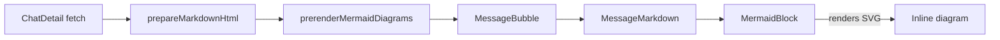
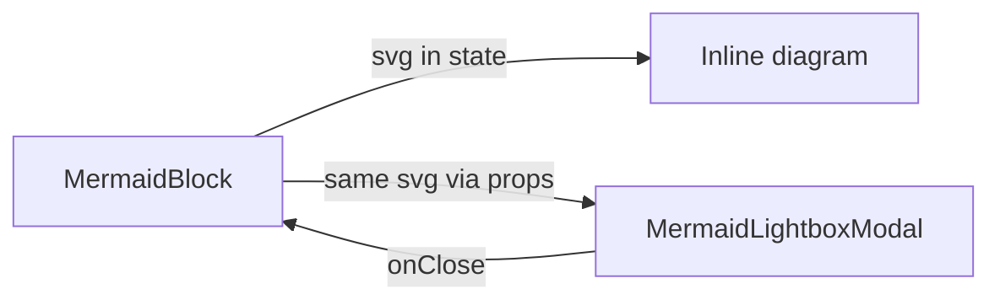

## Goal

Match the image-attachment modal experience for inline mermaid diagrams: clicking either the rendered diagram body **or** a new expand icon opens a full-size modal whose body shows the same diagram, with a close button, ESC / backdrop dismissal, and theme-aware styling. The modal does **not** include a source/diagram toggle (per the design choice) — toggling stays an inline-only affordance, matching the image-lightbox analog the user sketched.

## Architecture (chat view only)

The chat-view mermaid pipeline today is:

After this change, `MermaidBlock` gains a sibling modal that consumes the **same** rendered SVG it already holds in state — no new `mermaid.render` call, no new pipeline:

Because the SVG flows through `MermaidBlock`'s existing state, the theme-flip path that already regenerates the SVG (`useEffect([source, darkMode])`) automatically updates the modal too.

The HTML export pipeline (`cursor_view/export/mermaid.py` + vendored `mermaid.min.js`) is **untouched** — exported files have no React runtime to host a Dialog, so this matches the precedent set by `MessageImageGallery` for image attachments (HTML exports keep `<a target="_blank">` instead of a modal).

## Files

### New

- [`frontend/src/components/MermaidLightboxModal.js`](frontend/src/components/MermaidLightboxModal.js) — new sibling to `MermaidBlock.js`. Folder placement matches the existing `MermaidBlock.js` location (top-level `components/` rather than a feature folder); `MermaidBlock` is not under `components/<feature>/` today so the modal stays alongside it for proximity.

### Modified

- [`frontend/src/components/MermaidBlock.js`](frontend/src/components/MermaidBlock.js) — add expand affordance and modal wiring.
- [`.cursor/rules/mermaid-rendering.mdc`](.cursor/rules/mermaid-rendering.mdc) — note that the chat-view pipeline now has an inline + modal **presentation surface**, both fed by a single `mermaid.render` call per block. Cross-link `MermaidLightboxModal`. This is required by the `comments-style.mdc` "Rule drift" clause and `mermaid-rendering.mdc`'s own "never introduce a third without updating this rule" guard.
- [`.cursor/rules/react-components.mdc`](.cursor/rules/react-components.mdc) — under "Third-party imperative-DOM libraries", note that the modal **reuses the SVG from the parent block** and does not call `mermaid.render` itself, so the discipline ("library calls only inside effects of the owning component") is preserved.
- [`README.md`](README.md) — add a Features bullet for the mermaid modal mirroring the existing image-modal bullet at line 103.
- [`.github/CONTRIBUTING.md`](.github/CONTRIBUTING.md) — under `components/` (around line 367–370), list `MermaidLightboxModal.js` as the sibling that opens on diagram click, matching how `ImageLightboxModal` is described next to `MessageImageGallery`.

## Detailed implementation

### 1. `MermaidLightboxModal.js`

Mirror the structure of [`ImageLightboxModal.js`](frontend/src/components/chat-detail/ImageLightboxModal.js) so a future contributor sees the same shape across both features. Specifically:

- Props: `{ open, onClose, source, svg, renderError }`. (`source` is needed for the source-fallback path described below; `renderError` lets the modal mirror the inline parse-error caption rather than opening on a blank Paper.)
- MUI `Dialog` with the same viewport-fixed `PaperProps.sx` shape used by `ImageLightboxModal` (`width: '95vw', height: '95vh', maxWidth/maxHeight: 95vw/95vh, m: 0.5, bgcolor: 'background.paper', display: 'flex', flexDirection: 'column'`). All colors via theme tokens (no hard-coded hex), per `react-components.mdc` "Theme ownership".
- Toolbar row: just the close `IconButton` pinned right via `ml: 'auto'` (no counter / nav row — there's exactly one diagram per modal, no analog to multi-image navigation).
- Body row: `flex: 1`, centered, contains a `Box dangerouslySetInnerHTML={{ __html: svg }}` with the same `'& svg': { maxWidth: '100%', height: 'auto' }` discipline `MermaidBlock` already uses inline.
- If `renderError` is non-null **or** `svg` is null, render the same `<Typography color="error">Mermaid parse error: …</Typography>` plus a `<pre><code>{source}</code></pre>` fallback. This keeps the "graceful source fallback on parse error" invariant from `mermaid-rendering.mdc` consistent across surfaces.
- ESC / backdrop dismissal is free with MUI's `Dialog onClose`. Because there is no per-modal keyboard nav (no prev/next), no `useEffect`/`window.addEventListener('keydown', …)` is required — which is good, because the latest-id pattern from `frontend-hooks.mdc` is unnecessary.
- `aria-label="Mermaid diagram preview"` on the `Dialog`, `aria-label="Close"` on the close button, `role="img"` + `aria-label="Mermaid diagram"` on the SVG container (same as inline).

Why the SVG is passed as a prop rather than re-rendered inside the modal: `MermaidBlock` already owns the singleton config (`mermaid.initialize` immediately before each render) and the `latestRef` cancellation pattern. A second `mermaid.render` inside the modal would be redundant work, would re-introduce the bomb-graphic risk on a parse error (per the comment in `MermaidBlock.js` line 30–34), and would create a third pipeline that contradicts `mermaid-rendering.mdc`.

### 2. `MermaidBlock.js` changes

- Add `OpenInFullIcon` import from `@mui/icons-material/OpenInFull` and a default-imported `MermaidLightboxModal`.
- Add `const [modalOpen, setModalOpen] = useState(false);`.
- Wrap the open/close handlers in `useCallback`:
  - `const handleOpenModal = useCallback(() => setModalOpen(true), []);`
  - `const handleCloseModal = useCallback(() => setModalOpen(false), []);`
  Stable references satisfy `frontend-hooks.mdc` "Stable callback references" because these are passed to a child component that may register them in its own effects (today the modal does not have effects, but the rule is the canonical guard against future regressions).
- Render an additional `<IconButton aria-label="Open diagram in modal">` next to the existing diagram/source toggle (around lines 105–128). Show the expand button **only when** `mode === 'diagram'` and `renderError === null && svg !== null` — same gating as `showDiagram`. The two icons sit in a small flex row at `position: 'absolute'; top: 4; right: 4` so they don't overlap.
- Make the diagram body clickable too (per the user's "both" choice): the existing diagram `<Box role="img" …>` (lines 140–156) becomes `<Box component="button" type="button" onClick={handleOpenModal} aria-label="Open mermaid diagram in modal" sx={{ cursor: 'pointer', border: 'none', background: 'transparent', p: 0, …existing sx }}>`. Reset default `<button>` border/background so the visual is unchanged. Keep `role="img"` redundant with the button semantics — actually drop `role="img"` here because a `<button>` element shouldn't carry a conflicting role; the `aria-label` plus inner SVG carries the meaning.
- Render `<MermaidLightboxModal open={modalOpen} onClose={handleCloseModal} source={source} svg={svg} renderError={renderError} />` at the bottom of the returned tree (after the diagram/source surface, inside the same outer `<Box>`).

Edge cases the change must preserve:

- When `mode === 'source'`, the diagram body is not rendered at all (existing branch on line 157 renders the `<pre>` instead). The expand IconButton is hidden in this mode, matching the design choice "modal is diagram-only".
- When `renderError !== null`, the diagram body is not rendered (same `showDiagram` gate). No expand affordance, no modal — consistent with the inline error fallback.
- A theme flip while the modal is open must keep the modal's content current. Because `MermaidBlock`'s `useEffect([source, darkMode])` re-runs and updates `svg`, and the modal reads `svg` from props, this is automatic. Document this explicitly in a comment so a future contributor doesn't add a duplicate `useEffect(darkMode)` inside the modal.

### 3. Comments

All new comments must explain intent per [`comments-style.mdc`](. cursor/rules/comments-style.mdc). Concretely:

- The modal file's top-of-component comment explains **why** the SVG is a prop (single render, no bomb-graphic risk on parse error), why there is no keyboard-nav effect (single diagram per modal), and the parity with `ImageLightboxModal` (close button, viewport-fixed Paper, theme-token-only styling).
- The expand-button comment in `MermaidBlock.js` explains why the affordance is gated on `mode === 'diagram' && svg !== null && renderError === null` (modal is diagram-only by design; also avoids opening on a blank Paper).
- Do **not** add comments like "// open the modal" or "// close button" — narration of mechanics is forbidden. The example to follow is the existing `MermaidBlock.js` comment at lines 19–36.

### 4. Rule updates

#### `mermaid-rendering.mdc`

Under "Two rendering pipelines, one source format" (lines 7–26), append a sub-paragraph to the **Chat view** bullet:

> The chat-view pipeline has two **presentation surfaces** fed by a single `mermaid.render` per block: the inline `<MermaidBlock>` and an optional `<MermaidLightboxModal>` opened on click. The modal consumes the SVG already in `MermaidBlock`'s state and never calls `mermaid.render` itself. Adding a second `mermaid.render` for the modal would be a third pipeline and is forbidden.

Under "Graceful source fallback on parse error" (lines 47–52), append: "The lightbox modal mirrors this fallback (Typography error caption + raw `<pre><code>`) so the invariant holds across surfaces."

Under "Canonical examples" / closing list (the existing list of motivating sources), add `frontend/src/components/MermaidLightboxModal.js` as the modal counterpart.

#### `react-components.mdc`

Under "Third-party imperative-DOM libraries" (lines 111–133), add a paragraph after the `MermaidBlock` + `useMermaid` example:

> A sibling `<MermaidLightboxModal>` is allowed to **display** the SVG produced by `MermaidBlock`, but it must not call `mermaid.render`, `mermaid.parse`, or `mermaid.initialize` itself — those calls live exclusively inside `MermaidBlock`'s effect and `useMermaid`. This keeps "library calls only inside effects of the owning component" intact even when the same SVG is consumed by multiple presentation surfaces.

### 5. Documentation updates

#### `README.md`

After the existing line 102 mermaid bullet, modify it to:

> Render mermaid diagrams inline in the chat view (with a full-size modal on click) and in HTML exports

(or split into two bullets — pick whichever reads cleaner alongside line 103's image bullet, which is already two-clause).

#### `.github/CONTRIBUTING.md`

In the `components/` section (around line 367–370), update the `MermaidBlock.js` description to:

> `MermaidBlock.js` and `MermaidLightboxModal.js` &mdash; global UI for mermaid fenced code blocks. `MermaidBlock` renders the inline diagram (default) or raw source with a per-block toggle and a parse-error fallback; clicking the diagram body or the expand icon opens the sibling `MermaidLightboxModal`, which reuses the SVG already in `MermaidBlock`'s state and provides a viewport-sized close-only view (parity with `ImageLightboxModal`).

Also add a brief note at the end of the existing chat-detail bullet (around line 374–379) cross-referencing that `MermaidLightboxModal` follows the same modal pattern.

### 6. Testing

`tests/` is Python-only stdlib unittest (per `project-layout.mdc`). There are no frontend tests today; this change is JSX-only and does not touch `chat_index/`, the cache, or any code path covered by `tests/test_chat_index_incremental.py` and friends. **Run `python -m unittest discover -s tests` once at the end** to confirm the existing suite stays green (it should, since no Python files are touched), and **run `npm run build` inside `frontend/`** to confirm the bundle still builds.

Per the `project-layout.mdc` clause requiring chat-index regression tests for refresh-path changes, no new test is required here because this change does not touch the chat-index refresh path.

## Implementation order

The todos below mirror this order; each is small and reviewable in isolation.
