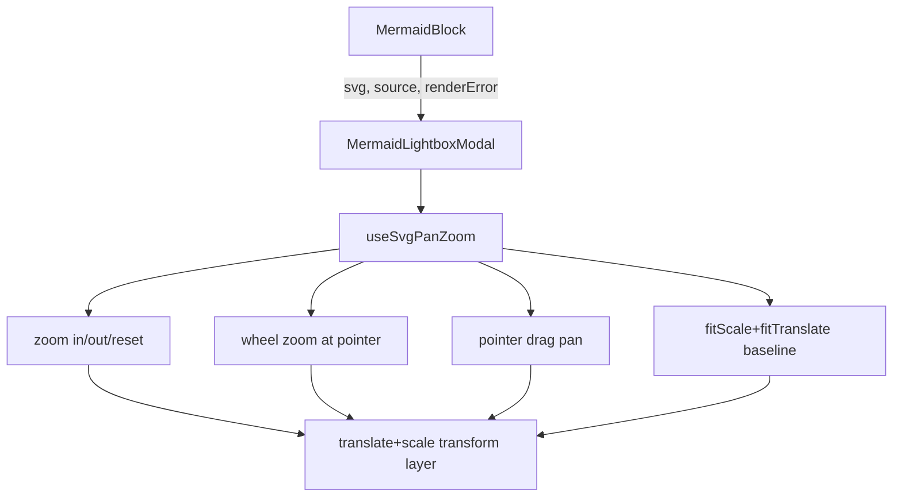

# Mermaid Modal Pan/Zoom Plan

## Objective

Upgrade the mermaid modal so users can:
- Drag to pan
- Wheel to zoom in/out
- Use explicit `Zoom in`, `Zoom out`, and `Reset` buttons

while keeping all current invariants:
- no second `mermaid.render` path,
- theme updates still come from `MermaidBlock` SVG regeneration,
- graceful error/source fallback remains intact.

## Current Architecture Constraints (must remain true)

- The modal in [frontend/src/components/MermaidLightboxModal.js](frontend/src/components/MermaidLightboxModal.js) receives `svg` from [frontend/src/components/MermaidBlock.js](frontend/src/components/MermaidBlock.js) and must stay display-only (no `mermaid.initialize` / `mermaid.parse` / `mermaid.render` in modal code).
- `MermaidBlock` remains the owner of parse-first render logic and theme-resync on `darkMode`.
- Existing rules in [.cursor/rules/mermaid-rendering.mdc](.cursor/rules/mermaid-rendering.mdc) and [.cursor/rules/react-components.mdc](.cursor/rules/react-components.mdc) already enforce that split; this feature should extend behavior by applying transforms to the injected SVG DOM, not by re-rendering diagrams.

## Implementation Design

### 1) Add a pan/zoom state model scoped to the modal

Implement transform state in the modal surface (or in a dedicated hook):
- `scale` (number)
- `translateX`, `translateY` (numbers in CSS px)
- drag refs/state (`isDragging`, `dragStartX`, `dragStartY`, last pointer position)
- `minScale`, `maxScale`, and `zoomStep` constants (e.g. 0.25, 6, 1.2)

Use one canonical `applyZoomAtPoint(targetScale, anchorX, anchorY)` helper so wheel + button zoom share identical math.

Anchor-preserving zoom math (to avoid chart jumping):
- `worldX = (anchorX - translateX) / scale`
- `worldY = (anchorY - translateY) / scale`
- `nextTranslateX = anchorX - worldX * nextScale`
- `nextTranslateY = anchorY - worldY * nextScale`

### 2) Keep an explicit “fit-to-viewport baseline” and reset behavior

On modal open and whenever `svg` content changes:
- Measure viewport container dimensions.
- Read intrinsic SVG size from `viewBox` (fallback to rendered `getBoundingClientRect` if missing).
- Compute `fitScale = min(viewportW / svgW, viewportH / svgH)`.
- Center using `fitTranslateX`, `fitTranslateY`.
- Store these as baseline values and set current transform to baseline.

`Reset` button restores this baseline exactly.

This preserves your latest behavior (“fit in view, no scrollbars”) while allowing interaction afterward.

### 3) Wire interactions in modal diagram branch only

In [frontend/src/components/MermaidLightboxModal.js](frontend/src/components/MermaidLightboxModal.js):
- Add a dedicated viewport wrapper (`overflow: hidden`) and a child transform layer containing the injected SVG.
- Apply transform on the wrapper/layer with `transform: translate(...) scale(...)`.
- Use `transformOrigin: '0 0'` for predictable coordinate math.
- Attach handlers only when `hasDiagram` is true:
  - `onPointerDown` / `onPointerMove` / `onPointerUp` / `onPointerLeave` for pan
  - `onWheel` for zoom
- Call `event.preventDefault()` on wheel to prevent page/dialog scroll chaining.
- Keep the current fallback branch (error caption + source code) untouched and non-interactive.

### 4) Add toolbar zoom controls in modal

Extend the existing modal toolbar row (currently close-only):
- `Zoom out` icon button
- `Reset view` icon button
- `Zoom in` icon button
- existing `Close`

Behavior:
- Button zoom should anchor around viewport center.
- Disable zoom-in at `maxScale`, zoom-out at `minScale`.
- Keep all controls in the toolbar row (no overlays on top of SVG), matching existing modal UX comments.

### 5) Extract logic to keep component size under rule threshold

Because [frontend/src/components/MermaidLightboxModal.js](frontend/src/components/MermaidLightboxModal.js) is already near the soft limit, proactively decompose:
- Add hook: [frontend/src/hooks/useSvgPanZoom.js](frontend/src/hooks/useSvgPanZoom.js)
  - Owns transform state + math + pointer/wheel handlers + fit/reset
  - Returns a narrow API (state + handler callbacks + control actions)
- Optional presentational control component if needed: [frontend/src/components/MermaidZoomControls.js](frontend/src/components/MermaidZoomControls.js)

This keeps `MermaidLightboxModal` focused on rendering/layout and aligns with `react-components.mdc` + `frontend-hooks.mdc`.

### 6) Preserve existing invariants in `MermaidBlock`

Minimal/no changes expected in [frontend/src/components/MermaidBlock.js](frontend/src/components/MermaidBlock.js):
- Continue passing `svg`, `source`, `renderError`, `open`, `onClose` into modal.
- Keep current auto-close-on-error effect.
- Keep current open affordances (diagram click + expand button).

No modal pan/zoom state should leak upward into `MermaidBlock`.

## Data Flow After Change

## File-by-File Plan

- [frontend/src/components/MermaidLightboxModal.js](frontend/src/components/MermaidLightboxModal.js)
  - Add interactive viewport + transform layer.
  - Integrate hook outputs/handlers.
  - Add zoom/reset buttons in toolbar.
  - Keep fallback branch unchanged.
- [frontend/src/hooks/useSvgPanZoom.js](frontend/src/hooks/useSvgPanZoom.js) (new)
  - Implement fit/zoom/pan math and reset.
  - Handle `open` + `svg` change reinitialization.
- [frontend/src/components/MermaidZoomControls.js](frontend/src/components/MermaidZoomControls.js) (optional new; create only if modal approaches size limit again)
  - Render toolbar controls + disabled states.
- [frontend/src/components/MermaidBlock.js](frontend/src/components/MermaidBlock.js)
  - Only prop pass-through adjustments if needed (likely none).
- [.cursor/rules/mermaid-rendering.mdc](.cursor/rules/mermaid-rendering.mdc)
  - Document pan/zoom/reset as modal presentation behavior over prop-fed SVG.
  - Re-state prohibition on calling `mermaid.*` in modal.
- [.cursor/rules/react-components.mdc](.cursor/rules/react-components.mdc)
  - Add/adjust canonical note if new hook/component extraction is introduced.
- [README.md](README.md)
  - Update feature bullet to include pan/zoom/reset controls in modal.
- [.github/CONTRIBUTING.md](.github/CONTRIBUTING.md)
  - Update frontend component descriptions (modal toolbar now includes zoom controls; mention hook if added).

## Verification Strategy

### Functional QA

- Open modal from diagram click and from expand icon.
- Drag pans chart smoothly.
- Wheel zoom scales around cursor location.
- Buttons zoom in/out around center and clamp at min/max.
- Reset returns to exact fit+center baseline.
- Close/reopen returns to baseline.
- Theme flip while modal open keeps diagram visible and interactions functional.
- Error diagram path still shows error + source (no controls crash/overlay issues).

### Regression QA

- No modal background box reintroduced behind SVG.
- Tall diagrams remain fully fit initially.
- Toolbar clicks do not trigger unintended modal-level drag state.
- No text-selection regression in inline diagram surface in `MermaidBlock`.

### Build/Test

- Run `npm run build` in `frontend`.
- Run `python -m unittest discover -s tests` at repo root.

## Rule-Compliance Checklist (explicit gate before merge)

- Re-read and validate against:
  - [.cursor/rules/mermaid-rendering.mdc](.cursor/rules/mermaid-rendering.mdc)
  - [.cursor/rules/react-components.mdc](.cursor/rules/react-components.mdc)
  - [.cursor/rules/frontend-hooks.mdc](.cursor/rules/frontend-hooks.mdc)
  - [.cursor/rules/comments-style.mdc](.cursor/rules/comments-style.mdc)
  - [.cursor/rules/project-layout.mdc](.cursor/rules/project-layout.mdc)
  - [.cursor/rules/known-bugs.mdc](.cursor/rules/known-bugs.mdc)
- If any conventions changed materially, update rules in same change (avoid rule drift).
- Ensure no generated artifacts are committed (`frontend/build`, `node_modules`).

## Final Safety Pass

After implementation and tests, perform one final targeted bug sweep of touched frontend files for:
- pointer-capture edge cases (mouse-up outside viewport),
- stale transform state after `svg` swap,
- scroll/zoom event leakage to dialog/page,
- accessibility labels and disabled states,
- any suspicious out-of-scope defects (add `# TODO(bug):` marker only where required by rule policy).