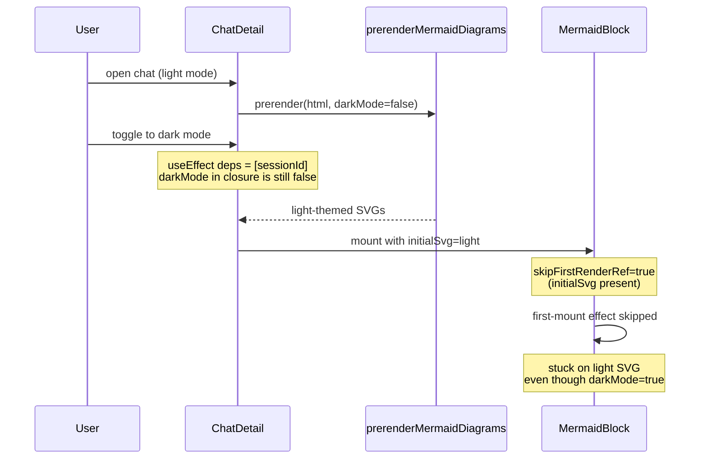

# Fix mermaid prerender theme staleness on theme-toggle-during-load

## Symptom

When the user opens a chat and toggles dark/light mode while the chat is still loading, valid mermaid diagrams render with the *previous* theme on first paint and stay that way until something else (another theme toggle, a navigation, etc.) re-runs the per-block render effect. The bombs-on-toggle bug fixed in the previous change is unrelated; this is the residual finding 1 from that change's final review.

The race window is narrow (only the chat-detail loading window, typically <1 s) and the visible artifact is purely cosmetic (wrong-color SVG, not broken behavior). It still violates the implicit invariant that "valid diagrams render with the current theme on first paint", and the fix is small and self-contained.

## Root cause

[`frontend/src/components/chat-detail/ChatDetail.js`](frontend/src/components/chat-detail/ChatDetail.js)'s fetch effect declares `[sessionId]` as its only dep, but the body reads `darkMode` out of the React closure at call time:

```43:93:frontend/src/components/chat-detail/ChatDetail.js
  useEffect(() => {
    let cancelled = false;
    setLoading(true);
    setError(null);
    axios
      .get(`/api/chat/${sessionId}`)
      .then(async (response) => {
        ...
        const preparedMessages = await Promise.all(
          rawMessages.map(async (message) => {
            ...
            const renderedContent = await prepareMarkdownHtml(message.content);
            const mermaidSvgs = await prerenderMermaidDiagrams(renderedContent, darkMode);
            return { ...message, renderedContent, mermaidSvgs, images };
          }),
        );
        ...
        startTransition(() => {
          setChat({ ...fetchedChat, messages: preparedMessages });
          setLoading(false);
        });
      })
      ...
  }, [sessionId]);
```

If the user toggles theme between the effect firing and `setLoading(false)`, the closed-over `darkMode` is the *original* value, so [`frontend/src/utils/prerenderMermaidDiagrams.js`](frontend/src/utils/prerenderMermaidDiagrams.js) produces SVGs themed for that original value. On first commit, [`frontend/src/components/MermaidBlock.js`](frontend/src/components/MermaidBlock.js)'s `skipFirstRenderRef` (currently keyed only on whether `initialSvg` / `initialError` are truthy) fires and short-circuits the very first-mount effect that would otherwise re-render the SVG with the *current* theme. Result: the wrong-theme SVG persists until the next dep change on the per-block effect.



## Fix

The two obvious React-idiomatic fixes both have UX problems:

- Adding `darkMode` to the fetch effect's deps refetches the chat over the network on every theme toggle, which causes a loading-spinner flash on a context-only change. Bad UX.
- Splitting the effect into a fetch-only effect and a prerender-only effect keyed on `[rawChat, darkMode]` re-runs the prerender on every post-mount theme flip even though `MermaidBlock`'s own `[source, darkMode]` effect already re-renders on darkMode change. Wasted work, more state, and an extra commit cycle for every theme toggle.

The smallest correct fix lives one layer down: tag every prerender result with the `darkMode` value it was rendered against, and let `MermaidBlock` decide whether the cached SVG is still authoritative for the current theme. The existing parse-first invariant from the previous change already established this kind of "don't skip when we'd render the wrong thing" discipline; this is a strict generalisation of it from "wrong because the source is invalid" to "wrong because the theme has shifted".

### Behaviour after the fix

- Theme matches between prerender and mount → `skipFirstRenderRef` fires exactly as today; no flash, no rework. Common case stays fast.
- Theme mismatched (toggle during load) → `skipFirstRenderRef` does *not* fire; the per-block effect runs once on mount and re-renders with the current theme. There is a sub-frame window where the wrong-theme SVG is visible before the async render completes, but this is strictly better than the current behavior (wrong theme stays forever) and is unavoidable without doing two prerender passes.
- `initialError` set → `skipFirstRenderRef` always fires regardless of theme, because parse failure is theme-independent (the error is just a string and the source-fallback UI is the same in both themes). This preserves the parse-first invariant from the previous change.
- No prerender data at all → unchanged; per-block effect runs on first mount.

### Implementation steps

The diff is small and confined to four files. The propagation path `ChatDetail` → `MessageBubble` → `MessageMarkdown` → `MermaidBlock` only carries the prerender Map opaquely except at the two endpoints (Map producer and Map consumer), so `MessageBubble` does not need to change.

1. **[`frontend/src/utils/prerenderMermaidDiagrams.js`](frontend/src/utils/prerenderMermaidDiagrams.js)** — extend each Map entry from `{ svg, error }` to `{ svg, error, darkMode }`. Set `darkMode` to the value passed into the function so each entry carries the theme it was rendered against. Update the top-of-file comment to document the new field as part of the entry shape and explain why it exists (so consumers can detect a theme shift between prerender and mount and decide whether to re-render). The function signature is unchanged; only the value shape grows.

2. **[`frontend/src/components/MessageMarkdown.js`](frontend/src/components/MessageMarkdown.js)** — extend the existing `replaceNode` interceptor at lines 48-67 so it forwards `initialDarkMode={prerender?.darkMode}` alongside the existing `initialSvg` / `initialError` props. No comment changes required; the existing block comment about replacing `<pre><code class="language-mermaid">` nodes stays accurate.

3. **[`frontend/src/components/MermaidBlock.js`](frontend/src/components/MermaidBlock.js)** —
   - Add `initialDarkMode` to the destructured props on line 42.
   - Change the `skipFirstRenderRef` initializer on line 52 from `useRef(Boolean(initialSvg) || Boolean(initialError))` to `useRef(Boolean(initialError) || (Boolean(initialSvg) && initialDarkMode === darkMode))`. The boolean expression encodes the three behavior rules above: errors always skip, SVGs only skip on theme match, and the no-prerender case (where `initialDarkMode` is `undefined`) cleanly degrades to "don't skip" because `undefined === false` and `undefined === true` are both false.
   - Update the top-of-file comment block (lines 36-41 — the `initialSvg` / `initialError` paragraph touched in the previous change) to mention `initialDarkMode` explicitly: explain that `skipFirstRenderRef` requires the prerender's theme to match the current `darkMode` so a theme toggle during loading triggers a corrective re-render on first mount instead of leaving the wrong-theme SVG visible. Cross-reference the new section in `mermaid-rendering.mdc` (see step 4). Per [`.cursor/rules/comments-style.mdc`](.cursor/rules/comments-style.mdc) the comment must explain *intent* (which invariant the new condition enforces) rather than narrate the boolean expression.
   - Tighten the inline comment on lines 50-51 (`Skip the redundant first-mount render when prerenderMermaidDiagrams already produced a usable result (svg or error) for this source.`) so it reflects that the SVG arm is also gated on theme match.

4. **[`.cursor/rules/mermaid-rendering.mdc`](.cursor/rules/mermaid-rendering.mdc)** —
   - Extend the "Parse before render" section (or add a new sibling section, "Theme-tagged prerender entries", whichever reads cleaner; the parse-before-render section is the closer logical neighbor because both rules govern when `MermaidBlock` is allowed to skip a render). The new text must specify: each prerender Map entry carries the `darkMode` it was rendered with; `MermaidBlock`'s `skipFirstRenderRef` skips only when the entry is an error (theme-independent) or when the entry's `darkMode` matches the current `darkMode`; this exists to close the chat-detail prerender-vs-toggle race documented in [`known-bugs.mdc`](.cursor/rules/known-bugs.mdc).
   - Skim the "Two rendering pipelines, one source format" overview at the top to confirm it still reads correctly. The current text says `MermaidBlock` owns the parse-then-render sequence; that stays accurate. No edit expected unless the overview drifts.

5. **[`.cursor/rules/known-bugs.mdc`](.cursor/rules/known-bugs.mdc)** — add a fifth retired-example bullet citing the prerender theme-staleness fix in the same shape as the four existing entries (lead phrase + `file::location` + parenthetical with symptom, mechanism, fix, regression-pinning posture). Bump the count line from "Four retired examples" to "Five retired examples". Honestly state that there is no automated regression test (frontend has no JS test harness) and that the invariant is enforced by the cross-referenced `mermaid-rendering.mdc` section plus manual verification.

### Why not other approaches

- **Add `darkMode` to ChatDetail's deps**: refetch on every theme toggle while on a chat-detail page; loading-spinner flash; bad UX; also resets the scroll-restore work in [`useLayoutEffect`](frontend/src/components/chat-detail/ChatDetail.js) at lines 106-129.
- **Split into fetch + prerender effects with `[rawChat, darkMode]` on the prerender effect**: cleaner architecture but redundant prerender work on every post-mount theme flip (because `MermaidBlock`'s `[source, darkMode]` effect already handles this). Adds a `chat == null` guard and an extra state slice. Bigger surface area for the same observable behavior.
- **Use a `darkModeRef` populated each render**: closes most of the window (the prerender call reads the latest `darkMode` at the moment of the call) but not all of it (the user can toggle between the prerender call and `setLoading(false)`). The Map-tagged-with-theme approach closes the entire window without the `darkModeRef` complication.
- **Pre-render both themes eagerly**: doubles the prerender cost in the common case to fix a rare race. Wrong trade-off.

### Rule-drift audit

- [`.cursor/rules/comments-style.mdc`](.cursor/rules/comments-style.mdc) — the comment edits in `MermaidBlock.js` and `prerenderMermaidDiagrams.js` must follow the intent-only discipline. No update needed; the rule is being followed, not changed.
- [`.cursor/rules/frontend-hooks.mdc`](.cursor/rules/frontend-hooks.mdc) — `MermaidBlock`'s `latestRef` discipline is unchanged. The new boolean condition is synchronous; it does not introduce a new `await` boundary. No update needed.
- [`.cursor/rules/react-components.mdc`](.cursor/rules/react-components.mdc) — the "Third-party imperative-DOM libraries" canonical example bullet was updated in the previous change to describe `MermaidBlock` as owning "the per-block async `mermaid.parse` + `mermaid.render` sequence". That description stays accurate; the `skipFirstRenderRef` behaviour change is a refinement, not a re-architecture. No update unless the audit step finds a contradiction.
- [`.cursor/rules/project-layout.mdc`](.cursor/rules/project-layout.mdc) "Documentation sync" — fix doesn't alter repo layout, doesn't affect user-facing setup, binary usage, or features. The single mermaid bullet in [`README.md`](README.md) (line 102) and the `MermaidBlock` paragraph in [`.github/CONTRIBUTING.md`](.github/CONTRIBUTING.md) (lines 376-378, "with a per-block toggle and a parse-error fallback") stay accurate. No edits expected; the verify-docs todo records this finding explicitly.
- The four backend-focused rules (`chat-index-refresh.mdc`, `image-attachments.mdc`, `python-standards.mdc`, `sqlite-cursor-db.mdc`) are unrelated. No update.

### Tests

The repo's test suite is Python-only (`tests/` + stdlib `unittest`, per [`.cursor/rules/project-layout.mdc`](.cursor/rules/project-layout.mdc)). Standing up a JS test runner is out of scope. Verification will be manual:

- Open a chat that contains a valid mermaid diagram. Before the loading spinner disappears, toggle theme. Confirm the diagram renders with the *new* theme on first paint (allowing for a sub-frame async-render window).
- Repeat with a chat that contains an invalid mermaid diagram. Confirm the error caption + source fallback still display correctly and that no orphaned bomb SVG accumulates at the page bottom (regression coverage for the previous change).
- Open a chat without toggling during load; confirm no flash and the diagram renders with the current theme on first paint (no behavioral regression for the common case).

## Out of scope

- Adding a frontend JS test harness.
- Changing the prerender's invocation site in `ChatDetail`'s fetch effect (the closure stays as-is — the fix lives in the consumer, not the producer).
- Touching the HTML export's mermaid pipeline; this race only exists in the chat view.
- Pre-rendering both themes eagerly to eliminate the sub-frame async-render window.