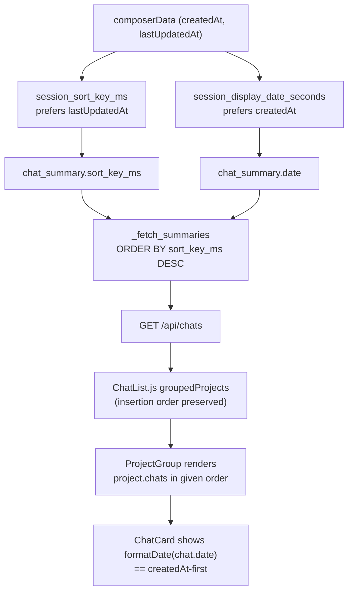
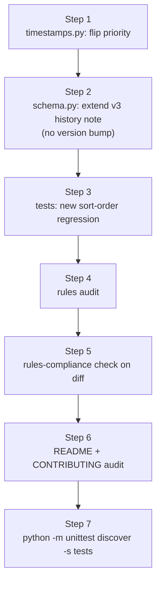

# Sort project chats by creation timestamp

## How chats are currently sorted (deep dive)

The chat-list page does **not** do its own sort. The order you see on screen is exactly what the backend returns from `GET /api/chats`. Tracing the full path:

### 1. Backend computes two timestamps from the same Cursor session, in opposite priority orders

[`cursor_view/timestamps.py`](cursor_view/timestamps.py) defines two helpers that read the same two fields off `composerData` but in deliberately swapped priority:

```49:68:cursor_view/timestamps.py
def session_sort_key_ms(session: dict) -> int:
    """Recency sort: lastUpdatedAt, then createdAt (same fields as display fallback order)."""
    if not isinstance(session, dict):
        return 0
    lu = parse_cursor_timestamp_to_ms(session.get("lastUpdatedAt"))
    if lu is not None:
        return lu
    cr = parse_cursor_timestamp_to_ms(session.get("createdAt"))
    return cr if cr is not None else 0


def session_display_date_seconds(session: dict) -> int | None:
    """Unix seconds for UI: prefer createdAt, then lastUpdatedAt."""
    if not isinstance(session, dict):
        return None
    for key in ("createdAt", "lastUpdatedAt"):
        ms = parse_cursor_timestamp_to_ms(session.get(key))
        if ms is not None:
            return ms // 1000
    return None
```

- `session_sort_key_ms` — used to **sort** the list. Prefers `lastUpdatedAt`, falls back to `createdAt`.
- `session_display_date_seconds` — used to compute the **shown** date on the card. Prefers `createdAt`, falls back to `lastUpdatedAt`.

Notice the priority order is opposite. That is the root cause of the symptom in the screenshot.

### 2. Both values are persisted into `chat_summary` at insert time

[`cursor_view/chat_index/rows.py`](cursor_view/chat_index/rows.py) writes both values into the cache:

- `sort_key_ms` (line 139, 151, 164) — column declared `sort_key_ms INTEGER NOT NULL` in [`cursor_view/chat_index/schema.py`](cursor_view/chat_index/schema.py) line 84.
- `date` (line 159) — populated from `formatted.get("date")` which `cursor_view/chat_format.py::format_chat_for_frontend` line 137 derives from `session_display_date_seconds`.

There is also an index `idx_chat_summary_sort` on `(sort_key_ms DESC, session_id)` ([`cursor_view/chat_index/schema.py`](cursor_view/chat_index/schema.py) lines 167–168) that backs the ordering query.

### 3. The API sorts globally by `sort_key_ms DESC`

[`cursor_view/chat_index/rows.py::_fetch_summaries`](cursor_view/chat_index/rows.py) line 387 uses `ORDER BY sort_key_ms DESC, session_id ASC` for the empty-query path; the FTS and LIKE branches both append the same secondary key. There is no per-project sort — the backend returns one flat, globally-sorted list.

### 4. The frontend groups but never re-sorts

[`frontend/src/components/chat-list/ChatList.js`](frontend/src/components/chat-list/ChatList.js) lines 52–75 walks `chatData.items` linearly and pushes each chat into a `Map` bucket keyed by `(project name, project rootPath)`. Insertion order is preserved, so each project bucket inherits the API's global `sort_key_ms DESC` order as a contiguous subsequence. Then [`frontend/src/components/chat-list/ProjectGroup.js`](frontend/src/components/chat-list/ProjectGroup.js) line 124 renders `project.chats.map(...)` in that order. `ChatCard` displays `formatDate(chat.date)` ([`frontend/src/components/chat-list/ChatCard.js`](frontend/src/components/chat-list/ChatCard.js) line 33) — i.e., the `createdAt`-preferred display value.

### 5. Why the cards look out of order

Cursor bumps `composerData.lastUpdatedAt` whenever a composer is touched, including navigation-only writes (called out in [`.cursor/rules/sqlite-cursor-db.mdc`](.cursor/rules/sqlite-cursor-db.mdc) "Invalidation: hash rows, don't stat files"). `createdAt` is fixed at composer creation. So a chat created 1/8/2026 but last revisited yesterday sorts ahead of one created 3/4/2026 that nobody touched since — but the card shows "1/8/2026" because the displayed date is `createdAt`. The user sees the card date, not the hidden sort key, so the order looks scrambled. Exactly the screenshot.

### Sort flow today



The two timestamp lanes meet at the cache and never reconcile: persisted order uses `lastUpdatedAt`, displayed order uses `createdAt`.

## Fix shape

Collapse the divergence in the backend so the persisted `sort_key_ms` is computed from the same priority chain as the displayed `date`. That is a single-source-of-truth change with no frontend work, no per-render sort cost, and matches the user's mental model: "the date I see is the date you sort by."

The alternative (keeping the backend as-is and re-sorting on the frontend by `chat.date` DESC inside `ChatList.js`'s `useMemo`) was considered and rejected: it duplicates ordering logic across two layers, drops to second-precision (`session_display_date_seconds` returns `ms // 1000`, so same-second ties go to `Map`-insertion order, which is itself `lastUpdatedAt` order — i.e. the bug peeks through on the boundary), and forces every future caller of `/api/chats` to know it must re-sort.

### Key change

Flip [`cursor_view/timestamps.py::session_sort_key_ms`](cursor_view/timestamps.py) to `createdAt`-first, `lastUpdatedAt`-fallback. The two helpers then share a single canonical priority order — `createdAt` is the canonical chat timestamp, `lastUpdatedAt` is the same fallback for both.

### Cache invalidation — explicitly *not* a schema bump

Existing `chat_summary.sort_key_ms` rows on disk were computed under the old rule. The chat-index has the row-shape-vs-row-content distinction codified in [`.cursor/rules/chat-index-refresh.mdc`](.cursor/rules/chat-index-refresh.mdc) and [`.cursor/rules/sqlite-cursor-db.mdc`](.cursor/rules/sqlite-cursor-db.mdc) "Cache tables". Strictly speaking the column shape did not change — but the **values** in that column will be wrong on every existing cache until something forces a recompute.

In the general case the lever for that would be `INDEX_SCHEMA_VERSION` in [`cursor_view/chat_index/schema.py`](cursor_view/chat_index/schema.py). For this change, however, the schema version **stays at 3**: per the user, schema v3 has not yet been released publicly, so the only caches that hold stale `sort_key_ms` values live on developer machines, not on end-user installs. That is exactly the carve-out the v2 entry of the existing `History:` block already documents (lines 36–50 of [`cursor_view/chat_index/schema.py`](cursor_view/chat_index/schema.py)):

> The later bubble-ordering fix (extraction now sorts bubbles by `composerData.fullConversationHeadersOnly` instead of the alphabetical bubbleId order cursorDiskKV returned) did NOT bump the version: the scrambled caches never shipped to users, so there is no on-first-launch rebuild to force. Developers with a stale local cache can delete `chat-index.sqlite3` or hit the UI's Refresh button to regenerate it.

We follow the same pattern. Two escape hatches are available to developers running against an unreleased v3 cache:

- **UI Refresh button** — calls `force=True` against `ChatIndex.ensure_current`, which routes to the synchronous-rebuild branch ([`cursor_view/chat_index/index.py`](cursor_view/chat_index/index.py) lines 170–173). The rebuild calls `_insert_chat` for every composer, which recomputes `sort_key_ms` from the updated `session_sort_key_ms` priority. No restart needed.
- **Delete `chat-index.sqlite3`** — first launch then takes the missing-cache branch and rebuilds from scratch.

The plan documents this carve-out in `schema.py`'s `History:` block in the same spirit as the v2 entry, so a future maintainer browsing the history understands why the createdAt-first sort change rode under v3 without a bump. The escape-hatch note belongs alongside the existing v2 paragraph (or appended to the v3 entry as a parenthetical), not as a brand-new history line.

If/when v3 actually ships, this carve-out becomes invalid and any *future* sort-key change of the same shape would require the bump that this change deliberately omits.

## Implementation steps

### Step 1 — Flip the priority in `session_sort_key_ms`

Edit [`cursor_view/timestamps.py`](cursor_view/timestamps.py) so `session_sort_key_ms` prefers `createdAt`, falling back to `lastUpdatedAt`. Update the docstring to read e.g.:

```python
def session_sort_key_ms(session: dict) -> int:
    """Recency sort: createdAt, then lastUpdatedAt (same priority as the displayed date).

    Sharing the priority order with ``session_display_date_seconds``
    keeps the per-project card grid in the order the user sees on the
    cards. Cursor bumps ``lastUpdatedAt`` for navigation-only writes
    (see :file:`.cursor/rules/sqlite-cursor-db.mdc` "Invalidation: hash
    rows, don't stat files"), which would otherwise re-order the list
    every time the user idly clicks through a chat without editing it.
    """
```

The docstring on `session_display_date_seconds` can stay as-is; consider a one-line cross-reference comment so a future reader understands the two helpers are intentionally aligned.

Per [`.cursor/rules/comments-style.mdc`](.cursor/rules/comments-style.mdc), the docstring above explains intent, not mechanics.

### Step 2 — Document the carve-out in `schema.py` (no version bump)

Edit [`cursor_view/chat_index/schema.py`](cursor_view/chat_index/schema.py):

- **Leave `INDEX_SCHEMA_VERSION = 3` untouched** on line 62. v3 has not been released publicly, so there are no end-user caches to invalidate.
- Update the `History:` block (lines 36–61) so the v3 entry, or a sibling paragraph attached to it, records the createdAt-first sort change and explicitly notes that it rode under v3 without a bump. Match the wording shape the existing v2 carve-outs already use ("no shipped caches to invalidate; developers with stale local caches delete `chat-index.sqlite3` or hit the UI's Refresh button to regenerate it"), so a future maintainer reading the history understands the precedent and does not assume the constant must move on every sort-semantics tweak.

No DDL change, no constant change — the `chat_summary` column shape and version are both unchanged.

The user-facing escape hatches a developer needs are the UI Refresh button (force=True synchronous rebuild) or deleting `chat-index.sqlite3`. Both are already wired up; no code change is required to make either of them work.

### Step 3 — Add a regression test

Per [`.cursor/rules/project-layout.mdc`](.cursor/rules/project-layout.mdc), tests use stdlib `unittest` and live under `tests/`. The synthetic-Cursor-DB harness already exists in `tests/_image_test_helpers.py` and is reused by `tests/test_chat_index_*` modules.

Add `tests/test_chat_index_sort_order.py` with at least these cases driven through the public `ChatIndex.list_summaries` path (mirrors `tests/test_chat_index_titles.py`'s shape):

1. **`createdAt` priority drives order, not `lastUpdatedAt`.** Build two synthetic composers in the same workspace:
   - chat A: `createdAt=2026-03-04T...`, `lastUpdatedAt=2026-03-04T...` (untouched).
   - chat B: `createdAt=2026-01-08T...`, `lastUpdatedAt=2026-04-15T...` (older creation, newer touch).
   Assert `list_summaries()` returns A before B (by `createdAt` DESC), proving the `lastUpdatedAt`-priority bug is gone.
2. **`lastUpdatedAt` fallback still works when `createdAt` is missing.** Two composers, one with both fields, one with only `lastUpdatedAt`. Assert sort order falls back gracefully.
3. **No new routing test.** Because the schema version is **not** bumped, the existing `tests/test_chat_index_incremental.py::test_schema_version_bump_forces_synchronous_rebuild` and `::test_source_fingerprint_bump_uses_background_refresh` continue to pin the existing routing behavior unchanged. The new module only asserts the *correct* sort order produced by the rebuild path; it does not need to re-validate router decisions.

The new test file must be picked up by `python -m unittest discover -s tests`.

### Step 4 — Rules audit

Re-read every file under [`.cursor/rules/`](.cursor/rules/) and verify nothing is invalidated by the change. Expected outcome — none of these rules need editing, but note each was checked:

- [`.cursor/rules/sqlite-cursor-db.mdc`](.cursor/rules/sqlite-cursor-db.mdc) "Cache tables" — the `chat_summary` column list stays correct (`sort_key_ms` is still there, still INTEGER, still ordered by). The rule's reference to the `INDEX_SCHEMA_VERSION` history block stays accurate; the v3 carve-out we're adding is exactly the kind of paragraph the rule already points at. No update.
- [`.cursor/rules/chat-index-refresh.mdc`](.cursor/rules/chat-index-refresh.mdc) — schema-drift routing is unchanged because the schema version is unchanged. The user-driven UI Refresh button is the documented `force=True` lever the rule already covers. No update.
- [`.cursor/rules/comments-style.mdc`](.cursor/rules/comments-style.mdc) "Rule drift" — verify no rule cites the `lastUpdatedAt`-first sort priority as canonical. (Spot check found none.) No update.
- [`.cursor/rules/python-standards.mdc`](.cursor/rules/python-standards.mdc) "Logging" — n/a, no new log lines. "Module size" — `timestamps.py` and `schema.py` stay well under 400 lines.
- [`.cursor/rules/known-bugs.mdc`](.cursor/rules/known-bugs.mdc) — the change fixes a bug rather than deferring one, so no `# TODO(bug):` marker is needed; the rule's "no live markers" wording stays accurate.
- [`.cursor/rules/project-layout.mdc`](.cursor/rules/project-layout.mdc) — no new top-level files; new test under `tests/`. No update.
- [`.cursor/rules/frontend-hooks.mdc`](.cursor/rules/frontend-hooks.mdc), [`.cursor/rules/react-components.mdc`](.cursor/rules/react-components.mdc), [`.cursor/rules/image-attachments.mdc`](.cursor/rules/image-attachments.mdc), [`.cursor/rules/mermaid-rendering.mdc`](.cursor/rules/mermaid-rendering.mdc) — unrelated; no frontend or image or mermaid changes. No update.

If during the audit any rule turns out to actually reference the old priority (none found in the pre-read), update it in the same change per `comments-style.mdc` "Rule drift".

### Step 5 — Rules-compliance check on the diff

After the edits, sanity-check the diff against each applicable rule:

- [`.cursor/rules/comments-style.mdc`](.cursor/rules/comments-style.mdc) — added comments explain intent, no code-narrating comments, no stale `TODO(bug):`.
- [`.cursor/rules/python-standards.mdc`](.cursor/rules/python-standards.mdc) — no f-string logging, typed signatures preserved (`session_sort_key_ms` already uses `dict` and returns `int`; we keep that).
- [`.cursor/rules/sqlite-cursor-db.mdc`](.cursor/rules/sqlite-cursor-db.mdc) "Cache tables" — no schema bump (v3 has not shipped), and the `History:` block carries a new note matching the v2 carve-out wording so the precedent is visible to future readers.
- [`.cursor/rules/chat-index-refresh.mdc`](.cursor/rules/chat-index-refresh.mdc) — refresh routing is untouched; the UI Refresh button (force=True synchronous rebuild) and a manual `chat-index.sqlite3` delete are the documented developer escape hatches.
- [`.cursor/rules/project-layout.mdc`](.cursor/rules/project-layout.mdc) — only edits are inside `cursor_view/` and `tests/`; no top-level shim changes.

### Step 6 — Documentation audit

Re-read [`README.md`](README.md) and [`.github/CONTRIBUTING.md`](.github/CONTRIBUTING.md) and update only if the change makes a section inaccurate.

- [`README.md`](README.md) — line 100 says "View timestamps of conversations". The displayed date semantic is unchanged. **No update required**, but the audit must be performed.
- [`.github/CONTRIBUTING.md`](.github/CONTRIBUTING.md) — line 26 lists `timestamps.py` as a small cross-cutting utility (no priority detail). The `chat_summary` column description on lines 138–151 mentions "sort key" generically without specifying priority. **No update required**, but the audit must be performed. If during the audit any sentence is found to assert `lastUpdatedAt`-priority specifically, rewrite it to match the new behavior in the same change per [`.cursor/rules/project-layout.mdc`](.cursor/rules/project-layout.mdc) "Documentation sync".

### Step 7 — Run the test suite

`python -m unittest discover -s tests` must stay green per [`.cursor/rules/project-layout.mdc`](.cursor/rules/project-layout.mdc). The new sort-order test joins the existing chat-index regression tests; the `_image_test_helpers.py` fixture (which already sets `createdAt` and `lastUpdatedAt` on its synthetic composers) demonstrates the harness shape.

## Fix flow


