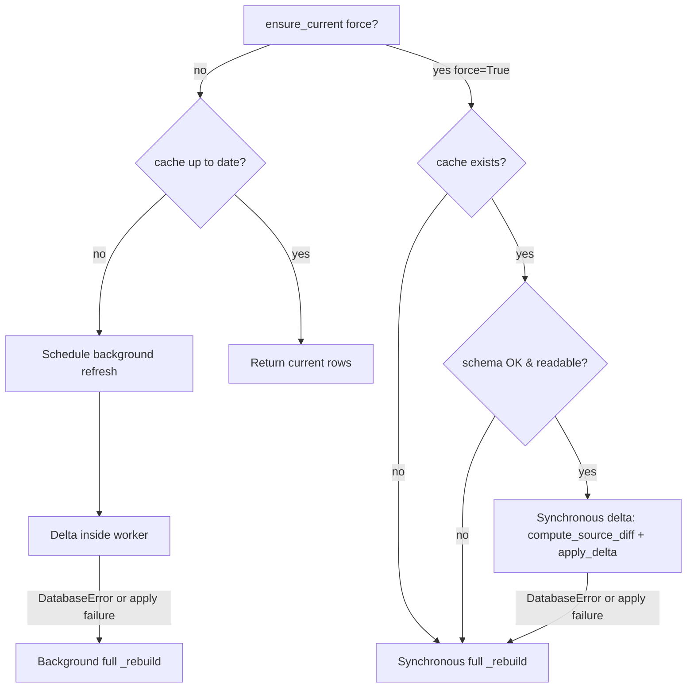

## Problem

The "Refresh" button in [`frontend/src/components/chat-list/ChatList.js`](frontend/src/components/chat-list/ChatList.js) calls `useChatSummaries.refresh`, which sends `GET /api/chats?refresh=1`. The Flask handler in [`cursor_view/routes.py`](cursor_view/routes.py) translates that into `force_refresh=True`, which `ChatIndex.list_summaries` forwards to `ensure_current(force=True)`. That branch unconditionally calls `_rebuild` — the slow, build-to-temp-and-atomic-swap full reindex path — even though the existing background `_background_refresh_worker` already knows how to do an incremental delta apply with a full-rebuild fallback.

Today's force=True path (synchronous full rebuild):

```170:173:cursor_view/chat_index/index.py
        if force:
            with self._rebuild_build_lock:
                self._rebuild(source_fingerprint, sources)
            return
```

## Approach

Keep the manual Refresh synchronous (the user is staring at a spinner), but mirror the path that `_background_refresh_worker` already takes:

1. Coarse fingerprint check first; if the cache is already current, return immediately.
2. If the cache is missing, unreadable (`sqlite3.DatabaseError`), or its `schema_version` row does not match `INDEX_SCHEMA_VERSION`, fall back to `_rebuild` — these are correctness gates, not freshness ones (per [`.cursor/rules/chat-index-refresh.mdc`](.cursor/rules/chat-index-refresh.mdc)).
3. Otherwise, run `compute_source_diff` + `apply_delta` under the existing `_rebuild_build_lock`. On any `sqlite3.DatabaseError` or apply exception, fall back to `_rebuild` (same fallback discipline as the background worker).

Concretely, factor the refresh body so the `force=True` branch and `_background_refresh_worker` share a single helper (`_run_synchronous_delta_or_rebuild`). This removes duplication and makes it impossible to drift between the two paths' fallback logic.

## Key files

- [`cursor_view/chat_index/index.py`](cursor_view/chat_index/index.py) — core change in `ensure_current` and a new shared helper that wraps `_compute_source_diff` + `_apply_delta` with the `DatabaseError -> _rebuild` fallback. `_background_refresh_worker` calls the same helper from inside its existing `_rebuild_build_lock` block.
- [`.cursor/rules/chat-index-refresh.mdc`](.cursor/rules/chat-index-refresh.mdc) — `force=True` is no longer a synchronous-rebuild trigger by default; it becomes a synchronous-delta trigger that only escalates to full rebuild on the same correctness gates as the SWR path.
- [`.github/CONTRIBUTING.md`](.github/CONTRIBUTING.md) — the `chat_index/` paragraph claims the cache "[falls] back to a full rebuild only on `force_refresh`, schema drift, `DatabaseError`, or a missing cache file"; update it so `force_refresh` lands on the delta path.
- [`README.md`](README.md) — does not currently describe refresh-cache routing, so no edit is expected. Verify and add a brief note only if other parts of the change make a user-visible behavior promise (e.g. "Refresh is now incremental").
- [`tests/test_chat_index_incremental.py`](tests/test_chat_index_incremental.py) — add a regression test that pins the new behavior (force=True against a readable, schema-current cache uses delta) and confirm the existing schema-drift / fingerprint-bump tests still pass without modification (they monkey-patch `_schedule_background_refresh` and `_rebuild`, neither of which the new force-delta arm calls into).

## Routing diagram (after change)



## Frontend

No frontend change required. The button already shows a spinner (`loading=true`) until the API call returns, and the API call's response is whatever rows `apply_delta` produced. The button's perceived latency drops from "rebuild whole index" to "apply diff", which is the entire point.

## Bug-hunt check (mandatory final step)

After the implementation lands, do one focused read pass over the changed file and the apply-delta seam looking specifically for:

- A force=True caller that races a background refresh thread — both arms now need `_rebuild_build_lock`; the new synchronous delta arm must hold the lock for the whole `compute_source_diff` + `apply_delta` window so it cannot interleave with `_background_refresh_worker`. Verify the lock acquisition order matches and that `_compute_source_diff` (which opens its own read-only connection) does not deadlock against the writable connection `apply_delta` opens later.
- The `_rebuild` fallback inside the new helper must run **without** the lock already released — a naive refactor that does `with lock: try delta` then `_rebuild()` outside the `with` would lose the single-writer guarantee. The fallback must be inside the same `with self._rebuild_build_lock:` block.
- A force=True call against a cache that was deleted between the existence check and the build-lock acquisition — re-check `db_path.exists()` after taking the lock, mirroring the existing double-check in the `not self.db_path.exists()` branch of `ensure_current`.
- Per [`.cursor/rules/known-bugs.mdc`](.cursor/rules/known-bugs.mdc), if any code path looks suspicious but is out-of-scope for this change, leave a `# TODO(bug):` marker rather than silently rewriting it.