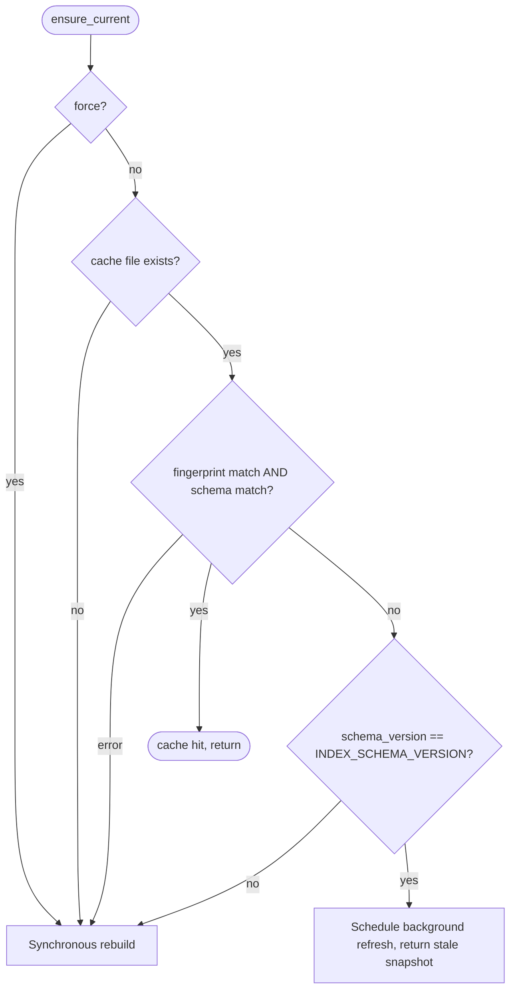

# Schema-drift -> synchronous cache rebuild

## Background

The cache-refresh router lives in [`cursor_view/chat_index/index.py`](cursor_view/chat_index/index.py) and is driven by `ChatIndex.ensure_current` (lines 153-209). Its current routing:

- `force=True` -> synchronous full rebuild.
- Cache file missing -> synchronous full rebuild (first-build).
- `_cached_index_up_to_date` True -> cache hit.
- `_cached_index_up_to_date` raised `sqlite3.DatabaseError` -> corrupt, synchronous rebuild.
- Anything else (fingerprint mismatch or schema drift) -> return stale snapshot, schedule background refresh via `_schedule_background_refresh`.

`_cached_index_up_to_date` (lines 286-295) returns False if **either** the source-fingerprint meta row or the `schema_version` meta row doesn't match `INDEX_SCHEMA_VERSION`. The fingerprint hash in [`cursor_view/chat_index/fingerprint.py`](cursor_view/chat_index/fingerprint.py) already folds `INDEX_SCHEMA_VERSION` into the SHA-256, so after a ship that bumps the schema both signals flip simultaneously.

The background worker already handles schema drift as a "must full-rebuild rather than delta-apply" case at lines 263-270:

```263:270:cursor_view/chat_index/index.py
                if cached_schema != str(INDEX_SCHEMA_VERSION):
                    logger.info(
                        "Chat index schema drift (%s -> %s); falling back to full rebuild",
                        cached_schema,
                        INDEX_SCHEMA_VERSION,
                    )
                    self._rebuild(fp, sources)
                    return
```

However, between the moment `ensure_current` returns (releasing the caller to read the cache) and the worker finishing the rebuild, the API is serving rows produced under the previous schema to clients expecting the new schema. That's the bug.

## Desired routing



The new branch is `schemaQ -> syncRebuild`. First-build, corruption, and schema drift all collapse onto the same synchronous-rebuild recipe.

## Files to change

### 1. [`cursor_view/chat_index/index.py`](cursor_view/chat_index/index.py) - the routing fix

Add a focused helper next to `_cached_index_up_to_date`:

```python
def _cached_schema_version(self) -> str | None:
    """Return the cache's ``schema_version`` meta row value, or None if absent.

    Split out from :meth:`_cached_index_up_to_date` so the refresh
    router can distinguish a schema bump (synchronous rebuild --
    serving old-shape rows to callers expecting the new shape is a
    data-correctness bug) from a pure source-fingerprint miss (safe
    to serve stale under stale-while-revalidate). Raises
    :class:`sqlite3.DatabaseError` on corrupt cache so the caller
    can unify corrupt-cache handling with schema-drift handling.
    """
```

In `ensure_current`, after the existing fingerprint-miss detection and corruption `try/except`, read the cached schema version and branch:

- If it differs from `str(INDEX_SCHEMA_VERSION)` (including `None`, meaning the meta row is missing), acquire `_rebuild_build_lock`, re-check `_cached_index_up_to_date` under the lock (so a racing rebuild-winner doesn't trigger a second rebuild), and call `self._rebuild(source_fingerprint, sources)`. Log at `info` the `cached -> current` version transition, matching the existing worker log line at line 264.
- Otherwise, keep the existing `self._schedule_background_refresh()` call.

Update the `ensure_current` docstring (lines 154-175) to name the new fifth routing case: "Schema-version drift is treated like a missing cache -- the on-disk rows were produced under the previous schema, so serving them while the new cache is built would return responses that don't match the current table layout. Callers block until the rebuild completes."

The background worker's schema-drift branch at lines 263-270 stays as defense-in-depth (a background refresh could in principle still observe schema drift if it was already queued before `ensure_current` took the new fast path, though in practice the new fast path will usually beat the worker to the lock). Leave a short comment explaining that the primary schema-drift handler now lives on the synchronous path; the worker's branch is a belt-and-suspenders fallback.

### 2. [`cursor_view/chat_index/schema.py`](cursor_view/chat_index/schema.py) - docstring sync

The `INDEX_SCHEMA_VERSION` block comment at lines 10-33 currently reads "must immediately invalidate existing caches on first launch rather than waiting for a natural source-DB mtime change to flip the fingerprint." That phrasing dates from when schema drift rode the SWR path. Update it to clarify:

- A bump forces a **synchronous** rebuild on the first launch that sees it, so API responses never mix old-schema rows with new-schema readers.
- The fingerprint hash in `fingerprint.py` already folds this constant in, so bumping it is sufficient to guarantee the rebuild path fires; the `schema_version` meta row is the second, independent signal that `ensure_current` reads to pick synchronous vs. background.

### 3. [`tests/test_chat_index_incremental.py`](tests/test_chat_index_incremental.py) - regression test

Per [`.cursor/rules/project-layout.mdc`](.cursor/rules/project-layout.mdc) ("Any new behavior that touches the chat-index refresh path must land with a synthetic-Cursor-DB regression test in `tests/test_chat_index_incremental.py` or a new sibling"), add one new test method on the existing `unittest.TestCase` fixture. Rough shape:

```python
def test_schema_version_bump_forces_synchronous_rebuild(self) -> None:
    ci = self._build_index()

    # Corrupt the cache's recorded schema_version so the router
    # sees drift without us having to poke module-level constants.
    con = sqlite3.connect(self.cache_path)
    try:
        con.execute(
            "UPDATE meta SET value=? WHERE key='schema_version'",
            (str(INDEX_SCHEMA_VERSION - 1),),
        )
        con.commit()
    finally:
        con.close()

    with patch.object(
        ChatIndex, "_schedule_background_refresh"
    ) as bg, patch.object(
        ChatIndex, "_rebuild", wraps=ci._rebuild
    ) as rebuild:
        ci.ensure_current()

    bg.assert_not_called()
    rebuild.assert_called_once()
    # Post-condition: cache now reports the current schema_version.
    self.assertEqual(
        ci._read_meta_value("schema_version"), str(INDEX_SCHEMA_VERSION)
    )
```

And a complementary negative-case assertion so a future regression that routes fingerprint-only mismatches through the sync path would fail loudly:

```python
def test_source_fingerprint_bump_uses_background_refresh(self) -> None:
    # Bump only the fingerprint meta row; leave schema_version current.
    ...
    with patch.object(ChatIndex, "_schedule_background_refresh") as bg:
        ci.ensure_current()
    bg.assert_called_once()
```

`from unittest.mock import patch` is already imported; `from cursor_view.chat_index import INDEX_SCHEMA_VERSION` should be added with the other imports.

### 4. [`.cursor/rules/sqlite-cursor-db.mdc`](.cursor/rules/sqlite-cursor-db.mdc) - rule sync

Per [`.cursor/rules/comments-style.mdc`](.cursor/rules/comments-style.mdc) ("When a refactor materially changes a convention captured in any rule under `.cursor/rules/`, update that rule in the same PR"), update the **Cache tables** section. The current line "Bumping `INDEX_SCHEMA_VERSION` (defined in the same module) forces one full rebuild on first launch; subsequent launches take the incremental path" is technically still true but glosses over the synchronous-vs-SWR distinction. Replace with wording that says:

- Schema drift is handled on the **synchronous** refresh path in `ChatIndex.ensure_current`; callers block until the rebuild finishes.
- Fingerprint-only drift (source DB moved) stays on the stale-while-revalidate path.
- Reference the single source of truth, the `_cached_schema_version` helper.

### 5. New rule: refresh-path routing invariants

Also per [`.cursor/rules/comments-style.mdc`](.cursor/rules/comments-style.mdc), capture the new invariant in a focused rule so future contributors do not re-introduce the SWR-on-schema-drift footgun. Create [`.cursor/rules/chat-index-refresh.mdc`](.cursor/rules/chat-index-refresh.mdc) with:

- Front-matter: `description: Rules for routing refreshes in ChatIndex.ensure_current`, `globs: **/cursor_view/chat_index/**/*.py`, `alwaysApply: false`.
- One paragraph describing the four-way routing (force / first-build / corruption / schema-drift -> synchronous; fingerprint-only -> SWR).
- The invariant "never serve rows under a different schema version than `INDEX_SCHEMA_VERSION`"; i.e. if a new condition makes `_cached_index_up_to_date` return False, the author must decide whether it affects row *shape* (schema) or just row *freshness* (fingerprint) and pick sync vs. SWR accordingly.
- A pointer back to `sqlite-cursor-db.mdc` for the tables and to `cursor_view/chat_index/index.py::ensure_current` for the canonical switch.

Keep it short (matching the other rule files' terse, example-driven style).

### 6. [`README.md`](README.md) - only if the project-layout list changes

Per [`.cursor/rules/project-layout.mdc`](.cursor/rules/project-layout.mdc) ("Any change that alters the repository layout must update the 'Project layout' section of README.md in the same change"), I only expect to touch README if the new rule file counts as repository-layout change worth listing. Confirm during implementation; if README already doesn't enumerate individual rule files, skip.

## Adherence to `.cursor/rules`

- [`comments-style.mdc`](.cursor/rules/comments-style.mdc): new comments explain *why* schema drift must block (correctness of returned rows), not *what* the branch does. The two rule updates in steps 4-5 discharge the "update rules in the same PR" requirement.
- [`project-layout.mdc`](.cursor/rules/project-layout.mdc): no new top-level files, no new subpackages, tests added to the prescribed location, README checked for layout impact.
- [`python-standards.mdc`](.cursor/rules/python-standards.mdc): new helper has a docstring explaining its reason for existing; logging uses `%`-style (`logger.info("Chat index schema drift (%s -> %s); rebuilding synchronously", cached, current)`); `index.py` currently sits at ~410 lines, well under the 400-line soft cap once the new ~20-line helper lands -- if this pushes past the cap, extract the routing-decision helpers into a private `cursor_view/chat_index/routing.py` module, but first preference is to keep them on `ChatIndex` since the helpers all read instance state.
- [`sqlite-cursor-db.mdc`](.cursor/rules/sqlite-cursor-db.mdc): read-only URI and try/finally patterns already in place in the code being touched; no new connection sites introduced. The rule itself is being updated (step 4).
- [`known-bugs.mdc`](.cursor/rules/known-bugs.mdc): the worker's now-near-dead schema-drift branch is kept (not silently deleted), with a comment explaining its new role as defense-in-depth. No `# TODO(bug):` needed because the synchronous path is a real fix, not a known-broken workaround.

## Non-goals

- Do not change the fingerprint hash contents -- the current inclusion of `INDEX_SCHEMA_VERSION` in `fingerprint.py` is what makes the existing `_cached_index_up_to_date` fail fast on schema drift, which is exactly what the new sync path relies on.
- Do not change `INDEX_SCHEMA_VERSION` itself. This plan is structural; it will land while the constant is still `2`.
- Do not rework the background worker into the synchronous path. The two paths remain; only the pre-dispatch routing decision is changed.
