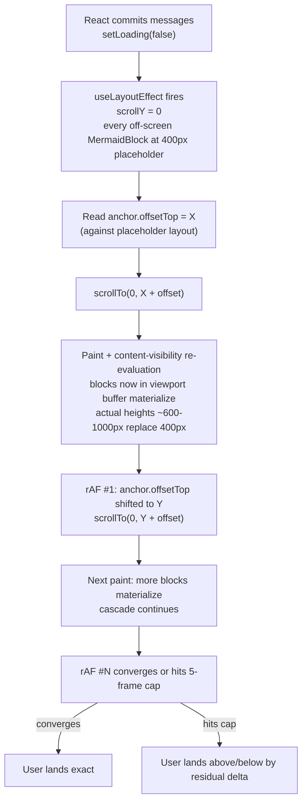

# Scroll drift on mermaid chats: continued fix

## What is already in place

The previous chat ([retired example #6 in `known-bugs.mdc`](.cursor/rules/known-bugs.mdc) and the `useChatScrollAnchor` hook) landed an anchor-based scroll restore with a chase loop:

- `MessageBubble` carries `data-msg-idx={index}` on its outer `<Box>` (`[frontend/src/components/chat-detail/MessageBubble.js](frontend/src/components/chat-detail/MessageBubble.js)` line 43).
- `useChatScrollAnchor` saves `{ msgIdx, offset }` JSON to `sessionStorage`, restores via `window.scrollTo(0, anchorEl.offsetTop + offset)`, and then chases `content-visibility: auto` materialization shifts with a 5-frame `requestAnimationFrame` loop (`[frontend/src/hooks/useChatScrollAnchor.js](frontend/src/hooks/useChatScrollAnchor.js)` lines 94-117).
- `MermaidBlock`'s outer `<Box>` carries `contentVisibility: 'auto'` plus a static `containIntrinsicSize: '0 400px'` placeholder (`[frontend/src/components/MermaidBlock.js](frontend/src/components/MermaidBlock.js)` lines 104-105).

That fix is correct in shape but does not converge reliably on long, diagram-heavy chats — exactly the URLs the user cites (`/chat/ec60d4dd-9bac-45af-84e7-bc7e35022378`, `/chat/7be71d40-07cb-46de-8203-266e17c97ae7`).

## Why the existing fix is incomplete

Sequence of a refresh from a non-zero scroll position on a diagram-heavy chat:



Two race conditions live in this loop:

1. **`content-visibility: auto` re-evaluation is async.** `scrollTo` updates `scrollY` synchronously, but the browser only re-evaluates content-visibility relevance during the next rendering update step (between rAFs). Reading `anchor.offsetTop` forces layout but does **not** trigger relevance re-evaluation, so frame N's rAF reads the layout *as of frame N-1's paint*. Each `scrollTo` triggers one wave of materialization that the next rAF measures, but each new scroll target pulls *more* blocks into the viewport buffer — a cascade that takes 1 frame per wave to propagate.
2. **The 5-frame cap is unconditional.** It runs exactly 5 frames whether or not the position has stabilized. There is no convergence check, so the loop can both quit early (position not yet stable) and keep firing pointless `scrollTo` calls (position already stable).

The cascade depth scales with the number of mermaid blocks above the saved position and the per-block height delta from 400px. On the user's two example URLs the cascade frequently exceeds 5 frames, producing the "sometimes lands exact, sometimes off" symptom the user reports. Frame timing varies with paint cost, GC pauses, and CPU pressure, which is why the symptom is intermittent.

## Recommended approach: persist heights + harden the chase loop

Two complementary fixes. The first removes the race at the source; the second tightens the safety net for the (rare) case where the first does not yet have data.

### Why this combination

The root cause is that `containIntrinsicSize: '0 400px'` is a coarse heuristic. The CSS spec already defines a "last remembered size" mechanism inside `content-visibility: auto`, but that memory is per-render and is lost on every page refresh. We give it a persistent equivalent across refreshes so the layout is deterministic before the first `scrollTo` runs.

Trade-off summary versus the alternatives the question listed:

- **Force-materialize-above-anchor (Option B from the question)** would work but is more invasive: it fights `content-visibility` rather than informing it, and the previous reverted attempt documented in [`.cursor/rules/known-bugs.mdc`](.cursor/rules/known-bugs.mdc) shows the visible-↔-auto flip is fragile on this surface. Persisting heights keeps `content-visibility: auto` always on, which preserves the perf win on long chats with many off-screen diagrams.
- **Just raise the rAF cap (Option C from the question)** patches the symptom without addressing the cascade. Even with stable-frames detection it remains timing-dependent on first-load. Keeping it as a safety net under a deterministic primary path is fine; relying on it as the only mechanism is not.

The combination matches the existing architecture: `mermaidRenderCache` already persists *rendered SVGs* keyed by `(source, darkMode)`. The new height cache is the layout-axis sibling of that.

### Step 1 — Add a persistent height cache utility

Add `[frontend/src/utils/mermaidHeightCache.js](frontend/src/utils/mermaidHeightCache.js)`, modeled on `[frontend/src/utils/mermaidRenderCache.js](frontend/src/utils/mermaidRenderCache.js)`.

Public API (deliberately narrow, mirroring the render cache's shape):

```js
export function getCachedMermaidHeight(source) { ... }
export function setCachedMermaidHeight(source, height) { ... }
```

Storage backend: `sessionStorage` under a single key (e.g. `mermaid-block-heights`) holding a JSON `{ [source]: number }` map. The reader memoizes the parsed object on module load to avoid `JSON.parse` per-block on first paint of a long chat. Writes update the in-memory copy and write the full JSON back; the write is bounded to ~once per block per render so the JSON.stringify cost stays trivial. Errors from `sessionStorage` (quota exceeded, disabled by privacy mode) are swallowed and the cache silently degrades to placeholder behavior — exactly what the legacy code did.

Why source-only keying (no `darkMode`): rendered mermaid heights vary by ~few pixels across themes (different stroke widths, etc.), well within the rAF loop's tolerance window. Adding the theme axis would double the storage footprint and force a full re-measure on every theme toggle for no perceptible drift improvement. The render cache keys by `(source, darkMode)` because the SVG content itself differs across themes; height is a layout property that does not.

Why `sessionStorage` and not `localStorage`: scroll restoration is per-tab anyway (`useChatScrollAnchor` already uses `sessionStorage`), and naturally-bounded session lifetime avoids unbounded growth across browser restarts.

### Step 2 — Add a ResizeObserver hook to record heights

Add `[frontend/src/hooks/useMermaidBlockHeight.js](frontend/src/hooks/useMermaidBlockHeight.js)` per `[`.cursor/rules/frontend-hooks.mdc`](.cursor/rules/frontend-hooks.mdc)` "One concern per hook" and "Expose minimal state":

```js
export function useMermaidBlockHeight(source) {
  const ref = useRef(null);
  const [persistedHeight] = useState(() => getCachedMermaidHeight(source));
  useEffect(() => {
    const el = ref.current;
    if (!el || typeof ResizeObserver === 'undefined') return undefined;
    const observer = new ResizeObserver(([entry]) => {
      const h = entry.contentRect.height;
      if (h > 0) setCachedMermaidHeight(source, h);
    });
    observer.observe(el);
    return () => observer.disconnect();
  }, [source]);
  return { ref, persistedHeight };
}
```

`persistedHeight` is read once via the lazy `useState` initializer (not a derived value) so the value is stable for the block's lifetime — prevents `containIntrinsicSize` from flipping mid-session as the observer writes new measurements.

The `ResizeObserver` fires when `content-visibility: auto` transitions between skipped (placeholder height) and rendered (actual height), so heights are recorded as the user scrolls past each diagram. Disconnect on unmount per `frontend-hooks.mdc` "Cancellation on every awaited effect" (the principle generalizes to any subscription).

### Step 3 — Wire the hook into `MermaidBlock`

Modify `[frontend/src/components/MermaidBlock.js](frontend/src/components/MermaidBlock.js)`:

```js
const { ref: heightRef, persistedHeight } = useMermaidBlockHeight(source);
// ...
<Box
  ref={heightRef}
  sx={{
    // ...existing sx...
    contentVisibility: 'auto',
    containIntrinsicSize: `0 ${persistedHeight ?? 400}px`,
  }}
>
```

The static `400px` becomes the fallback for first-ever load of a never-seen source. Replace the existing intent comment block on lines 89-103 to document why the placeholder is now usually the actual rendered height (cross-reference the new hook and the height cache).

### Step 4 — Harden the rAF chase loop with stable-frames convergence

Modify `[frontend/src/hooks/useChatScrollAnchor.js](frontend/src/hooks/useChatScrollAnchor.js)` lines 94-117. Replace the unconditional 5-frame cap with a stable-frames-based convergence detector plus a higher safety cap:

```js
// Constants near the top of the function or hook scope:
const CONVERGENCE_STABLE_FRAMES = 2;     // exit after position is stable for N frames
const CONVERGENCE_SAFETY_CAP_FRAMES = 30; // ultimate cap against pathological cascades

// Inside the loop:
let stableFrames = 0;
let frame = 0;
const tryStabilize = () => {
  stabilizationRafId = null;
  if (frame >= CONVERGENCE_SAFETY_CAP_FRAMES) return;
  frame += 1;
  const anchorEl = document.querySelector(`[data-msg-idx="${stabilizationData.msgIdx}"]`);
  if (anchorEl === null) return;
  const newTargetY = anchorEl.offsetTop + stabilizationData.offset;
  if (Math.abs(newTargetY - window.scrollY) > 1) {
    window.scrollTo(0, newTargetY);
    stableFrames = 0;
  } else {
    stableFrames += 1;
    if (stableFrames >= CONVERGENCE_STABLE_FRAMES) return;
  }
  stabilizationRafId = requestAnimationFrame(tryStabilize);
};
```

Why two stable frames (not one): a single frame of "position unchanged" can be a false negative if content-visibility re-evaluation is still pending; two consecutive stable frames means the cascade has fully propagated. Why 30 as the safety cap: pathological cases (every block above a deep anchor unmemoized + slow GPU) might need 10-15 frames; 30 leaves headroom. With persisted heights from Step 3 the typical case will converge in 1-2 frames so the higher cap is effectively never reached.

Update the existing intent-comment block on lines 80-93 to reflect the new convergence rule and to mention that the persisted-height cache from Step 1-3 is the *primary* stabilization mechanism — the rAF loop becomes the safety net for un-measured blocks (e.g., user scrolled past a diagram before its `ResizeObserver` callback fired) rather than the primary mechanism.

### Step 5 — Review every edited and new file against the always-applied rules

Check each in turn against `.cursor/rules/`:

- **[`comments-style.mdc`](.cursor/rules/comments-style.mdc)** — no comment that re-narrates code; every new comment explains intent (why we cache heights, why source-only keying, why two stable frames, why `useState` initializer instead of derived state).
- **[`known-bugs.mdc`](.cursor/rules/known-bugs.mdc)** — no `# TODO(bug):` deletions without flagging; the existing entry on this bug is being *extended* with the continued fix, not silently rewritten.
- **[`project-layout.mdc`](.cursor/rules/project-layout.mdc)** — new utility lives in `frontend/src/utils/`, new hook in `frontend/src/hooks/`. No top-level files. Reachable from the active codebase (`MermaidBlock` imports the hook; `useChatScrollAnchor` is unchanged at the import boundary).
- **[`react-components.mdc`](.cursor/rules/react-components.mdc)** — `MermaidBlock` is currently 184 lines; the hook integration adds ~3 lines of new code and replaces the 15-line static-placeholder comment block, net change is small. Stays well under the ~250-line cap.
- **[`frontend-hooks.mdc`](.cursor/rules/frontend-hooks.mdc)** — new `useMermaidBlockHeight` hook follows "One concern per hook", "Expose minimal state" (returns `{ ref, persistedHeight }` only), and the `useEffect` cleanup pattern. No callbacks to memoize because the consumer doesn't pass any to deps.
- **[`mermaid-rendering.mdc`](.cursor/rules/mermaid-rendering.mdc)** — new utility does **not** call `mermaid.parse`, `mermaid.render`, or `mermaid.initialize`; it observes DOM size only. The "Two pipelines, one source format" invariant is preserved by construction.
- **[`theme-transitions.mdc`](.cursor/rules/theme-transitions.mdc)** — no new transition literals, no inline `transition` shorthand outside `PALETTE_TRANSITION` composition. The `containIntrinsicSize` change is a layout property, not an animated property.

If any review finding surfaces a *separate* deferred bug, add a fresh `# TODO(bug):` marker per `known-bugs.mdc`'s "Do not silently delete suspicious code" rule rather than rewriting silently.

### Step 6 — Update the affected rule files

- **[`.cursor/rules/known-bugs.mdc`](.cursor/rules/known-bugs.mdc)** — extend the existing scroll-drift retired example (the one currently ending with the rAF re-scroll paragraph) with a follow-up paragraph noting that the rAF-chase-only approach was incomplete, summarizing the persisted-height + stable-frames convergence pair, and re-stating the manual verification expectation.
- **[`.cursor/rules/theme-transitions.mdc`](.cursor/rules/theme-transitions.mdc)** — in the "Two CSS containment hints" subsection (which already documents the `data-msg-idx` SAVE side and the rAF re-scroll RESTORE paragraph), update the rAF paragraph to describe the convergence rule (stable-frames cap, 30-frame safety) and add a new bullet describing the persisted-height cache as the primary determinism mechanism. Mark the rAF loop explicitly as a safety net rather than the primary mechanism.
- **[`.cursor/rules/frontend-hooks.mdc`](.cursor/rules/frontend-hooks.mdc)** — add a `useMermaidBlockHeight` entry in the "Canonical hooks to read when writing a new one" list, near the other mermaid hooks (`useMermaid`, `useMermaidRender`, `useSvgCrossFade`). Include the return shape and the cross-reference to the height cache utility.
- **[`.cursor/rules/mermaid-rendering.mdc`](.cursor/rules/mermaid-rendering.mdc)** — in the "Render cache and queue" section, add a one-paragraph mention of the `mermaidHeightCache` sibling (layout-axis cache; same lifecycle / sessionStorage / source-keyed shape) and cross-reference back to `theme-transitions.mdc` for the scroll-restore consumer.

### Step 7 — Update CONTRIBUTING.md

Modify `[.github/CONTRIBUTING.md](.github/CONTRIBUTING.md)`:

- The `utils/` bullet (around line 454-470) — append `mermaidHeightCache` alongside `mermaidRenderCache` and `mermaidRenderQueue`, with a short description of the persisted-height responsibility and cross-reference to `theme-transitions.mdc`.
- The `hooks/` bullet (around line 396-453) — add `useMermaidBlockHeight` near `useMermaidRender` with the return shape.
- The `chat-detail/` bullet (around line 518-542) — extend the existing scroll-restore description: the determinism contract now relies on the height cache, with the rAF loop as the safety net.

### Step 8 — Confirm README needs no change

`[README.md](README.md)` describes user-facing setup and feature surface. The fix is internal correctness, no new feature or setup change. No update needed; flag this explicitly when reviewing so the doc-sync requirement from `[`.cursor/rules/project-layout.mdc`](.cursor/rules/project-layout.mdc)` "Documentation sync" is recorded as evaluated.

### Step 9 — Run the Python test suite

`python -m unittest discover -s tests` from the repo root. The fix is frontend-only; the Python suite does not regress, but `[`.cursor/rules/project-layout.mdc`](.cursor/rules/project-layout.mdc)` requires it stays green on every change. No new tests added (frontend has no JS test harness; per `[`.cursor/rules/known-bugs.mdc`](.cursor/rules/known-bugs.mdc)` the invariant-enforcement mechanism is cross-referenced rule entries plus manual verification).

### Step 10 — Manual verification

Cover three scenarios on the user's example URLs:

1. **First-load-then-refresh (cold cache → warm cache):** open `/chat/ec60d4dd-9bac-45af-84e7-bc7e35022378` cold (no `mermaid-block-heights` entry yet). Scroll mid-page so several mermaid blocks are above the viewport. Refresh. Expect: lands precisely (heights now persisted).
2. **Repeat refresh (warm cache):** refresh again from a fresh non-zero scroll position. Expect: lands precisely.
3. **Diagram-free chat (regression check):** open any chat without mermaid diagrams, scroll mid-page, refresh. Expect: lands precisely via the legacy plain-`scrollY` fallback path (which the change does not touch).

Repeat (1)-(2) on `/chat/7be71d40-07cb-46de-8203-266e17c97ae7`. Open DevTools and inspect `sessionStorage` for the `mermaid-block-heights` key after each visit; confirm it accumulates entries keyed by source text with sensible numeric heights.

### Step 11 — Audit the implementation for new bugs

Re-read every file the change touched looking for new defects, *especially*:

- A `ResizeObserver` callback that runs in a microtask and writes `sessionStorage`: confirm no obvious cycle (writes back into observed DOM that triggers another size change).
- The lazy `useState` initializer reading `sessionStorage`: confirm it does not crash when `sessionStorage` is unavailable (privacy mode) — the cache utility should swallow the error and return `undefined`.
- The stable-frames convergence: confirm cleanup still cancels the in-flight `requestAnimationFrame` on unmount (otherwise navigation to a different chat keeps firing into a stale anchor selector).

If any new defect is identified that is *not* immediately fixed, add a `# TODO(bug):` marker per the `known-bugs.mdc` format (literal prefix + symptom + suspected cause) and surface it before declaring the plan complete.

### Step 12 — Sweep the rest of the project for any newly-surfaced bugs

Per `[`.cursor/rules/known-bugs.mdc`](.cursor/rules/known-bugs.mdc)`'s "Do not silently delete suspicious code" guidance: walk the rest of the chat-detail surface (`MermaidBlock`, `MermaidDiagramSurface`, `useChatScrollAnchor`, `useMermaidRender`, `prerenderMermaidDiagrams`) one more pass looking for code paths that *look* dead, suspicious, or in tension with an invariant pinned in a rule. Any such finding gets a `# TODO(bug):` marker (do not rewrite silently) and is cited from `known-bugs.mdc`'s "live markers" section. If no such findings, record explicitly that the sweep was performed and was empty so the next contributor can trust the discipline was honored.