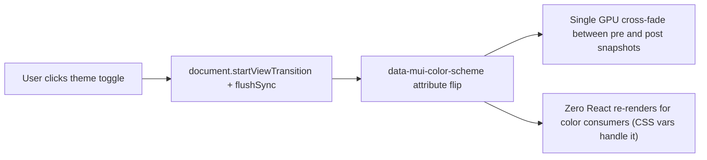

## Architecture overview

The end-state replaces "N concurrent per-element CSS transitions plus N React re-renders" with "one GPU cross-fade between page snapshots, zero React re-renders for color consumers". Two primary mechanisms get us there:



Cheap CSS containment wins (A, B) ensure off-screen and isolated subtrees skip layout/paint during whatever transition mechanism is active. Mermaid-side wins (D, E) handle the few cases the page-wide approach doesn't cover.

## Item A - `content-visibility: auto` on `MermaidBlock` wrapper

[`frontend/src/components/MermaidBlock.js`](frontend/src/components/MermaidBlock.js) outer `<Box>` (around line 156-167 in the current file). Add to its `sx`:

```js
contentVisibility: 'auto',
containIntrinsicSize: '0 400px',
```

`contentVisibility: auto` tells the browser to skip layout/paint of off-screen blocks until they scroll into view; `containIntrinsicSize: 0 400px` provides a placeholder height (width 0 = use parent width, height 400px = a typical mermaid block height) so the scrollbar doesn't jump as off-screen blocks materialize. The "400px" is a heuristic; future work could measure actual heights and store per-source. Browser support: Chromium 85+, Safari 18+, Firefox 125+; older Firefox silently ignores both properties and falls through to current behavior.

## Item B - `contain: layout paint style` on `MermaidDiagramSurface`

[`frontend/src/components/MermaidDiagramSurface.js`](frontend/src/components/MermaidDiagramSurface.js) outer `<Box component="button">`. Add to its `sx`:

```js
contain: 'layout paint style',
```

Tells the browser the surface's layout, paint, and styles cannot affect siblings or ancestors. Safe because nothing inside this surface needs to leak out: the lightbox modal is portal-rendered (lives outside the surface's DOM subtree), and the cross-fade overlay is `position: absolute; inset: 0` already scoped to the surface's `position: relative` parent.

## Item C - View Transitions API for the toggle

[`frontend/src/App.js`](frontend/src/App.js) `toggleDarkMode` (lines 31-37). Wrap the state flip in `document.startViewTransition` with a `flushSync` from `react-dom`:

```js
import { flushSync } from 'react-dom';

const toggleDarkMode = () => {
  const next = !darkMode;
  writeThemeCookie(next);
  if (typeof document.startViewTransition === 'function') {
    document.startViewTransition(() => {
      flushSync(() => setDarkMode(next));
    });
    return;
  }
  setDarkMode(next);
};
```

`flushSync` is load-bearing: without it, React batches `setDarkMode` and the post-snapshot fires before React commits the new DOM, capturing pre-state twice and producing no visible cross-fade. With it, React commits synchronously inside the callback, the post-snapshot reflects the new state, and the browser cross-fades the two snapshots as a single GPU composite.

The fallback `setDarkMode(next)` outside the `if` keeps the toggle working on browsers without View Transitions support (Chromium <111, Safari <18, Firefox <137 - now a minority).

Important interaction with item H below: once CSS variables land, the View Transition still works the same way but the post-snapshot is captured *immediately* after the data-attribute flips (CSS var update is synchronous); React doesn't have to commit anything for color changes. This is what makes the combined C+H so cheap on the GPU.

## Item D - Pre-render both themes at chat load

[`frontend/src/components/chat-detail/ChatDetail.js`](frontend/src/components/chat-detail/ChatDetail.js) lines 56-69 (the `Promise.all(rawMessages.map(...))` block). After the existing `prerenderMermaidDiagrams(renderedContent, darkMode)` call, add a second sequential call for the opposite theme so both populate the session-scoped cache:

```js
const mermaidSvgs = await prerenderMermaidDiagrams(renderedContent, darkMode);
// Cache-warm the opposite theme so the user's first toggle is a hit.
// Sequential because mermaid.initialize is a singleton and parallel
// calls would race on `theme: dark | default`.
await prerenderMermaidDiagrams(renderedContent, !darkMode);
```

The `await` is fire-and-forget for cache purposes - the second prerender's return value is unused. Could also be bumped after `setLoading(false)` so the user sees the chat sooner; flag this as a follow-up if first-paint regressions appear.

Trade-off: doubles prerender wall-time on chats with many diagrams. Acceptable on typical chats; consider a count threshold (e.g. only warm both themes if `< 30` diagrams) if the second prerender becomes a noticeable load delay.

## Item E - Cap concurrent SVG cross-fades

New module-level counter + gate check in [`frontend/src/components/MermaidDiagramSurface.js`](frontend/src/components/MermaidDiagramSurface.js). Cap at 5 (heuristic; tune after measuring):

```js
let activeCrossFades = 0;
const MAX_CONCURRENT_CROSS_FADES = 5;
```

In the derive-state block:

```js
if (svg !== committedSvg) {
  const shouldFade =
    inView && !reducedMotion && activeCrossFades < MAX_CONCURRENT_CROSS_FADES;
  setOutgoingSvg(shouldFade ? committedSvg : null);
  setCommittedSvg(svg);
}
```

Track active count via `useEffect([outgoingSvg])` so a TOCTOU window or unmount-mid-fade doesn't leak the counter:

```js
useEffect(() => {
  if (outgoingSvg === null) return undefined;
  activeCrossFades += 1;
  return () => {
    activeCrossFades -= 1;
  };
}, [outgoingSvg]);
```

Edge: React strict-mode double-invokes effects in dev, which would double-increment. Acceptable - the counter is a heuristic gate, not a correctness invariant; off-by-N in dev does not affect prod behavior.

## Item F - Reduce `PALETTE_TRANSITION_DURATION` to 200ms

[`frontend/src/theme/transitions.js`](frontend/src/theme/transitions.js) line 69. Change `'0.3s'` to `'0.2s'`. Update the "matches `ChatCard`'s historical inline transition byte-for-byte" comment in the same file to reflect that the historical 0.3s value was tuned in a different context and 200ms is closer to modern Material Design 3 ranges (200-250ms for emphasized curves).

The keyframe animation in `MermaidDiagramSurface` uses `PALETTE_TRANSITION_DURATION` directly, so the cross-fade also speeds up to match - no other changes needed there.

## Item G - Drop `transform` from `PALETTE_TRANSITION_PROPERTIES`

[`frontend/src/theme/transitions.js`](frontend/src/theme/transitions.js) lines 72-80. Remove `'transform'` from the array. Update the doc-comment bullet that explains why `transform` is in the list (lines 55-59) - it should now read that `transform` is not in the list because the only theme-fade-related transform is `ChatCard`'s hover-lift, which is moved to a local transition.

In [`frontend/src/components/chat-list/ChatCard.js`](frontend/src/components/chat-list/ChatCard.js) `Card` `sx`, add a local hover transition for `transform`:

```js
import { PALETTE_TRANSITION_CURVE, PALETTE_TRANSITION_DURATION } from '../../theme/transitions';

// in sx:
transition: `transform ${PALETTE_TRANSITION_DURATION} ${PALETTE_TRANSITION_CURVE}, box-shadow ${PALETTE_TRANSITION_DURATION} ${PALETTE_TRANSITION_CURVE}`,
```

Wait - `box-shadow` is still in `PALETTE_TRANSITION_PROPERTIES`, so the `Card`'s `MuiCard.root` styleOverride already animates it. Adding it inline would duplicate. So just `transform`:

```js
transition: `transform ${PALETTE_TRANSITION_DURATION} ${PALETTE_TRANSITION_CURVE}`,
```

The MUI `transition` shorthand on a styled component composes with the `sx`-level inline transition - the browser merges multiple `transition` declarations onto the same element. We need to verify in practice whether that's true (it is; `transition` is a comma-separable shorthand and `sx` overrides the styleOverride entirely, so we re-write the full string). Actually safer: in `ChatCard`'s `sx`, write the FULL transition string covering both `transform` and any other property the central list still tracks. Use the new `PALETTE_TRANSITION` constant value PLUS an inline `transform` extension.

Cleanest: import the central constant and append:

```js
import { PALETTE_TRANSITION, PALETTE_TRANSITION_CURVE, PALETTE_TRANSITION_DURATION } from '../../theme/transitions';

transition: `${PALETTE_TRANSITION}, transform ${PALETTE_TRANSITION_DURATION} ${PALETTE_TRANSITION_CURVE}`,
```

Document the rationale in a comment on the `Card` `sx`.

## Item H - CSS-variables palette migration via MUI's `CssVarsProvider`

The biggest change. Eliminates React re-renders on theme toggle for every color consumer. Theme toggle becomes a CSS-only operation: flip `data-mui-color-scheme` on `<html>` and the browser recomputes styles for all elements that reference `var(--mui-palette-*)` without re-rendering React.

This breaks down into five sub-todos:

### H1 - Migrate `buildTheme.js` to `extendTheme` with `colorSchemes`

[`frontend/src/theme/buildTheme.js`](frontend/src/theme/buildTheme.js). Replace `createTheme(c, mode)` with `extendTheme({ colorSchemes: { light: { palette: lightColors }, dark: { palette: darkColors } }, ... })`.

The two palette objects are already exported from [`frontend/src/theme/colors.js`](frontend/src/theme/colors.js) (`lightColors`, `darkColors`). The `highlightColor` is currently a top-level field, not under `palette`; needs to be lifted into `palette: { highlight: { main: ... } }` per scheme.

The `transition: PALETTE_TRANSITION` styleOverrides stay as-is (View Transitions does not replace them entirely; per-element transitions are still useful as a fallback for browsers without View Transitions support and for non-toggle color changes).

### H2 - Migrate `App.js` to `CssVarsProvider`

[`frontend/src/App.js`](frontend/src/App.js). Replace `<ThemeProvider theme={theme}>` with `<CssVarsProvider theme={theme} defaultMode={readThemeCookie() ? 'dark' : 'light'}>`. Drop the `useMemo` rebuild of theme on `darkMode` change (the theme is now static and CSS variables handle the swap).

`toggleDarkMode` becomes a wrapper around MUI's `useColorScheme().setMode()`. Keep the `ThemeModeContext` shape (`{ darkMode: bool, toggleDarkMode: () => void }`) for backward compat with consumers that read `darkMode` (e.g. `MermaidBlock`'s render effect deps `[source, darkMode]`); under the hood it now derives from `useColorScheme().mode`.

The `useEffect` writing `document.documentElement.dataset.theme` (lines 27-29) gets removed - `CssVarsProvider` writes `data-mui-color-scheme` itself, and `index.css`'s scrollbar selector `:root[data-theme="light"]` updates to `:root[data-mui-color-scheme="light"]` to match.

### H3 - Migrate every `useContext(ColorContext)` consumer

12 files (per the explore subagent report) consume `ColorContext`. For each, replace `colors.X` references in `sx` with theme-aware values. Two patterns:

**Pattern 1 - sx callback with `theme.vars`:**

```js
sx={(theme) => ({
  borderColor: alpha(theme.vars.palette.highlight.main, 0.2),
})}
```

But `alpha` from MUI works on color tokens, not CSS var strings. For alpha-of-CSS-var, need `mainChannel`:

```js
sx={{
  borderColor: 'rgba(var(--mui-palette-highlight-mainChannel) / 0.2)',
}}
```

**Pattern 2 - direct CSS var reference (preferred for performance):**

```js
sx={{
  backgroundColor: 'var(--mui-palette-background-paper)',
}}
```

Per-file effort:
- [`Header.js`](frontend/src/components/Header.js): single `colors.highlightColor` reference for the GitHub button hover. Replace with `var(--mui-palette-highlight-main)`.
- [`ChatList.js`](frontend/src/components/chat-list/ChatList.js): `colors.highlightColor` (refresh button hover, spinner). Replace.
- [`ChatDetail.js`](frontend/src/components/chat-detail/ChatDetail.js): `colors.highlightColor` (back/export buttons, spinner). Replace.
- [`ChatCard.js`](frontend/src/components/chat-list/ChatCard.js): `colors.text.secondary`, `colors.highlightColor`. Replace.
- [`ProjectGroup.js`](frontend/src/components/chat-list/ProjectGroup.js): `colors.background.paper`, `colors.text.primary`, `colors.text.secondary`, `colors.highlightColor`. Replace all.
- [`MessageBubble.js`](frontend/src/components/chat-detail/MessageBubble.js): `colors.highlightColor`, `colors.secondary.main`. Replace.
- [`ChatMetaPanel.js`](frontend/src/components/chat-detail/ChatMetaPanel.js): `colors.highlightColor`. Replace.
- [`MermaidBlock.js`](frontend/src/components/MermaidBlock.js): `colors.highlightColor`, `colors.text.primary`. Replace.
- [`MermaidDiagramSurface.js`](frontend/src/components/MermaidDiagramSurface.js): `colors.highlightColor`. Replace.
- [`MermaidToolbar.js`](frontend/src/components/MermaidToolbar.js): `colors.text.secondary`, `colors.highlightColor`. Replace.
- [`MermaidLightboxFallback.js`](frontend/src/components/MermaidLightboxFallback.js): `colors.highlightColor`, `colors.text.primary`. Replace.
- [`ExportFormatDialog.js`](frontend/src/components/export/ExportFormatDialog.js): `colors.highlightColor`. Replace.

`MessageMarkdown.js` reads `colors` via prop (not context); the prop is passed down from `MessageBubble`. With H3 done, `MessageBubble` no longer has a `colors` object to pass; either change the prop signature to drop `colors` (consumer reads CSS vars directly) or pass MUI's `useTheme()` result. Cleanest is the former.

### H4 - Remove `ColorContext` entirely

[`frontend/src/contexts/ColorContext.js`](frontend/src/contexts/ColorContext.js) becomes empty. Delete the file. Remove all `import { ColorContext } from '...'` statements (12 sites from H3).

### H5 - Rewire `ThemeModeContext` to derive from `useColorScheme`

[`frontend/src/contexts/ThemeModeContext.js`](frontend/src/contexts/ThemeModeContext.js) interface stays the same. The provider in `App.js` now derives `darkMode` from MUI's `useColorScheme().mode === 'dark'` and `toggleDarkMode` calls `setMode('dark' | 'light')`.

`useMermaid` (in [`frontend/src/hooks/useMermaid.js`](frontend/src/hooks/useMermaid.js)) and `MermaidBlock` continue to read `darkMode` boolean from the context unchanged.

## Rule and documentation updates

[`.cursor/rules/theme-transitions.mdc`](.cursor/rules/theme-transitions.mdc) - substantial update:
- Update the "Canonical transition token" property list (drop `transform`, change duration to 200ms).
- Add a new "View Transitions API" section explaining the `document.startViewTransition` + `flushSync` pattern, why both are needed, and the browser-support fallback path.
- Add a new "CSS variables palette" section documenting the `CssVarsProvider` architecture and the consumer pattern (CSS var references, `mainChannel` for alpha).
- Update the SVG cross-fade section to mention the concurrent-fade cap (`MAX_CONCURRENT_CROSS_FADES`) and how it interacts with the visibility/reduced-motion gates.
- Note `content-visibility: auto` on `MermaidBlock` and `contain: layout paint style` on `MermaidDiagramSurface` as the canonical sites; future imperative-DOM components should follow.

[`.cursor/rules/mermaid-rendering.mdc`](.cursor/rules/mermaid-rendering.mdc) - smaller update:
- Add to the "Render cache and queue" section (will be added in todo 12 from the prior plan) that `prerenderMermaidDiagrams` now warms both themes at chat load, doubling its wall-time but eliminating first-toggle queue work.

[`.cursor/rules/react-components.mdc`](.cursor/rules/react-components.mdc) "Theme ownership" section:
- Replace the language about `ColorContext` with language about `theme.vars` / CSS variables. The principle "MUI theme tokens own the visual language" is unchanged, but the *mechanism* shifts from React context to CSS custom properties. Cross-reference `theme-transitions.mdc`'s new "CSS variables palette" section.

[`.github/CONTRIBUTING.md`](.github/CONTRIBUTING.md):
- `theme/` bullet: update to reflect `extendTheme` + `CssVarsProvider`, drop the `colors.js` standalone-palette description (the palettes are now scheme entries inside `extendTheme`), keep `transitions.js` and `themeCookie.js`.
- `contexts/` bullet: drop `ColorContext.js` (deleted in H4); keep `ThemeModeContext.js` (now derives from `useColorScheme`).

[`README.md`](README.md): no user-visible behavior change; nothing to add. (View Transitions and CSS variables are implementation details; the perf improvement is a UX polish that doesn't merit a Features bullet on its own.)

## Compliance review (own todo)

- [`comments-style.mdc`](.cursor/rules/comments-style.mdc): every new comment explains *why*, not what. The CSS variables migration introduces many new comments; keep them load-bearing.
- [`react-components.mdc`](.cursor/rules/react-components.mdc) "Component size": `MermaidBlock.js` is currently 261 lines (over the ~250 cap from the prior plan). Adding A's two `sx` properties + a brief comment pushes to ~265. Decompose-or-accept decision: extracting the render effect into a `useMermaidRender` hook would resolve both the prior overage and the new one. Recommend extracting in this plan.
- [`react-components.mdc`](.cursor/rules/react-components.mdc) "Theme ownership": rule update lands alongside the H migration; in-flight changes do not drift from the rule.
- [`mermaid-rendering.mdc`](.cursor/rules/mermaid-rendering.mdc): no new `mermaid.parse` / `render` / `initialize` call sites. The double-prerender in D is two calls to the existing `prerenderMermaidDiagrams` function. Parse-before-render invariant preserved.
- [`frontend-hooks.mdc`](.cursor/rules/frontend-hooks.mdc): no new hooks added in this plan (existing `useInView` / `useReducedMotion` reused). H5's `ThemeModeContext` rewire keeps the public hook-like interface stable.
- [`project-layout.mdc`](.cursor/rules/project-layout.mdc): H4 deletes one file; H1/H2 modify two existing files in `theme/`; rest are component edits. No layout shape changes. `CONTRIBUTING.md` updates documented above.
- [`known-bugs.mdc`](.cursor/rules/known-bugs.mdc): no `# TODO(bug):` markers introduced; all changes are intentional perf wins, not deferred bugs.

## Final bug check (own todo)

- A: `containIntrinsicSize` heuristic is a guess - verify scrollbar stability after edit; if blocks are commonly smaller/larger than 400px, scroll position jumps may surface.
- B: confirm no descendant escapes `MermaidDiagramSurface`'s subtree (the lightbox modal is portal'd; verify in MUI 7 - portals don't share their parent's containment).
- C: verify View Transitions does NOT capture the document twice when `flushSync` finishes synchronously inside the callback. If pre/post snapshots are identical (because `setDarkMode` was somehow async), no fade would render. Manual smoke test.
- D: confirm the second `await prerenderMermaidDiagrams(..., !darkMode)` does not race with the first `mermaid.initialize` (it should not - sequential `await` order serializes).
- E: confirm `activeCrossFades` decrement fires on component unmount mid-fade (the `useEffect` cleanup handles this); confirm React strict-mode double-invocation does not cause a stuck counter (it shouldn't - cleanup also fires twice).
- F + G: ripgrep `0.3s` over `frontend/src/` to ensure no stale literal references the old duration; ripgrep `transform` in `sx` blocks to ensure no other site relied on the central `PALETTE_TRANSITION` for `transform` animation.
- H: verify `MessageMarkdown.js`'s `colors` prop is fully removed (or stays as MUI theme accessor) so the migration is consistent. Verify no residual `import { ColorContext }` statements after H4. Verify scrollbar CSS variables in `index.css` align with the new `data-mui-color-scheme` selector.
- View Transitions + cross-fade interaction: with both C and the existing mermaid cross-fade enabled, verify that the two animations don't double-cross-fade the SVGs. The expected behavior: View Transitions captures both pre and post snapshots, the SVGs are pixels in the snapshots, the cross-fade overlay (if mounted) is also a snapshot pixel, and the View Transition cross-fades the snapshots. The mermaid cross-fade overlay's keyframe animation runs on the live DOM during the View Transition window, but the user sees only the snapshot. Net effect: clean fade. Manual smoke test on a chat with 5+ visible diagrams.