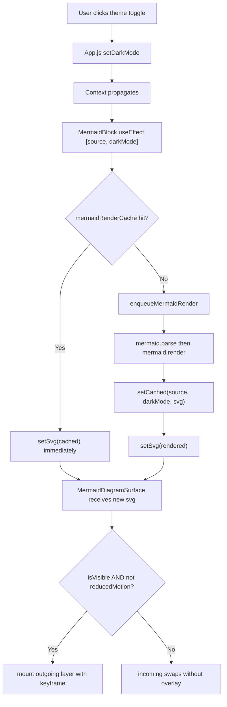

## Architecture overview



The cache short-circuits the JS-thread cost on repeated toggles. The queue serializes the unavoidable first-toggle work. The visibility + reduced-motion gates eliminate compositor cost where the cross-fade has no value.

## Item A — Mermaid render cache

New module [`frontend/src/utils/mermaidRenderCache.js`](frontend/src/utils/mermaidRenderCache.js): module-scope `Map<key, svg>` keyed by `${darkMode ? 'd' : 'l'}\0${source}`. Two exports — `getCachedMermaidSvg(source, darkMode)` and `setCachedMermaidSvg(source, darkMode, svg)`. The `\0` separator is unambiguous because mermaid source can't contain a literal NUL.

Cache lifecycle: session-lifetime, no eviction, no TTL. SVG strings are tens of KB; a heavy session with hundreds of `(source, darkMode)` pairs stays under a few MB. If memory ever becomes an issue we add LRU later — premature today.

Wire-up:

- [`frontend/src/utils/prerenderMermaidDiagrams.js`](frontend/src/utils/prerenderMermaidDiagrams.js) — after the existing `await mermaid.render(...)` succeeds (line 84), call `setCachedMermaidSvg(source, darkMode, svg)`. Errors stay out of the cache so a transient parse rejection is re-evaluated next time. This means the cold-page prerender doubles as the cache-warmer.
- [`frontend/src/components/MermaidBlock.js`](frontend/src/components/MermaidBlock.js) render effect — at the top of the async block (after the `skipFirstRenderRef` check, before `mermaid.parse`), call `getCachedMermaidSvg(source, darkMode)`. On hit: `setSvg(cached); setRenderError(null);` and return early. On miss: the existing parse-then-render path runs, and on success we call `setCachedMermaidSvg(source, darkMode, renderedSvg)` right before `setSvg`.

Bomb-graphic invariant from [`mermaid-rendering.mdc`](.cursor/rules/mermaid-rendering.mdc) "Parse before render" stays satisfied: a cache hit implies the source previously passed `mermaid.parse`, so we can skip both `mermaid.parse` and `mermaid.render` without risk. Errors deliberately don't enter the cache.

## Item B — `will-change: opacity` on outgoing cross-fade layer

One-line addition to the outgoing layer's `sx` in [`frontend/src/components/MermaidDiagramSurface.js`](frontend/src/components/MermaidDiagramSurface.js): `willChange: 'opacity'`. Promotes the layer to its own GPU compositor layer for the 300ms fade so the browser can interpolate alpha on the GPU rather than rasterizing the SVG every frame. Bounded cost — the layer only mounts for 300ms — so the standard "don't keep `will-change` permanently" caveat doesn't apply here.

## Item C — IntersectionObserver-gated cross-fade

New hook [`frontend/src/hooks/useInView.js`](frontend/src/hooks/useInView.js):

```js
export function useInView(ref, { rootMargin = '0px' } = {}) {
  const [inView, setInView] = useState(false);
  useEffect(() => {
    const node = ref.current;
    if (!node || typeof IntersectionObserver === 'undefined') {
      setInView(true);
      return undefined;
    }
    const observer = new IntersectionObserver(
      (entries) => { if (entries[0]) setInView(entries[0].isIntersecting); },
      { rootMargin },
    );
    observer.observe(node);
    return () => observer.disconnect();
  }, [ref, rootMargin]);
  return inView;
}
```

Conservative `IntersectionObserver === 'undefined'` fallback returns `inView: true` so the cross-fade still runs in environments without the API.

In `MermaidDiagramSurface.js`: attach a `useRef` to the outer `<Box component="button">`, call `useInView(ref)`, and gate the cross-fade trigger on `inView`:

```jsx
if (svg !== committedSvg) {
  setOutgoingSvg(inView && !prefersReducedMotion ? committedSvg : null);
  setCommittedSvg(svg);
}
```

Off-screen diagrams get an instant swap (zero compositor cost). Visible diagrams cross-fade as before.

## Item D — Serialized render queue

New module [`frontend/src/utils/mermaidRenderQueue.js`](frontend/src/utils/mermaidRenderQueue.js):

```js
let chain = Promise.resolve();
export function enqueueMermaidRender(task) {
  const result = chain.then(task);
  chain = result.catch(() => {});
  return result;
}
```

The `result.catch(() => {})` fork keeps a thrown task from poisoning the chain while still surfacing the rejection on the caller's own promise.

Wire-up in `MermaidBlock.js`'s render effect: wrap the `mermaid.parse(source)` + `mermaid.render(renderId, source)` pair in `enqueueMermaidRender(async () => { ... })`. Stale-result detection still uses the existing `latestRef` pattern — check `id !== latestRef.current` after the queue's await boundary and bail out.

The cache check from item A runs **before** the queue, so cache hits never queue. The queue only serializes genuinely-uncached first-toggle work.

## Item E — `React.memo` wraps

Wrap the default exports of both [`MermaidBlock.js`](frontend/src/components/MermaidBlock.js) and [`MermaidDiagramSurface.js`](frontend/src/components/MermaidDiagramSurface.js) in `memo()`. Per [`react-components.mdc`](.cursor/rules/react-components.mdc) "Memoize list-row components" the discipline is "memo + every callback prop is `useCallback`-stable".

- `MermaidBlock` props are `source`, `initialSvg`, `initialError`, `initialDarkMode` — all primitive/string. `MessageMarkdown.js`'s `replaceNode` constructs a fresh JSX element on each render but the props themselves are reference-equal across renders that don't change `mermaidSvgs`. Verify by reading [`frontend/src/components/MessageMarkdown.js`](frontend/src/components/MessageMarkdown.js) lines 60-67 — the `prerender` lookup is by source, so `prerender?.svg` etc. are stable strings.
- `MermaidDiagramSurface` props are `svg`, `colors`, `darkMode`, `onOpenModal`. `colors` is the context value (stable per theme), `darkMode` is primitive, `svg` is the cached/rendered string, `onOpenModal` is already wrapped in `useCallback` in MermaidBlock.

No new `useCallback`s needed at parent level — existing wrap is sufficient.

## Item F — Narrow `PALETTE_TRANSITION` property list

Today: `'all 0.3s cubic-bezier(.17,.67,.83,.67)'`. The `'all'` keyword tells the browser to keep a transition entry per element per property, even properties that never change. Narrowing to a property list shrinks that overhead.

In [`frontend/src/theme/transitions.js`](frontend/src/theme/transitions.js):

```js
export const PALETTE_TRANSITION_PROPERTIES = [
  'background-color', 'color', 'border-color',
  'fill', 'stroke', 'box-shadow', 'transform',
];
export const PALETTE_TRANSITION = PALETTE_TRANSITION_PROPERTIES
  .map((prop) => `${prop} ${PALETTE_TRANSITION_DURATION} ${PALETTE_TRANSITION_CURVE}`)
  .join(', ');
```

The seven properties cover every observed palette-driven change in the codebase: theme bg/text/border on every MUI surface, SVG `fill`/`stroke` for icons, `box-shadow` on `Paper` + `Card` hover, and `transform` for `ChatCard`'s hover translate. No site that currently relies on `'all'` loses behavior.

This is a rule-affecting change — [`theme-transitions.mdc`](.cursor/rules/theme-transitions.mdc) currently shows `PALETTE_TRANSITION = 'all 0.3s cubic-bezier(...)'` as the canonical form. The rule update accompanies this code change in the same step.

## Item G — `prefers-reduced-motion`

Two-pronged implementation:

1. **Global CSS opt-out** in [`frontend/src/index.css`](frontend/src/index.css) — appended `@media (prefers-reduced-motion: reduce)` rule that sets `transition: none !important; animation: none !important; scroll-behavior: auto !important;` on `*, *::before, *::after`. Disables every theme fade, every hover transition, every scrollbar fade, and the mermaid cross-fade animation in one stroke. This is the canonical CSS-only approach.

2. **JS-level cross-fade gate** via new hook [`frontend/src/hooks/useReducedMotion.js`](frontend/src/hooks/useReducedMotion.js):

```js
export function useReducedMotion() {
  const [reduced, setReduced] = useState(() => (
    typeof window !== 'undefined' && window.matchMedia
      ? window.matchMedia('(prefers-reduced-motion: reduce)').matches
      : false
  ));
  useEffect(() => {
    if (typeof window === 'undefined' || !window.matchMedia) return undefined;
    const mql = window.matchMedia('(prefers-reduced-motion: reduce)');
    const handler = () => setReduced(mql.matches);
    mql.addEventListener('change', handler);
    return () => mql.removeEventListener('change', handler);
  }, []);
  return reduced;
}
```

Used in `MermaidDiagramSurface.js` to gate `setOutgoingSvg` (so the outgoing layer never even mounts when reduced motion is preferred — the global CSS would disable the animation, leaving the layer stuck at opacity 1 forever). The CSS handles every other surface; the hook exists specifically for the mermaid case where mounting the outgoing DOM is itself the work we want to avoid.

## Rule and documentation updates

[`.cursor/rules/theme-transitions.mdc`](.cursor/rules/theme-transitions.mdc):

- "Canonical transition token" — update the example to show `PALETTE_TRANSITION_PROPERTIES` and the composed `PALETTE_TRANSITION` (the property-list form is now canonical, not `'all'`). Document the seven properties and why each one is in the list.
- New section "Reduced motion" — document the CSS opt-out in `index.css` plus the `useReducedMotion` hook for JS-level gates that need to *avoid mounting* the animated DOM (cross-fade) rather than just rely on CSS to disable the animation.
- "SVG content cross-fade" section — add a paragraph on the IntersectionObserver-gated trigger (`useInView`) so the cross-fade overlay never mounts off-screen, and the `useReducedMotion` gate so it never mounts when the user has requested less motion. Also mention `will-change: opacity`.

[`.cursor/rules/mermaid-rendering.mdc`](.cursor/rules/mermaid-rendering.mdc):

- New section "Render cache and queue" — document `mermaidRenderCache` (keyed by `(source, darkMode)`, write-on-success-only, errors stay out, parse-before-render invariant preserved by construction since cache hits imply prior successful parse) and `mermaidRenderQueue` (serializes uncached first-renders so a theme toggle on a chat with N diagrams doesn't block the JS thread with N parallel `mermaid.render` calls).
- Cross-reference both modules from "Two rendering pipelines, one source format" — clarify they are *not* a third pipeline. They are memoization + scheduling around the existing `MermaidBlock` pipeline; `mermaid.parse` / `mermaid.render` / `mermaid.initialize` continue to be owned by `MermaidBlock` exclusively.

[`.cursor/rules/frontend-hooks.mdc`](.cursor/rules/frontend-hooks.mdc):

- Add `useInView` and `useReducedMotion` to the "Canonical hooks" list at the bottom. Both follow the existing discipline: single concern, narrow boolean return, no awaited network, cleanup on unmount.

[`.github/CONTRIBUTING.md`](.github/CONTRIBUTING.md):

- Update the `hooks/` bullet to mention `useInView` and `useReducedMotion`.
- Update the `utils/` bullet to mention `mermaidRenderCache` and `mermaidRenderQueue`.
- Update the `MermaidDiagramSurface` description to note the visibility + reduced-motion gating and the GPU hint.
- Update the `theme/` bullet to note `PALETTE_TRANSITION_PROPERTIES`.

[`README.md`](README.md):

- Add one bullet to the Features list noting respect for `prefers-reduced-motion`. This is a user-facing accessibility behavior worth advertising.

## Rule compliance review (own todo)

Confirm post-implementation:

- [`comments-style.mdc`](.cursor/rules/comments-style.mdc) — every new comment explains *why*, not *what*. The cache module's comment must explain why it's safe wrt the bomb-graphic invariant; the queue must explain why serialization helps; the hooks must explain why they exist (which surface they unblock).
- [`frontend-hooks.mdc`](.cursor/rules/frontend-hooks.mdc) — `useInView` and `useReducedMotion` have stable callbacks (no callbacks returned, just a boolean), no awaited promises, cleanup on unmount, single concern. Verified.
- [`react-components.mdc`](.cursor/rules/react-components.mdc) — `MermaidBlock.js` size after additions: ~244 lines (current 232 + ~6 cache check + ~5 queue wrap + 1 memo wrap), under the 250-line cap. `MermaidDiagramSurface.js` size after additions: ~170 lines, under cap. Theme ownership preserved (no new hardcoded colors). Memo + stable-callback discipline followed.
- [`mermaid-rendering.mdc`](.cursor/rules/mermaid-rendering.mdc) — no new `mermaid.parse` / `mermaid.render` / `mermaid.initialize` call sites; cache and queue are wrappers around the existing call sites in `MermaidBlock.js` + `prerenderMermaidDiagrams.js`. Parse-before-render invariant preserved by construction. The "Two rendering pipelines" rule is amended (not violated) to acknowledge the new shared cache between pipelines.
- [`theme-transitions.mdc`](.cursor/rules/theme-transitions.mdc) — `PALETTE_TRANSITION` shape updated in the rule and the constant in the same change, so the rule does not drift. CSS-side scrollbar transitions in `index.css` continue to use the literal duration / curve (CSS can't import JS) and remain narrow-property-scoped — already compliant.
- [`project-layout.mdc`](.cursor/rules/project-layout.mdc) — new files live in canonical subpackages (`utils/`, `hooks/`). `CONTRIBUTING.md` is updated in the same change. `README.md` is updated for the user-visible accessibility feature.
- [`known-bugs.mdc`](.cursor/rules/known-bugs.mdc) — no `# TODO(bug):` markers introduced (these are perf wins, not deferred bugs).

## Final bug check (own todo)

After implementation, look for:

- The cache key encoding handling edge cases (empty source, source containing `\0` literal — extremely unlikely but worth documenting that `\0` is reserved).
- Cache write happening only on the success path of both `mermaid.render` (in `MermaidBlock`) and `mermaid.render` (in `prerenderMermaidDiagrams`). A write on the error path would poison the cache.
- The queue's `result.catch(() => {})` not eating real errors needed by the caller — it's the *chain* fork that swallows, the *result* fork still rejects.
- `useInView` reading `ref.current` at the top of the effect, not in the IntersectionObserver callback (which would close over a stale ref under React's strict-mode double-invocation). Verified during write.
- `useReducedMotion`'s `addEventListener('change', ...)` works on Safari ≤14 (which only supports the legacy `addListener`). The browser support today is fine for our targets.
- Stale render results (the `latestRef` check) still firing inside the queue task — the wrap around `mermaid.parse + mermaid.render` must check `id !== latestRef.current` AFTER both await boundaries inside the queued task.
- Memo + cache interaction: if `MermaidBlock` is memoized, prop changes (e.g. theme toggle changing `darkMode` from context, not from props) still re-fire the effect because `darkMode` is in the dep list — verify the effect runs on `darkMode` change even after `memo` wrap. (It will: context changes always re-render even memoized children.)
- IntersectionObserver disconnect on unmount of MermaidDiagramSurface — verify by mentally walking the effect cleanup.
- `prefers-reduced-motion` flip mid-session — the hook listens for `change`, and the gate re-evaluates on next render. Should "just work" but worth verifying mentally.