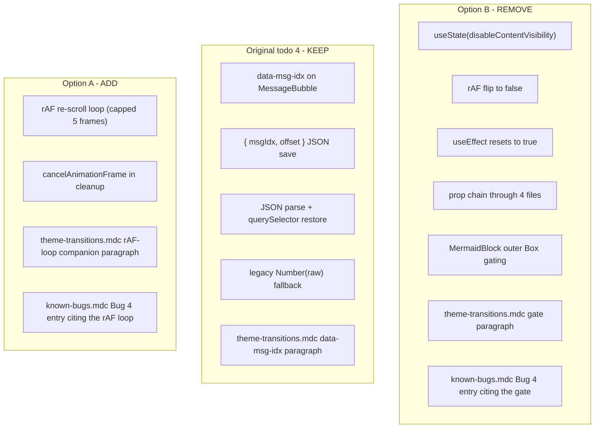

# Undo Option B, implement Option A (rAF re-scroll)

## What is being undone vs kept

The `disableContentVisibility` prop chain, the `useState(true)` flag in `ChatDetail`, the rAF flip, the second loading-resets effect, and the corresponding rule additions all go. The `data-msg-idx={index}` attribute on `MessageBubble` and the anchor-based `{ msgIdx, offset }` JSON save / restore in `ChatDetail` are NOT part of Option B — they were the original todo 4 fix for the SAVE side, and they are still load-bearing for Option A. They stay.



## Why Option A's mechanism is different

Option B made the first commit fully materialized (all blocks at actual SVG height), measured `anchor.offsetTop` against that layout, scrolled, then flipped `'visible'` -> `'auto'` one frame later. The rAF flip itself shrinks every off-screen mermaid block back from its rendered height to the 400px placeholder, which moves the anchor while `scrollY` stays put. Browser scroll-anchoring may not catch a `content-visibility` driven shift, so the user lands off the saved anchor anyway. Option A leaves `content-visibility: auto` static and instead chases the post-`scrollTo` materialization in a rAF loop: each iteration re-reads `anchor.offsetTop` (now reflecting whatever materialized this frame) and re-`scrollTo`'s to `offsetTop + offset`. The loop converges when the anchor stops moving, capped at 5 frames as a safety net.

## Undo step (file-by-file)

1. **`[frontend/src/components/chat-detail/ChatDetail.js](frontend/src/components/chat-detail/ChatDetail.js)`**
   - Delete the `disableContentVisibility` state declaration plus its block comment (currently lines 28-43).
   - Inside the existing `useLayoutEffect([loading, sessionId])`: delete the `const cvRafId = requestAnimationFrame(() => setDisableContentVisibility(false))` block (currently lines 222-232) and remove `cancelAnimationFrame(cvRafId)` from the cleanup.
   - Delete the second `useEffect([loading])` that resets the flag back to `true` (currently lines 270-279).
   - Remove `disableContentVisibility={disableContentVisibility}` from the `<MessageList>` JSX prop list.

2. **`[frontend/src/components/chat-detail/MessageList.js](frontend/src/components/chat-detail/MessageList.js)`**
   - Drop `disableContentVisibility` from the destructured props and from the `<MessageBubble>` JSX.
   - Strip the file-header comment paragraph that mentions the prop.

3. **`[frontend/src/components/chat-detail/MessageBubble.js](frontend/src/components/chat-detail/MessageBubble.js)`**
   - Drop `disableContentVisibility` from the destructured props and from the `<MessageMarkdown>` JSX.
   - Trim the file-header comment back to the original todo-4 form (mentions `index` / `data-msg-idx`, no longer mentions the SAVE/RESTORE pairing with the gate).

4. **`[frontend/src/components/MessageMarkdown.js](frontend/src/components/MessageMarkdown.js)`**
   - Drop `disableContentVisibility` from the destructured props and from the `<MermaidBlock>` JSX inside `replaceNode`.

5. **`[frontend/src/components/MermaidBlock.js](frontend/src/components/MermaidBlock.js)`**
   - Drop `disableContentVisibility` from the destructured props and from the file-header comment block.
   - Outer `<Box>`'s `sx`: replace `contentVisibility: disableContentVisibility ? 'visible' : 'auto'` with the original static `contentVisibility: 'auto'`.
   - Strip the second comment paragraph that explained the gate; keep the original "skip layout/paint for off-screen blocks" paragraph as it was.

6. **`[.cursor/rules/theme-transitions.mdc](.cursor/rules/theme-transitions.mdc)`** "Two CSS containment hints"
   - Delete the paragraph that begins "The `contentVisibility: 'auto'` hint above has a load-bearing companion gate..." through the "Both halves are required." line.
   - **Keep** the `data-msg-idx` bullet (it is part of Option A's SAVE side).

7. **`[.cursor/rules/known-bugs.mdc](.cursor/rules/known-bugs.mdc)`**
   - Delete the sixth retired-example entry (the long scroll-position-drift bullet that cites the `disableContentVisibility` gate). Restore the count to "Five retired examples now live in git history".
   - The Bug 4 entry will be re-added below in the Option A step with the new wording.

## Implement step (Option A)

1. **`[frontend/src/components/chat-detail/ChatDetail.js](frontend/src/components/chat-detail/ChatDetail.js)`** — modify the existing `useLayoutEffect([loading, sessionId])`:
   - Capture the `msgIdx` and `offset` parsed in the JSON branch into a local `stabilizationData` variable so the rAF callback can re-find the anchor each frame:
     ```js
     let stabilizationData = null;
     // ... inside the JSON parse branch, when an anchorEl was found:
     stabilizationData = { msgIdx: parsed.msgIdx, offset };
     ```
     (Set only on the JSON-with-found-anchor path; left `null` for the legacy plain-number fallback and the no-saved-entry case, so the rAF chain skips entirely for those.)
   - After `window.scrollTo(0, targetY)` and BEFORE the existing `let saveTimer; ...` scroll-listener block, add the rAF chain:
     ```js
     // content-visibility: auto on every off-screen MermaidBlock skips
     // layout/paint at the 400px placeholder until the block enters the
     // viewport buffer; our scrollTo above causes the browser to
     // re-evaluate that, materializing blocks now in/near the new
     // viewport on the next paint and shifting `anchor.offsetTop` while
     // `scrollY` stays put. We chase that shift via rAF: each iteration
     // re-reads the anchor's offsetTop and re-scrolls if it differs from
     // where we currently are. Capped at 5 frames as a safety net (a
     // pathological materialization cascade would otherwise loop
     // unboundedly); 2-3 frames are typical in practice.
     let stabilizationRafId = null;
     if (stabilizationData !== null) {
       let frame = 0;
       const MAX_STABILIZATION_FRAMES = 5;
       function tryStabilize() {
         stabilizationRafId = null;
         if (frame >= MAX_STABILIZATION_FRAMES) return;
         frame += 1;
         const anchorEl = document.querySelector(
           `[data-msg-idx="${stabilizationData.msgIdx}"]`,
         );
         if (anchorEl === null) return;
         const newTargetY = anchorEl.offsetTop + stabilizationData.offset;
         if (Math.abs(newTargetY - window.scrollY) > 1) {
           window.scrollTo(0, newTargetY);
         }
         stabilizationRafId = requestAnimationFrame(tryStabilize);
       }
       stabilizationRafId = requestAnimationFrame(tryStabilize);
     }
     ```
   - Cleanup adds `if (stabilizationRafId !== null) cancelAnimationFrame(stabilizationRafId);` alongside the existing `clearTimeout(saveTimer)` and listener removal.
   - The 1-px tolerance on `Math.abs(newTargetY - window.scrollY) > 1` prevents a no-op `scrollTo` from re-triggering layout work when the position is already correct.

2. **`[.cursor/rules/theme-transitions.mdc](.cursor/rules/theme-transitions.mdc)`** "Two CSS containment hints"
   - Append a new paragraph immediately after the bullets and before "This pattern generalizes...":
     - State: a page-level `useLayoutEffect` that does scroll restoration on a page containing `MermaidBlock` instances must follow its initial `scrollTo` with a `requestAnimationFrame`-driven re-scroll loop (capped at 5 iterations) that recomputes `anchor.offsetTop + offset` and re-scrolls until the position is stable. Otherwise, post-`scrollTo` `content-visibility: auto` materialization shifts `anchor.offsetTop` by the cumulative actual-vs-placeholder height difference of every block now in the viewport buffer, while `scrollY` stays put -- the canonical scroll-drift symptom on diagram-heavy chats.
     - Cross-reference `ChatDetail.js`'s `useLayoutEffect` and the `data-msg-idx` SAVE-side bullet above.
     - Note that removing the rAF loop re-opens the scroll-drift-on-mermaid-chats bug.

3. **`[.cursor/rules/known-bugs.mdc](.cursor/rules/known-bugs.mdc)`**
   - Bump the count back to "Six retired examples now live in git history".
   - Re-add the Bug 4 retired-example bullet, but rewrite the fix-summary half to cite the rAF re-scroll loop (RESTORE side, in `ChatDetail.js`'s `useLayoutEffect`) plus the anchor-based `{ msgIdx, offset }` JSON save with `data-msg-idx` on `MessageBubble`'s outer `<Box>` (SAVE side). Drop every mention of `disableContentVisibility` and the threading through `MessageList` / `MessageBubble` / `MessageMarkdown` / `MermaidBlock`. Pin to the new `theme-transitions.mdc` paragraph above. Manual-verification recipe stays the same (refresh `/chat/ec60d4dd-9bac-45af-84e7-bc7e35022378` and `/chat/7be71d40-07cb-46de-8203-266e17c97ae7` from non-zero scroll, regression-check a diagram-free chat).

## Rule compliance

- **`comments-style.mdc`**: The new comment block on the rAF chain explains the WHY (post-`scrollTo` materialization shifts `offsetTop`; rAF chases it), the trade-off (5-frame cap as safety net), and the invariant (1-px tolerance prevents no-op self-trigger). It does not narrate what the loop literally does.
- **`react-components.mdc` ~250-line cap**: The undo removes a comment block, two effects, and a state declaration from `ChatDetail.js`, while the implement step adds a smaller block (no state, no second effect). Net effect on `ChatDetail.js` is approximately neutral or slightly smaller. The cap-compliance decomposition is still owned by the original plan's `review-rules` todo.
- **`mermaid-rendering.mdc`**: Untouched. No new calls to `mermaid.parse` / `render` / `initialize`, and `MermaidBlock` is reverted to its pre-Option-B shape.
- **`frontend-hooks.mdc`**: Not exercised by the minimal-scope fix. If the original plan's `review-rules` todo extracts this into `useChatScrollAnchor`, the rAF chain should travel with the rest of the save/restore logic into the hook (clean separation, since the hook would already own the JSON save/restore and the listener wiring).
- **`known-bugs.mdc`**: The retired-example entry is rewritten, not silently changed; the count is updated in the same change.

## Verification

Same recipe as the original plan's `run-tests` todo for Bug 4:

1. Refresh `/chat/ec60d4dd-9bac-45af-84e7-bc7e35022378` from a non-zero scroll position with mermaid blocks both above and below the viewport. Expected: the page restores to precisely the same visual position; the topmost in-viewport message is the same on both sides of the refresh, with the same vertical offset within it. (One-frame visual settle while the rAF chain converges is acceptable; what the user must NOT see is a final position that's drifted by hundreds of px.)
2. Repeat on `/chat/7be71d40-07cb-46de-8203-266e17c97ae7`.
3. Regression-check a diagram-free chat to confirm the legacy plain-number fallback path still restores precisely (the rAF chain does not run on that path).
4. Toggle dark/light on a long mermaid-heavy chat AFTER the page has loaded. Expected: theme-toggle performance is unchanged from the pre-bug-fix baseline (no off-screen mermaid SVG re-paint), confirming `content-visibility: auto` is still in effect on every block.
5. Run `python -m unittest discover -s tests` from the repo root as a safety check that nothing else regressed (no Python code is touched by this plan, but the rule still requires the suite to stay green).
