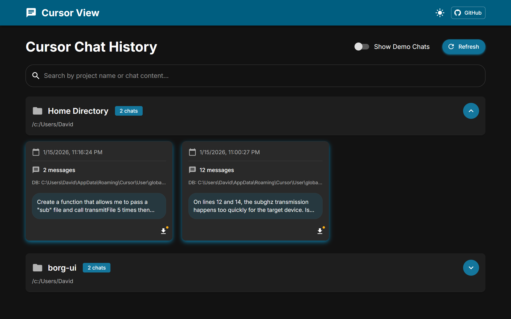
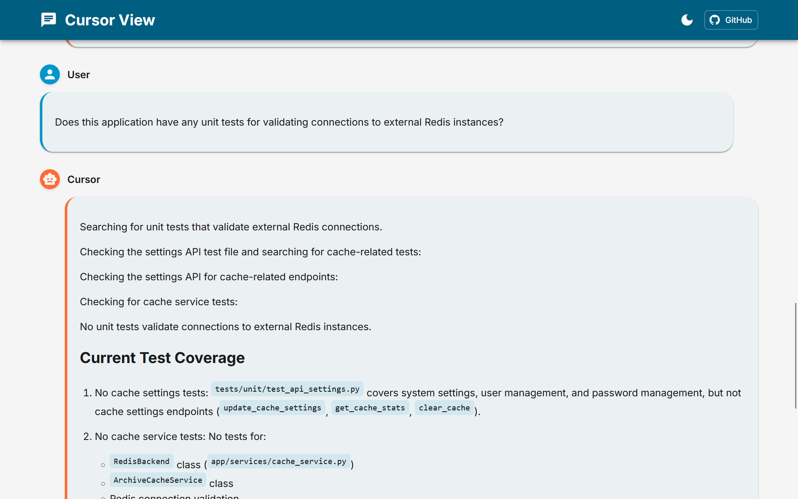

<div align="center">

# Cursor View

Cursor View is a local tool to view, search, and export all your Cursor AI chat histories in one place. It works by scanning your local Cursor application data directories and extracting chat data from the SQLite databases.

**Privacy Note**: All data processing happens locally on your machine. No data is sent to any external servers.

 

</div>


## Setup & Running

1. Clone this repository
2. Install Python dependencies:
   ```
   python3 -m pip install -r requirements.txt
   ```
3. Install frontend dependencies and build (optional, pre-built files included):
   ```
   cd frontend
   npm install
   npm run build
   ```
4. Start the server:
   ```
   python3 server.py
   ```
5. Open your browser to http://localhost:5000

## Desktop app

Cursor View can also be run as a standalone desktop application. The Flask
server is started in the background and the UI is rendered inside a native OS
webview window (WebView2 on Windows, WKWebView on macOS, WebKitGTK/Qt on Linux)
via [pywebview](https://pywebview.flowrl.com/).

### Run from source

```
python3 -m pip install -r requirements.txt
cd frontend && npm install && npm run build && cd ..
python3 desktop.py
```

On Linux you may also need system webview libraries, e.g. on Debian/Ubuntu:

```
sudo apt install libwebkit2gtk-4.1-0
```

(Alternatively, `pywebview[qt]` is installed by default on Linux via
`requirements.txt`, which uses QtWebEngine.)

### Build a standalone binary

Icons live under `assets/icons/`. If you replace `frontend/public/logo512.png`
and want to regenerate them, run:

```
python3 assets/icons/_generate_icons.py
```

Then build with PyInstaller using the included spec:

```
pyinstaller cursor-view.spec
```

This produces a windowed (no-console) binary in `dist/`:

- Windows: `dist/Cursor View/Cursor View.exe`
- macOS:   `dist/Cursor View.app`
- Linux:   `dist/Cursor View/Cursor View`

On macOS, unsigned local builds may be quarantined by Gatekeeper. To run
without code signing:

```
xattr -dr com.apple.quarantine "dist/Cursor View.app"
```

### User preferences / webview profile

The desktop app persists UI preferences (theme, export warning opt-out) in a
per-user webview profile directory:

- Windows: `%LOCALAPPDATA%\cursor-view\webview-storage`
- macOS:   `~/Library/Caches/cursor-view/webview-storage`
- Linux:   `$XDG_CACHE_HOME/cursor-view/webview-storage` (falls back to
  `~/.cache/cursor-view/webview-storage`)

Delete that folder to reset preferences.

## Features

- Browse all Cursor chat sessions
- Search through chat history
- Export chats as HTML, JSON, or Markdown
- Organize chats by project
- View timestamps of conversations

_Originally built by [Sahar Mor](https://www.linkedin.com/in/sahar-mor/)._
